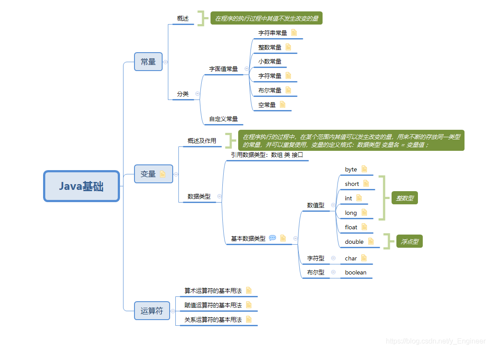
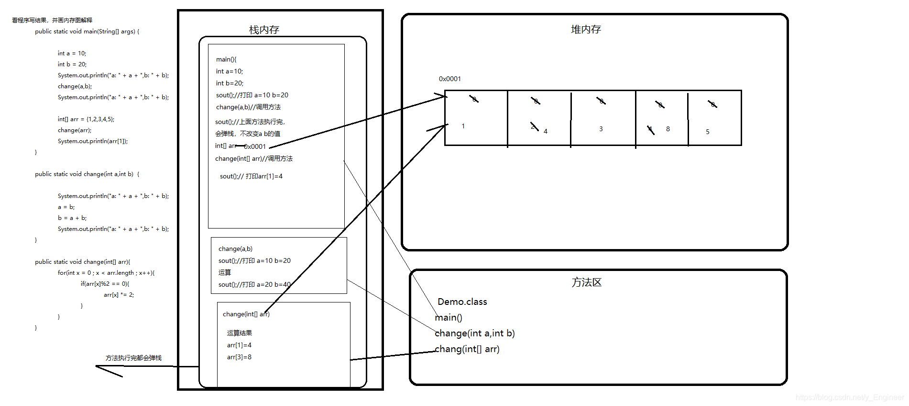
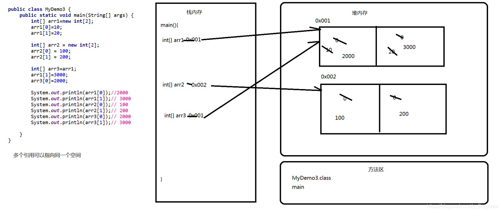
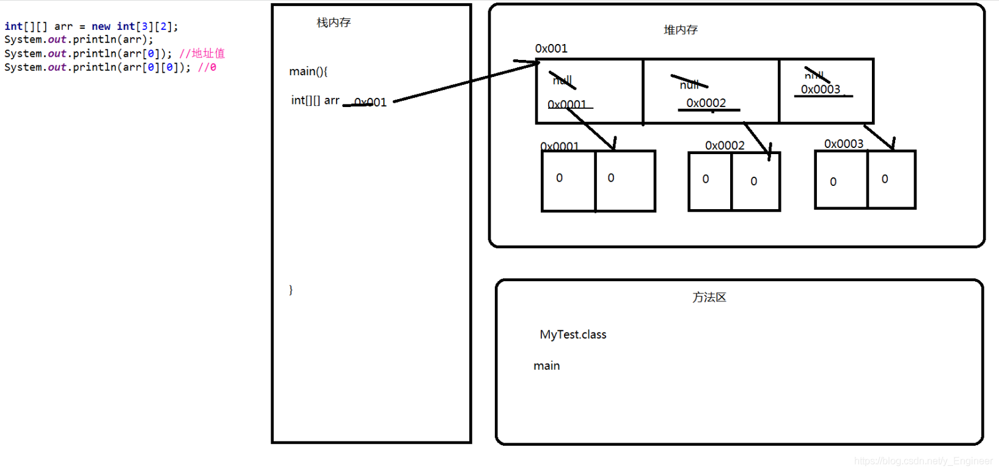

# 

# **1 Java语言**

 **Java语言跨平台原理**

1. 什么是跨平台性 (平台指定的是操作系统)

   通过Java语言编写的应用程序在不同的系统平台上都可以运行

2. Java语言跨平台原理

   只要在需要运行java应用程序的操作系统上，先安装一个Java虚拟机(JVM Java Virtual Machine)即可，由JVM来负责Java程序在该系统中的运行   
   因为有了JVM，所以同一个Java程序在不同的操作系统中都可以执行。这样就实现了Java程序的跨平台性。也称为Java具有良好的可移植性  

> JAVA语言是跨平台的，而JVM不是跨平台的。  
> JVM是不跨平台的，因为针对不同的操作系统，JAVA提供了不同的JVM，而各个操作系统的可执行文件是不同的 

**JRE和JDK的概述**

 1. 什么是**JRE**

    Java Runtime Environment  Java运行环境 

    包括Java虚拟机(JVM Java Virtual Machine)和Java程序所需的核心类库等，如果想要运行一个开发好的Java程序，计算机中只需要安装JRE即可。

 2. 什么是**JDK**

    Java Development Kit    Java开发工具包

    JDK是提供给Java开发人员使用的，其中包含了java的开发工具，也包括了JRE。所以安装了JDK，就不用再单独安装JRE了

 3. 为什么JDK中包含一个JRE

    其一，开发完的程序，总需要运行一下看看效果

    其二，也是最重要的，JDK中的开发工具其实都是java语言编写的应用程序，为了方便使用才打包成exe文件， 如果没有JRE，那么这些工具是运行不了的

 4. JDK、JRE、JVM的作用和关系

    用jdk编写了一个java程序交由jre 运行起来由jvm实现跨平台

# **2 快捷键及常见DOS命令**

**常用DOS命令**

```powershell
#盘符切换
d: 回车
 
#列出当前目录下的文件以及文件夹
dir(directory)
 
#改变指定目录（进入指定目录）
cd (change directory) 
#注意： 跨盘进入需要加一个 /d参数  例子： cd /d D:\software\cs1.6
 
#退回到上一级目录
cd.. 
 
#回退多级目录 
cd ../../
 
#退回到根目录
cd\
 
#(clear screen)清屏
cls 
 
#退出dos命令行
exit

#查看本机IP 网卡物理地址等信息
ipconfig /all  

#获取计算机名称
hostname 

#获取物理网卡地址
getmac   

#创建目录
md (make directory) 

#删除目录
rd (remove directory)

#删除文件,删除一堆后缀名一样的文件*.txt
del (delete)

#删除带内容的文件夹 不能直接删除  加参数如下
rd + /s	文件夹名称		#询问是否删除
rd + /q + /s 文件夹名称	#直接删除
```

# **3 Java基础**

## 1 常量

### 1.1 概述

**在程序的执行过程中其值不发生改变的量**

### 1.2 分类

#### 1.2.1 字面值常量

##### 1. 字符串常量：用双引号括起来的内容

##### 2. 整数常量

##### 3. 小数常量

##### 4. 字符常量：用单引号括起来的内容，单引号中只能是单个字母，单个数字，单个符号

##### 4. 布尔常量：只有true和false

##### 6. 空常量：null

#### 1.2.2 自定义常量

## 2 变量

使用变量的注意事项

* 作用域问题，变量定义在哪一级大括号中，哪个大括号的范围就是这个变量的作用域。相同的作用域中不能定义两个同名变量
* 初始化值问题，没有初始化值不能直接使用
* 在一行上建议只定义一个变量，可以定义多个，但是不建议

### 2.1 概述及作用

**在程序执行的过程中，在某个范围内其值可以发生改变的量，用来不断的存放同一类型的常量，并可以重复使用，变量的定义格式：数据类型 变量名 = 变量值 ；**

### 2.2 数据类型



#### 2.2.1 引用数据类型：数组、类、接口

#### 2.2.2 基本数据类型

| 类型    | 字节数   | 范围                         |
| ------- | -------- | ---------------------------- |
| byte    | 1(8bit)  | -128 ~ 127                   |
| short   | 2(16bit) | -2^15 ~ 2^15 - 1             |
| int     | 4(32bit) | -2^31 ~ 2^31 - 1             |
| long    | 8(64bit) | -2^63 ~ 2^63 - 1             |
| float   | 4(32bit) | -3.403*10^38 ~ 3.403*10^38   |
| double  | 8(64bit) | -1.798*10^308 ~ 1.798*10^308 |
| char    | 2(16bit) | 0 ~ 2^16 - 1 = 65535         |
| boolean |          |                              |

**1数据类型转换之隐式转换**

Java中的默认转换规则

* boolean类型不能转换为其他的数据类型
* byte、short、char、int、long、float、double转换顺序
* byte、short、char之间不转换，他们参与运算首先转换为int类型

**数据类型转换之强制转换**

强制转换的格式: **目标数据类型  变量名 = (目标数据类型) (被转换的数据)**

## 3 运算符

**1. 什么是运算符**

对常量和变量进行操作的符号称为运算符

**2. 运算符的分类**

算术运算符、赋值运算符、比较运算符、逻辑运算符、位运算符、三目运算符

### 3.1 算术运算符

```
自加（++）自减（--）运算
	++:自加。对原有的数据进行+1
	--:自减。对原有的数据进行-1
   a: 单独使用：
		放在操作数的前面和后面效果一样。
   b: 参与运算使用：
		放在操作数的前面，先自增或者自减，然后再参与运算
		放在操作数的后面，先参与运算，再自增或者自减
		
注意事项：
a: 整数相除只能得到整数。如果想得到小数，请使用浮点数
b: /获取的是除法操作的商，%获取的是除法操作的余数
	%运算结果的符号，取决于参与运算是左边的符号
```

### 3.2 赋值运算符

```
赋值运算符有哪些
=、 +=、-=、*=、/=、%=
	
注意事项：
a: 基本的赋值运算符：=
	把=右边的数据赋值给左边。
b: 扩展的赋值运算符：+=、=、*=、/=、%=
	+= 把左边和右边做加法，然后赋值给左边。
c: 赋值运算符要求左边的数据必须是一个变量
```

### 3.3 比较运算符

```
关系运算符有哪些：
== 、!= 、 < 、 > 、 <= 、 >= 、 instanceof

注意事项：
无论你的操作是简单还是复杂，结果是boolean类型
"=="不能写成"="
```

### 3.4 逻辑运算符

| 运算符   | 运算   | 规则                                        |
| -------- | ------ | ------------------------------------------- |
| **&**    | 与     | 有false则为false                            |
| **\|**   | 或     | 有true则为true                              |
| **^**    | 异或   | 相同为false ，不同为 true                   |
| **!**    | 非     | false 变true，true变false                   |
| **&&**   | 短路与 | 有false则为false，若左端为false则右端不执行 |
| **\|\|** | 短路或 | 有true则为true，若左端为true则右端不执行    |

### 3.5 位运算符

| 运算符  | 运算       | 规则                                                         |
| ------- | ---------- | ------------------------------------------------------------ |
| **&**   | 按位与     | 有0则为0                                                     |
| **\|**  | 按位或     | 有1则为1                                                     |
| ~       | 按位取反   | 0变1,1变0                                                    |
| **^**   | 按位异或   | 相同为0，不同为1                                             |
| **<<**  | 左移       | 将操作数 所有二进制位向左移动一位，右边空位补0               |
| **>>**  | 右移       | 将操作数 所有二进制位向右移动一位，左边空位正数补0，负数补1  |
| **>>>** | 无符号右移 | 将操作数 所有二进制位向右移动一位左边空位补0（不考虑原数正负） |

### 3.6 三目运算符

```
格式 ：(关系表达式)?表达式 1:表达式2;
执行流程：
计算关系表达式的值，如果为true，运算后的结果是表达式1；如果为false，运算后的结果是表达式2。
```

# **4 Java中用键盘录入数据**

**第一步：导入包**

```java
import java.util.Scanner;
```

**第二步：创建Scanner对象**

```java
Scanner sc = new Scanner(System.in);
```

**第三步：提示键盘输入数据**

```java
System.out.println("请输入数据：");
```

**第四步：获取数据**

```java
String str=sc.nextLine();//获取字符串
int score = sc.nextInt();//获取int类型数据
```

**示例：**

```java
import java.util.Scanner;
public class InputData {
    public static void main(String[] args) {
        Scanner sc = new Scanner(System.in);
        System.out.println("请输入数据：");
        int num=sc.nextInt();
        System.out.println("我录入的数据为："+num);
    }
}
输出结果：
请输入数据
	1
我录入的数据为：1

Process finished with exit code 0
```

# **5 流程控制语句**

## 1 顺序结构语句

**概述：是程序中最简单最基本的流程控制，没有特定的语法结构，按照代码的先后顺序，依次执行，程序中大多数的代码都是这样执行的。**

## 2 选择结构语句

**概述：也被称为分支结构。选择结构有特定的语法规则，代码要执行具体的逻辑运算进行判断，逻辑运算的结果有两个，所以产生选择，按照不同的选择执行不同的代码。**

### 1. if语句

**格式1**

```java
格式1：if(比较表达式或者是boolean类型的值) {
		语句体;
		}

执行流程：
先计算比较表达式的值，看其返回值是true还是false
如果是true，就执行语句体
如果是false，就不执行语句体
```

**示例：判断两个数据是否相等**

```java
public class MyBlog {
    public static void main(String[] args) {
        int a = 10;
        int b = 20;
        if (a == b) {
            System.out.println("a和b相等");
        }
        System.out.println("a和b不相等 ");
    }
}
```

**格式2**

```java
格式2：if(比较表达式) {
		语句体1;
	 }else {
		语句体2;
	 }
注意事项：else后面是没有比较表达式的，只有if后面有
    
执行流程：
首先计算比较表达式的值，看其返回值是true还是false
如果是true，就执行语句体1
如果是false，就执行语句体2
```

**示例：获取两个数据中较大的值**

```java
public class MyBlog {
    public static void main(String[] args) {
        int a = 10;
        int b = 20;
        if (a > b) {
            System.out.println("最大值为：" + a);
        } else {
            System.out.println("最大值为：" + b);
        }
    }
}
```

**格式3**

```java
格式3：if(比较表达式1) {·1
		语句体1;
	}else if(比较表达式2) {
		语句体2;
	}else if(比较表达式3) {
		语句体3;
	}
	...
	else {
		语句体n+1;
	}

执行流程：
首先计算比较表达式1看其返回值是true还是false，
如果是true，就执行语句体1，if语句结束。
如果是false，接着计算比较表达式2看其返回值是true还是false，
	
如果是true，就执行语句体2，if语句结束。
如果是false，接着计算比较表达式3看其返回值是true还是false，
...
如果都是false，就执行语句体n+1。
```

**示例：键盘录入一个成绩，判断并输出成绩的等级**

```java
import java.util.Scanner;
public class MyBlog{
    public static void main(String[] args) {
        Scanner sc = new Scanner(System.in);
        System.out.println("请输入成绩：");
        int score = sc.nextInt();
        grade(score);
    }
    public static void grade(int score) {
        if(score<60&&score>=0){
            System.out.println("成绩为E等");
        }else if(score>=60&&score<70){
            System.out.println("成绩为D等");
        }else if(score>=70&&score<80){
            System.out.println("成绩为C等");
        }else if(score>=90&&score<100){
            System.out.println("成绩为B等");
        }else if(score>=80&&score<90){
            System.out.println("成绩为B等");
        }
    }
}
```

### 2. switch语句

**格式**

```java
switch语句的格式
	switch(表达式){
		case 值1:
			语句体1;
			break;
		case 值2:
			语句体2;
			break;
		case 值3:
			语句体3;
			break;
		....
		default：	
			语句体n+1;
			break;
	}
```

**执行流程**

```java
先计算表达式的值,然后和case后面的匹配，如果匹配成功就执行对应的语句，遇到break就会结束,否则执行default控制的语句
```

**3 注意事项**

```java
1、表达式的取值：byte,short,int,char,枚举,String
2、case后面只能是常量，不能是变量，必须与表达式值类型相同，而且，多个case后面的值不能出现相同的
3、default可以省略，但是不建议，因为它的作用是对不正确的情况给出提示
4、break可以省略，但是结果可能不是我们想要的，会出现一个现象：case穿透，不建议省略
5、default可以在任意位置。但是建议在最后
6、switch语句的结束条件：遇到break结束，执行到末尾结束
7、如果多个case条件后面的执行语句是相同的，则该执行语句只需书写一次即可(例如下面示例)
```

**4 示例：请根据键盘输入的月份，打印出对应月份的天数**

```java
import java.util.Scanner;
public class MonthDay {
    public static void main(String[] args) {
        Scanner scanner = new Scanner(System.in);
        System.out.println("请输入月份：");
        int mon = scanner.nextInt();
        day(mon);
    }
    public static void day(int mon) {
        switch (mon) {
            case 1:
            case 3:
            case 5:
            case 7:
            case 8:
            case 10:
            case 12:
                System.out.println("这个月有31天");
                break;
            case 4:
            case 6:
            case 9:
            case 11:
                System.out.println("这个月有30天");
                break;
            case 2:
                System.out.println("这个月有28天");
                break;
            default:
                System.out.println("输入月份不合法......");
                break;
        }
    }
}
```

## 3 循环结构语句

### 1. for循环

**1格式**

```java
for(初始化表达式语句;判断条件语句;控制条件语句) {
		循环体语句;
	}
```

**执行流程**

```java
a:执行初始化表达式语句
b:执行判断条件语句,看其返回值是true还是false
	如果是true，就继续执行
	如果是false，就结束循环
c:执行循环体语句;
d:执行控制条件语句
e:回到b继续。
```

**注意事项**

```shell
a:判断条件语句无论简单还是复杂结果是boolean类型。
b:循环体语句如果是一条语句，大括号可以省略；如果是多条语句，大括号不能省略。建议永远不要省略。
c:一般来说：有左大括号就没有分号，有分号就没有左大括号
d:初始化表达式语句只执行一次
```

**示例：分别求出1-100之间偶数和与奇数和**

```java
public class MyBlog {
    public static void main(String[] args) {
        int ou=0;
        int ji=0;
        for (int i = 1; i <= 100; i++) {
            if (i%2==0){
                ou+=i;
            }else {
                ji+=i;
            }
        }
        System.out.println("偶数和为："+ou);
        System.out.println("奇数和为："+ji);
    }
}
```

### 2. while语句

**格式**

```
初始化条件语句;
	    while(判断条件语句) {
			 循环体语句;
			 控制条件语句;
	   }
```

**执行流程**

```
a:执行初始化条件语句;
b:执行判断条件语句,看其返回值是true还是false
	如果是true，就继续执行
	如果是false，就结束循环
c:执行循环体语句;
d:执行控制条件语句
e:回到b继续
```

**示例：找出100~999之间的水仙花数输出，并统计个数**

```java
public class MyBlog{
    public static void main(String[] args) {
        int c=0;
        int i=100;
        while(i<=999){
            int ge=i%10;
            int shi=i/10%10;
            int bai=i/100%10;
            int fnum=ge*ge*ge+shi*shi*shi+bai*bai*bai;
            if(i==fnum){
                System.out.println(i+"是水仙花数");
                c++;
            }i++;
        }
        System.out.println("有"+c+"个水仙花数");
    }
}
```

### 3. do…while语句

**格式**

```
初始化条件语句;
		do {
			循环体语句;
			控制条件语句;
		}while(判断条件语句);
```

**执行流程**

```
a:执行初始化条件语句;
b:执行循环体语句;
c:执行控制条件语句;
d:执行判断条件语句,看其返回值是true还是false
	如果是true，就继续执行
	如果是false，就结束循环
e:回到b继续。
```

**三种循环语句的区别**

```
(1):do...while循环至少执行一次循环体。
	而for,while循环必须先判断条件是否成立，然后决定是否执行循环体语句。
(2):A：如果你想在循环结束后，继续使用控制条件的那个变量，用while循环，否则用for循环。不知道用for循环。因为变量及早的从内存中消失，可以提高内存的使用效率。
	B:建议优先考虑for循环，然后是while循环 ，最后是do...while循环
```

### 4. 循环的嵌套

**示例：九九乘法表**

```java
public class Myblog {
    public static void main(String[] args) {
        for (int i = 1; i <= 9; i++) {
            for (int j = 1; j <= i; j++) {
                System.out.print(j + "*" + i + "=" + j * i + "\t");
            }
            System.out.println();
        }
    }
}
```

### 5. 控制跳转语句

**break语句**

```
作用:
	a:退出单层循环
	b:退出多层循环(几乎不使用)
		要想实现这个效果，就必须知道一个东西;带标签的语句；
		格式：标签名：语句
使用场景:
	(1):在选择结构switch语句中
	(2):在循环语句中
```

**continue语句**

```
作用:跳出一次循环，执行下一步操作
使用场景:
	(1):在循环语句中
	(2):离开使用场景的存在是没有意义的
```

**return语句**

```
作用:退出一个方法;
跳转到上层调用的方法
```

## 4 冒泡排序法

```java
import java.util.Arrays;

public class Test {
    public static void main(String[] args) {
        int[] arr={32,45,77,7,43,76};
        bubbleSort(arr);
        System.out.println(Arrays.toString(arr));
    }

    private static void bubbleSort(int[] arr) {
        for (int i = 0; i < arr.length-1; i++) {
            for (int j = 0; j < arr.length-i-1; j++) {
                if(arr[j]>arr[j+1]){
                    int t=arr[j];
                    arr[j]=arr[j+1];
                    arr[j+1]=t;
                }
            }
        }
    }
}
```

# **6 方法及其重载**

## 1 方法概述和格式说明

**方法概述**

方法就是完成特定功能的代码块，在很多语言中都有函数的定义，但在JAVA语言中，我们将其称之为方法。

**格式**

```
修饰符 返回值类型 方法名(参数类型 参数名1，参数类型 参数名2 ....){
	方法体;
	return 返回值;
}
```

**方法的格式详细说明**

```
(1): 修饰符：比较多,后面会详细介绍。目前使用  public static
(2): 返回值类型：用于限定返回值的数据类型
(3): 方法名：就是一个名称，它的存在是为了方便我们调用方法
(4): 参数类型：限定调用方法时传入参数的数据类型
(5): 参数名：是一个变量，接收调用方法时传入的参数（这个参数其实有一个专业的名词,被称之为形式参数,它的作用是用来接收实际参数的）
(6): 方法体：完成功能的代码
(7): return：结束方法以及返回方法指定类型的值 
(8): 返回值：就是功能的结果，由return带回，带回给调用者
```

## 2 方法的注意事项

```
A:	方法不调用不执行
B:	方法与方法是平级关系，不能嵌套定义
C:	方法定义的时候参数之间用逗号隔开
D:	方法调用的时候不用在传递数据类型
E:	如果方法有明确的返回值，一定要由return带回一个值
```

## 3 例题

**例一：数字三角**

```
1、请编写程序，打印出如下图形,并在main方法中调用
1
12
123
1234
12345
......
1234567
```

```java
import java.util.Scanner;
public class TuXing {
    public static void tuXing(int n){
        for(int i=1;i<=n;i++){
            for (int i1 = 1; i1 <= i; i1++) {
                System.out.print(i1);
            }
            System.out.println();
        }
    }
    public static void main(String[] args) {
        Scanner sc = new Scanner(System.in);
        System.out.println("请输入行数：");
        int n = sc.nextInt();
        tuXing(n);
    }
}
```

**例二：请编写一个方法，求出1-n之间的偶数和与奇数和的差值,并在 main方法中调用**

```java
import java.util.Scanner;
public class OuAdd {
    public static int  ouAdd(int n) {
        int sum=0;
        int sum2=0;
        for (int i = 1; i <= n; i++) {
            if(i%2==0){
                sum+=i;
            }else {
                sum2+=i;
            }
        }
        return sum-sum2;
    }
    public static void main(String[] args) {
        Scanner sc = new Scanner(System.in);
        System.out.println("请输入n的值：");
        int n = sc.nextInt();
        int cha=ouAdd(n);
        System.out.println("偶数和与奇数和的差值为："+cha);
    }
}
```

## 4 方法的重载

**概述**

在同一个类中，允许存在一个以上的同名方法，只要它们的参数列表不同，与返回值无关。

参数列表不同：

* 参数个数不同
* 参数类型不同

**示例**

使用三元运算符完成如下练习(数据来自于键盘录入，使用方法的重载)：
	比较两个数是否相等
	获取两个数中最大值
	获取三个数中最大值

```java
import java.util.Scanner;
public class SanYuan {
    public static void main(String[] args) {
        Scanner scanner = new Scanner(System.in);
        System.out.println("请输入第一个数据：");
        int num1 = scanner.nextInt();
        System.out.println("请输入第二个数据：");
        int num2 = scanner.nextInt();
        System.out.println("请输入第三个数据：");
        int num3 = scanner.nextInt();
        boolean f = equal(num1, num2);
        System.out.println("前两个数是否相等：" + f);
        int max1 = quite(num2, num3);
        System.out.println("后两个数的最大值为：" + max1);
        int max2 = quite(num1, num2, num3);
        System.out.println("三个数的最大值为：" + max2);
    }
    public static boolean equal(int n1, int n2) {
        return n1 == n2 ? true : false;
    }
    public static int quite(int n1, int n2) {
        return n1 > n2 ? n1 : n2;
    }
    public static int quite(int n1, int n2, int n3) {
        return (n1 > n2 ? n1 : n2) > n3 ? (n1 > n2 ? n1 : n2) : n3;
    }
}
```

# **7 数组、内存分配、内存图**

**概述：数组是存储同一种数据类型多个元素的集合，也可以看成是一个容器。可以存储基本数据类型和引用数据类型。**

## 1 一维数组

**定义格式**

```
格式1：数据类型[]  数组名;	例：int[] arr;
格式2：数据类型  数组名[];	例：int arr[];**
```

### 1. 数组的初始化

```
概述：为数组中的数组元素分配内存空间，并为每个数组元素赋值。
```

**动态初始化**

```
概述：只指定长度，由系统给出初始化值
格式：数据类型[] 数组名 = new 数据类型[数组长度];
 例：int[] arr=new int[2];//定义了一个int类型的数组arr，长度为2.
```

**静态初始化**

```
概述：给出初始化值，由系统决定长度
格式：数据类型 [] 数组名={元素1,元素2,元素3,......};
 例：int[] arr={1,2,3,4};
```

### 2. 数组操作中常见的问题

```
A:ArrayIndexOutOfBoundsException:数组索引越界异常
	原因：你访问了不存在的索引。
B:NullPointerException:	空指针异常
	原因：数组已经不在指向堆内存了。而你还用数组名去访问元素。
```

### 3. 一维数组常用操作

**遍历数组**

```java
public class Example1 {
    public static void main(String[] args) {
        int arr[]={1,2,3,4,5,6};   //定义数组
        for (int i = 0; i < arr.length; i++) { //循环遍历数组
            System.out.print(arr[i]+"\t");
        }
    }
}
```

**获取数组中最大值**

```java
public class GetMax {
    public static void main(String[] args) {
        int arr[]={1,2,3,4,5,6}; 
        int max = getMax(arr); //调用获取最值得方法
        System.out.println("该数组中的最大值为："+max); 
    }
    //定义获取最值得方法
    public  static int getMax(int[] arr){
        int max=arr[0]; //给max赋初值
        for (int i = 1; i < arr.length; i++) {
            if(arr[i]>max){   
                max= arr[i]; //将较大值赋给max
            }
        }
        return max; //返回最大值
    }
}
```

**数组元素反转（把元素对调）**

```java
public class Alignment {
    public static void main(String[] args) {
        int[] arr={1,2,3,4,5,6,7};
        alignment(arr); //调用反转数组的方法
        printArray(arr); //调用打印数组的方法
    }
    //定义反转数组的方法
    public static void alignment(int  arr[]){
        for (int i = 0; i < arr.length/2; i++) {
            //元素位置对调
            int t = arr[i];
            arr[i]=arr[arr.length-i-1];
            arr[arr.length-i-1]=t;
        }
    }
    //定义打印数组的方法
    public static void printArray(int[] arr){
        System.out.println("数组反转后为：");
        for (int i = 0; i < arr.length; i++) {
            System.out.print(arr[i]+"\t");
        }
    }
}
```

**查表法（根据键盘录入索引,查找对应元素）**

```java
import java.util.Scanner;
//以查找星期为例
public class LookUpTable {
    public static void main(String[] args) {
        //键盘录入索引
        Scanner scanner = new Scanner(System.in);
        System.out.println("请输入索引 ：");
        int index= scanner.nextInt();
        String[] week={"星期一","星期二","星期三","星期四","星期五","星期六","星期日"};
        String seek = seek(week, index); //调用查表方法，并获取返回值
        if(!seek.equals("-1")){  
            System.out.println("您输入的索引对应的星期为："+"\n"+seek);
        }else{
            System.out.println("您输入的索引不存在！");
        }
    }
    //定义查表方法
    public static String  seek(String[] week,int index){
        if(index>=1&&index<=7){
            return week[index-1];
        }else {
            return "-1";
        }
    }
}
```

**元素查找**

```java
//以用键盘录入星期查找元素为例
import java.util.Scanner;
public class MyDemo1 {
    public static void main(String[] args) {
        String[] weeks = {"星期一", "星期二", "星期三", "星期四", "星期五", "星期六", "星期日", "星期一", "星期二", "星期三", "星期四", "星期五", "星期六", "星期日"};
        //键盘录入星期
        Scanner scanner = new Scanner(System.in);
        System.out.println("请输入星期:");
        String s = scanner.nextLine();
        int num = search(s, weeks);//调用查找方法，并获取返回值
        if(num!=-1){
        System.out.println("你输入的星期对应的第一个元素是: weeks["+num+"]");
        System.out.println("该元素的索引为："+(num+1));
        }else {
            System.out.println("你输入的星期不存在...");
        }
    }
    //定义查找方法
    public static int search(String s,String[] weeks){
         int num =-1;
         for (int i = 0; i < weeks.length; i++) {
            if(s.equals(weeks[i])){
                num=i;
                break;
            }
        }
        return num;
    }
}
```

## 2 二维数组

### 1. 定义格式

```java
格式1：数据类型[][] 数组名= new 数据类型[m][n];
  例：int[][] arr=new int[3][2];
解释：这个二维数组有3个一维数组，名称是arr[0],arr[1],arr[2],每个一维数组有2个元素，可以通过arr[m][n]	   来获取第m+1个一维数组的第n+1个元素.
格式2：数据类型[][] 变量名 = new 数据类型[m][];
  注：m表示这个二维数组有m个一维数组,一维数组元素个数可以动态给出
格式3：数据类型[][] 变量名 = {{元素…},{元素…},{元素…}};
  注：这个格式属于静态初始化:由我们指定具体的元素值,由系统给分配长度
格式4：数据类型 数组名[][] = new 数据类型[m][n];//不建议使用
格式5:数据类型[] 数组名[] = new 数据类型[m][n];//不建议使用
```

### 2. 二维数组应用举例

**2.1 二维数组的遍历**

```java
public class Traversing {
    public static void main(String[] args) {
        int[][] arr={{1,2,3},{4,5},{6},{7,8,9}};
        for (int i = 0; i < arr.length; i++) {
            for (int j = 0; j < arr[i].length; j++) {
                System.out.print(arr[i][j]+"\t");
            }
            System.out.println();
        }
    }
}
```

**2.2 求和**

```
案例演示
需求：求出公司每个季度销售总额及年销售总额
某公司按照季度和月份统计的数据如下：单位(万元)
第一季度：22,66,44
第二季度：77,33,88
第三季度：25,45,65
第四季度：11,66,99
```

```java
public class MyDemo {
    public static void main(String[] args) {
        int[][] arr = {{22, 66, 44}, {77, 33, 88}, {25, 45, 65}, {11, 66, 99}};
        int sum = 0;
        for (int i = 0; i < arr.length; i++) {
            int sum1=0;
            System.out.print("第" + (i + 1) + "季度各月份销售额分别为(单位:万元):");
            for (int j = 0; j < arr[i].length; j++) {
                System.out.print(arr[i][j] + "  ");
                sum += arr[i][j];
                sum1+=arr[i][j];
            }
            System.out.println();
            System.out.println("总额为:"+sum1+"(万元)");
            sum1=0;
        }
        System.out.println("全年销售总额为:" + sum + "(万元)");
    }
}
```

**2.3 杨辉三角**

```java
/*
需求：打印杨辉三角形(行数可以键盘录入)

		1
		1 1	
		1 2 1
		1 3 3 1
		1 4 6 4 1 
		1 5 10 10 5 1
		.............
*/
import java.util.Scanner;
public class YangHuiTriangle {
    public static void main(String[] args) {
        Scanner scanner = new Scanner(System.in);
        System.out.println("请输入行数:");
        int n= scanner.nextInt();
        int [][] arr=new int[n][n];
        for (int i = 0; i < arr.length; i++) {
            arr[i][0]=1;
            arr[i][i]=1;
        }
        for (int i = 2; i < arr.length; i++) {
            for (int j = 1; j < arr[i].length; j++) {
                arr[i][j]=arr[i-1][j-1]+arr[i-1][j];
            }
        }
        for (int i = 0; i < arr.length; i++) {
            for (int j = 0; j <=i; j++) {
                System.out.print(arr[i][j]+"\t");
            }
            System.out.println();
        }
    }
}
```

## 3 Java中的内存分配以及栈和堆的区别

```
A:栈: 存放的是局部变量
	局部变量：在方法定义中或者方法声明上的变量都是局部变量。
B:堆: 存放的是所有new出来的东西
	特点：
		a: 每一个new出来的东西都会为其分配一个地制值。
		b: 每一个变量都有一个默认的值
			byte，short，int，long  -- 0
			float，double 		  -- 0.0
			char 				   -- '\u0000'
			boolean 			   -- false
			引用数据类型	           -- null		
		c: 使用完毕就变成了垃圾，等待垃圾回收器对其回收
C:方法区
D:本地方法区:(和系统相关)
E:寄存器:(cpu使用)
```

## 4 数组内存图

**1 Java中的参数传递问题及图解**

```java
//看程序写结果，并画内存图解释
public static void main(String[] args) {
    int a = 10;
    int b = 20;
    System.out.println("a: " + a + ",b: " + b);
    change(a,b);
    System.out.println("a: " + a + ",b: " + b);
    int[] arr = {1,2,3,4,5};
    change(arr);
    System.out.println(arr[1]);
}
public static void change(int a,int b)  {
    System.out.println("a: " + a + ",b: " + b);
    a = b;
    b = a + b;
    System.out.println("a: " + a + ",b: " + b);
}
public static void change(int[] arr){
    for(int x = 0 ; x < arr.length ; x++){
        if(arr[x]%2 == 0){
            arr[x] *= 2;
        }
    }
}
```

##### 内存图



**2 三个引用2个数组**



**3 二维数组的内存图**



> 参考引用链接：https://blog.csdn.net/y_engineer
