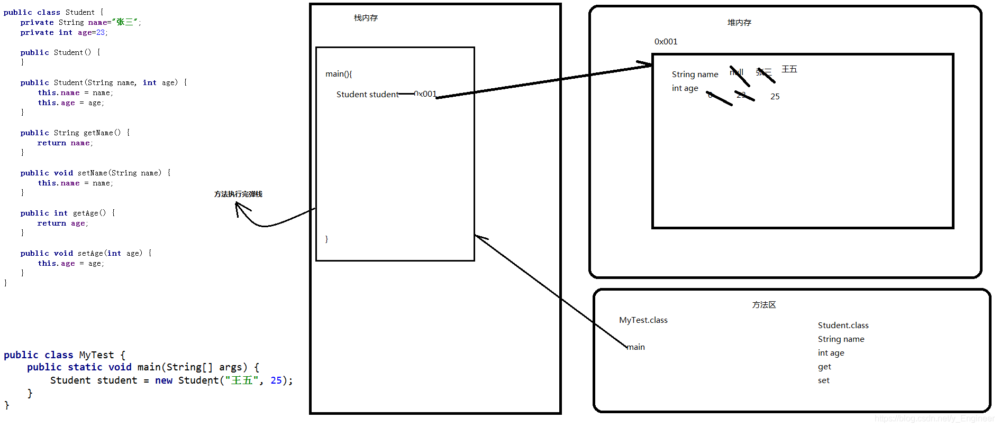
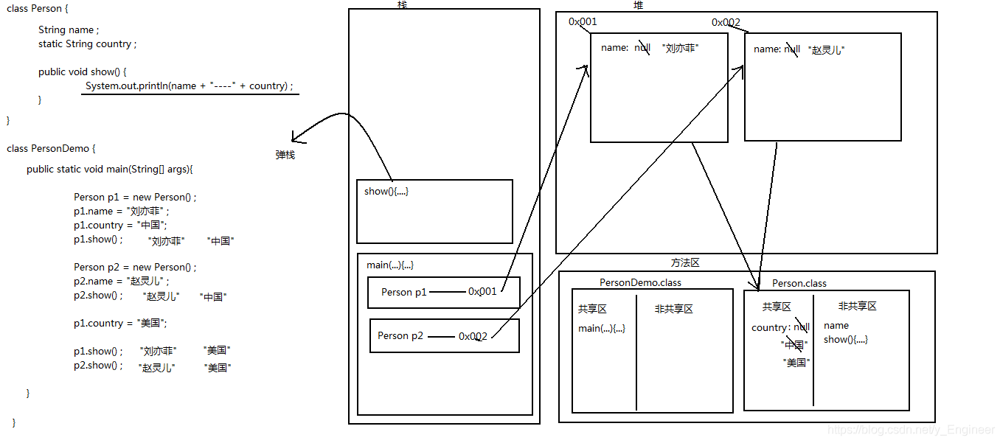

## **面向对象（一）**

### 1、面向对象的概念

* 概述：面向对象是一种复合人类思维习惯的编程思想。现实生活中存在各种形态不同的事物，这些事物之间存在着各种各样的联系。在程序中使用对象来映射现实生活中的事物，使用对象的关系来描述事物之间的联系，这种思想就是面向对象。 
* 面向对象与面向过程的区别：面向过程就是分析解决问题所需要的步骤，然后用函数把这些步骤一一实现，使用的时候一个一个依次调用就可以了。面向对象则是把解决的问题按照一定规则划分成多个独立的对象，然后通过调用对象的方法来解决问题。
* 面向对象的特征：
  	a、封装性：把对象的属性和行为封装起来，不需要让外界知道具体的实现细节
    	b、继承性：主要描述类与类之间的关系，通过继承，可以在无需重新编写原有类的情况下，对原有类的功能进行拓展
    	c、多态性
* 面向对象的开发
  	就是不断的创建对象，使用对象，指挥对象做事情

### 2、类与对象

```java
1、类与对象的关系：类是对某一类事物的抽象描述，而对象用于表示实现该类事物的个体。
2、类的定义格式：
class 类名{
    成员变量；
    成员方法(){
        
    }
}
3、对象的创建与使用
A、创建对象格式：
	类名 对象名称=new 类名();
B、访问对象成员格式
	对象引用.对象成员
4、以定义学生类及其使用为例
	//定义学生类
class Student{
    String name;        //定义成员变量（属性）
    int age;
    //定义成员方法
    public void introduction(){
        System.out.println("大家好，我是"+name+",今年"+age+"岁！");
    }
}
public class Blog {
    public static void main(String[] args) {
        Student student1 = new Student();//创建第一个对象
        Student student2 = new Student();//创建第二个对象
        student1.age=18; //为第一个对象属性赋值
        student1.name="张三";
        student1.introduction();//调用成员方法
        student2.introduction();//没有给此对象变量赋值，所以其成员变量为默认值
    }
}
运行结果：
大家好，我是张三，今年18岁！
大家好，我是null，今年0岁！

Process finished with exit code 0
```

### 3、对象的内存图

**例：三个引用二个对象的内存图**


### 4、成员变量和局部变量的区别

* 成员变量是定义在类中方法外的变量，而局部变量是定义在方法的形参和方法中的变量
* 成员变量有默认值，局部变量没有默认值；
* 成员变量在堆内存中，局部变量在栈内存中；
* 成员变量：随着对象的创建而存在，随着对象的消失而消失，
  局部变量：随着方法的调用而存在，随着方法调用完毕而消失。

### 5、方法的形式参数是类名的时候如何调用

**形参类型为类类型（引用类型），需要传递的是该类的对象**
**注意：形参为引用类型时，其值得改变直接影响实际参数**

```java
//定义学生类
class Student{
    int age;    //定义成员变量（属性）
    //定义成员方法
    public void introduction(){
        System.out.println("大家好，我今年"+age+"岁！");
    }
}
public class Blog {
    public static void main(String[] args) {
        Student student = new Student();
        student.age=18;     //给成员变量赋值
        set(student);       //调用set方法，成员变量被重新赋值，student.age=20;
        student.introduction(); //打印结果
    }
    public static void set(Student student){ //形参为类类型，传入Student的一个对象
        student.age=20;     //给对象成员赋值
    }
}
运行结果：
大家好，我今年20岁！

Process finished with exit code 0
```

### 6、类的封装

* this关键字
  	a：作用：解决局部变量隐藏成员变量
    	b：特点：是当前类的对象引用，代表当前类的一个对象。谁调用这个方法,那么该方法的内部的this就代表谁
* private关键字
  	a：是一个权限修饰符
    	b：可以修饰成员变量和成员方法
    	c：被其修饰的成员只能在本类中被访问
* setXxx()方法和getXxx方法
  	私有属性只能在它所在类中被访问，为了能让外界访问私有属性，Java给我们提供了一些使用public修饰的公有方法，其中包括用于获取属性值的getXxx()方法和设置属性值的setXxx()方法。

```java
class Student {
    private String name;    //将name私有化
    private int age;    //将age私有化
	//下面是共有的getXxx()方法和setXxx()方法
    public String getName() {
        return name;
    }
    public void setName(String name) {
        this.name = name;
    }
    public int getAge() {
        return age;
    }
    public void setAge(int age) {
        //对传入参数进行检查
        if (age>0&&age<100) {
            this.age = age;
        }else {
            System.out.println("年龄不合法...");
        }
    }
    public void introduction(){
        System.out.println("大家好，我是"+name+"，今年"+age+"岁！");
    }
}
public class Package {
    public static void main(String[] args) {
        Student student = new Student();
        student.setAge(-1);
        student.setName("张三");
        student.introduction();
    }
}
运行结果：
年龄不合法...
大家好，我是张三，今年0岁！

Process finished with exit code 0
```

# **面向对象（二）**

## 1、构造方法及其重载

### 1、构造方法概述及格式

概述和作用：创建对象，给对象中的成员进行初始化
格式特点：

​	a：方法名与类名相同
​	b：没有返回值类型（void都没有）
​	c：没有具体返回值

### 2、构造方法的重载及注意事项

概述：即参数列表不同的构造方法
构造方法注意事项
	a：如果我们没有给出构造方法，系统将自动提供一个无参构造方法。
	b：如果我们给出了有参构造方法，系统将不再提供默认的无参构造方法，这时如果我们还想使用无参的构造方法，必须自己给出（建议每次自己给出无参构造方法）。

**示例：**

```java
class Dog{
    //定义成员变量
    String name;
    double age;
    //定义无参的构造方法
    Dog(){
        System.out.println("无参的构造方法执行了...");
    }
    //定义有参的构造方法
    Dog(String name,double age){
        System.out.println("有参的构造方法执行了...");
        this.name=name; //设置成员变量name的值
        this.age=age;   //设置成员变量age的值
    }
    //定义打印狗信息的方法
    public void show(){
        System.out.println("狗的名字："+name+"\n年龄："+age);
    }
}
public class Demo {
    public static void main(String[] args) {
        Dog dog = new Dog();//通过无参构造方法创建对象，并调用无参构造方法
        dog.show();     //dog调用show()方法，无参构造方法没有给name和age设置值，所以打印默认值
        System.out.println("----------------------------");     //分割线，无特殊意义
        Dog dog1= new Dog("旺财", 1.5);//通过有参构造方法创建对象，并调用有参构造方法
        dog1.show();    //dog1调用show()方法
    }
}
运行结果:
无参的构造方法执行了...
狗的名字：null
年龄：0.0
----------------------------
有参的构造方法执行了...
狗的名字：旺财
年龄：1.5

Process finished with exit code 0
```

## 2、创建一个对象的步骤

```java
Student s = new Student();
```

步骤:
	(1)：加载Student.class文件进内存
	(2)：在栈内存为s开辟空间
	(3)：在堆内存为学生对象开辟空间
	(4)：对学生对象的成员变量进行默认初始化
	(5)：对学生对象的成员变量进行显示初始化
	(6)：通过构造方法对学生对象的成员变量赋值
	(7)：学生对象初始化完毕，把对象地址赋值给s变量

#### 内存图：



## 3、static关键字

### 1、static关键字概述

* static 状态修饰符，静态的 ，可以修饰成员变量，可以修饰成员方法，
* 修饰的成员变量变成了共享变量，该类的对象可以去操作这个共享变量
* 被static修饰的变量存在方法区的静态区，被这个类的所有对象，所共享
* 被静态所修饰的成员，是随着类的加载（.class 一加载进内存，静态的数据就会加载）而加载

### 2、static关键字内存图解



### 3、static关键字特点

**static关键字的特点**

* 随着类的加载而加载
* 优先于对象存在
* 被类的所有对象共享
* 可以通过类名调用，也可以使用对象名调用（推荐使用类名调用）

#### 4、举例

```java
class Teacher {
    String name;
    static int num=100;
    //非静态方法里面既可以访问静态变量，也可以访问非静态变量
    public void test(){
        System.out.println("这是一个测试方法"+name+"==="+num);
    }
    //在静态方法里面，不能访问非静态成员，只能访问静态成员
    //原因是：被静态所修饰的成员，是随着类的加载而加载，出现的时机比较早，而非静态成员，是随着对象的创建而产生
    //静态的只能访问静态的
    public static void show(){
       // System.out.println("这是一个静态的方法"+name+"===="+num);//name访问不到
        System.out.println("这是一个静态的方法" + num); //只能访问到静态变量
    }
    //静态方法里面只能调用静态方法
    public static void show2() {
        System.out.println("这是一个静态2的方法" + num);
       // test(); 调用不到
        show();
    }
    //非静态方法里面既可以调用静态方法，也可调用非静态方法
    public void test2() {
        System.out.println("这是一个测试2方法" + name + "===" + num);
        this.test();
        this.show();
        Teacher.show();
    }
    //静态方法里面不能出现this关键字
    public static void show3() {
        System.out.println("这是一个静态3的方法" + num);
        //this 他代表本类的一个引用，或者说对象，对象是后来才有的，先有的不能访问后有的
       // System.out.println(this); //错误
    }
}
public class MyTest {
    public static void main(String[] args) {
        //被静态所修饰的成员，推荐使用类名直接访问
        Teacher.num=500;
        System.out.println(Teacher.num);    //500
        Teacher teacher = new Teacher();    
        System.out.println(teacher.num);    //500
        teacher.num=1000;
        Teacher teacher2 = new Teacher();
        System.out.println(teacher2.num);   //1000
        teacher.show();
        teacher2.show();
        Teacher.show(); //静态方法类名直接调用即可
    }
}
运行结果：
500
500
1000
这是一个静态的方法1000
这是一个静态的方法1000
这是一个静态的方法1000

Process finished with exit code 0
```

### 5、static关键字注意事项

static的注意事项

* 在静态方法中是没有this关键字的
  	因为静态变量是随着类的加载而加载，this是随着对象的创建而存在，静态比对象先存在。
* 静态方法只能访问静态的成员变量和静态的成员方法
  	简单记：静态只能访问静态,非静态可以访问静态的也可以访问非静态的

### 6、静态变量和成员变量的区别

```
A:所属不同
	静态变量属于类，所以也称为类变量
	成员变量属于对象，所以也称为实例变量(对象变量)
B:内存中位置不同
	静态变量存储于方法区的静态区
	成员变量存储于堆内存
C:内存出现时间不同
	静态变量随着类的加载而加载，随着类的消失而消失
	成员变量随着对象的创建而存在，随着对象的消失而消失
D:调用不同
	静态变量可以通过类名调用，也可以通过对象调用
	成员变量只能通过对象名调用
```

## 4、JDK帮助文档的使用

### 1、使用方法

```
A:找到文档，打开文档
B:点击显示，找到索引，出现输入框
C:你应该知道你找谁?举例：Scanner
D:看这个类的结构(需不需要导包)
	java.lang包下的内容不需要我们手动导入
	其它包下的内容需要我们手动导入
	类		    			API文档
		成员变量				字段摘要
		构造方法				构造方法摘要
		成员方法				方法摘要
E:看这个类的说明(简单的了解一下)
F:看开始版本
G:看构造方法
H:看成员方法
	看左边:
		是否是static的,如果是我们就不需要创建对象,直接可以使用类名调用该方法;看返回值,返回值是什么我就使用什么接收
	看右边:
		看参数列表: 参数的个数 , 参数的类型 ; 要什么参数我是用的时候,就传递什么参数					
I:然后使用
```

### 2、学习Math类的随机数功能

```
A:Math类概述
	类包含用于执行基本数学运算的方法
B:Math类特点
	由于Math类在java.lang包下，所以不需要导包。
	没有构造方法，因为它的成员全部是静态的。
C:获取随机数的方法
	public static double random():返回带正号的 double 值，该值大于等于 0.0 且小于 1.0。
D:我要获取一个1-100之间的随机数，怎么办?
	int number = (int)(Math.random()*100)+1;
```

### 3、应用随机数功能设计猜数字小游戏

```java
需求：猜数字小游戏(数据在1-100之间)

import java.util.Scanner;
public class GuessNumberGame {
    public static void main(String[] args) {
        int frequency=6;    //定义游戏次数
        int num = (int) (Math.random() * 100 + 1);  //调用随机数方法，获取一个[1,100]随机整数
        Scanner scanner = new Scanner(System.in);   //创建Scnner的对象
        System.out.println("游戏开始，你一共有"+frequency+"次机会\n请在1---100之间（包括1和100）猜一个数：");
        int x=-1;   
        for (int i = 1; i <=frequency; i++) {
            int n = scanner.nextInt();  //调用方法，获取键盘录入数字
            //判断猜的数字与随机数的关系，并提示玩家
            if (n > num) {
                System.out.println("猜大了");
            } else if (n < num) {
                System.out.println("猜小了");
            } else {
                System.out.println("恭喜你猜对了！");
                x=1;
                break;
            }
            //提示玩家剩余游戏次数
            if (i < frequency) {
                System.out.println("你还有" + (frequency - i) + "次机会！\n请再猜一个数：");
            }
        }
        //游戏次数用完且没有猜对，则会执行下面打印语句
        if(x!=1){
            System.out.println("Game Over");
        }
    }
}
运行结果示例：
游戏开始，你一共有6次机会
请在1---100之间（包括1和100）猜一个数：
50
猜小了
你还有5次机会！
请再猜一个数：
75
猜大了
你还有4次机会！
请再猜一个数：
63
猜大了
你还有3次机会！
请再猜一个数：
55
猜小了
你还有2次机会！
请再猜一个数：
58
猜大了
你还有1次机会！
请再猜一个数：
56
猜小了
Game Over

Process finished with exit code 0
```

# **面向对象（三）**

## 1、代码块

### 1、代码块的概述及分类

```
A:代码块概述：在Java中，使用{}括起来的代码被称为代码块。
B：代码块的分类及应用：
	a：局部代码块：在方法中出现，限定生命周期，及早释放，提高内存利用率；
	b：构造代码块：在类中方法外出现，将多个构造方法中相同的代码存放在一起，每次调用构造方法都会执行一次，并且在构造方法前执行；
	c：静态代码块：在类中方法外出现，使用static修饰，用于给类进行初始化，在类加载时就会执行，且只执行一次；
	d:同步代码块
```

### 2、例题：看程序写结果

```java
	class Student {
		static {
			System.out.println("Student 静态代码块"); //3
		}
		
		{
			System.out.println("Student 构造代码块"); //4  // 6
		}
		
		public Student() {
			System.out.println("Student 构造方法"); //5 //7
		}
	}

public class StudentDemo {
		static {
			System.out.println("StudentDemo的静态代码块"); //1 
		}
		
		public static void main(String[] args) {
			System.out.println("我是main方法"); // 2  
			
			Student s1 = new Student();
			Student s2 = new Student();
		}
	}
答案：
StudentDemo的静态代码块
我是main方法
Student 静态代码块
Student 构造代码块
Student 构造方法
Student 构造代码块
Student 构造方法
```

## 2、类的继承

### 1、概述及格式

```
继承概述：多个类中存在相同属性和行为时，将这些内容抽取到单独一个类中，那么多个类无需再定义这些属性和行为，只要继承那个类即可。
继承格式：通过extends关键字实现类与类的继承
		class 子类名 extends 父类名{}
```

### 2、继承的利弊

```
继承的好处：
	a:提高了代码的复用性；
	b:提高了代码的维护性；
	c:让类与类之间产生了关系，是多态的前提
继承的弊端：
	增强了类的耦合性（类与类之间的关系）
```

### 3、继承的特点

```
Java中类的继承特点
	a:Java只支持单继承，不支持多继承;
	b:Java支持多层继承(继承体系)
```

**举例**

```java
//定义父类
class  Animal{
    String name;    //定义动物名字
    //定义动物叫声方法
    void Shout(){
        System.out.println("动物发出的叫声");
    }
}
//定义子类
//1、类只支持单继承，不允许多继承，一个类只能有一个直接父类
//2、多个类可以继承一个父类
/*
* class A{}
* class B extends A{}
* class C extends A{}
* */
//3、可以多层继承类，即一个类的父类可以作为子类再去继承另一个父类
//   子类和父类是相对概念，如下：B是A的子类，是C的父类
/*
* class A {}
* class B extends A{}
* class C extends B{}
* */
//定义子类
class Subclass extends Animal{
    //定义打印动物名字的方法
    void printname(){
        System.out.println("name="+name);
    }
}
public class MyDemo4_1 {
    public static void main(String[] args) {
        Subclass subclass = new Subclass();
        subclass.name="旺财";
        subclass.printname();
        subclass.Shout();
    }
}
运行结果：
name=旺财
动物发出的叫声

Process finished with exit code 0
```

### 4、继承的注意事项

```
继承的注意事项
	a:子类只能继承父类所有非私有的成员(成员方法和成员变量)；
	b:子类不能继承父类的构造方法，但是可以通过super关键字去访问父类构造方法；
	c:不要为了部分功能而去继承
```

### 5、super关键字

```
概述：super代表的是父类存储空间的标识(可以理解成父类的引用,可以操作父类的成员)
使用格式：
	a:调用成员变量
		super.成员变量 	//调用父类的成员变量
	b:调用构造方法
		super(...)		//调用父类的构造方法
	c:调用成员方法
		super.成员方法 	//调用父类的成员方法
```

### 6、继承中构造方法的关系

```
子类中所有的构造方法默认都会访问父类中的空参构造方法，因为子类会继承父类中的数据，还可能要使用父类的数据，所以在子类初始化之前，一定会先完成父类数据的初始化。
```

**举例**

```java
public class MyDemo4_1_3 {
    public static void main(String[] args) {
        //super关键字
        //1、使用super关键字调用父类的成员变量和成员方法
        /* super.成员变量
        *  super.成员方法（参数1,参数2...）
        * */
        Dog1 dog1 = new Dog1();
        dog1.shout();
        dog1.printName();
        System.out.println("************************");
        //2、使用super关键字调用父类的构造方法
        //super(参数1、参数2...);
        new Dog1();
    }
}
class Animal1{
    String name="动物";
    //定义动物叫声方法
    void shout(){
        System.out.println("动物的叫声");
    }
    //定义Animal1有参构造方法
    public Animal1(String name){
        System.out.println("你是一只"+name);
    }
}
//定义Dog1类继承动物类
class Dog1 extends Animal1{
    String name="狗";
    //重写父类shout()方法
    void shout(){
        super.shout();  //调用父类成员方法
    }
    public Dog1(){
        //注意：通过super调用父类的构造方法的代码必须位于子类构造方法的第一行，且只能出现一次
        //如果子类构造方法不指定调用父类那个构造方法（即不写下面那行代码），则默认调用父类无参的构造方法
        //为防止程序出现编译错误，可以在子类中显示的调用父类已有的构造方法，也可以在父类中定义无参的构造方法
        super("哈士奇");   //调用父类有参构造方法
    }
    void printName(){
        System.out.println("name="+super.name);//调用父类成员变量
    }
}
运行结果：
你是一只哈士奇
动物的叫声
name=动物
************************
你是一只哈士奇

Process finished with exit code 0
```

### 7、方法重写概述及应用

```
概述：子类中出现了和父类中一模一样的方法声明(方法名,参数列表,返回值类型)，也被称为方法覆盖，方法复写。
应用：当子类需要父类的功能，而功能主体子类有自己特有内容时，可以重写父类中的方法。
	这样，即沿袭了父类的功能，又定义了子类特有的内容。
```

**举例**

```java
//定义Animal2类
class Animal2{
    void shout(){
        System.out.println("动物的叫声");
    }
}
//定义Dog类继承动物类
class Dog extends Animal2{
    //对父类方法重写，要求：要和父类被重写的方法具有相同的方法名、参数列表、返回值类型
    public void shout(){   //子类重写父类方法时，不能使用比父类中被重写方法更严格的访问权限
        System.out.println("汪汪汪");
    }
}
public class MyDemo4_1_2 {
    public static void main(String[] args) {
        new Dog().shout();
    }
}
运行结果：
汪汪汪

Process finished with exit code 0
```

#### 注意事项：

```
方法重写注意事项
	a:父类中私有方法不能被重写，
		因为父类私有方法子类根本就无法继承；
	b:子类重写父类方法时，访问权限不能更低（最好一致）；
	c:父类静态方法，子类也必须通过静态方法进行重写
```

## 3、final关键字

### final关键字的概述及特点

```
概述：final关键字是最终的意思，可以修饰类，变量，成员方法
final修饰特点：
	修饰类：被修饰的类不能被继承；
	修饰方法：被修饰的方法不能被重写；
	修饰变量：被修饰的变量（成员变量和局部变量）是常量，只能赋值一次，
			被修饰的成员变量，虚拟机不会对其进行初始化，
			被修饰的局部变量：
				基本类型，是值不能被改变；
				引用类型，是地址值不能被改变。
```

**举例**

```java
final class Fu{}
// class zi extends Fu{}    //错误！被final修饰的类不能被继承
class Fu1{
    public final void show(){
        System.out.println("被final修饰的方法");
    }
}
class Zi extends Fu1{
    //错误！被final修饰的方法不能重写
   /* public final void show(){
        System.out.println("重写方法");
    }*/
}
public class Example01 {
    public static void main(String[] args) {
        final int NUM=3;    //自定义常量 ，常量的命名规范 字母全部大写
        //NUM=10;  //错误，不能重新赋值
        Zi zi = new Zi();
        Zi zi1 = new Zi();
        final Zi dz=zi;
        //dz=zi1;   //错误！被final修饰的引用类型变量，不能重新赋新地址值
    }
}
```

## 4、随机数小游戏

```java
import java.util.Scanner;
class GuessNumberGame {
    public static void main(String[] args) {
        int frequency=6;    //定义并设置游戏次数
        gameAlgorithm(frequency);   //调用游戏算法
    }
    public static void gameAlgorithm(int frequency){
        int num = (int) (Math.random() * 100 + 1);  //调用随机数方法，获取一个[1,100]随机整数
        Scanner scanner = new Scanner(System.in);   //创建Scnner的对象
        System.out.println("游戏开始，你一共有"+frequency+"次机会\n请在1---100之间（包括1和100）猜一个整数：");
        int x=-1;
        for (int i = 1; i <=frequency; i++) {
            double n =scanner.nextDouble();  //调用方法，获取键盘录入数字
            //判断猜的数字与随机数的关系，并提示玩家
            if(n<1||n>100||n*10%10!=0){
                System.out.println("你猜的数超出限定范围\n来自游戏开发者的惩罚:游戏次数-2\n还剩余"+(frequency-i-1)+"次机会，请重新猜:");
                i++;
                continue;
            }
            if (n > num) {
                System.out.println("猜大了");
            } else if (n < num) {
                System.out.println("猜小了");
            } else {
                System.out.println("恭喜你猜对了！");
                x=1;
                break;
            }
            //提示玩家剩余游戏次数
            if (i < frequency) {
                System.out.println("你还有" + (frequency - i) + "次机会！\n请再猜一个数：");
            }
        }
        //游戏次数用完且没有猜对，则会执行下面打印语句
        if(x==-1){
            System.out.println("Game Over");
            System.out.println("很遗憾，你没有猜对，正确答案是: "+num);
        }
    }
}
运行结果示例：
游戏开始，你一共有6次机会
请在1---100之间（包括1和100）猜一个整数：
101
你猜的数超出限定范围
来自游戏开发者的惩罚:游戏次数-2
还剩余4次机会，请重新猜:
1.5
你猜的数超出限定范围
来自游戏开发者的惩罚:游戏次数-2
还剩余2次机会，请重新猜:
50
猜小了
你还有1次机会！
请再猜一个数：
88
猜大了
Game Over
很遗憾，你没有猜对，正确答案是: 62

Process finished with exit code 0
```

# **面向对象（四）**

## 1、多态

### 1、多态的概述及格式

```java
某一个事物，在不同时刻表现出来的不同状态。
前提：a:要有继承关系;
	 b:要有方法重写;
	 c:要有父类引用指向子类对象。
		 父 f =  new 子();
```

**举例**

```java
public class Test {
    public static void main(String[] args) {
        Dog dog = new Dog();    //狗属于狗类
        dog.eat();
        System.out.println("--------------------------");
        Animal an = new Dog();  //狗也属于动物类
        an.eat();
    }
}
class Animal{
    public void eat(){
        System.out.println("吃饭");
    }
}
class Dog extends Animal{
    public void eat(){
        System.out.println("狗吃骨头");
    }
}
运行结果：
狗吃骨头
--------------------------
狗吃骨头

Process finished with exit code 0
```

### 2、多态中的成员访问特点

```java
A:多态中的成员访问特点
	a:成员变量
		编译看左边，运行看左边。
	b:构造方法
		创建子类对象的时候，会访问父类的构造方法，对父类的数据进行初始化。
	c:成员方法
		编译看左边，运行看右边。
	d:静态方法
		编译看左边，运行看左边。
		(静态和类相关，算不上重写，所以，访问还是左边的)

public class Test {
    public static void main(String[] args) {
        //创建子类对象的时候，会先访问父类的构造方法，对父类的数据进行初始化
        Zi zi = new Zi();
        Fu fu = new Zi();
        //成员变量：编译看左边，运行看左边
        System.out.println(zi.num); //左边是zi,就是子类成员变量   打印：100
        System.out.println(fu.num); //左边是fu,就是父类成员变量   打印：10
        //成员方法：编译看左边，运行看右边
        zi.show();
        fu.show();  //父类引用调用方法，运行子类重写过后的方法
    }
}
class Fu {
    int num = 10;
    public Fu() {
        System.out.println("父类构造执行了");
    }
    public void show() {
        System.out.println("fu show");
    }
}
class Zi extends Fu{
    int num=100;
    public Zi() {
        System.out.println("子类构造执行了");
    }
    @Override
    public void show() {
        System.out.println("zi show");
    }
}
运行结果：
父类构造执行了
子类构造执行了
父类构造执行了
子类构造执行了
100
10
zi show
zi show

Process finished with exit code 0
```

### 3、多态的利弊

```
优点：a:提高了代码的维护性(继承保证)
	 b:提高了代码的扩展性(由多态保证) 
弊端：不能使用子类特有的功能
解决办法：把父类的引用强制转换为子类的引用(向下转型)。
	示例：Animal an = new Cat();//多态就是向上转型
		 Cat cat= (Cat) an; //向下转型 将父引用转成他所指向的那个子类型
```

### 4、多态的内存图解


## 2、抽象类

### 1、抽象类的概述及其特点

```
概述：在Java中，一个没有方法体的方法应该定义为抽象方法，而类中如果有抽象方法，则该类必须定义为抽象类。
特点：
	a:抽象类和抽象方法必须用abstract关键字修饰
		抽象类格式:		abstract class 类名 {}
		抽象方法格式:	public abstract void eat();
	b:抽象类不一定有抽象方法，但有抽象方法的类一定是抽象类；
	c:抽象类不能进行实例化,有构造方法,构造方法用于子类访问父类数据时的初始化；
	d:抽象类不能直接实例化，按照多态的方式，由具体的子类实例化。其实这也是多态的一种，抽象类多态；
	e:抽象类的子类，要么是抽象类，要么重写抽象类中的所有抽象方法。
```

### 2、抽象类的成员特点

```
a:成员变量：既可以是变量，也可以是常量。
b:构造方法：用于子类访问父类数据的初始化。
c:成员方法：抽象方法：强制要求子类做的事情。
		  非抽象方法：子类选择继承的事情，提高代码复用性
```

### 3、案例演示

```
假如我们在开发一个系统时需要对员工(Employee)类进行设计，员工包含3个属性：姓名、工号以及工资(salary)。
经理(Manager)也是员工，除了含有员工的属性外，另为还有一个奖金(bonus)属性。
然后定义工作的方法.
请使用继承的思想设计出员工类和经理类。
```

**示例**

```java
public class MyTest {
    public static void main(String[] args) {
        Employee p=new OrdinaryEmployee();
        p.name="张三";
        p.id=1;
        p.sal=3000;
        System.out.println("姓名："+p.name+"；ID："+p.id+"；工资："+p.sal);
        p.work();

        p=new Manager();
        p.name="李四";
        p.id=2;
        p.sal=5000;
        Manager m= (Manager) p;
        m.bonus=1000;
        System.out.println("姓名："+p.name+"；ID："+p.id+"；工资："+p.sal+"；奖金："+m.bonus);
        p.work();
    }
}
//定义抽象类
abstract class Employee {
    int id;
    String name;
    double sal;
    public abstract void work();
}
//定义普通员工类
class OrdinaryEmployee extends Employee {
    @Override   //重写工作方法
    public void work() {
        System.out.println("做一些一线的工作");
    }
}
//定义经理类
class Manager extends Employee {
    double bonus;   //定义经理特有属性
    @Override
    public void work() {
        System.out.println("做管理的工作");
    }
}
运行结果：
姓名：张三；ID：1；工资：3000.0
做一些一线的工作
姓名：李四；ID：2；工资：5000.0；奖金：1000.0
做管理的工作

Process finished with exit code 0
```

## 3、接口

### 1、接口的概述及特点

```
概述：接口中定义的是一个继承体系的扩展功能。
特点：
	a:接口用关键字interface定义		 格式: 	interface 接口名 {}
	b:类实现接口用implements修饰	 格式:	class 类名 implements 接口名 {}
	c:接口不能直接实例化，需要按照多态的方式来实例化；
	d:接口的子类：
		1:可以是抽象类，但是意义不大；
		2:可以是具体类，要重写接口中的所有抽象方法。
```

### 2、接口的成员特点

```
成员变量；只能是常量，并且是静态的。
		默认修饰符：public static final
		建议：自己手动给出。
构造方法：接口没有构造方法。
成员方法：只能是抽象方法。
		默认修饰符：public abstract
		建议：自己手动给出。
```

### 3、类与类,类与接口,接口与接口的关系

```
a:类与类：
	继承关系,只能单继承,可以多层继承。
b:类与接口：
	实现关系,可以单实现,也可以多实现。
	并且还可以在继承一个类的同时实现多个接口。
c:接口与接口：
	继承关系,可以单继承,也可以多继承。
```

**示例**

```java
public class Test {
    public static void main(String[] args) {
        Animal an = new Cat();
        an.eat();
        Cat cat= (Cat) an;  //向下转型
        cat.jump();
        cat.run();
    }
}
interface HighJump {
    void jump();
}
interface Run{
    void run();
}
//接口可以多继承
interface AA extends HighJump,Run{

}
abstract class Animal {
    public abstract void eat();
}
//一个类在继承另一个类的同时可以实现多个接口
class Cat extends Animal implements HighJump,Run{
    //实现接口HighJump的方法
    @Override
    public void jump() {
        System.out.println("跳高");
    }
    //实现接口Run的方法
    @Override
    public void run() {
        System.out.println("跑");
    }
    //实现抽象类Animal的方法
    @Override
    public void eat() {
        System.out.println("猫吃鱼");
    }
}
运行结果：
猫吃鱼
跳高
跑

Process finished with exit code 0
```

# **面向对象（五）**

## 1、参数传递

### 1、类名作为形式参数传递

```
如果一个方法的形参要一个类类型，那就传一个该类对象
```

**举例**

```java
public class MyTest {
    public static void main(String[] args) {
        //如果一个方法的形参要一个类类型，就传一个该类对象
        Student student = new Student();
        student.show(student,20);	//传入Student的一个对象（student）和一个整数值
        System.out.println(student.num);    //打印 20
    }
}
class Student{
    int num=100;
    public void show(Student stu,int num){
        stu.num=num;
    }
}
```

### 2、抽象类名作为形式参数

```
如果一个方法的形参要一个抽象类 类型，那就传一个实现该类的子类的对象
```

**举例**

```java
public class MyTest2 {
    public static void main(String[] args) {
        //如果一个方法的形参要一个抽象类 类型，那就传一个该类的子类对象
        Dog dog = new Dog();
        setMethod(dog,4);   //传入实现Animal类的类的对象（dog）和一个整数值
    }
    private static void setMethod(Animal an,int num) {
        an.show(num);   //调用show()方法
    }
}
abstract class Animal{
    public abstract void show(int a);
}
class Dog extends Animal{
    @Override
    public void show(int num) {
        System.out.println(num);    //打印num值：4
    }
}
```

### 3、接口作为形式参数

```
如果一个方法的形参要一个接口 类型，那就传一个实现该接口的子类的对象
```

**举例**

```java
public class MyTest3 {
    public static void main(String[] args) {
        //如果一个方法的形参要一个接口 类型，那就传一个实现该接口的子类的对象
        MyClass myClass = new MyClass();
        test(myClass,22);   //传入一个实现该接口的子类的对象（myClass）和一个整数值
    }

    private static void test(MyInterface myInterface,int b) {
        myInterface.show(b);    //调用show()方法
    }
}

interface MyInterface{
    void show(int a);
}

class MyClass implements MyInterface{
    @Override
    public void show(int a) {
        System.out.println(a);  //打印a的值：22
    }
}
```

## 2、返回值

### 1、类名作为返回值类型

```
如果一个方法的返回值类型是类 类型，那就返回一个该类对象
```

**举例**

```java
public class MyTest {
    public static void main(String[] args) {
        //如果一个方法的返回值类型是一个类 类型，那就返回一个该类对象
        Student student = new Student();
        student.num=20;     //给student.num赋值20
        Student student1 = student.getStudent(111);   //获取返回值，即student对象，并赋给student1
        System.out.println(student1.num);   //打印student1.num的值：111
    }
}
class Student {
    int num=10;
    public Student getStudent(int num){
        this.num=num;   //相当于student.num=num;重新赋值111
        return this;    //谁调用这个方法this就代表谁，在此this代表student
    }
}
```

### 2、抽象类名作为返回值类型

```
如果一个方法的返回值类型是接口类型，那就返回一个实现该接口的子类的对象
```

**举例**

```java
public class MyTest2 {
    //如果一个方法的返回值类型是接口类型，那就返回一个实现该接口的子类的对象
    public static void main(String[] args) {
        MyInterface anInterface = getInterface();   //调用getInterface()方法并接收其返回值，赋给anInterface
        anInterface.show(1000); //调用show()方法
    }
    
    private static MyInterface getInterface() {
        return new MyClass();   //返回一个实现该接口的子类的对象（new MyClass()）
    }
}

interface  MyInterface{
    void show(int num);
}

class MyClass implements  MyInterface{
    @Override
    public void show(int num) {
        System.out.println(num);    //打印： 1000
    }
}
```

### 3、接口名作为返回值类型

```
如果一个方法的返回值类型是抽象类 类型，那返回一个实现该抽象类的子类的对象
```

**举例**

```java
public class MyTest3 {
    //如果一个方法的返回值类型是抽象类 类型，那返回一个实现该抽象类的子类的对象
    public static void main(String[] args) {
        Animal animal = getAnimal(new Cat());   //调用getAnimal(Cat cat)方法并获取其返回值赋给animal
        animal.test();      //调用test()方法
    }
    private static Animal getAnimal(Cat cat) {
        return cat;     //返回实现抽象类Animal的子类的对象（cat）
    }
}

abstract class Animal{
    public abstract void test();
}

class Cat extends Animal{

    @Override
    public void test() {
        System.out.println("abc");  //打印abc
    }
}
```

# **面向对象（六）**

## 1、Java包

### 1、包概述及作用

```
A:包的概述:	就是文件夹
B:包的作用:	用来解决同一个路径下不能存在同名文件的问题(分类管理)
```

### 2、包的定义格式及注意事项

```shell
A:定义包的格式
	package 包名;
	多级包用.分开即可
B:定义包的注意事项
	A:package语句必须是程序的第一条可执行的代码
	B:package语句在一个java文件中只能有一个
	C:如果没有package，默认表示无包名
```

### 3、import关键字的概述和使用

```shell
A:导包的概述
	我们发现每次使用不同包下的类的时候，都需要加包的全路径，比较麻烦,所以java提供了导包的功能
B:导包格式
	import 包名;
	注意：
		这种方式导入是到类的名称。
		虽然可以最后写*，但是不建议。
```

## 2、四种权限修饰符的权限范围

```shell
结论
				本类	同一个包下(子类和无关类)  不同包下(子类) 不同包下(无关类)
	private 	Y		
	默认		   Y	         Y
	protected	 Y		       Y		          Y
	public		 Y		       Y		          Y		          Y
```

## 3、类及其成员所使用的常见修饰符

```shell
A:修饰符：
	权限修饰符：private，默认的，protected，public
	状态修饰符：static，final 
	抽象修饰符：abstract
B:修饰类的关键字：
	权限修饰符：默认修饰符，public
	状态修饰符：final
	抽象修饰符：abstract
	
	用的最多的就是：public
	
C:修饰成员变量的关键字：
	权限修饰符：private，默认的，protected，public
	状态修饰符：static，final
	
	用的最多的就是：private
	
D:修饰构造方法的关键字：
	权限修饰符：private，默认的，protected，public
	
	用的最多的就是：public
	
E:修饰成员方法的关键字：
	权限修饰符：private，默认的，protected，public
	状态修饰符：static，final
	抽象修饰符：abstract
	
	用的最多的就是：public
	
F:除此以外的组合规则：
	成员变量：public static final 
	成员方法：public static 
	         public abstract
			 public final
```

## 4、内部类

### 1、内部类概述和访问特点

```shell
A:内部类概述:把类定义在其他类的内部，这个类就被称为内部类。
	举例：在类A中定义了一个类B，类B就是内部类。
B:内部类访问特点
	a:内部类可以直接访问外部类的成员，包括私有。
	b:外部类要访问内部类的成员，必须创建对象。
```

### 2、内部类分类

```shell
按照内部类位置分类：
	成员位置:在成员位置定义的类，被称为成员内部类。	
	局部位置:在局部位置定义的类，被称为局部内部类。
```

**举例**

```shell
class A{

    class B { //成员内部类

    }

    public void Show(){
        class C{ //局部内部类
            
        }
    }
}
```

### 3、成员内部类的使用

```shell
A:成员内部类的修饰符：
	private 为了保证数据的安全性
	static 	为了方便访问数据
		注意事项:  a:静态内部类访问的外部类数据必须用静态修饰。
		          b:成员方法可以是静态的也可以是非静态的
B：直接创建内部类对象格式：
		外部类名.内部类名 对象名 = 外部类对象.内部类对象;
C：成员内部类被静态修饰后的访问方式是:
		格式:	外部类名.内部类名 对象名 = new 外部类名.内部类名();
```

**举例**

```java
public class Test {
    public static void main(String[] args) {
        //访问成员内部类方式一：直接创建对象（适用于未使用static修饰的）
        ExternalClass.InternalClass1 inner1 = new ExternalClass().new InternalClass1();
        inner1.test();
        //访问访问成员内部类方式二：适用于使用static修饰的
        ExternalClass.InternalClass2 inner2= new ExternalClass.InternalClass2();
        inner2.show();
    }
}
class ExternalClass{
    //成员内部类一（未使用static修饰的）
    class InternalClass1{
        public void test(){
            System.out.println("test");
        }
    }
    //成员内部类二（用static修饰的）
    static class InternalClass2{
        public void show(){
            System.out.println("show");
        }
    }
}
运行结果：
test
show

Process finished with exit code 0
```

### 4、局部内部类访问局部变量的问题

```shell
局部内部类要访问的局部变量必须用final修饰，因为局部变量会随着方法的调用完毕而消失，这个时候，局部对象并没有立马从堆内存中消失，还要使用那个变量。为了让数据还能继续被使用，就用fianl修饰，这样，在堆内存里面存储的其实是一个常量值。
```

### 5、匿名内部类

```shell
A:匿名内部类:就是局部内部类的简化写法。
B:前提：存在一个类或者接口;这里的类可以是具体类也可以是抽象类。
C:格式：
	new 类名或者接口名(){
		重写方法;
	} ;
D:本质:是一个继承了该类或者实现了该接口的子类匿名对象。
```

**举例**

```java
public class Test {
    public static void main(String[] args) {
        MyInterface1 myInterface1=new  MyInterface1(){
            @Override
            public void show() {
                System.out.println("show");
            }

            @Override
            public void test() {
                System.out.println("test");
            }
        };
        myInterface1.show();
        myInterface1.test();
    }
}
interface MyInterface1{
    void show();
    void test();
}
运行结果：
show
test

Process finished with exit code 0
```

> 参考引用链接：https://blog.csdn.net/y_engineer