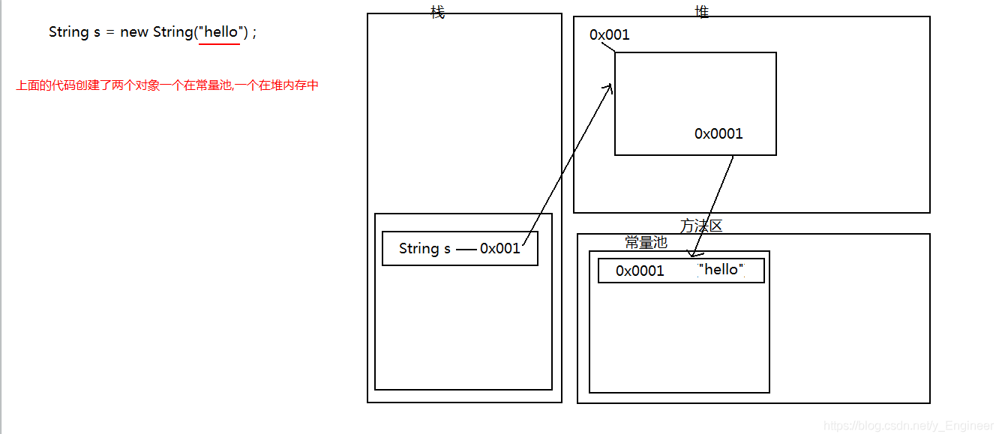
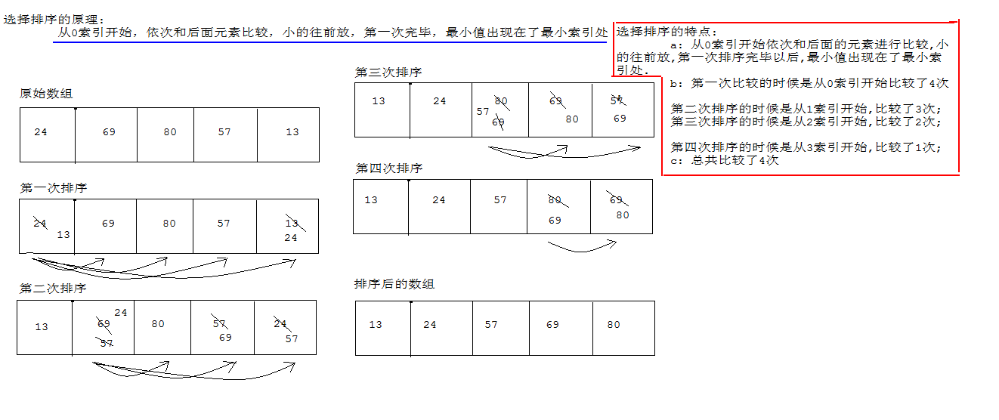
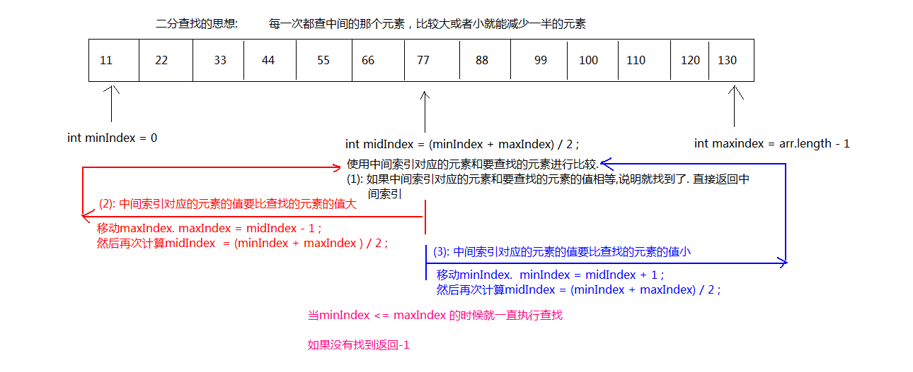

# 

# **一、Object类概述**

类层次结构的根类，即所有类都直接或者间接的继承自该类。

# **二、Object类的常用方法**

## 1、Object类的*equals*()方法

```shell
A：功能：指示其他某个对象是否与此对象“相等”。
B：源代码：
		public boolean equals(Object obj) {
    		return (this == obj);
		}
C：注意：默认情况下比较的是对象的引用是否相同。
D：使用：由于比较对象的引用没有意义，一般建议重写该方法。一般用于比较成员变量的值是否相等。
```

**举例**

```shell
要求：在Student类中重写equals()方法，重写后的功能：如果两个对象成员变量的值相等，就认为这两个对象相同，即equals()方法返回ture。并定义测试类进行测试。
```

```java
public class Student {
    private String name;
    private int age;

    public Student() {
    }
    //有参构造方法，传入成员变量值
    public Student(String name, int age) {
        this.name=name;
        this.age=age;
    }

    @Override
    //两个对象的成员变量一摸一样，就认为两个对象一样
    public boolean equals(Object obj) {
        //优化比较效率（比较的两个对象本来就是一个对象）
        if(this==obj){
            return true;
        }

        //instanceof 可以判断一个引用或者对象，是不是该类型的一个引用
        if(!(obj instanceof Student)){
            return false;
        }
        //向下转型
        Student stu= (Student) obj;
        //"张三"=="张三"，有可能返回false，String 类认为父类Object中的 equals()方法默认比较方式意义不大，String类就重写了equals方法，去比较两个字符串字面内容是否相同
        return this.name.equals(stu.name)&&this.age==stu.age;
    }
}
class Test{
    public static void main(String[] args) {
        Student student3 = new Student("张三", 23);
        Student student4 = new Student("张三", 23);

        System.out.println(student3.equals(student4));
    }
}
运行结果：
true

Process finished with exit code 0
```

## 2、Object类的hashCode()方法

```shell
public int hashCode()
	a:返回该对象的哈希码值。默认情况下，该方法会根据对象的地址来计算,即把对象的地址值换算成一个整数值。
	b:不同对象的哈希码值一般来说不会相同。
	  但是，同一个对象的哈希码值肯定相同。
	c:不是对象的实际地址值，可以理解为逻辑地址值。	
```

**示例**

```java
public class MyTest extends Object{
    public static void main(String[] args) {
        //Object 是我们所有类的顶层父类，所有类都是直接或间接继承自他
        //创建Object类的对象
        Object obj = new Object();
        //Object类中常用的方法
        //hashCode() 返回一个对象的哈希码值(把对象的地址值换算成一个整数值)
        int code = obj.hashCode(); 
        System.out.println(code);
        
        Object obj2 = new Object();
        int code1 = obj2.hashCode();
        System.out.println(code1);
        //不同的对象的哈希码值不一样
    }
}
运行结果：
356573597
1735600054

Process finished with exit code 0
```

## 3、Object类的getClass()方法

```shell
public final Class getClass()
		a:返回此 Object 的运行时类，即 类名.class文件加载进内存后，JVM就会为 类名.class文件创建一个对象，getClass()方法会返回该对象。
		b:可以通过Class类中的一个方法，获取对象的真实类的全名称。	
		public String getName()
		getClass().getName()代表返回对象所属类的类名。
```

**示例**

```java
public class Test {
    public static void main(String[] args) {
        Animal animal = new Animal();
        System.out.println(animal.getClass());
        System.out.println(animal.getClass().getName());
    }
}
class Animal{

}
运行结果：
class Animal
Animal

Process finished with exit code 0
```

## 4、Object类的toString()方法

```java
public String toString()
	a:返回该对象的字符串表示。
		源代码:
		 	public String toString() {
   					 return getClass().getName() + "@" + Integer.toHexString(hashCode());
				}
	b:它的值等于： 
		getClass().getName() + '@' + Integer.toHexString(hashCode()) 
	c:由于默认情况下的数据对我们来说没有意义，一般建议重写该方法，即将该类的所有的成员变量组成返回即可
```

**示例**

```java
public class Test {
    public static void main(String[] args) {
        //未重写的toString()
        System.out.println(new Student1("小明", 21).toString());
        System.out.println("--------------------------------");
        //重写的toString() 方法
        Student stu = new Student("小明", 20);
        System.out.println(stu.toString());
    }
}
class Student{
    String name;
    int age;

    public Student() {
    }

    public Student(String name, int age) {
        this.name = name;
        this.age = age;
    }

    @Override
    public String toString() {
        return "Student{" +
                "name='" + name + '\'' +
                ", age=" + age +
                '}';
    }
}
class Student1{
    String name;
    int age;

    public Student1() {
    }

    public Student1(String name, int age) {
        this.name = name;
        this.age = age;
    }
}
运行结果：
Student1@1540e19d
--------------------------------
Student{name='小明', age=20}

Process finished with exit code 0
```

## 5、Object类的clone() 方法

* 使用：clone()的权限修饰符是受保护的,在用的时候,让该类重写该方法,并把该方法的权限修饰符改为public，使用clone()方法采用的是浅克隆的方式。

* 对象浅克隆要注意的细节： 
  1. 如果一个对象需要调用clone()方法克隆，那么该对象所属的类必须要实现Cloneable接
  2. Cloneable接口是一个标识接口，没有任何方法。
  3. 对象的浅克隆就是克隆一个对象的时候，如果被克隆的对象中维护了另外一个类的对象，这时候只是克隆另外一个对象的地址，而没有把另外一个对象也克隆一份。
  4. 对象的浅克隆也不会调用到构造方法的。

**示例**

```java
public class Test {
    public static void main(String[] args) throws CloneNotSupportedException {
        Person p1 = new Person("张三", 23);
        Person p2 = (Person) p1.clone();
        //克隆会将成员变量的值也克隆，不对其重新赋值，则克隆的对象的成员变量的值等于被克隆对象的成员变量的值
        System.out.println(p1);
        System.out.println(p2);
        System.out.println("---------------------------");;
        Person p3 = new Person("王五", 25);
        Person p4 = (Person) p3.clone();
        p4.name = "赵六";
        p4.age = 36;
        System.out.println(p3);
        System.out.println(p4);
    }
}

class Person implements Cloneable {  //必须实现Cloneable接口，否则不能克隆
    public String name;
    public int age;

    public Person() {
    }

    public Person(String name, int age) {
        this.name = name;
        this.age = age;
    }

    @Override
    //重写 clone()方法 修改权限修饰符，将private改为public
    public Object clone() throws CloneNotSupportedException {
        return super.clone();
    }

    @Override
    public String toString() {
        return "Person{" +
                "name='" + name + '\'' +
                ", age=" + age +
                '}';
    }
}
运行结果：
Person{name='张三', age=23}
Person{name='张三', age=23}
---------------------------
Person{name='王五', age=25}
Person{name='赵六', age=36}

Process finished with exit code 0
```

# **Java常用类（一）**

## String类

### 1、String类概述

```shell
A:字符串：
	a、字符串是由多个字符组成的一串数据(字符序列)；
	b、字符串可以看成是字符数组。
B:String类的概述：String 类代表字符串
	a:字符串字面值"abc"也可以看成是一个字符串对象。
	b:字符串是常量，一旦被创建，就不能被改变。
```

### 2、String类的构造方法

```java
public String():空构造
public String(byte[] bytes):把字节数组转成字符串	
public String(byte[] bytes,int index,int length):把字节数组的一部分转成字符串(index:表示的是从第几个索引开始, length表示的是长度)
public String(char[] value):把字符数组转成字符串
public String(char[] value,int index,int count):把字符数组的一部分转成字符串
public String(String original):把字符串常量值转成字符串
```

**举例**

```java
public class Example02 {
    public static void main(String[] args) {
        String s1 = new String();//空参构造方法
        byte[] bytes={97,98,99,100,101};
        String s = new String(bytes);//把字节数组转成字符串的构造方法
        System.out.println(s);  //ASCII表   打印对应键盘字符
        String s2 = new String(bytes, 1, 3);//将一部分转成字符串
        System.out.println(s2);

        System.out.println("------------------------------");
        char[] value={'他','是','个','学','生'};
        String str3 = new String(value);//将字符数组转换为字符串的构造方法
        System.out.println(str3);
        //public int length()：返回此字符串的长度
        System.out.println(str3.length());
        //从指定元素开始获取指定个数的元素并将其转换为字符串的构造方法
        String str4 = new String(value, 3, 2);
        System.out.println(str4);
        System.out.println(str4.length());
    }
}
运行结果：
abcde
bcd
------------------------------
他是个学生
5
学生
2

Process finished with exit code 0
```

### 3、String类特点

字符串一旦被创建就不能改变，因为字符串的值是在方法区的常量池中划分空间分配地址值的。

**简化内存图**




### 4、String类的判断功能

```java
public boolean equals(Object obj):				比较字符串的内容是否相同,区分大小写
public boolean equalsIgnoreCase(String str):	比较字符串的内容是否相同,忽略大小写
public boolean contains(String str):			判断字符串中是否包含传递进来的字符串
public boolean startsWith(String str):			判断字符串是否以传递进来的字符串开头
public boolean endsWith(String str):			判断字符串是否以传递进来的字符串结尾
public boolean isEmpty():						判断字符串的内容是否为空串""。
```

**示例**

```java
public class Example03 {
    public static void main(String[] args) {
        //public boolean equals(Object obj): 比较字符串的内容是否相同,区分大小写
        //“==”比较的是地址值
        {
            String str = "aaa";
            String str1 = "bbb";
            String str2 = "ccc";
            String str3 = "aaa";
            String str4 = new String("bbb");
            System.out.println(str.equals(str3));   //true
            System.out.println(str == str3);        //true 
            System.out.println(str.equals(str2));   //false
            System.out.println(str1.equals(str4));  //true
            System.out.println(str1 == str4);       //false str4是新创建的"bbb"字符串，地址值和str1的不同
        }
        System.out.println("------------------------------");
        //public boolean equalsIgnoreCase(String str):		比较字符串的内容是否相同,忽略大小写
        {
            String str="QWER";
            String str1="qwer";
            System.out.println(str.equalsIgnoreCase(str1)); //true
        }
        {
            String str="MyJavaDemo";
            System.out.println(str.contains("aD")); //true 判断字符串中是否包含传递进来的字符串
           System.out.println(str.startsWith("My"));//true 判断字符串是否以传递进来的字符串开头
            System.out.println(str.endsWith("emo"));//true 判断字符串是否以传递进来的字符串结尾
            System.out.println(str.isEmpty());      //false 判断字符串的内容是否为空串""
            System.out.println("".isEmpty());       //true
        }
    }
}
```

### 5、String类的获取功能

```java
public int length():				获取字符串的长度。
public char charAt(int index):		获取指定索引位置的字符
public int indexOf(int ch):			返回指定字符在此字符串中第一次出现处的索引。
public int indexOf(String str):		返回指定字符串在此字符串中第一次出现处的索引。
public int indexOf(int ch,int fromIndex):返回指定字符在此字符串中从指定位置后第一次出现处的索引。
public int indexOf(String str,int fromIndex): 返回指定字符串在此字符串中从指定位置后第一次出现处的索引。
public String substring(int start):		从指定位置开始截取字符串,默认到末尾。
public String substring(int start,int end):	从指定位置开始到指定位置结束截取字符串。
```

**示例**

```java
public class Example08 {
    public static void main(String[] args) {
        String str="西安市长安区西安邮电大学长安校区710121";
        //获取字符串长度
        System.out.println( str.length());
        //获取指定索引位置的字符
        System.out.println( str.charAt(0));
        //返回指定字符串在此字符串中第一次出现处的索引
        System.out.println( str.indexOf("邮电"));
        //返回指定字符(ASCII码表对应数值或字符)在此字符串中第一次出现处的索引
        System.out.println( str.indexOf('邮'));
        //返回指定字符在此字符串中从指定位置后第一次出现处的索引
        System.out.println( str.indexOf('区', str.indexOf('区') + 1));
        //返回指定字符串在此字符串中从指定位置后第一次出现处的索引
        System.out.println( str.indexOf("西安", str.indexOf("西安")+1));
        //从指定位置开始截取字符串,默认到末尾
        System.out.println( str.substring(5));
        //从指定位置开始到指定位置结束截取字符串
        System.out.println( str.substring(5, 8));
    }
}
运行结果：
22
西
8
8
15
6
区西安邮电大学长安校区710121
区西安

Process finished with exit code 0
```

### 6、字符串的遍历

```java
//遍历字符串
    public static void traversingStrings(String str) {
        for (int i = 0; i < str.length(); i++) {
            System.out.print(str.charAt(i));
        }
        System.out.println();
    }
```

**例：分别统计字符串中大写字母，小写字母，数字的个数**

```java
public static void statistics(String str1) {
		//定义统计变量
        int capitalCount=0;
        int lowerCaseCount=0;
        int numCount=0;
        //遍历查找统计
        for (int i = 0; i < str1.length(); i++) {
            if(str1.charAt(i)>=48&&str1.charAt(i)<=57){
                numCount++;
            }else if(str1.charAt(i)>=65&&str1.charAt(i)<=90){
                capitalCount++;
            }else if(str1.charAt(i)>=97&&str1.charAt(i)<=122){
                lowerCaseCount++;
            }
        }
        System.out.println("大写字母统计个数：" + capitalCount);
        System.out.println("小写字母统计个数：" + lowerCaseCount);
        System.out.println("数字统计个数：" + numCount);
    }
```

### 7、String类的转换功能

```java
public byte[] getBytes():						把字符串转换为字节数组。
public char[] toCharArray():					把字符串转换为字符数组。
public static String valueOf(char[] chs):		把字符数组转成字符串。
public static String valueOf(int i):			把int类型的数据转成字符串。
		注意：String类的valueOf方法可以把任意类型的数据转成字符串。
public String toLowerCase():					把字符串转成小写。
public String toUpperCase():					把字符串转成大写。
public String concat(String str):				把字符串拼接。
```

**示例**

```java
public class Example06 {
    public static void main(String[] args) {
        {
            String str="33 4 @";
            byte[] bytes = str.getBytes();  //把字符串转换为字节数组
            for (int i = 0; i < bytes.length; i++) {
                System.out.print(bytes[i]+" ");
            }
            System.out.println();
            char[] chars = str.toCharArray();   //把字符串转换为字符数组
            for (int i = 0; i < chars.length; i++) {
                System.out.print(chars[i]+",");
            }
        }
        System.out.println("\n----------------------------------");
        {
            //注意：String类的valueOf方法可以把任意类型的数据转成字符串。
            char[] chars = {'s', '#', '你', '好'};
            System.out.println(String.valueOf(chars));//把字符数组转成字符串
            System.out.println(String.valueOf(100));//将int类型数据转化为字符串
        }
        System.out.println("----------------------");
        {
            String str = "ASDsfshgY";
            String str1 = "asds";
            System.out.println(str.toLowerCase());  //转小写
            System.out.println(str.toUpperCase());  //转大写
            System.out.println(str.concat(str1));   //拼接
        }
    }
}
运行结果：
51 51 32 52 32 64 
3,3, ,4, ,@,
----------------------------------
s#你好
100
----------------------
asdsfshgy
ASDSFSHGY
ASDsfshgYasds

Process finished with exit code 0
```

### 8、String类的其他功能

```java
public String replace(char old,char new)			将指定字符进行互换
public String replace(String old,String new)		将指定字符串进行互换
public String trim()								去除两端空格
```

```java
public class Example14 {
    public static void main(String[] args) {
        String str="abcde12345";
        String newStr = str.replace('a', '#');//将指定字符进行互换
        System.out.println(newStr);
        String newStr1 = str.replace("abcde", "*****");//将指定字符串进行互换
        System.out.println(newStr1);
        str="    123     ";
        String newStr2 = str.trim();//去除两端空格
        System.out.println(newStr2);
    }
}
运行结果：
#bcde12345
*****12345
123

Process finished with exit code 0
```

### 9、例题：

```shell
需求：统计大串中小串出现的次数
	举例: "woaijavawozhenaijavawozhendeaijavawozhendehenaijavaxinbuxinwoaijavagun”中,
	      java出现了5次
```

**示例**

```java
public class Example13 {
    public static void main(String[] args) {
        String maxStr = "woaijavawozjavahendeaijavawohenajavaihenaijava";
        String minStr = "java";

        int count = getCount1(maxStr, minStr);//方法一
        int count1 = countMinString(maxStr, minStr);//方法二
        System.out.println(count);
        System.out.println(count1);
    }

    public static int getCount1(String maxStr, String minStr) {
        if(minStr==null||minStr.isEmpty()){
            return -1;
        }
        int count = 0;// 定义一个统计变量
        int index;//定义java索引
        while ((index = maxStr.indexOf(minStr)) != -1) {
            count++;
            // 找到"java" 截取
            maxStr = maxStr.substring(index + minStr.length());
        }
        return count;
    }

    public static int countMinString(String maxStr,String minStr) {
        //若传进来的minStr为null或空串，则直接返回-1
        if(minStr==null||minStr.isEmpty()){
            return -1;
        }
        int maxStrLength = maxStr.length();//原串长度
        maxStr=maxStr.replace(minStr,"");//用空串替换java
        int strNewLength = maxStr.length();//新串长度
        int count=(maxStrLength-strNewLength)/minStr.length();//计算java出现的次数
        return count;

        //上面五行代码链式编程：return (maxStr.length()-maxStr.replace(minStr,"").length())/minStr.length();
    }
}
运行结果：
5
5

Process finished with exit code 0
```

# **排序及二分查找**

## 1、排序

### 1、冒泡排序


### 2、选择排序



### 3、直接插入排序


### 4、快速排序

**快速排序算法思想**

```shell
分治法：比大小，再分区
1.从数组中取出一个数，作为基准数。
2.分区：将比这个数大或等于的数全放到他的右边，小于他的数
全放到他的左边。
3.再对左右区间重复第二步，直到各区间只有一个数
```

**实现思路**

```shell
挖坑填数
1.将基准数挖出形成第一个坑。
2.由后向前找比他小的数，找到后挖出此数填到前一个坑中。
3.由前向后找比他大或等于的数，找到后也挖出此数填到前一个坑中。
4.再重复执行2，3两步骤。
```

**例如对 5391672408 进行排序**

| **元素** | **5** | **3** | **9** | **1** | **6** | **7** | **2** | **4** | **0** | **8** |
| -------- | ----- | ----- | ----- | ----- | ----- | ----- | ----- | ----- | ----- | ----- |
| 坑位     | 坑位1 |       | 坑位3 |       | 坑位5 | 坑位7 | 坑位6 | 坑位4 | 坑位2 |       |
| 第一轮   | 0     | 3     | 4     | 1     | 2     | 5     | 7     | 6     | 9     | 8     |

## 2、二分查找

**二分查找前提：数组必须有序**



**代码演示**

```java
import java.util.Arrays;

public class Test {
    public static void main(String[] args) {
        int[] arr = {55, 33, 77, 11, 99, 22, 44, -1, 0};
        Tools.bubbleSort(arr);//冒泡排序
        System.out.println(Arrays.toString(arr));

        int[] arr1 = {55, 33, 77, 11, 99, 22, 44, -1, 0};
        Tools.selectSort(arr1);//选择排序
        System.out.println(Arrays.toString(arr1));

        int[] arr2 = {55, 33, 77, 11, 99, 22, 44, -1, 0};
        Tools.directInsertionSort(arr2);//直接插入排序
        System.out.println(Arrays.toString(arr2));

        int[] arr3 = {55, 33, 77, 11, 99, 22, 44, -1, 0};
        Tools.quickSort(arr3, 0, arr3.length - 1);//快速排序
        System.out.println(Arrays.toString(arr3));

        int[] arr4 = {-1, 0, 11, 22, 33, 44, 55, 77, 99};
        int ele = 99;
        int index = Tools.binarySearch(arr4, ele);
        System.out.println(new StringBuilder().append(ele).append("的索引是：").append(index));
    }
}

//定义排序及二分查找工具类
class Tools {
	//私有化构造方法
	private Tools(){}
	//提供公共静态的方法
    //冒泡排序
    public static void bubbleSort(int[] arr) {
        for (int i = 0; i < arr.length - 1; i++) {
            for (int j = 0; j < arr.length - i - 1; j++) {
                if (arr[j] > arr[j + 1]) {
                    exchange(arr, j, j + 1);
                }
            }
        }
    }

    //选择排序
    public static void selectSort(int[] arr) {
        for (int i = 0; i < arr.length - 1; i++) {
            for (int j = i + 1; j < arr.length; j++) {
                if (arr[i] > arr[j]) {
                    exchange(arr, i, j);
                }
            }
        }
    }

    //直接插入排序
    public static void directInsertionSort(int[] arr) {
        for (int i = 1; i < arr.length; i++) {
            for (int j = i; j > 0; j--) {
                if (arr[j] < arr[j - 1]) {
                    exchange(arr, j, j - 1);
                }
            }
        }
    }

    //快速排序
    public static void quickSort(int[] arr, int start, int end) {
        if (start >= end||end<=0||arr==null) {
            return;
        }else {
            int index = getIndex(arr, start, end);
            quickSort(arr, start, index - 1);
            quickSort(arr, index + 1, end);
        }
    }

    public static int getIndex(int[] arr, int start, int end) {
        int i = start;
        int j = end;
        int x = arr[i];
        while (i < j) {
            while (i < j && arr[j] >= x) {
                j--;
            }
            if (i < j) {
                arr[i] = arr[j];
                i++;
            }
            while (i < j && arr[i] < x) {
                i++;
            }
            if (i < j) {
                arr[j] = arr[i];
                j--;
            }
        }
        arr[i] = x;
        return i;
    }

    //交换值
    public static void exchange(int[] arr, int i, int j) {
        int t = arr[i];
        arr[i] = arr[j];
        arr[j] = t;
    }

    //二分查找
    public static int binarySearch(int[] arr, int ele) {
        int maxIndex = arr.length - 1;
        int minIndex = 0;
        int midIndex = (maxIndex + minIndex) >>> 1;
        while (minIndex <= maxIndex) {
            if (ele == arr[midIndex]) {
                return midIndex;
            } else if (ele < arr[midIndex]) {
                maxIndex = midIndex - 1;
            } else {
                minIndex = midIndex + 1;
            }
            midIndex = (maxIndex + minIndex) >>> 1;
        }
        return -1;
    }
}
运行结果：
[-1, 0, 11, 22, 33, 44, 55, 77, 99]
[-1, 0, 11, 22, 33, 44, 55, 77, 99]
[-1, 0, 11, 22, 33, 44, 55, 77, 99]
[-1, 0, 11, 22, 33, 44, 55, 77, 99]
99的索引是：8

Process finished with exit code 0
```

# **Java常用类（二）**

## 1、StringBuffer类

### 1、StringBuffer类的概述

线程安全的可变字符序列。一个类似于 String 的字符串缓冲区，但不能修改。虽然在任意时间点上它都包含某种特定的字符序列，但通过某些方法调用可以改变该序列的长度和内容。
**String类和StringBuffer类的区别**

1. String表示的字符串是常量，其长度和内容都无法改变。而StringBuffer表示字符容器，其长度和内容都可以改变；
2. 在操作字符串时，如果该字符串仅用于表示数据类型，则使用String类即可，但如果需要对字符串中的字符进行修改操作，则须使用StringBuffer类；
3. String覆盖了Object类的equals()方法，而StringBuffer类没有覆盖；
4. String类对象可以用操作符"+"进行连接，而StringBuffer类对象不可以。

### 2、StringBuffer类的构造方法

```java
public class Example16 {
    public static void main(String[] args) {
        //构造方法
        //public StringBuffer():				无参构造方法,不带字符，其初始容量为16个字符
        //public StringBuffer(int capacity):	不带字符，指定容量的字符串缓冲区
 		//public StringBuffer(String str):		指定字符串内容的字符串缓冲区对象

        //方法
        //public int capacity()：               返回当前容量,	 理论值
        //public int length():                  返回长度（字符数, 实际值
        StringBuffer sb = new StringBuffer();
        System.out.println(sb.capacity());//默认容量16

        StringBuffer sb1 = new StringBuffer(100);
        System.out.println(sb1.capacity());//指定容量100

        StringBuffer sb2 = new StringBuffer("123");
        System.out.println(sb2.length());//字符长度 ：3
    }
}
运行结果：
16
100
3

Process finished with exit code 0
```

### 3、StringBuffer的添加，修改，删除功能

```java
public class Example14 {
    public static void main(String[] args) {
        System.out.println("1、添加---------------");
        add();
        System.out.println("2、删除---------------");
        remove();
        System.out.println("3、修改---------------");
        String str = alter();
        System.out.println(str);
    }

    private static void add() {
        StringBuffer stringBuffer = new StringBuffer();//定义一个字符串缓冲区
        stringBuffer.append("abcdefg");//添加参数（"append"）到StringBuffer容器中
        System.out.println(stringBuffer);
        System.out.println(stringBuffer.insert(3, "123"));//在指定位置插入字符串
    }

    private static String alter() {
        StringBuffer stringBuffer = new StringBuffer("abcdefg");//构造方法添加字符串
        System.out.println(stringBuffer.replace(0, 3, "hij"));//修改指定区间的字符或字符串   //范围含头不含尾
        stringBuffer.setCharAt(stringBuffer.length()-1,'1');//修改指定位置的字符
        System.out.println(stringBuffer);
        System.out.println(stringBuffer.reverse());//反转字符序列
        return stringBuffer.toString();//返回StringBuffer缓冲区中的String类型的字符串
    }

    private static void remove() {
        StringBuffer stringBuffer = new StringBuffer("abcdefg");
        System.out.println(stringBuffer.deleteCharAt(3));//删除指定位置字符
        System.out.println(stringBuffer.delete(3, 5));//删除指定范围字符串   //含头不含尾
        System.out.println(stringBuffer.delete(0, stringBuffer.length()));//清空缓冲区
    }
}
运行结果：
1、添加---------------
abcdefg
abc123defg
2、删除---------------
abcefg
abcg

3、修改---------------
hijdefg
hijdef1
1fedjih
1fedjih

Process finished with exit code 0
```

### 4、StringBuffer和String的相互转换

```java
public class Example17 {
    public static void main(String[] args) {
        //String -- StringBuffer
        String str="123";
        StringBuffer sb = new StringBuffer(str);//通过构造方法
        StringBuffer sb1 = new StringBuffer().append(str);//通过append()方法

        //StringBuffer -- String
        String sbStr = sb.substring(0);//使用substring方法
        String sbStr1 = new String(sb);//通过构造方法
        String sbStr2 = sb.toString();//通过toString()方法
    }
}
```

### 5、StringBuilder类

一个可变的字符序列。此类提供一个与**StringBuffer** 兼容的 API，但不保证同步。该类被设计用作StringBuffer 的一个简易替换，用在字符串缓冲区被单个线程使用的时候（这种情况很普遍）。如果能，建议优先采用该类，因为在大多数实现中，它比StringBuffer 要快。

## 2、Arrays类

### 1、Arrays类概述

```shell
针对数组进行操作的工具类。提供了排序，查找等功能。
```

### 2、Arrays类的方法使用

```java
public static String toString(int[] a)
public static void sort(int[] a)
public static int binarySearch(int[] a,int key)
```

**演示**

```java
import java.util.Arrays;

public class Example18 {
    public static void main(String[] args) {
        int[] arr={55,44,66,33,77,22,88,11,99,-1,0};
        String arrStr = Arrays.toString(arr);//把数组以字符串形式展示出来
        System.out.println(arrStr);

        Arrays.sort(arr);//对数组进行排序（快速排序）
        String arrSortStr = Arrays.toString(arr);//把数组以字符串形式展示出来
        System.out.println(arrSortStr);

        int index = Arrays.binarySearch(arr, 55);//二分查找，数组必须有序
        System.out.println(index);
    }
}
运行结果：
[55, 44, 66, 33, 77, 22, 88, 11, 99, -1, 0]
[-1, 0, 11, 22, 33, 44, 55, 66, 77, 88, 99]
6

Process finished with exit code 0
```

### 3、Arrays类方法的源码解析

```java
A：数组字符串
	public static String toString(int[] a) {
        if (a == null)
            return "null";
        int iMax = a.length - 1;
        if (iMax == -1)
            return "[]";

        StringBuilder b = new StringBuilder();
        b.append('[');
        for (int i = 0; ; i++) {
            b.append(a[i]);
            if (i == iMax)
                return b.append(']').toString();
            b.append(", ");
        }
    }
```

```java
B:二分查找
	public static int binarySearch(int[] arr, int ele) {
        int maxIndex = arr.length - 1;
        int minIndex = 0;
        int midIndex = (maxIndex + minIndex) >>> 1;
        while (minIndex <= maxIndex) {
            if (ele == arr[midIndex]) {
                return midIndex;
            } else if (ele < arr[midIndex]) {
                maxIndex = midIndex - 1;
            } else {
                minIndex = midIndex + 1;
            }
            midIndex = (maxIndex + minIndex) >>> 1;
        }
        return -1;
    }
```

## 3 、包装类

```shell
A：概述：为了对基本数据类型进行更多、更方便的操作,java就针对每一种基本数据类型提供了对应的类类型.
B：基本类型和包装类的对应
        byte 			Byte
        short			Short
        int				Integer
        long			Long
        float			Float
        double		    Double
        char			Character
        boolean		    Boolean
```

**以Integer为例演示**

**1、构造方法**

```shell
	Integer integer = new Integer(100);//将int类型数据转换为Integer类类型
    Integer integer1 = new Integer("100");//将String类型(内容必须为int类型)转换为Integer类类型
```

**2、常用方法**

```java
	int i = integer.intValue();//将Integer类型转换为int类型
    String str = integer.toString();//将Integer类型转换为String类型
    //获取int的范围
        int maxValue = Integer.MAX_VALUE;
        int minValue = Integer.MIN_VALUE;
    //将String类型（字面值必须为int类型)转为int类型
        int num2 = Integer.parseInt("100");
    //将字符串(字面值必须为int类型)或int类型转为Integer类型
        Integer integer = Integer.valueOf("100");
```

**3、JDK5的新特性自动装箱和拆箱**

* 自动装箱：系统自动把基本类型转换为包装类类型

* 自动拆箱：系统自动把包装类类型转换为基本类型

**演示**

```java
Integer integer=100;	//自动装箱
int a=integer;			//自动拆箱
```

**注意**

```java
Integer inte = 127;
	采用自动装箱这种方式,给他赋值的时候 这个值如果在 -128---127 那么他会从缓存中取对象,
  	如果超过一个字节的范围,那么就会重新new一个对象
举例：
		Integer i5 = 128;// i5= new Integer(128)
        Integer i6 = 128; // i6=new Integer(128)
        System.out.println(i5 == i6); //false   //重新new的对象，地址值不同
        System.out.println(i5.equals(i6));//true

        //自动装箱
        Integer i7 = 127;
        Integer i8 = 127;
        System.out.println(i7 == i8); //true    //从缓存中取的对象，地址值相同
        System.out.println(i7.equals(i8));//true
```

# **Java常用类（三）**

## 1、正则表达式

### 1、概述

正则表达式：即正确规则的表达式，是指一个用来描述或者匹配一系列符合某个句法规则的字符串的单个字符串。其实就是一种规则。有自己特殊的应用。

### 2、常用规则字符

```shell
规则字符在java.util.regex Pattern类中
A:字符
	x 字符 x。举例：'a'表示字符a
	\\ 反斜线字符。
	\n 新行（换行）符 ('\u000A') 
	\r 回车符 ('\u000D')
B:字符类
	[abc] a、b 或 c（简单类） 
	[^abc] 任何字符，除了 a、b 或 c（否定） 
	[a-zA-Z] a到 z 或 A到 Z，两头的字母包括在内（范围） 
	[0-9] 0到9的字符都包括
C:预定义字符类
	. 任何字符 (注意:如果要使用'.'本身，则要使用转义字符："\.")
	\d 数字：[0-9]
	\w 单词字符：[a-zA-Z_0-9]
		在正则表达式里面组成单词的东西必须有这些东西组成
D:边界匹配器
	^ 行的开头 
	$ 行的结尾 
	\b 单词边界
E:Greedy 数量词 
	X? X，一次或一次也没有 比如""空串 就是没有
	X* X，零次或多次  大于等于1次 都算多次
	X+ X，一次或多次
	X{n} X，恰好 n 次 
	X{n,} X，至少 n 次 
	X{n,m} X，至少 n 次，但是不超过 m 次 
```

### 3、正则表达式的判断

```shell
String类的功能：public boolean matches(String regex)
```

**示例**

```java
import java.util.Scanner;

public class BLog {
    public static void main(String[] args) {
        /*
            需求：校验键盘录入的qq号码：
		    1:要求必须是5-11位数字
		    2:0不能开头
	    */
        Scanner scanner = new Scanner(System.in);
        System.out.println("请输入QQ号：");
        String qqStr = scanner.nextLine();
        boolean f=checkQQ(qqStr);
        if(f){
            System.out.println("QQ号码格式正确！");
        }else {
            System.out.println("QQ号码格式错误！");
        }
    }

    private static boolean checkQQ(String qqStr) {
        //第一位为1到9数字，第二位之后为0到9数字，长度4到10位，总共5到15位
        String regexStr="[1-9][0-9]{4,10}";
        return qqStr.matches(regexStr);
    }
}
```

### 4、正则表达式分割功能

```
String类的功能：public String[] split(String regex)
```

**示例**

```java
import java.util.Arrays;

public class Blog1 {
    public static void main(String[] args) {
        /*需求：有如下一个字符串:"91absad27ssdaf46safasf38safs50",拿出其中的数字，并排序，拼串
         请写代码实现最终输出结果是："27 38 46 50 91"  */
        String oldStr="91aASd27ssNJf46sSQasf38safs50";
        String newStr=getNewStr(oldStr);
        System.out.println(newStr);
    }

    private static String getNewStr(String oldStr) {
        String regexSplitStr="[a-zA-z]+";//定义分割符正则表达式
        String[] split = oldStr.split(regexSplitStr);//使用分割符正则表达式分割字符串

        int[] arr=new int[split.length];//定义int[]类型数组存储分割出来的数字

        for (int i = 0; i < split.length; i++) {
            arr[i]=Integer.parseInt(split[i]);//遍历存储数字
        }
        Arrays.sort(arr);//排序
        StringBuilder sb = new StringBuilder();
        for (int i = 0; i < arr.length; i++) {
            sb.append(arr[i]).append(" ");//拼串
        }
        return sb.toString().trim();//将StringBuilder类型转换为String类型，并去除最后的空格
    }
}
运行结果：
27 38 46 50 91

Process finished with exit code 0
```

### 5、正则表达式替换功能

```
String类的功能：public String replaceAll(String regex,String replacement)
```

**示例**

```java
public class Blog2 {
    public static void main(String[] args) {
        /*
        *   需求：将"ss5455sd5a45sda56566SD5FSD65SD5F4__5645_sdf5565"字符串中除了数字之外的内容删除
        *   思路：将除数字之外的内容替换为空串:  ""
        */
        String str="ss5455sd5a45sda56566SD5FSD65SD5F4__5645_sdf5565";
        String newStr=getNewStr(str);
        System.out.println(newStr);
    }

    private static String getNewStr(String str) {
        String  regexReplaceStr="[a-zA-Z_]+";//定义要替换字符串的正则表达式
        return str.replaceAll(regexReplaceStr,"");//替换字符串（删除）
    }
}
运行结果：
5455545565665655456455565

Process finished with exit code 0
```

## 2、Pattern类和Matcher类

* Pattern模式器,用来封装一个正则表达式

* Matcher匹配器,可以封装一个待匹配的数据,可以通过匹配器中的方法，进行匹配

**示例**

```java
//获取一个模式器
Pattern p = Pattern.compile("a*b*");
//通过模式器获取一个匹配器
Matcher m = p.matcher("aaaaab");
//进行匹配
boolean b = m.matches();
System.out.println(b);//true
```

```shell
Matcher匹配器的方法：
boolean find ()
尝试查找与该模式匹配的输入序列的下一个子序列。
String group ()
返回由以前匹配操作所匹配的输入子序列。
```

**举例**

```java
import java.util.regex.Matcher;
import java.util.regex.Pattern;

public class Blog3 {
    public static void main(String[] args) {
        //把下面这个字符串中是三个字母组成的单词，获取出来
        // da jia ting wo shuo, jin tian yao xia yu, bu shang wan zi xi, gao xing bu?

        String str="da jia ting wo shuo, jin tian yao xia yu, bu shang wan zi xi, gao xing bu?";

        //定义三个字母单词的正则表达式 注意加单词边界,否则是三个字符的都会取到
        String strRegx="\\b[a-z]{3}\\b";
        //把正则表达式封装到模式器中
        Pattern p = Pattern.compile(strRegx);
        //获取匹配器，把待匹配的字符串传进去
        Matcher matcher = p.matcher(str);
        while (matcher.find()){ //判断下一个字符词组是否为三个字母组成的单词
            String group = matcher.group();//获取匹配上的单词
            System.out.println(group.concat(" "));
        }
    }
}
运行结果：
jia jin yao xia wan gao 
Process finished with exit code 0
```

## 3、Math类概述和方法使用

```java
A:Math类概述
	Math 类包含用于执行基本数学运算的方法，如初等指数、对数、平方根和三角函数。 
B: 成员变量
	public static final double E : 		自然底数
	public static final double PI:		圆周率
C:成员方法
	public static int abs(int a)		取绝对值
	public static double ceil(double a)	 向上取整
	public static double floor(double a)	向下取整
	public static int max(int a,int b)      获取最大值
	public static int min(int a, int b)	 获取最小值
	public static double pow(double a,double b) 获取a的b次幂
	public static double random() 获取随机数返回带正号的 double 值，该值大于等于 0.0 且小于 1.0。
	public static int round(float a)  四舍五入
	public static double sqrt(double a) 获取正平方根
```

**演示**

```java
public class MathDemo {
    public static void main(String[] args) {
        //Math 数学工具类
        //属性
        double pi = Math.PI;
        double e = Math.E;
        //方法
        double num = Math.random(); //生成double类型随机数 0-----1 之间
        //获取最值
        int max = Math.max(19, 20);//20
        int min = Math.min(20, 40);//20
        //向上取整，向下取整
        double ceil = Math.ceil(1.9);//2.0
        double floor = Math.floor(1.9);//1.0
        //四舍五入
        long round = Math.round(1.48);//小数点后一位四舍五入 结果：1
        //求一个数的几次幂
        double pow = Math.pow(2, 3);//2的3次方
        //求平方根
        double sqrt = Math.sqrt(4);//2.0
        //求一个数的立方根
        double pow2 = Math.pow(8, 1.0/3);//2.0
        //求一个数的绝对值
        int abs = Math.abs(-1);//1
    }
}
```

## 4、Random类

```shell
A:Random类的概述
	此类的实例用于生成伪随机数流,使用48位的种子,如果用相同的种子创建两个 Random 实例，
	则对每个实例进行相同的方法调用序列，它们将生成并返回相同的数字序列。
B:构造方法
	public Random()			 没有给定种子,使用的是默认的(当前系统的毫秒值)
	public Random(long seed)		 给定一个long类型的种子,给定以后每一次生成的随机数是相同的
C:成员方法
	public int nextInt()//没有参数 表示的随机数范围 是int类型的范围
	public int nextInt(int n)//可以指定一个随机数范围 
	void nextBytes(byte[] bytes)  生成随机字节并将其置于用户提供的空的 byte 数组中。 
```

**示例**

```java
public class RandomDemo {
    public static void main(String[] args) {
        //生成随机数据的类
        // 此类的实例用于生成伪随机数流。此类使用 48 位的种子，
        Random random = new Random();
        //生成一些随机整数
        random.nextInt(); //如果没有传入一个范围，生成的随机数就是int的范围
        random.nextInt(100); //范围是0-99,包含0和99

        random.nextDouble();//生成一个随机double范围内的数
        random.nextBoolean();//生成一个随机boolean值
        byte[] bytes= new byte[10];
        //随机一些byte范围的数，填到这个数组中
        random.nextBytes(bytes);
        show();
        show();
        show();
    }

    public static void show() {
        int[] arr=new int[10];
        //Random( long seed)
        //使用单个 long 种子创建一个新的随机数生成器。
        //给定了种子，每次生成的随机数都是一样的
        Random random = new Random(1);
        for (int i = 0; i < 10; i++) {
            int i1 = random.nextInt(10);
            arr[i]=i1;
        }
        System.out.println(Arrays.toString(arr));
    }
}
运行结果：
[5, 8, 7, 3, 4, 4, 4, 6, 8, 8]
[5, 8, 7, 3, 4, 4, 4, 6, 8, 8]
[5, 8, 7, 3, 4, 4, 4, 6, 8, 8]

Process finished with exit code 0
```

## 5、System类

```shell
A:System类的概述
	System 类包含一些有用的类字段和方法。它不能被实例化。
成员变量:in(标准的输入流，对应设备是键盘)
		out(标准的输出流，对应的设备是屏幕） 
B:成员方法
	public static void gc()//调用垃圾回收器
	public static void exit(int status)//退出java虚拟机 0 为正常退出 非0为 异常退出
	public static long currentTimeMillis()//获取当前时间的毫秒值
```

**示例**

```java
import java.io.PrintStream;
import java.util.Scanner;

public class Blog5 {
    public static void main(String[] args) {
        //InputStream 抽象类
        //in
        //public static final InputStream in“标准”输入流。此流已打开并准备提供输入数据。通常，此流对应于键盘输入
        Scanner sc= new Scanner(System.in);
        //out
        //public static final PrintStream out“标准”输出流。此流已打开并准备接受输出数据。通常，此流对应于显示器输出
        PrintStream out = System.out;
        out.println("abc");

        System.gc();//运行垃圾回收器

        //获取当前系统的毫秒值
        //计算机元年 1970-01-01 00:00:00-------当前时刻（毫秒值）
        long start = System.currentTimeMillis();
        System.out.println(start+"(毫秒)");
        //退出JVM
        System.exit(0);//给0正常退出 ，非0强制退出
    }
}
```

## 6、BigDecimal类

```java
A:BigDecimal的概述
	由于在运算的时候，float类型和double很容易丢失精度,
	所以，为了能精确的表示、计算浮点数，Java提供了BigDecimal
	不可变的、任意精度的有符号十进制数。
B:构造方法
	public BigDecimal(String val)
C:成员方法
	public BigDecimal add(BigDecimal augend)//加
	public BigDecimal subtract(BigDecimal subtrahend)//减
	public BigDecimal multiply(BigDecimal multiplicand)//乘
	public BigDecimal divide(BigDecimal divisor)//除法
	public BigDecimal divide(BigDecimal divisor,int scale,int roundingMode)//scale 小数点后面保留几位
	// roundingMode 取舍模式 比如四舍五入
```

**示例**

```java
public class MyTest {
    public static void main(String[] args) {
        double a=1.999999;
        double b=3.111111;
        //如果对精度要求比较高，就可以使用 BigDecimal
        BigDecimal aNum = new BigDecimal(a);
        BigDecimal bNum = new BigDecimal(b);
        BigDecimal add = aNum.add(bNum); //加
        System.out.println(add);
        BigDecimal subtract = aNum.subtract(bNum); //减
        System.out.println(subtract);

        BigDecimal multiply = aNum.multiply(bNum);
        System.out.println(multiply); //乘
        //不能整除时，我们要规定，保留位数，以及取舍方式
        BigDecimal divide = aNum.divide(bNum,30,BigDecimal.ROUND_CEILING);//除
        System.out.println(divide);
        System.out.println(1==0.999999999999999999999);//true
    }
}
运行结果：
5.1111100000000002641087348820292390882968902587890625
-1.1111120000000000995754589894204400479793548583984375
6.222218888889000619624654277117785066535292925651337156290189393803569117835650104098021984100341796875
0.642856844387744431287794403143
true

Process finished with exit code 0
```

## 7、BigInteger类

```java
概述：可以让超过Integer范围内的数据进行运算

构造方法
public BigInteger(String val)
成员方法
public BigInteger add(BigInteger val)
public BigInteger subtract(BigInteger val)
public BigInteger multiply(BigInteger val)
public BigInteger divide(BigInteger val)
public BigInteger[] divideAndRemainder(BigInteger val)
```

**示例**

```java

import java.math.BigInteger;

public class MyTest1 {
    public static void main(String[] args) {
        BigInteger bi1=new BigInteger("99999999999999999999999999");
        BigInteger bi2=new BigInteger("77777777777777777777");

        System.out.println(bi1.add(bi2));   //加
        System.out.println(bi1.subtract(bi2));   //减
        System.out.println(bi1.multiply(bi2));   //乘
        System.out.println(bi1.divide(bi2));    //除
        System.out.println("----------------");
        BigInteger[] arr=bi1.divideAndRemainder(bi2);    //取除数和余数
        System.out.println("数组长度："+arr.length);
        for(int i=0;i<arr.length;i++){
            System.out.println(arr[i]);
        }
    }
}
运行结果：
100000077777777777777777776
99999922222222222222222222
7777777777777777777699999922222222222222222223
1285714
----------------
数组长度：2
1285714
22222222222223222221

Process finished with exit code 0
```

# **Java常用类（四）**

## 1、Date类

```java
A:Date类的概述
	类 Date 表示特定的瞬间，精确到毫秒。 
B:构造方法
	public Date()
	public Date(long date)  //把一个long类型的毫秒值转换成一个日期对象
C:成员方法
	public long getTime():	获取一个日期对象对象毫秒值
	public void setTime(long time):	给一个日期对象设置上指定的毫秒值
```

**示例**

```java
import java.util.Date;

public class Blog {
    public static void main(String[] args) {
        Date date = new Date();     //获取当前日期值
        System.out.println(date);
        long time = date.getTime();//获取当前时刻毫秒值
        System.out.println(time);
        //获取当前系统的毫秒值
        //long l = System.currentTimeMillis();
        //System.out.println(l);

        //返回将传入毫秒值加到计算机初始时间(1970-01-01 00:00:00)的Date值
        Date date1 = new Date(1000 * 60 * 60 * 24);
        System.out.println(date1);
        
        date.setTime(1000*60*60*24);//给计算机元年设置相应的时间量
        System.out.println(date);
    }
}
运行结果：
Tue Jul 16 23:25:51 CST 2019
Fri Jan 02 08:00:00 CST 1970
1563290751279
Fri Jan 02 08:00:00 CST 1970

Process finished with exit code 0
```

## 2、SimpleDateFormat类

```shell
SimpleDateFormat功能: 可以把一个日期对象格式化成一个文本(字符串) , 也可以把一个日期字符串解析成一个日期对象。
构造方法:
 public SimpleDateFormat():使用默认的模式来创建一个SimpleDateFormat对象
 public SimpleDateFormat(String pattern):使用指定的模式（规则比如yyyy:MM:dd HH:mm:ss）来创建一个SimpleDateFormat对象
 
 规则的定义：
 y               年
 M               月
 d               天
 H               时
 m               分
 s               秒
 E              星期几

 成员方法:
 public String format(Date date): 	把一个日期对象格式化成一个字符串
 public Date parse(String dateStr):	把一个日期字符串解析成一个日期对象 注意要以指定格式解析
```

**演示**

```java
import java.text.ParseException;
import java.text.SimpleDateFormat;
import java.util.Date;

public class Blog1 {
    public static void main(String[] args) throws ParseException {
        Date date = new Date();
        SimpleDateFormat simpleDateFormat = new SimpleDateFormat();//默认格式
        String format1 = simpleDateFormat.format(date);
        System.out.println(format1);

        //指定格式
        SimpleDateFormat simpleDateFormat1 = new SimpleDateFormat("yyyy-MM-ss HH:mm:ss");
        String format = simpleDateFormat1.format(date);
        System.out.println(format);

        String dateStr="2019-07-04 23:44:04";
        Date parse = simpleDateFormat1.parse(dateStr);
        System.out.println(parse);
    }
}
运行结果：
19-7-16 下午11:47
2019-07-03 23:47:03
Mon Jul 01 23:44:04 CST 2019

Process finished with exit code 0
```

**例：编写日期工具类并测试**

```java
import java.text.ParseException;
import java.text.SimpleDateFormat;
import java.util.Date;

public class Test {
    public static void main(String[] args) throws ParseException {
        Date date = new Date();
        String str = DateUtils.fromatDate(date, "yyyy-MM-dd HH:mm:ss");
        System.out.println(str);

        Date date1 = DateUtils.pareStringToDate("2019-07-16 23:55:06", "yyyy-MM-dd HH:mm:ss");
        System.out.println(date1);
    }
}
class DateUtils {
    //第一步 私有化构造
    private DateUtils() {
    }
    
    //提供公共的静态方法
    //把日期格式成字符串
    public static String fromatDate(Date date,String format) {
        SimpleDateFormat simpleDateFormat = new SimpleDateFormat(format);
        String format1 = simpleDateFormat.format(date);
        return format1;
    }

    //把日期字符串，变成日期对象
    public static Date pareStringToDate(String dateStr, String format) throws ParseException {
        SimpleDateFormat simpleDateFormat = new SimpleDateFormat(format);
        Date date = simpleDateFormat.parse(dateStr);
        return date;
    }
}
```

## 3、Calendar类

概述：Calendar 类是一个抽象类，不能直接创建对象，可以通过他的一个静态成员方法getInstance()来获取他的对象，它为特定瞬间与一组诸如 YEAR、MONTH、DAY_OF_MONTH、HOUR 等日历字段之间的转换提供了一些方法，并为操作日历字段（例如获得下星期的日期）提供了一些方法。瞬间可用毫秒值来表示，它是距历元（即格林威治标准时间 1970 年 1 月1 日的 00:00:00.000，格里高利历）的偏移量。

**成员方法**

```java
public static Calendar getInstance()	使用默认时区和语言环境获得一个日历对象
public int get(int field)		获得给定日历字段对应的值，field通过Calendar提供的字段来取
public void add(int field,int amount)		根据日历的规则，为给定的日历字段添加或减去指定的时间量
public final void set(int year,int month,int date)	设置日历时间 年月日
```

**演示**

```java
import java.util.Calendar;

public class CalendarDemo {
    public static void main(String[] args) {
        Calendar instance = Calendar.getInstance();
        instance.set(2000,01,01);
        //给相应的日历字段，加上会减去相应的量  减去可以填数负数
        instance.add(Calendar.YEAR,-1);
        int i = instance.get(Calendar.YEAR);
        System.out.println(i);//1999

        instance.add(Calendar.DAY_OF_MONTH,2);
        System.out.println(instance.get(Calendar.DAY_OF_MONTH));//3

        //直接设置日期 set()
        Calendar instance1 = Calendar.getInstance();
        instance1.set(2000,6,19,14,20,20);
        int i1 = instance1.get(Calendar.YEAR);
        System.out.println(i1);//2000
    }
}
```

**例：如何获取任意年份的2月份有多少天**

```java
import java.util.Calendar;
import java.util.Scanner;

public class Blog2 {
    public static void main(String[] args) {
        //如何获取任意年份的2月份有多少天
        Scanner scanner = new Scanner(System.in);
        System.out.println("请输入年份：");
        int year = scanner.nextInt();

        int i = getFebruaryDate(year);
        System.out.println(i);
    }

    private static int getFebruaryDate(int year) {
        Calendar instance = Calendar.getInstance();
        instance.set(year,2,1);
        instance.add(Calendar.DAY_OF_MONTH,-1);
        return instance.get(Calendar.DAY_OF_MONTH);
    }
}
运行结果：
请输入年份：
2008
29

Process finished with exit code 0
```

> 参考引用链接：https://blog.csdn.net/y_engineer/article/list/1