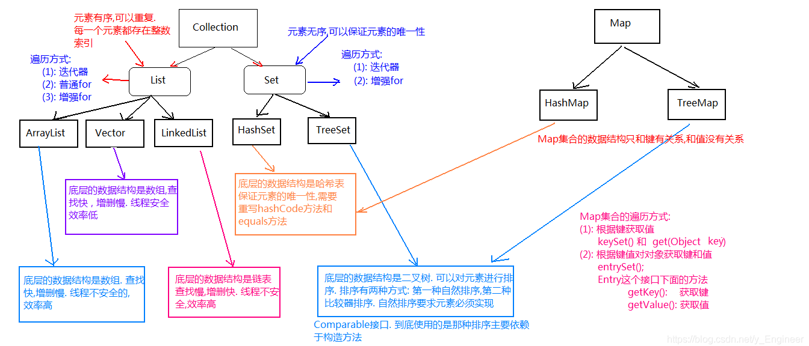

## 集合List（一）

### 1、集合概述

```shell
A:集合的由来
    面向对象语言对事物的体现都是以对象的形式，所以为了方便对多个对象的操作，Java就提供了集合类。
B:数组和集合的区别
	(1): 长度区别:
     数组的长度是固定的而集合的长度是可变的
	(2): 存储数据类型的区别:
     数组可以存储基本数据类型 , 也可以存储引用数据类型; 而集合只能存储引用数据类型
	(3): 内容区别:
     数组只能存储同种数据类型的元素 ,集合可以存储不同类型的元素
```

#### 常用集合继承体系图


### 2、接口Collection

#### 1、Collection常用功能

```java
Collection的功能概述(通过API查看即可得到)
	a:添加功能
		boolean add(Object obj):在集合末尾添加一个元素
		boolean addAll(Collection c):在集合末尾添加进另一个集合中的所有元素
	b:删除功能
		void clear():移除集合所有元素
		boolean remove(Object o):移除指定元素
		boolean removeAll(Collection c):移除该集合与指定集合的交集元素，有交集元素，返回true，如果没有交集元素，则移除失败，返回false.
		boolean retainAll(Collection c):移除该集合与指定集合的非交集元素
	c:判断功能
		boolean contains(Object o)：判断集合中是否包含指定的元素	
		boolean containsAll(Collection c)：判断该集合是否包含另一个集合(所有元素)
		boolean isEmpty()：判断集合是否为空
	d:获取功能
		Iterator<E> iterator():获取迭代器
		int size():获取集合中元素的个数
	e:把集合转换为数组
		Object[] toArray()
```

#### 2、Collection常用功能测试

```java
import java.util.ArrayList;
import java.util.Arrays;
import java.util.Collection;
import java.util.Iterator;

public class Blog {
    public static void main(String[] args) {
        Collection coll = new ArrayList();//Collection是接口，使用它的子类创建对象
        Collection coll1 = new ArrayList();
        /*-----添加功能-----*/
        coll.add(11);    //添加Integer类型数据
        coll.add(22);
        coll.add(11);
        coll.add(22);
        coll.add(33);
        coll.add(44);
        System.out.println(coll);//[11,22,11,22,33,44]
        coll1.addAll(coll);//将coll集合所有元素添加到coll1集合中
        System.out.println(coll1);//[11,22,11,22,33,44]

        /*-----删除功能-----*/
        coll1.clear();//移除coll1集合中所有元素
        coll.remove(11);//移除coll集合中的第一个 11
        System.out.println(coll);//[22, 11, 22, 33, 44]
        coll1.add(11);    //添加Integer类型数据
        coll1.add(22);
        coll.removeAll(coll1);
        System.out.println(coll);//[33, 44]
        /*-----判断功能-----*/
        boolean contains = coll.contains(11);
        System.out.println(contains);//false
        boolean b = coll.containsAll(coll1);
        System.out.println(b);//false
        boolean empty = coll.isEmpty();
        System.out.println(empty);//false
        /*-----获取功能-----*/
        Iterator iterator = coll.iterator();//获取迭代器
        int size = coll.size();
        System.out.println(size);//获取长度  2
        /*-----把集合转为数组-----*/
        Object[] objects = coll.toArray();//将集合转为数组
        System.out.println(Arrays.toString(objects));//打印数组
    }
}
```

#### 3、Collection集合遍历

#### A：把集合转为数组遍历

```java
public static void listTraversing(Collection coll) {
    	if(coll==null){
            System.out.println("null");
            return;
        }
        Object[] obj = coll.toArray();
        for (int i = 0; i < obj.length; i++) {
            System.out.println(obj[i]);
        }
    }
```

#### B:使用迭代器遍历

```java
private static void iteratorTraversing(Collection coll) {
        if(coll==null){
            System.out.println("null");
            return;
        }
        //boolean hasNext():判断是否还有元素可以迭代
        //E next()  ：返回迭代的下一个元素
        Iterator iterator = coll.iterator();//获取迭代器
        while(iterator.hasNext()){
            Object o = iterator.next();
            System.out.println(o);
        }
    }
```

#### C：增强for循环遍历

```java
//增强for循环格式：for(容器中的元素是什么类型 当前遍历的元素名:容器名){}
//bug:采用新式for循环遍历容器元素的过程中，若修改容器中的元素则会出现 并发修改异常(ConcurrentModificationException:)，若要在遍历过程中操作元素，则需要使用普通for循环
    private static void increaseForTraversing(Collection coll) {
        for (Object o : coll) {
            System.out.println(o);
        }
    }
```

### 3、接口List

#### 1、List特点

```shell
元素有序，每个元素都有一个索引，且可有重复元素。
```

#### 2、List特有功能

```java
void add(int index,E element):	在指定索引处添加元素
E remove(int index):移除指定索引处的元素,返回的是移除的元素
E get(int index):获取指定索引处的元素
E set(int index,E element):更改指定索引处的元素 返回的而是被替换的元素
```

#### 3、List特有功能测试

```java
import java.util.ArrayList;
import java.util.List;

public class Blog2 {
    public static void main(String[] args) {
        List<String> strList = new ArrayList<>();
        strList.add("aaa");
        strList.add("bbb");
        strList.add("ccc");
        strList.add(1,"ddd");//在1索引位置插入"ddd"
        System.out.println(strList);
        strList.remove(1);//移除1索引位置元素
        System.out.println(strList);
        String str=strList.get(1);//获取1索引位置元素
        System.out.println(str);
        strList.set(1,"你好");//设置1索引位置元素
        System.out.println(strList);
    }
}
运行结果：
[aaa, ddd, bbb, ccc]
[aaa, bbb, ccc]
bbb
[aaa, 你好, ccc]
```

#### 4、List新增遍历方式

#### A：通过get()和size()方法遍历

```java
private static void methodTraversal(List list) {
        if(list==null){
            System.out.println("null");
            return;
        }
        for (int i = 0; i < list.size(); i++) {
            Object o = list.get(i);
            System.out.println(o);
        }
    }
```

#### B:使用List特有迭代器遍历

```java
private static void listIteratorTraversal(List list) {
        if(list==null){
            System.out.println("null");
            return;
        }
        ListIterator listIterator = list.listIterator();//获取ListIterator迭代器
        while (listIterator.hasNext()){
            Object o = listIterator.next();
            System.out.println(o);
        }
        System.out.println("--------------------");
        //ListIterator迭代器,新增反向迭代功能(其他方法可查API获取)
        //反向迭代前必须先正向迭代，让指针先指向最后一个元素，才能迭代出前面的元素
        while (listIterator.hasPrevious()){
            Object o1 = listIterator.previous();
            System.out.println(o1);
        }
    }
```

#### 5、并发修改异常产生原因及解决方案

```java
产生原因：在迭代器或者增强for循环遍历集合过程中，由于迭代器或者增强for循环已经提前获取集合的长度，这时再在集合遍历过程中添删元素，会改变集合的长度，导致集合实际长度与迭代器或增强for循环获取的长度不一致，所以会产生并发修改异常。
    解决方案：1、使用ListIterator迭代器自身的add()方法添加元素；
            2、使用普通for循环遍历添加元素
```

#### 6、Arrays工具类的asList()方法的使用

```java
//public static <T> List<T> asList(T... a): 将数组转为集合
int[] arr={1,2,3};
List<int[]> ints=Arrays.asList(arr);//数组转集合

//使用asList()方法往集合存参数
List<Integer> list=Arrays.asList(1，2，3，4，5);
Integer[] arr1={1,2,3};
Integer[] arr2={4,5,6};
List<Integer> integerList = Arrays.asList(arr1);
List<Integer[]> asList = Arrays.asList(arr1, arr2);
//注意：
//1、通过Arrays.asList()转换过来的的集合，不能再添加或删除元素
//2、如果传的参数基本类型的数组，那么他会把数组装到集合里，如果传的参数是一个引用类型数组，那他会把元素取出来存到集合中，如果传的参数是两个及以上的引用数据类型的数组，那么他会把数组存到集合中。
```

### 4、List的三个子类

#### 1、List的三个子类的特点

```shell
List的三个子类的特点：
    ArrayList:
         底层数据结构是数组，查询快，增删慢。
         线程不安全，效率高。
    Vector:
         底层数据结构是数组，查询快，增删慢。
         线程安全，效率低。
    LinkedList:
         底层数据结构是链表，查询慢，增删快。
         线程不安全，效率高。
```

#### 2、Vector常用特有功能

```java
//public void addElement(E obj)
//public E elementAt(int index)
//public Enumeration elements()
/*-----测试-----*/
import java.util.Enumeration;
import java.util.Vector;

public class Blog4 {
    public static void main(String[] args) {
        Vector<String> vector = new Vector();
        vector.addElement("q");//在集合末尾处添加元素
        vector.addElement("w");
        System.out.println(vector);	//[q, w]
        String str=vector.elementAt(0);//返回指定索引处的元素
        System.out.println(str);	//q
        Enumeration elements = vector.elements();//返回Vector的枚举
        //boolean hasMoreElements(): 判断此枚举是否包含更多的元素
        //E nextElement():  如果此枚举对象至少还有一个可提供的元素，则返回此枚举的下一个元素
        elementsTraversing(vector,elements);
    }

    //遍历集合
    private static void elementsTraversing(Vector vector, Enumeration elements) {
        while (elements.hasMoreElements()){
            Object o = elements.nextElement();
            System.out.println(o);
        }
    }
}
```

#### 3、LinkedList常用特有功能

```java
	public void addFirst(E e)及 addLast(E e)
	public E getFirst()及 getLast()
	public E removeFirst()及 public E removeLast()
```

#### 3.1、LinkedList常用特有功能测试：

```java
import java.util.LinkedList;

public class Blog5 {
    public static void main(String[] args) {
        LinkedList<Integer> linkedList = new LinkedList<>();
        linkedList.add(11);
        linkedList.add(22);
        linkedList.addFirst(33);//在集合开头添加元素
        System.out.println(linkedList);//[33, 11, 22]
        linkedList.addLast(44);//在集合末尾添加元素
        System.out.println(linkedList);//[33, 11, 22, 44]
        Integer first = linkedList.getFirst();//获取开头元素
        System.out.println(first);//33
        Integer last = linkedList.getLast();//获取末尾元素
        System.out.println(last);//44
        Integer removeFirst = linkedList.removeFirst();//移除并返回集合的第一个元素
        System.out.println(removeFirst);//33
        System.out.println(linkedList);//[11, 22, 44]
        Integer removeLast = linkedList.removeLast();//移除并返回集合的最后一个元素
        System.out.println(removeLast);//44
        System.out.println(linkedList);//[11, 22]
    }
}
```

#### 3.2、使用LinkedList模拟栈数据结构的集合

```java
import java.util.LinkedList;

public class Blog6 {
    public static void main(String[] args) {
        //栈的数据结构，先进后出
        MyList myList = new MyList();
        //存元素
        myList.addEle("aaa");
        myList.addEle("bbb");
        myList.addEle("ccc");
        //取元素
        for (int i = 0; i < 3; i++) {
            Object ele = myList.getEle();
            System.out.println(ele);
        }
    }
}
class MyList {
    LinkedList linkedList=null;
    public MyList() {
        linkedList = new LinkedList();
    }

    //添加元素
    public void addEle(String ele) {
        linkedList.addFirst(ele);
    }

    public Object getEle() {
        //获取第一个元素并删除，这样第二次才能取到第二个元素
        Object obj = linkedList.removeFirst();
        //取的元素再加回去
        linkedList.addLast(obj);
        return obj;
    }
}
运行结果：
ccc
bbb
aaa
```

#### 3.3、集合嵌套

```java
//集合嵌套：就是将一个或多个集合存到另一个集合中，类似于二维数组
//示例：
import java.util.ArrayList;

public class Blog7 {
    public static void main(String[] args) {
        ArrayList<String> integerType = new ArrayList<>();
        integerType.add("byte");
        integerType.add("short");
        integerType.add("int");
        integerType.add("long");
        ArrayList<String> decimalType = new ArrayList<>();
        decimalType.add("float");
        decimalType.add("double");
        ArrayList<String> characterType = new ArrayList<>();
        characterType.add("char");
        ArrayList<String> booleanType = new ArrayList<>();
        booleanType.add("boolean");
        ArrayList<ArrayList<String>> basicDataType = new ArrayList<>();
        //将4类数据类型集合添加到基本数据类型集合，即实现集合的嵌套
        basicDataType.add(integerType);
        basicDataType.add(decimalType);
        basicDataType.add(characterType);
        basicDataType.add(booleanType);
    }
}
```

# 集合Set（二）

```shell
概述及特点：元素唯一，即一个不包含重复元素的 collection。更确切地讲，set 不包含满足 e1.equals(e2) 的元素对 e1 和 e2，并且最多包含一个 null 元素。
```

## 1、HashSet

### 1、概述及特点

```
概述及特点：HashSet 底层数据结构是哈希表，线程不安全，效率高，元素无序（存取顺序不一致），且唯一（元素不可重复），可以是 null。
哈希表：JDK1.7之前是数组+链表，JDK1.8之后为数组+链表+二叉树
```

### 2、HashSet元素唯一性解析及代码优化


#### 代码优化

```java
import java.util.HashSet;
import java.util.Objects;

public class Blog1 {
    public static void main(String[] args) {
        //HashSet 之所以能够保证元素的唯一性，是靠元素重写 equals()和hashCode()方法来保证的，如果元素不重写该方法，则不能保证元素的唯一性
        //合理重写hashCode()方法，可以减少调用equals()的次数，也称之为减少碰撞
        //原因：只有当两个对象hashCode()的返回值相同时，才会去调用equals()方法，比较成员变量的内容
        HashSet<Student> hashSet = new HashSet<>();
        hashSet.add(new Student("张三",23));
        hashSet.add(new Student("李四",27));
        hashSet.add(new Student("王五",26));
        hashSet.add(new Student("张三",23));
        hashSet.add(new Student("李四",27));
        hashSet.add(new Student("王五",26));
        hashSet.add(new Student("赵六",25));
        hashSet.add(new Student("张三",24));
        hashSet.add(new Student("曾七",23));
        System.out.println(hashSet);
    }
}
class Student{
    String name;
    int age;

    public Student() {
    }

    public Student(String name, int age) {
        this.name = name;
        this.age = age;
    }

    @Override
    public String toString() {
        return "Student{" +
                "name='" + name + '\'' +
                ", age=" + age +
                '}';
    }

    static int count=1;//统计变量
    @Override
    public boolean equals(Object o) {
        System.out.println("equals()方法执行了"+(count++)+"次");
        if (this == o) return true;
        if (o == null || getClass() != o.getClass()) return false;
        Student student = (Student) o;
        return age == student.age &&
                Objects.equals(name, student.name);
    }

    @Override
    public int hashCode() {
        return Objects.hash(name, age);
    }
}	
运行结果：
equals()方法执行了1次
equals()方法执行了2次
equals()方法执行了3次
[Student{name='张三', age=23}, Student{name='李四', age=27}, Student{name='王五', age=26}, Student{name='赵六', age=25}, Student{name='张三', age=24}, Student{name='曾七', age=23}]

Process finished with exit code 0
```

## 2、LinkedHashSet

```
概述及特点：LinkedHashSet 底层数据结构是链表和哈希表，元素有序且唯一，链表保证了有序，哈希表保证了唯一，线程不安全，效率高
```

## 3、TreeSet

### 1、概述及特点

```shell
概述及特点：TreeSet 底层数据结构是二叉树，元素唯一，且可以对元素进行排序，
排序：自然排序，比较器排序
```

#### 二叉树存储数据保证元素唯一性且排序原理图解


### 2、自然排序

```
 自然排序：如果TreeSet()采用的是空参构造，那么采用的就是自然排序，自然排序要求元素必须实现一个Comparable接口，并实现这个接口中的一个compareTo比较方法，根据此方法的返回值的正（右边） 、负（左边）  0（两元素相同，不再向集合添加） 来决定元素排列的位置。
```

#### 演示

```java
import java.util.TreeSet;

public class Blog2 {
    public static void main(String[] args) {
        TreeSet<Student> treeSet = new TreeSet<>();
        treeSet.add(new Student("张三",23));
        treeSet.add(new Student("李四",27));
        treeSet.add(new Student("王五",26));
        treeSet.add(new Student("张三",23));
        treeSet.add(new Student("李四",27));
        treeSet.add(new Student("王五",26));
        treeSet.add(new Student("赵六",25));
        treeSet.add(new Student("张三",24));
        treeSet.add(new Student("曾七",23));
        //按照年龄从小到大排序
        System.out.println(treeSet);
    }
}
class Student implements Comparable<Student> {
    private String name;
    private int age;

    public Student() {
    }

    public Student(String name, int age) {
        this.name = name;
        this.age = age;
    }

    public int getAge() {
        return age;
    }

    public void setAge(int age) {
        this.age = age;
    }

    public String getName() {
        return name;
    }

    public void setName(String name) {
        this.name = name;
    }

    @Override
    public String toString() {
        return "Student{" +
                "name='" + name + '\'' +
                ", age=" + age +
                '}';
    }

    //重写比较方法
    @Override
    public int compareTo(Student o) {
        //先比较年龄大小，如果年龄大小一样，再去比较名字，如果不比较名字，年龄相同的人就存不到集合中去了
        int num=this.age-o.age;
        int num1=num==0?this.name.compareTo(o.name):num;
        return num1;
    }
}
运行结果：
[Student{name='张三', age=23}, Student{name='曾七', age=23}, Student{name='张三', age=24}, Student{name='赵六', age=25}, Student{name='王五', age=26}, Student{name='李四', age=27}]

Process finished with exit code 0
```

### 3、比较器排序

```java
比较器排序：采用有参构造，在创建TreeSet对象时，需要传入一个Comparetor 比较器
        //TreeSet(Comparator < ? super E > comparator)
		Comparator<T> 比较器:
        int compare (T o1, T o2);//比较用来排序的两个参数。
```

#### 演示

```java
import java.util.Comparator;
import java.util.TreeSet;

public class Blog3 {
    public static void main(String[] args) {
        //传入比较器方式：1、可以自己创建一个Comparator<T>接口的子类，并实现 compare方法，传入该接口的子类对象
        //              2、使用匿名内部类，传入比较器，并实现compare方法
        TreeSet<Student> treeSet = new TreeSet<>(new Comparator<Student>() {
            @Override
            public int compare(Student o1, Student o2) {
                int num=o1.getAge()-o2.getAge();
                int num1=num==0?o1.getName().compareTo(o2.getName()):num;
                return num1;
            }
        });
        treeSet.add(new Student("张三",23));
        treeSet.add(new Student("李四",27));
        treeSet.add(new Student("王五",26));
        treeSet.add(new Student("张三",23));
        treeSet.add(new Student("李四",27));
        treeSet.add(new Student("王五",26));
        treeSet.add(new Student("赵六",25));
        treeSet.add(new Student("张三",24));
        treeSet.add(new Student("曾七",23));
        //按照年龄从小到大排序
        System.out.println(treeSet);
    }
}
class Student{
    private String name;
    private int age;

    public Student() {
    }

    public Student(String name, int age) {
        this.name = name;
        this.age = age;
    }

    public int getAge() {
        return age;
    }

    public void setAge(int age) {
        this.age = age;
    }

    public String getName() {
        return name;
    }

    public void setName(String name) {
        this.name = name;
    }

    @Override
    public String toString() {
        return "Student{" +
                "name='" + name + '\'' +
                ", age=" + age +
                '}';
    }
}
运行结果：
[Student{name='张三', age=23}, Student{name='曾七', age=23}, Student{name='张三', age=24}, Student{name='赵六', age=25}, Student{name='王五', age=26}, Student{name='李四', age=27}]

Process finished with exit code 0
```

### 4、例题

```java
//需求：编写一个程序，获取10个1至20的随机数，要求随机数不能重复,且要对其进行排序
/*-----示例-----*/
import java.util.Random;
import java.util.TreeSet;

public class Blog4 {
    public static void main(String[] args) {
        int number=10;
        Random random = new Random();
        TreeSet<Integer> treeSet = new TreeSet<>();
        //Integer类已经实现Comparable接口，默认从小到大排序
        for (int i = 0; i < number; i++) {
            boolean flag=treeSet.add(random.nextInt(20)+1);//生成随机数尝试添加到集合,并获取是否添加成功的结果
            if(!flag){
                i--;//如果未添加成功，让i-1，多生成一个随机数添加尝试添加到集合
            }
        }
        System.out.println(treeSet);
    }
}
运行结果：
[1, 5, 6, 7, 10, 11, 12, 14, 15, 17]

Process finished with exit code 0

```

## 4、Collections工具类

```java
A:Collections类概述:	针对集合操作的工具类
B:Collections常用成员方法
	public static <T> void sort(List<T> list):					排序,默认按照自然顺序
	public static <T> int binarySearch(List<?> list,T key):		二分查找
	public static <T> T max(Collection<?> coll):				获取最大值
	public static void reverse(List<?> list):					反转集合元素
	public static void shuffle(List<?> list):					随机打乱元素
```

# 集合Map（三）

将键映射到值的对象。一个映射不能包含重复的键；每个键最多只能映射到一个值。所有Map集合的数据结构，只跟键有关，跟值没关系，键相同，值覆盖 

## 1、HashMap

### 1、概述及特点

```
基于哈希表的 Map 接口的实现。允许使用 null 值和 null 键。键值对无序（存取顺序）。线程不安全，效率高。
```

### 2、HashMap常用方法

```java
Map集合的功能概述
	a:添加功能 
		V put(K key,V value):添加元素。
			如果键是第一次存储，就直接存储元素，返回null
			如果键不是第一次存在，就用值把以前的值替换掉，返回以前的值
	b:删除功能
		void clear():移除所有的键值对元素
		V remove(Object key)：根据键删除键值对元素，并把值返回
	c:判断功能
		boolean containsKey(Object key)：判断集合是否包含指定的键
		boolean containsValue(Object value):判断集合是否包含指定的值
		boolean isEmpty()：判断集合是否为空
	d:获取功能
		Set<Map.Entry<K,V>> entrySet(): 返回一个键值对的Set集合
		V get(Object key):根据键获取值
		Set<K> keySet():获取集合中所有键的集合
		Collection<V> values():获取集合中所有值的集合
		int size()：获取集合中的键值对的对数
```

### 3、HashMap常用方法测试

```java
import java.util.Collection;
import java.util.HashMap;
import java.util.Map;
import java.util.Set;

public class Blog {
    public static void main(String[] args) {
        HashMap<String, Integer> hashMap = new HashMap<>();
        /*-----添加元素-----*/
        Integer oldValue = hashMap.put("aaa", 111);//之前没存过"aaa"键，返回null
        System.out.println(oldValue);  //null
        Integer oldValue1 = hashMap.put("aaa", 222);//键相同，值替换，返回被替换掉的值
        System.out.println(oldValue1); //111
        hashMap.put("bbb",222);
        System.out.println(hashMap);//{aaa=222, bbb=222}
        /*-----删除元素-----*/
        Integer aaa = hashMap.remove("aaa");//根据键删除指定键值对
        System.out.println(hashMap);//{bbb=222}
        System.out.println(aaa);//222
        hashMap.clear();//清空集合
        System.out.println(hashMap);//{}
        /*-----判断功能-----*/
        hashMap.put("ccc",333);
        boolean c = hashMap.containsKey("ccc");//判断集合是否包含指定键
        System.out.println(c);//true
        boolean c1 = hashMap.containsValue(333);//判断集合是否包含指定键值
        System.out.println(c1);//true
        boolean empty = hashMap.isEmpty();//判断集合是否为空
        System.out.println(empty);//false
        /*-----获取功能-----*/
        Set<Map.Entry<String, Integer>> set = hashMap.entrySet();//获取键值对的set集合
        hashMap.get("ccc");//根据键获取值 //333
        Set<String> keySet = hashMap.keySet();//获取所有键的set集合
        Collection<Integer> values = hashMap.values();//获取所有值的集合
        hashMap.size();//获取集合的长度
    }
}
```

### 4、Map集合的遍历

#### A:方式一：先获取键，再通过键找值

```java
public static void traversingWayOne(HashMap<String, Integer> hashMap) {
        Set<String> keySet = hashMap.keySet();
        //遍历keySet集合，找值
        for (String s : keySet) {
            System.out.println(s);//键
            Integer value = hashMap.get(s);
            System.out.println(value);//值
        }
    }
```

#### B:方式二：先获取键值对，再获取键和值

```java
public static void traversingWayTwo(HashMap<String, Integer> hashMap) {
        Set<Map.Entry<String, Integer>> set = hashMap.entrySet();
        //遍历键值对集合，找键和值
        for (Map.Entry<String, Integer> entry : set) {
            String key = entry.getKey();
            System.out.println(key);
            Integer value = entry.getValue();
            System.out.println(value);
        }
    }

```

### 5、HaShMap保证键唯一性

```java
//重写hashCode方法 和 equals 方法
import java.util.HashMap;
import java.util.Objects;

public class Blog2 {
    public static void main(String[] args) {
        //HashMap 之所以能够保证元素的唯一性，是靠元素重写 equals()和hashCode()方法来保证的，如果元素不重写该方法，则不能保证元素的唯一性
        //合理重写hashCode 方法，可以减少调用equals()的次数，也称之为减少碰撞
        HashMap<Student,String> hashMap = new HashMap<>();
        hashMap.put(new Student("张三",23),"1");
        hashMap.put(new Student("李四",27),"1");
        hashMap.put(new Student("王五",26),"1");
        hashMap.put(new Student("张三",23),"1");
        hashMap.put(new Student("李四",27),"1");
        hashMap.put(new Student("王五",26),"1");
        hashMap.put(new Student("赵六",25),"1");
        hashMap.put(new Student("张三",24),"1");
        hashMap.put(new Student("曾七",23),"1");
        System.out.println(hashMap);
    }
}
class Student{
    private String name;
    private int age;

    public Student() {
    }

    public Student(String name, int age) {
        this.name = name;
        this.age = age;
    }

    public int getAge() {
        return age;
    }

    public void setAge(int age) {
        this.age = age;
    }

    public String getName() {
        return name;
    }

    public void setName(String name) {
        this.name = name;
    }

    @Override
    public String toString() {
        return "Student{" +
                "name='" + name + '\'' +
                ", age=" + age +
                '}';
    }

    @Override
    public boolean equals(Object o) {
        if (this == o) return true;
        if (o == null || getClass() != o.getClass()) return false;
        Student student = (Student) o;
        return age == student.age &&
                Objects.equals(name, student.name);
    }

    @Override
    public int hashCode() {
        return Objects.hash(name, age);
    }
}
运行结果：
{Student{name='张三', age=23}=1, Student{name='李四', age=27}=1, Student{name='王五', age=26}=1, Student{name='赵六', age=25}=1, Student{name='张三', age=24}=1, Student{name='曾七', age=23}=1}

```

### 6、HashMap和Hashtable关系

```java
HashMap：可以存null值null键，线程不安全，效率高
Hashtable：不能存null值null键，线程安全，效率低
其余大致相同。
```

## 2、LinkedHashMap

### 1、概述及特点

```
Map 接口的哈希表和链表实现，具有可预知的迭代顺序(元素有序),并且唯一，可以存储null键null值。元素的有序性由链表数据结构保证，唯一性由哈希表数据结构保证，Map集合的数据结构只和键有关。
```

### 2、演示

```java
import java.util.LinkedHashMap;

public class Blog3 {
    public static void main(String[] args) {
        LinkedHashMap<String, Integer> linkedHashMap = new LinkedHashMap<>();
        linkedHashMap.put("aaa",111);
        linkedHashMap.put("bbb",222);
        linkedHashMap.put(null,null);
        System.out.println(linkedHashMap);
    }
}
运行结果：
{aaa=111, bbb=222, null=null}

Process finished with exit code 0
```

## 3、TreeMap

### 1、概述及特点

```
键的数据结构是二叉树,可保证键的排序和唯一性，序分为自然排序和比较器排序，键不允许插入null，线程不安全，效率高
```

### 2、演示

```java
import java.util.Comparator;
import java.util.TreeMap;

public class Blog4 {
    public static void main(String[] args) {
        //传入比较器方式：1、可以自己创建一个Comparator<T>接口的子类，并实现 compare方法，传入该接口的子类对象
        //              2、使用匿名内部类，传入比较器，并实现compare方法
        TreeMap<Student,String> treeMap = new TreeMap<>(new Comparator<Student>() {
            @Override
            public int compare(Student o1, Student o2) {
                int num=o1.getAge()-o2.getAge();
                int num1=num==0?o1.getName().compareTo(o2.getName()):num;
                return num1;
            }
        });
        treeMap.put(new Student("张三",23),"a");
        treeMap.put(new Student("李四",27),"a");
        treeMap.put(new Student("王五",26),"a");
        treeMap.put(new Student("张三",23),"a");
        treeMap.put(new Student("李四",27),"a");
        treeMap.put(new Student("王五",26),"a");
        treeMap.put(new Student("赵六",25),"a");
        treeMap.put(new Student("张三",24),"a");
        treeMap.put(new Student("曾七",23),"a");
        //按照年龄从小到大排序
        System.out.println(treeMap);
    }
}
class Student{
    private String name;
    private int age;

    public Student() {
    }

    public Student(String name, int age) {
        this.name = name;
        this.age = age;
    }

    public int getAge() {
        return age;
    }

    public void setAge(int age) {
        this.age = age;
    }

    public String getName() {
        return name;
    }

    public void setName(String name) {
        this.name = name;
    }

    @Override
    public String toString() {
        return "Student{" +
                "name='" + name + '\'' +
                ", age=" + age +
                '}';
    }
}
运行结果：
{Student{name='张三', age=23}=a, Student{name='曾七', age=23}=a, Student{name='张三', age=24}=a, Student{name='赵六', age=25}=a, Student{name='王五', age=26}=a, Student{name='李四', age=27}=a}
```

## 4、集合嵌套

```java
/*
传智播客
    jc 基础班
        张三    20
        李四    22
    jy 就业班
        王五    21
        赵六    23
        
        HashMap嵌套HashMap
        HashMap再嵌套ArrayList
*/
        
import java.util.ArrayList;
import java.util.HashMap;
import java.util.Map;
import java.util.Set;

public class Blog {
    public static void main(String[] args) {
        ArrayList<Student> jcList = new ArrayList<>();
        jcList.add(new Student("张三",20));
        jcList.add(new Student("李四",22));
        ArrayList<Student> jyList = new ArrayList<>();
        jyList.add(new Student("王五",21));
        jyList.add(new Student("赵六",23));
        HashMap<String, ArrayList<Student>> listMap = new HashMap<>();
        listMap.put("jc\t基础班",jcList);
        listMap.put("jy\t就业班",jyList);
        HashMap<String, HashMap<String, ArrayList<Student>>> maxMap = new HashMap<>();
        maxMap.put("传智播客",listMap);
        Set<Map.Entry<String, HashMap<String, ArrayList<Student>>>> entries = maxMap.entrySet();
        for (Map.Entry<String, HashMap<String, ArrayList<Student>>> entry : entries) {
            String key = entry.getKey();
            System.out.println(key);
            HashMap<String, ArrayList<Student>> value = entry.getValue();
            Set<Map.Entry<String, ArrayList<Student>>> entries1 = value.entrySet();
            for (Map.Entry<String, ArrayList<Student>> stringArrayListEntry : entries1) {
                String key1 = stringArrayListEntry.getKey();
                System.out.println("\t"+key1);
                ArrayList<Student> value1 = stringArrayListEntry.getValue();
                for (Student student : value1) {
                    String name = student.getName();
                    int age = student.getAge();
                    System.out.println("\t\t"+name+"\t  "+age);
                }
                System.out.println();            }
        }
    }
}
class Student{
    private String name;
    private int age;

    public Student() {
    }

    public Student(String name, int age) {
        this.name = name;
        this.age = age;
    }

    public String getName() {
        return name;
    }

    public void setName(String name) {
        this.name = name;
    }

    public int getAge() {
        return age;
    }

    public void setAge(int age) {
        this.age = age;
    }
}
运行结果：
传智播客
	jc	基础班
		张三	  20
		李四	  22

	jy	就业班
		王五	  21
		赵六	  23
```

# 集合小结



> 参考引用链接：https://blog.csdn.net/y_engineer/article/list/1