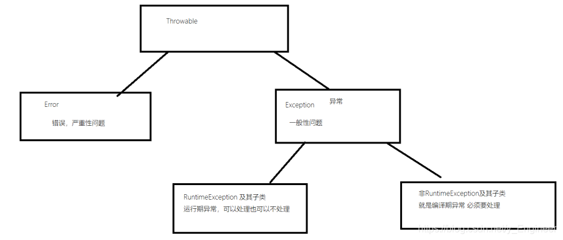
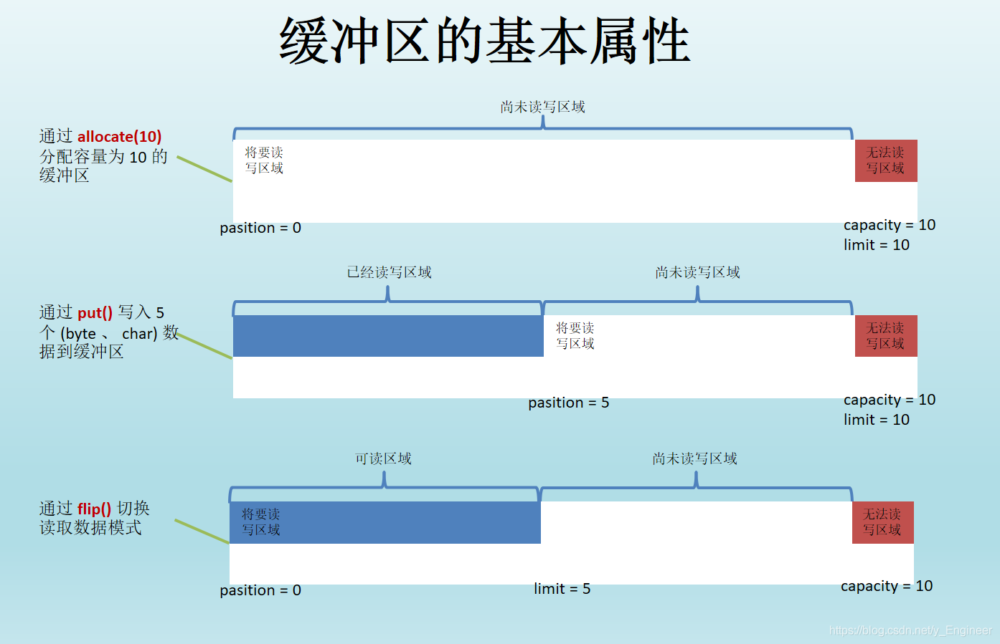

# 

# **文件(File类)**

## 1、 File类的概述和构造方法

```java
File类的概述:
	文件和目录路径名的抽象表示形式
构造方法：
	File(String pathname)：根据一个路径得到File对象    
	File(String parent, String child):根据一个目录和一个子文件/目录得到File对象
  	File(File parent, String child):根据一个父File对象和一个子文件/目录得到File对象
演示：
	1. File file = new File("D:\\IdeaProjects\\作业\src\\myhomework\\HomeWork.java") ;
	2. File file2 = new File("D:\\IdeaProjects\\作业\\src\\myhomework, "HomeWork.java") ;
	3. File file3 = new File("D:\\IdeaProjects\\作业\\src\\myhomework") ;
	   File file4 = new File(file3 , "HomeWork.java") ;
路径：
	绝对路径：带有盘符号的详细路径
	相对路径：不带盘符号的路径
	./当前路径
	../当前路径的上一级路径
	../../上两级
```

## 2、File类常用方法

### 1、与创建相关的方法

```java
file.createNewFile();//创建文件或目录，返回值为是否创建成功
file.mkdir();//创建目录，返回值为是否创建成功，只能创建单级目录
file.mkdirs();//可创建多级目录
```

### 2、删除相关的方法

```java
file.delete();//删除文件或非空目录，注意不走回收站，返回值为是否删除成功
```

### 3、重命名相关方法

```java
file.renameTo(file1);//file1为新名字的File类型 重命名文件，返回值为是否重命名成功，还可以实现剪切功能，如果源文件路径和传入文件路径不一致，就会发生剪切现象
```

### 4、判断功能

```java
file.isFile();//判断是否为文件
file.isDirectory();//判断是否为文件夹
file.exists();//判断文件或目录是否存在
file.canRead();//判断文件是否可读
file.canWrite();//判断文件是否可写
file.isHidden();//判断文件或目录是否隐藏
file.canExecute();//Linux系统下判断是否是可执行文件
file.isAbsolute();//判断路径名是否为绝对路径名
```

### 5、关于获取的方法

```java
file.getName();//获取文件名或路径名
file.length();//获取文件字节数
file.getAbsolutePath();//获取绝对路径，返回字符串形式
file.getAbsoluteFile();//获取绝对路径，返回文件类型
file.getPath();//获取相对路径,返回字符串形式
file.getParent();//获取该文件父路径，返回字符串形式
file.getParentFile();//获取该文件父路径，返回文件形式
file.getTotalSpace();//获取某个盘符的空间大小(字节)
file.getFreeSpace();//获取剩余空间（字节）
file.lastModified();//获取文件最后一次修改时间(毫秒)
file.list();//获取该目录下所有的文件或文件夹的名称,返回String[]数组
file.listFiles();//获取该目录下所有的文件或文件夹的File[]数组，可以传入过滤器
```

## 3、案例

```java
//修改文件或多级文件夹中所有相同类型的文件的后缀名
//删除文件或多级文件夹
import java.io.File;

public class MyTest {
    public static void main(String[] args) {
        File file = new File("C:\\Users\\73256\\Desktop","新建文件夹");
        boolean f1 = rename(file,".txt",".doc");
        System.out.println(f1);

        File file1 = new File("C:\\Users\\73256\\Desktop","新建文件夹");
        boolean f = deleteFile(file1);
        System.out.println(f);
    }

    //修改文件或多级文件夹中所有相同类型的文件的后缀名
    private static boolean rename(File file,String oldSuffixName,String newSuffixName) {
        boolean flag=false;

        if(file==null||!file.exists()){
            return false;
        }

        if(file.isFile()){
            File file1 = new File(file.getParentFile(), file.getName().replace(oldSuffixName, newSuffixName));
            file.renameTo(file1);
            return true;
        }

        File[] files = file.listFiles();
        for (File f : files) {
            if(f.isFile()&&f.getName().endsWith(oldSuffixName)){
                File file1 = new File(f.getParentFile(), f.getName().replace(oldSuffixName, newSuffixName));
                boolean b = f.renameTo(file1);
                flag=(!flag&&b);
            }else {
                rename(f,oldSuffixName,newSuffixName);
            }
        }
        return flag;
    }

    //删除文件或多级文件夹
    private static boolean deleteFile(File file) {
        if(file==null||!file.exists()){
            return false;
        }
        if(file.isFile()){
            file.delete();
            return true;
        }
        File[] files = file.listFiles();
        for (File f : files) {
            if(file.isDirectory()){
                deleteFile(f);
            }
            f.delete();
        }
        file.delete();
        return !file.exists();
    }
}
```

# **异常**

## 1、异常的概述及分类

```
A:异常的概述:异常就是Java程序在运行过程中出现的错误。
B:异常的继承体系
	异常的基类:	Throwable
	严重问题:	Error: 不予处理,因为这种问题一般是很严重的问题,比如: 内存溢出
	非严重问题:	Exception:
					编译时异常:	非RuntimeException
					运行时异常:	RuntimeException					
```



## 2、处理异常

### 1、JVM对异常的默认处理方式

```
将该异常的名称,异常的信息,异常出现的位置打印在了控制台上,同时关闭Java虚拟机使程序停止运行
```

### 2、try…catch

```java
语句格式1：
try	{
		可能出现问题的代码 ;
	}catch(异常名1 变量名){
		对异常的处理方式 ;
	}finally{
		释放资源;
	}
	
语句格式2：
 try {
 	可能出现问题的代码 ;
	 }catch(异常名1 变量名1){
		 对异常的处理方式 ;
	 }catch (异常名2 变量名2){
 		 对异常的处理方式 ;
	 }....
      finally{
		释放资源;
	}
语句格式3（JDK1.7之后）：
try {
 	可能出现问题的代码 ;
}catch(异常名1 | 异常名2 | ....   变量名){
	对异常的处理方案 ;
}
注意事项:
		a: try中的代码越少越好
		b: catch中必须要做处理,哪怕是一条提示输出语句也可以(不能会将异常信息隐藏)
        c: finally的特点:
			 被finally控制的语句体一定会执行(前提:jvm没有停止)
        d: 使用多个catch语句时，有继承关系的异常，分类必须放后面
        e: 能明确的异常尽量明确，不要用父类异常来处理
        f: 使用第三种格式时，多个异常间必须是平级关系
```

#### 示例

```java
public class Blog {
    public static void main(String[] args) {
        try {
            System.out.println(1/0);
        } catch (ArithmeticException e){
            System.out.println("算术异常");
        } catch (RuntimeException e) {
            System.out.println("运行时异常");
        }catch (Exception e){
            System.out.println("异常");
        }
    }
}
运行结果：
算术异常
```

### 3、Throwable的常见方法

```java
	a: getMessage():			获取异常信息，返回字符串。
	b: toString():				获取异常类名和异常信息，返回字符串。
	c: printStackTrace():		打印异常类名和异常信息，以及异常出现在程序中的位置。
```

### 4、throws和throw处理异常

```shell
A：概述
	throws：使用throws关键字在方法上将异常抛给调用者，谁调用谁处理。
	throw:在功能方法内部出现某种异常，程序不能继续运行，需要进行跳转时，就用throw把异常对象抛出。
B：throws和throw的区别
	a:throws
		用在方法声明后面，跟的是异常类名
		可以跟多个异常类名，用逗号隔开
		表示抛出异常，由该方法的调用者来处理
		throws表示出现异常的一种可能性，并不一定会发生这些异常
	b:throw
		用在方法体内，跟的是异常对象名
		只能抛出一个异常对象名
		这个异常对象可以是编译期异常对象,可以是运行期异常对象
		表示抛出异常，由方法体内的语句处理
		throw则是抛出了异常，执行throw则一定抛出了某种异常
```

### 5、自定义异常

```java
//需求：从银行取钱，发现钱不够，通过自定义异常给出提示。
import java.util.Scanner;

public class Blog {
    public static void main(String[] args) {
        int money=1000;
        try {//捕捉异常
            withdrawal(money);
        } catch (NoMoneyRuntimeException e) {
            e.printStackTrace();
            System.
        }
    }

    private static void withdrawal(int money){
        Scanner scanner = new Scanner(System.in);
        System.out.println("请输入取款金额：");
        int quMoney = scanner.nextInt();
        if(quMoney<= money){
            System.out.println("取款成功！");
        }else {
            throw  new NoMoneyRuntimeException("余额不足！");//抛出异常
        }
    }
}

//自定义异常类继承RuntimeException
class NoMoneyRuntimeException extends RuntimeException{
    public NoMoneyRuntimeException(String s) {
        super(s);
    }
}
运行结果：
请输入取款金额：
1111
异常.NoMoneyRuntimeException: 余额不足！
	at 异常.Blog.withdrawal(Blog.java:23)
	at 异常.Blog.main(Blog.java:10)

Process finished with exit code 0
```

## 3、异常的注意事项

```shell
A:异常注意事项(针对编译期异常)
	a:子类重写父类方法时，子类的方法必须抛出相同的异常或父类异常的子类，或者子类不抛出异常也是可以的。
	b:如果父类抛出了多个异常,子类重写父类时,只能抛出相同的异常或者是他的子集,子类不能抛出父类没有的异常，或者子类不抛出异常也是可以的。
	c:如果被重写的方法没有异常抛出,那么子类的方法绝对不可以抛出异常,如果子类方法内有异常发生,那么子类只能try,不能throws

B:如何使用异常处理
		原则:如果该功能内部可以将问题处理,用try,如果处理不了,交由调用者处理,这时用throws
		区别:
			后续程序需要继续运行就try
			后续程序不需要继续运行就throws
		如果JDK没有提供对应的异常，需要自定义异常。	
```

# **IO流（常用流）**

## 1、概述及分类

```shell
A:IO流概述
	IO流用来处理设备之间的数据传输
	Java对数据的操作是通过流的方式
	Java用于操作流的对象都在IO包中 java.io
B:IO流分类
	a:按照数据流向 站在内存角度
		输入流	读入数据
		输出流	写出数据
	b:按照数据类型
		字节流 可以读写任何类型的文件 比如音频 视频  文本文件
		字符流 只能读写文本文件
```

## 2、字节输入输出流

```shell
InputStream:字节输入流，输入流所关联的文件不存在，则会报错
OutputStream:字节输出流，输出流所关联的文件不存在，会自动创建
注意：流用完之后必须关闭以释放资源，否则可能出现内存泄漏
```

### 1、文件输入流(FileInputStream)

#### 常用方法

```java
构造方法:
FileInputStream(File|String file|name);
FileInputStream in=new FileInputStream("e.txt");
in.read();//一次读取一个字节，如果最后读取不到，则返回-1
in.read(new byte[1024]);//一次最多读取1024个字节存进字节数组，返回值为读取到的字节长度
in.read(new byte[1024],起始索引,读取字节长度);//从此输入流中将最多 len 个字节的数据读入一个 byte 数组中
in.close();//流用完之后关掉
```

### 2、文件输出流(FileOutputStream)

#### 常用方法

```java
FileOutputStream out=new FileOutputStream(file|name);
//通过文件输出流，往他所关联的文件中，写入数据
out.write(97);//一次写入一个字节,超过一个字节会丢弃掉多余字节 //写入a
out.write(字节数组);//一次写入一个字节数组
out.write(字节数组，起始索引，写入字节个数);//一次写入一个字节数组的一部分
//UTF-8编码，一个汉字占三个字节
out.write("\r\n".getBytes());//windows系统换行
FileOutputStream(file|name,true);//参数2为true，追加写入
out.close();//关闭流
```

### 3、使用文件输入输出流进行文件的复制

#### 方式一：一次读一个字节，写一个字节（效率低，一般不使用）

```java
import java.io.FileInputStream;
import java.io.FileOutputStream;
import java.io.IOException;

public class Demo1 {
    public static void main(String[] args) throws IOException {
        FileInputStream in = new FileInputStream("e.txt");
        FileOutputStream out = new FileOutputStream("ee.txt");
        int len=0;
        while ((len=in.read())!=-1){//读取字节
            out.write(len);//写入字节
            out.flush();//刷新
        }
        out.close();//关闭输出流
        in.close();//关闭输入流
    }
}
```

#### 方式二：一次读写一个字节数组（效率高）

```java
import java.io.FileInputStream;
import java.io.FileOutputStream;
import java.io.IOException;

public class CopyFile {
    public static void main(String[] args) throws IOException {
        FileInputStream in = new FileInputStream("e.txt");
        FileOutputStream out = new FileOutputStream("ee.txt");
        byte[] bytes=new byte[1024*1024];//定义缓冲数组
        int len=0;
        long start = System.currentTimeMillis();
        while ((len=in.read(bytes))!=-1){//读取字节到数组
            out.write(bytes,0,len);//将数组中的字节写入
            out.flush();//刷新
        }
        long end = System.currentTimeMillis();
        System.out.println((end-start)+"ms");
        in.close();//关闭输入流
        out.flush();//关闭输出流
    }
}
```

### 4、流的异常处理

```java
import java.io.File;
import java.io.FileInputStream;
import java.io.FileOutputStream;
import java.io.IOException;

public class Demo2 {
    public static void main(String[] args) {

        FileInputStream in=null;
        FileOutputStream out=null;
        try {
            File file = new File("e.txt");
            if(file.exists()){
                in = new FileInputStream(file);
            }
            File file1 = new File("ee.txt");
            if(file1.exists()){
                out = new FileOutputStream(file1);
            }
            if(in!=null&&out!=null){
                byte[] bytes=new byte[1024*1024];//定义缓冲数组
                int len=0;
                long start = System.currentTimeMillis();
                while ((len=in.read(bytes))!=-1){//读取字节到数组
                    out.write(bytes,0,len);//将数组中的字节写入
                    out.flush();//刷新
                }
                long end = System.currentTimeMillis();
                System.out.println((end-start)+"ms");
            }
        }catch (IOException e){
            e.printStackTrace();
        }finally {
            try {
                if (in != null) {
                    in.close();//关闭输入流
                }
            } catch (IOException e) {
                e.printStackTrace();
            }
            try {
                if (out != null) {
                    out.flush();//关闭输出流
                }
            } catch (IOException e) {
                e.printStackTrace();
            }
        }
    }
}
```

### 5、高效(通过内部缓冲区实现)的文件输入输出流

```java
BufferedInputStream:高效的文件输入流
BufferedInputStream(InputStream in):
		创建一个 BufferedInputStream 并保存其参数，即输入流 in，以便将来使用。
BufferedInputStream(InputStream in, int size) 
        创建具有指定缓冲区大小的 BufferedInputStream 并保存其参数，即输入流 in，以便将来使用。
BufferedOutputStream:高效的文件输出流
BufferedOutputStream(OutputStream out) 
        创建一个新的缓冲输出流，以将数据写入指定的底层输出流。
BufferedOutputStream(OutputStream out, int size) 
        创建一个新的缓冲输出流，以将具有指定缓冲区大小的数据写入指定的底层输出流。
```

#### 复制文件方式三 :使用高效的文件输入输出流

```java
import java.io.*;

public class Demo {
    public static void main(String[] args) throws IOException {
        BufferedInputStream bufferIn = new BufferedInputStream(new FileInputStream("a.txt"));
        BufferedOutputStream bufferOut = new BufferedOutputStream(new FileOutputStream("aa.txt"));
        int len;
        byte[] bytes=new byte[1024*8];
        while ((len=bufferIn.read(bytes))!=-1){
            bufferOut.write(bytes,0,len);
            bufferOut.flush();
        }
        bufferIn.close();
        bufferOut.close();
    }
}
```

## 3、字符输入输出流

```shell
Reader:用于读取字符流的抽象类
Writer:写入字符流的抽象类
编码：把字符串转成字节数组，采用默认的码表进行编码，也可指定码表
解码：把字节数组转换成字符串，采用默认的码表进行解码，也可指定码表
注意：a、编解码使用码表要一致，否则会出现乱码
	 b、写入数据后必须刷新，否则数据写不过去
```

### 1、InputStreamReader（字符转换输入流）

```java
//字节流通向字符流的桥梁，可使用指定的码表解码
InputStreamReader in=new InputStreamReader(new FileInputStream("a.txt"));//
in.read();//一次读取一个字符，读取不到返回-1
in.read(new char[1024]);//一次最多读1024个字符（一个字符数组）存进字节数组，返回值是实际读取到的字符个数
in.read(new char[1024],0,3);//将字符读入数组中的某一部分，返回值是实际读取到的字符个数
```

### 2、OutputStreamWriter(字符转换输出流)

```java
//字符流通向字节流的桥梁，可使用指定的码表编码
OutputStreamWriter out=new OutputStreamWriter(new FileOutputStream("aa.txt",true));//加true追加
out.write('你');//一次写一个字符
out.write("你好");//一次写一个字符串
out.write("你好",0,1);//一次写一个字符串的一部分
out.write(new byte[]{'a','你','好'});//一次写一个字符数组
out.write(new byte[]{'a','你','好'},1,2);//一次写一个字符数组的一部分
out.close();//释放资源
```

### 3、FileWriter和FileReader

```java
FileWriter和FileReader和InputStreamReader和OutputStreamWriter区别：
FileWriter和FileReader不可指定编码表编码。
```

### 4、高效字符流(缓冲区)

```java
BufferedReader bin=new BufferedReader(new FileReader("a.txt"));
bin.readLine();//一次读一行
BufferedWriter bout=new BufferedWriter(new FileWriter("aa.txt"));
bout.newLine();//写一个换行符
```

### 5、复制文本文件

#### 方式一：读一个字符数组，写一个字符数组

```java
import java.io.*;

public class Demo {
    public static void main(String[] args) throws IOException {
        InputStreamReader in = new InputStreamReader(new FileInputStream("a.txt"));
        OutputStreamWriter out = new OutputStreamWriter(new FileOutputStream("aaa.doc"));
        char[] chars = new char[1000];
        int len=0;
        while ((len=in.read(chars))!=-1){
            out.write(chars,0,len);
            out.flush();
        }
        in.close();
        out.close();
    }
}
```

#### 方式二：读一行写一行

```java
import java.io.*;

public class MyTest2 {
    public static void main(String[] args) throws IOException {
        BufferedReader bin = new BufferedReader(new FileReader("MyTest1.java"));
        BufferedWriter bout = new BufferedWriter(new FileWriter("Test.java"));
        String line=null;
        char[] chars = new char[1000];//充当缓冲区
        while ((line=bin.readLine())!=null){
            bout.write(line);
            bout.newLine();//换行
            bout.flush();//必须刷新
        }
        //关闭流，释放资源
        bin.close();
        bout.close();
    }
}
```

### 6、第二种键盘录入方式

```java
import java.io.BufferedReader;
import java.io.IOException;
import java.io.InputStreamReader;

public class Test{
    public static void main(String[] args) throws IOException {
        //Scanner scanner = new Scanner(System.in);//第一种
        BufferedReader reader = new BufferedReader(new InputStreamReader(System.in));
        System.out.println("请输入数据");
        String s = reader.readLine();
        System.out.println(s);
    }
}
```

## 4、例题

### 1、将多级文件夹复制到指定目录下

```java
import java.io.File;
import java.io.FileInputStream;
import java.io.FileOutputStream;
import java.io.IOException;

public class CopyFolder {
    public static void main(String[] args)throws IOException {
        File sourceFile = new File("C:\\Users\\Administrator\\Desktop\\新建文件夹");
        File copyFile = new File("D:\\");
        CopyMultistageFile(sourceFile,copyFile);
    }

    private static void CopyMultistageFile(File sourceFile, File copyFile) throws IOException {
        File file = new File(copyFile, sourceFile.getName());
        if(sourceFile.isFile()){
            copyFile(sourceFile, file);
            return;
        }
        if(!file.exists()){
            file.mkdir();
        }
        File[] files = sourceFile.listFiles();
        for (File f : files) {
            if(f.isFile()){
                File file1 = new File(file, f.getName());
                copyFile(f, file1);
            }else {
                CopyMultistageFile(f,file);
            }
        }
    }

    private static void copyFile(File f, File f1) throws IOException {
        FileInputStream in = new FileInputStream(f);
        FileOutputStream out = new FileOutputStream(f1);
        int len;
        byte[] bytes=new byte[1024*1024];
        while ((len=in.read(bytes))!=-1){
            out.write(bytes,0,len);
            out.flush();
        }
        in.close();
        out.close();
    }
}
```

### 2、复制多级文件夹只保留其中的.txt文件并将其修改为.doc文件

```java
import java.io.*;

public class CopyModify {
    public static void main(String[] args) throws IOException {
        File sourceFolder = new File("C:\\Users\\Administrator\\Desktop\\新建文件夹");
        File targetPath = new File("D:\\");
        copyModifyTheSuffixName(sourceFolder,targetPath);
    }

    private static void copyModifyTheSuffixName(File sourceFolder, File targetPath) throws IOException {
        File file = new File(targetPath, sourceFolder.getName()+"(doc)");
        if(!file.exists()){
            file.mkdir();
        }
        File[] files = sourceFolder.listFiles(new FilenameFilter() {
            @Override
            public boolean accept(File dir, String name) {
                if(name.endsWith(".txt")||new File(dir,name).isDirectory()){
                    return true;
                }
                return false;
            }
        });
        for (File f : files) {
            if(f.isFile()){
                copy(f,file);
            }else {
                copyModifyTheSuffixName(f,file);
            }
        }
    }

    private static void copy(File f, File f2) throws IOException {
        FileInputStream in = new FileInputStream(f);
        File file = new File(f2, f.getName().replace(".txt", ".doc"));
        FileOutputStream out = new FileOutputStream(file);
        int len=0;
        byte[] bytes = new byte[1024 * 8];
        while ((len=in.read(bytes))!=-1){
            out.write(bytes,0,len);
            out.flush();
        }
        in.close();
        out.close();
    }
}
```

### 3、合并文件：将两首歌合并为一首

```java
import java.io.FileInputStream;
import java.io.FileOutputStream;
import java.io.IOException;
import java.util.ArrayList;

public class MyDemo1 {
    public static void main(String[] args) throws IOException {
        FileInputStream in1 = new FileInputStream("许巍 - 曾经的你.mp3");
        FileInputStream in2 = new FileInputStream("许巍 - 蓝莲花.mp3");
        FileOutputStream out = new FileOutputStream("许巍大合唱.mp3");
        ArrayList<FileInputStream> list = new ArrayList<>();
        list.add(in1);
        list.add(in2);
        int len=0;
        byte[] bytes = new byte[1024 * 1024];
        for (FileInputStream in : list) {
            while ((len= in.read(bytes))!=-1){
                out.write(bytes,0,len);
                out.flush();
            }
            in.close();
        }
        out.close();
    }
}
```

# **IO流（其他流）**

## 1、数据输入输出流

### 1、特有属性

```java
特点：可以读写基本类型数据
数据输入流:
	DataInputStream(InputStream in) //使用指定的底层 InputStream 创建一个 DataInputStream
数据输出流:
    DataOutputStream(OutputStream out)// 创建一个新的数据输出流，将数据写入指定基础输出流   
```

### 2、特有方法演示

```java
import java.io.*;

public class MyTest {
    public static void main(String[] args) throws IOException {
        write();
        read();
    }

    private static void read() throws IOException {
        DataInputStream in = new DataInputStream(new FileInputStream("a.txt"));
        //注意：读写数据类型顺序要一致，否则会报错
        boolean b = in.readBoolean();
        byte b1 = in.readByte();
        char c = in.readChar();
        String s = in.readUTF();
        in.close();
    }

    private static void write() throws IOException {
        DataOutputStream out = new DataOutputStream(new FileOutputStream("a.txt"));
        out.writeBoolean(true);
        out.writeByte(99);
        out.writeChar('1');
        out.writeUTF("abc");
        out.close();
    }
}
```

## 2、内存操作流

```
不关联任何文件，只是在内存中对数据进行操作，此流无需关闭，关闭无效
```

### 1、操作字节数组的内存操作流

```java
	ByteArrayOutputStream：此类实现了一个输出流，其中的数据被写入一个 byte 数组。缓冲区会随着数据的不断写入而自动增长。可使用 toByteArray() 和 toString() 获取数据。 
	ByteArrayInputStream ：包含一个内部缓冲区，该缓冲区包含从流中读取的字节
演示：
import java.io.ByteArrayInputStream;
import java.io.ByteArrayOutputStream;
import java.io.IOException;
import java.util.Arrays;

public class MyTest1 {
    public static void main(String[] args) throws IOException {
        ByteArrayOutputStream baOut = new ByteArrayOutputStream();
        baOut.write("abcd".getBytes());
        baOut.write("1234".getBytes());
        byte[] bytes = baOut.toByteArray();//将缓冲区的数据转为字节数组
        System.out.println(Arrays.toString(bytes));//[97, 98, 99, 100, 49, 50, 51, 52]
        String s = baOut.toString();//将缓冲区的数据转为字符串
        System.out.println(s);//abcd1234

        ByteArrayInputStream baIn = new ByteArrayInputStream(bytes);
        byte[] bytes1 = new byte[1024 * 8];
        int len = baIn.read(bytes1);
        String s1 = new String(bytes1, 0, len);
        System.out.println(s1);//abcd1234
    }
}
```

### 2、操作字符数组的内存操作流

```java
//操作字符数组
// CharArrayWrite
//CharArrayReader
import java.io.CharArrayWriter;
import java.io.IOException;

public class MyTest2 {
    public static void main(String[] args)throws IOException {
        CharArrayWriter writer = new CharArrayWriter();
        writer.write("abc");
        writer.write("abc");
        char[] chars = writer.toCharArray();
        String s = writer.toString();
    }
}
```

### 3、操作字符串的内存操作流程

```java
//StringWriter：内部使用StringBuffer实现
//StringReader
import java.io.StringWriter;

public class MyTest3 {
    public static void main(String[] args) {
        StringWriter stringWriter = new StringWriter();
        stringWriter.write("abc");
        stringWriter.append("abc");//可以调用StringBuffer的append方法写入数据
        String s = stringWriter.toString();
        System.out.println(s);
    }
}
```

## 3、打印流

```
打印流的特点
	a: 打印流只能操作目的地,不能操作数据源(不能读取数据)
	b: 可以操作任意数据类型的数据 调用print() 方法可以写任意数据类型
	c: 自动刷新:必须调用println、printf 或 format 方法中的一个方法,且通过以下构造创建对象，能够启动自动刷新
  	 public PrintWriter(OutputStream out,  boolean autoFlush)//参2位true启动自动刷新
  	 public PrintWriter(Writer out,  boolean autoFlush)//参2位true启动自动刷新
	d: 这个流可以直接对文件进行操作(构造方法的参数可以传递文件或者文件路径)
```

### 1、字符打印流

```java
import java.io.FileOutputStream;
import java.io.IOException;
import java.io.PrintWriter;

public class MyTest4 {
    public static void main(String[] args) throws IOException {
        PrintWriter writer = new PrintWriter(new FileOutputStream("c.txt"),true);
        writer.println("abc");
        writer.println(123);
        writer.println(true);
        //writer.flush();以启用自动刷新，可不用再手动刷新
        writer.close();
    }
}
```

### 2、字节打印流

```java
import java.io.FileOutputStream;
import java.io.IOException;
import java.io.PrintStream;

public class MyTest5 {
    public static void main(String[] args) throws IOException {
        PrintStream printStream = new PrintStream(new FileOutputStream("b.txt"));
        printStream.write("字节打印流".getBytes());
        printStream.print(true);
        printStream.println(100);
        printStream.close();

        PrintStream out = System.out;
        out.write("abc".getBytes());
        out.println(3.14);//abc3.14
    }
}
```

### 3、使用字节打印流和Scanner类复制文本文件

```java
import java.io.FileInputStream;
import java.io.IOException;
import java.io.PrintWriter;
import java.util.Scanner;

public class MyTest7 {
    public static void main(String[] args)throws IOException {
        Scanner sc = new Scanner(new FileInputStream("a.txt"));//使用Scanner读取文件
        PrintWriter writer = new PrintWriter("b.txt");
        while (sc.hasNextLine()){
            writer.println(sc.nextLine());//一次读写一行，并换行
            writer.flush();
        }
        sc.close();
        writer.close();
    }
}
```

## 4、序列化与反序列化流

```java
序列化：把对象保存到硬盘上
反序列化：把对象读到内存中
序列化流：
ObjectOutputStream 
out.writeObject(对象);//要求对象类实现Serializable（标记接口）
public static final long serialVersionUID=1L;
//如果要存储多个对象，可以将对象存到集合中，再将集合存到硬盘中
//如果某一个成员变量不想被序列化，可以使用关键字transient修饰
反序列化流：
ObjeceInputStream
in.readObject();

```

**演示**

```java
import java.io.*;
import java.util.ArrayList;

public class MyTest4 {
    public static void main(String[] args) throws IOException, ClassNotFoundException {
        write();

        ObjectInputStream objIn = new ObjectInputStream(new FileInputStream("a.txt"));
        Object object = objIn.readObject();//读取文件，获取集合对象
        ArrayList<Student> list= (ArrayList<Student>) object;
        for (Student student : list) {
            System.out.println(student.getName());
        }
    }

    private static void write() throws IOException {
        Student zhangsan = new Student("zhangsan");
        Student lisi = new Student("lisi");
        Student wangwu = new Student("wangwu");
        ArrayList<Student> list = new ArrayList<>();
        list.add(zhangsan);
        list.add(lisi);
        list.add(wangwu);
        ObjectOutputStream objout = new ObjectOutputStream(new FileOutputStream("a.txt"));
        objout.writeObject(list);//将集合对象写入文件中
    }
}
class Student implements Serializable{//必须实现Serializable接口
    //保证serialVersionUID不变
    public static final long serialVersionUID = -3508803735981209248L;
    private String name;

    public Student() {
    }

    public Student(String name) {
        this.name = name;
    }

    public String getName() {
        return name;
    }

    public void setName(String name) {
        this.name = name;
    }
}
```

## 5、随机访问流

```java
RandomAccessFile特点:能读能写，有文件指针，可以记录文件读写的位置
RandomAccessFile(fileName,"rw“)//参2位可读可写
 	获取文件指针位置：getFilePointer()
    设置指针位置：seek()           
```

**演示**

```java
import java.io.IOException;
import java.io.RandomAccessFile;

public class MyTest4 {
    public static void main(String[] args)throws IOException {
        RandomAccessFile ra = new RandomAccessFile("e.txt", "rw");
        RandomAccessFile ra2 = new RandomAccessFile("e.txt", "rw");
        ra.writeBoolean(true);
        
        boolean b = ra2.readBoolean();//注意读取与写入数据类型一致，否则报错
        System.out.println(b);
        
        long l = ra2.getFilePointer();//获取文件指针位置
        System.out.println(l);
        ra2.seek(0);//设置文件指针位置
        
        boolean b1 = ra2.readBoolean();
        System.out.println(b1);
    }
}
```

**例题：将一个文件复制三遍**

```java
import java.io.File;
import java.io.IOException;
import java.io.RandomAccessFile;

public class CopyFile {
    public static void main(String[] args) throws IOException {
        File file = new File("许巍 - 曾经的你.mp3");
        RandomAccessFile ra = new RandomAccessFile(file, "rw");
        for (int i = 1; i <= 3; i++) {
            File f = new File(i+".许巍 - 曾经的你.mp3");
            RandomAccessFile ra1 = new RandomAccessFile(f, "rw");
            int len=0;
            byte[] bytes = new byte[1024 * 1024];
            while ((len=ra.read(bytes))!=-1){
                ra1.write(bytes,0,len);
            }
            ra1.close();
            ra.seek(0);
        }
        ra.close();
    }
}
```

## 6、Properties

```java
属性：集合，经常用来读写配置文件，属于双列集合，规定键只能是String类型
用此集合特有方法来存储键值对：
pro.setProperty(key,value);
获取键值：
pro.getProperty(key);
pro.getProperty(key,value);//如果键没有找到对应的值，则返回默认值参数2 
读取配置文件：
pro.load(new FileReader(file));
要求配置文件键值用“=”连接
写配置文件：
pro.store(new FileWriter("文件名"),null);
```

**演示**

```java
import java.io.FileReader;
import java.io.FileWriter;
import java.io.IOException;
import java.util.Properties;

public class MyTest5 {
    public static void main(String[] args) throws IOException {
        Properties properties = new Properties();
        properties.setProperty("a","aaa");//添加键值对
        String a = properties.getProperty("a");//获取键值
        System.out.println(a);
        String s1 = properties.getProperty("b", "bbb");//如果找不到键所对应的值，则返回参2
        System.out.println(s1);

        properties.setProperty("b","bbb");
        //参2表示文件的注释,为null默认为日期
        properties.store(new FileWriter("ab.properties"),null);
        properties.load(new FileReader("ab.properties"));
        System.out.println(properties);//{b=bbb, a=aaa}
    }
}
配置文件内容：
#Thu Jul 25 15:17:20 CST 2019
b=bbb
a=aaa
```

## 7、SequenceInputStream

```shell
SequenceInputStream 
	表示其他输入流的逻辑串联。
	它从输入流的有序集合开始，并从第一个输入流开始读取，直到到达文件末尾，接着从第二个输入流读取，依次类推，直到到达包含的最后一个输入流的文件末尾为止
	构造方法：
	SequenceInputStream(InputStream s1, InputStream s2) 
	通过记住这两个参数来初始化新创建的 SequenceInputStream（将按顺序读取这两个参数，先读取 s1，然后读取 s2），以提供从此 SequenceInputStream 读取的字节。

	SequenceInputStream(Enumeration<? extends InputStream> e) 
	 通过记住参数来初始化新创建的 SequenceInputStream，该参数必须是生成运行时类型为 InputStream 对象的 Enumeration 型参数（迭代器）。
```

**演示**

```java
import java.io.FileInputStream;
import java.io.FileOutputStream;
import java.io.IOException;
import java.io.SequenceInputStream;
import java.util.Enumeration;
import java.util.Vector;

public class MergeFile {
    public static void main(String[] args)throws IOException {
        Vector<FileInputStream> vector = new Vector<>();
        for (int i = 1; i <= 5; i++) {
            FileInputStream in = new FileInputStream(i + ".许巍 - 蓝莲花.mp3");
            vector.add(in);//将文件输入流添加到集合
        }
        Enumeration<FileInputStream> elements = vector.elements();//获取迭代器
        SequenceInputStream sIn = new SequenceInputStream(elements);
        FileOutputStream out = new FileOutputStream("1许巍 - 蓝莲花.mp3");
        int len;
        byte[] bytes = new byte[1024 * 1024];
        while ((len=sIn.read(bytes))!=-1){
            out.write(bytes,0,len);
            out.flush();
        }
        sIn.close();//会同时将迭代器中的流关闭
        out.close();
    }
}
```

# **NIO**

> Java NIO （ New IO ）是从 Java 1.4 版本开始引入的一个新的 IO API ， 可以替代标准的 Java IO API 。NIO 与原来的 IO 有同样的作用和目的，但是使用的方式完全不同， NIO 支持面向缓冲区的、基于通道的 IO 操作。 NIO 将以更加高效的方式进行文件的读写操作。
>

## 1、缓冲区（Buffer）

### 1、Buffer概述

```java
	缓冲区（ Buffer ）：一个用于特定基本数据类型的容器，底层由数组实现，用来存储数据。	
	非直接缓冲区：将缓冲区建立在JVM的内存中
    直接缓冲区：将缓冲区建立在物理内存中
	根据数据类型不同 (boolean 除外 ) ，有以下 Buffer子类：
    ByteBuffer（最常用）
    CharBuffer
    ShortBuffer
    IntBuffer
    LongBuffer
    FloatBuffer
    DoubleBuffer
    这些类都采用相似的方法进行管理数据，只是各自管理的数据类型不同。
    XxxBuffer xxxBuffer=XxxBuffer.allocate(int capacity)//创建一个容量为capacity的非直接缓冲区
    XxxBuffer xxxBuffer1 = XxxBuffer.allocateDirect(int capacity);//创建一个容量为capacity的直接缓冲区
```

### 2、缓冲区基本属性

```
   容量 (capacity) ： 表示 Buffer 最大数据容量，缓冲区容量不能为负，并且创建后不能更改。

   限制 (limit) ： 第一个不能读取或写入的数据的索引，即位于 limit 后的数据不可读写。缓冲区的限制不能为负，并且不能大于其容量。

   位置 (position) ： 下一个要读取或写入的数据的索引。缓冲区的位置不能为负，并且不能大于其限制

   标记 (mark) 与 重置 (reset) ： 标记是一个索引，通过 Buffer 中的 mark() 方法指定 Buffer 中一个特定的 position ，之后可以通过调用 reset() 方法恢复到这个 position.
    
标记、位置、限制、容量遵守以下不变式：
0 <= mark <= position <= limit <= capacity
```

### 3、缓冲区常用方法

```java
put(byte b) : 将给定单个字节写入缓冲区的当前位置
put(byte[] src) ：将 src 中的字节写入缓冲区的当前位置
put(int index, byte b) ：将指定字节写入缓冲区的索引位置 ( 不会移动 position)
get() : 读取缓冲区中的数据
get(byte[] dst) ：批量读取多个字节到 dst 中
get(int index) ：读取指定索引位置的字节 ( 不会移动 position)
flip(); 切换读取数据模式
rewind() : 可重复读
clear() : 清空缓冲区. 但是缓冲区中的数据依然存在，只是将缓冲区所有基本属性回到初始状态
mark() : 标记一个位置
reset()：回到上次标记位置
hasRemaining();//判断是否还有下一个可读元素
remaining()；//获取还有几个元素可读
```

### 4、演示

```java
import java.nio.ByteBuffer;

public class Blog {
    public static void main(String[] args) {
        ByteBuffer byteBuffer = ByteBuffer.allocate(10);//创建一个容量为10的缓冲区
        int capacity = byteBuffer.capacity();//获取容量
        System.out.println(capacity);//10
        int position = byteBuffer.position();//获取当前指针位置
        System.out.println(position);//0
        int limit = byteBuffer.limit();//获取当前限制位置
        System.out.println(limit);//10

        byteBuffer.put("abcde".getBytes());//存入数据
        int position1 = byteBuffer.position();//获取当前指针位置
        System.out.println(position1);//5

        byteBuffer.flip();//切换到读取模式
        int position2 = byteBuffer.position();//获取当前指针位置
        System.out.println(position2);//0
        int limit1 = byteBuffer.limit();//获取当前限制位置
        System.out.println(limit1);//5

        byteBuffer.mark();//标记当前指针位置
        //读取数据
        while (byteBuffer.hasRemaining()){
            byte b = byteBuffer.get();//获取数据
            System.out.println(b);//91~101
        }
        
        byteBuffer.reset();//让指针回到上次标记位置
        //重复读取数据
        while (byteBuffer.hasRemaining()){
            byte b = byteBuffer.get();//获取数据
            System.out.println(b);//91~101
        }
        
        byteBuffer.rewind();//重绕此缓冲区，将位置设为为0，取消设置的mark,可实现重新读取
    }
}
```



## 2、通道（Channel）

### 1、Channel概述

> Java 为 Channel 接口提供的最主要实现类如下：
>
> 本地文件传输通道:
>
> FileChannel ：用于读取、写入、映射和操作文件的通道
>
> 网络数据传输的通道:
>
> DatagramChannel ：通过 UDP 读写网络中的数据通道
>
> SocketChannel ：通过 TCP 读写网络中的数据。
>
> ServerSocketChannel ：可以监听新进来的 TCP 连接，对每一个新进来的连接都会创建一个SocketChannel

### 2、获取通道

**方式一：使用支持通道的类的对象调用getChannel() 方法**

```java
支持通道的类：
	本地I/O：
        FileInputStream：
        FileInputStream fileInputStream = new FileInputStream("MyTest.java");
        FileChannel channel = fileInputStream.getChannel();
        
		FileOutputStream：
        FileOutputStream fileOutputStream = new FileOutputStream("MyTest.java");
        FileChannel channel1 = fileInputStream.getChannel();

        RandomAccessFile：
        RandomAccessFile randomAccessFile = new RandomAccessFile("MyTest.java", "rw");
        FileChannel channel2 = randomAccessFile.getChannel();
	网络 I/O：
        DatagramSocket
        Socket
        ServerSocket
```

**方式二：使用 Files 类的静态方法newByteChannel() 获取字节通道**

```java
SeekableByteChannel inChannel = Files.newByteChannel(Paths.get("MyTest.java"), StandardOpenOption.READ);
SeekableByteChannel outChannel = Files.newByteChannel(Paths.get("MyTest2.java"), StandardOpenOption.READ,StandardOpenOption.WRITE,StandardOpenOption.CREATE);
//模式：
//StandardOpenOption.READ  可读
//StandardOpenOption.WRITE  可写
//StandardOpenOption.CREATE 文件不存在就创建，存在就覆盖
//StandardOpenOption.CREATE_NEW 文件不存在就创建，存在就报错
```

**方式三：通道的静态方法 open() 打开并返回指定通道**

```java
FileChannel inChannel = FileChannel.open(Paths.get("MyTest.java"),StandardOpenOption.READ);
FileChannel outChannl = FileChannel.open(Paths.get("MyTest2.java"),StandardOpenOption.WRITE, StandardOpenOption.CREATE);
```

### 3、通道的数据传输

```java
将 Buffer 中数据写入 Channel:  inChannel.read(byteBuffer)
从 Channel 读取数据到 Buffer:  outChannel.write(byteBuffer);
```

### 4、NIO复制文件

#### A：使用非直接缓冲区复制文件

```java
import java.io.FileInputStream;
import java.io.FileOutputStream;
import java.io.IOException;
import java.nio.ByteBuffer;
import java.nio.channels.FileChannel;

public class CopyFile1 {
    public static void main(String[] args) throws IOException {
        FileInputStream in = new FileInputStream("MyTest.java");
        FileOutputStream out = new FileOutputStream("MyTest3.java");
        //获取通道
        FileChannel inChannel = in.getChannel();
        FileChannel outChannel = out.getChannel();
        //创建非直接缓冲区
        ByteBuffer byteBuffer = ByteBuffer.allocate(1024 * 8);
        //将通道数据放进缓冲区
        while ((inChannel.read(byteBuffer))!=-1){
            byteBuffer.flip();//切换到读取模式
            outChannel.write(byteBuffer);//将缓冲区数据写入通道
            byteBuffer.clear();//清空缓冲区
        }
        //释放资源
        in.close();
        out.close();
        inChannel.close();
        outChannel.close();
    }
}
```

#### B：使用直接缓冲区复制文件

```java
import java.io.IOException;
import java.nio.MappedByteBuffer;
import java.nio.channels.FileChannel;
import java.nio.file.Paths;
import java.nio.file.StandardOpenOption;

public class CopyFile2 {
    public static void main(String[] args) throws IOException {
        //获取通道
        FileChannel inChannel = FileChannel.open(Paths.get("MyTest.java"), StandardOpenOption.READ);
        FileChannel outChannel = FileChannel.open(Paths.get("MyTest4.java"), StandardOpenOption.READ,StandardOpenOption.WRITE,StandardOpenOption.CREATE);
        //操作内存映射文件
        MappedByteBuffer inByteBuffer = inChannel.map(FileChannel.MapMode.READ_ONLY, 0, inChannel.size());
        MappedByteBuffer outByteBuffer = outChannel.map(FileChannel.MapMode.READ_WRITE, 0, inChannel.size());
        //直接使用缓冲区读写文件
        byte[] bytes = new byte[inByteBuffer.limit()];
        inByteBuffer.get(bytes);
        outByteBuffer.put(bytes);
        //释放资源
        inChannel.close();
        outChannel.close();
    }
}
```

### 5、通道之间的数据传输

```java
/*通道之间的数据传输，使用直接缓冲区的方式
         * transferFrom()
         * transferTo()*/
import java.io.IOException;
import java.nio.channels.FileChannel;
import java.nio.file.Paths;
import java.nio.file.StandardOpenOption;

public class MyTest {
    public static void main(String[] args) throws IOException {
        FileChannel inChannel = FileChannel.open(Paths.get("MyTest.java"), StandardOpenOption.READ);
        FileChannel outChannel = FileChannel.open(Paths.get("MyTest5.java"), StandardOpenOption.READ, StandardOpenOption.WRITE, StandardOpenOption.CREATE);
        //以下两种数据传输方式任选一种即可
        //将inChannel复制到outChannel
        inChannel.transferTo(0, inChannel.size(), outChannel);
        //outChannel的数据来自inChannel
        //outChannel.transferFrom(inChannel, 0, inChannel.size());
    }
}
```

## 3、Files 类常用方法

### 1、复制文件的方法

```java
static long copy(InputStream in, Path target, CopyOption... options) 
//将所有字节从输入流复制到文件。 
Files.copy(new FileInputStream("demo.txt"), Paths.get("demo55.txt"), StandardCopyOption.REPLACE_EXISTING);

static long copy(Path source, OutputStream out) 
//将从文件到输出流的所有字节复制到输出流中。
Files.copy(Paths.get("demo55.txt"),new FileOutputStream("demo66.txt"));

static Path copy(Path source, Path target, CopyOption... options) 
//将一个文件复制到目标文件。  
Files.copy(Paths.get("demo.txt"), Paths.get("demo77.txt"), StandardCopyOption.REPLACE_EXISTING);
//StandardCopyOption.REPLACE_EXISTING 可选参数,复制文件,如果文件存在就覆盖
```

### 2、其他方法

```java
Path createDirectory(Path path, FileAttribute<?> … attr) : 创建一个目录

Path createFile(Path path, FileAttribute<?> … arr) : 创建一个文件

void delete(Path path) : 删除一个文件

Path move(Path src, Path dest, CopyOption…how) : 将 src 移动到 dest 位置

ong size(Path path) : 返回 path 指定文件的大小
	
static Path write(Path path, Iterable<? extends CharSequence> lines, OpenOption... options)  可以将List集合中的数据写到文件中

Files用于判断的方法：
	 boolean exists(Path path, LinkOption … opts) : 判断文件是否存在
	 boolean isDirectory(Path path, LinkOption … opts) : 判断是否是目录
	 boolean isExecutable(Path path) : 判断是否是可执行文件
	 boolean isHidden(Path path) : 判断是否是隐藏文件
	 boolean isReadable(Path path) : 判断文件是否可读
	 boolean isWritable(Path path) : 判断文件是否可写
	 boolean notExists(Path path, LinkOption … opts) : 判断文件是否不存在
Files用于操作内容的方法：
	SeekableByteChannel newByteChannel(Path path, OpenOption…how) : 获取与指定文件的连接，how 指定打开方式。
	DirectoryStream newDirectoryStream(Path path) : 打开 path 指定的目录
	InputStream newInputStream(Path path, OpenOption…how): 获取 InputStream 对象
	OutputStream newOutputStream(Path path, OpenOption…how) : 获取 OutputStream 对象	 
```

## 4、Path 与 Paths

> java.nio.file.Path 接口代表一个平台无关的平台路径，描述了目录结构中文件的位置。
>
> Paths 提供的get()方法用来获取Path对象
>
> Path get(String first,String… more): 用于将多个字符串串连成路径

```java
Path 常用方法:
boolean endsWith(String path) : 判断是否以 path 路径结束
boolean startsWith(String path) : 判断是否以 path 路径开始
boolean isAbsolute() : 判断是否是绝对路径
Path getFileName() : 返回与调用 Path 对象关联的文件名
Path getName(int idx) : 返回的指定索引位置 idx 的路径名称
int getNameCount() : 返回 Path 根目录后面元素的数量
Path getParent() ：返回 Path 对象包含整个路径，不包含 Path 对象指定的文件路径
Path getRoot() ：返回调用 Path 对象的根路径
Path resolve(Path p) : 将相对路径解析为绝对路径
Path toAbsolutePath() : 作为绝对路径返回调用 Path 对象
String toString() ： 返回调用 Path 对象的字符串表示形式
```

> 参考引用链接：https://blog.csdn.net/y_engineer/article/list/1