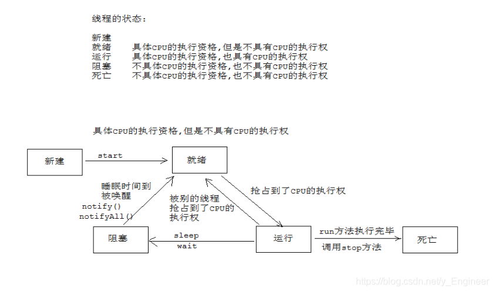

# 

# **多线程复制文件**

**示例**

```java
import java.io.File;
import java.io.FileNotFoundException;
import java.io.IOException;
import java.io.RandomAccessFile;

public class MyTest {
    public static void main(String[] args) throws FileNotFoundException {
        File sourceFile = new File("1.网络模型的介绍.mp4");//封装文件
        File targetFile = new File("网络模型的介绍.mp4");//封装目标文件
        CopyThread.threadCopyFile(sourceFile,targetFile);
    }
}

class CopyThread extends Thread {
    private long start;
    private long end;
    private RandomAccessFile in;
    private RandomAccessFile out;
    private CopyThread(File sourceFile, File targetFile, long start, long end) throws FileNotFoundException {
        this.start=start;
        this.end=end;
        in = new RandomAccessFile(sourceFile, "r");//读取源文件
        out= new RandomAccessFile(targetFile,"rw");//写入目标文件
    }

    @Override
    public void run() {
        try {
            //设置起始文件指针位置
            in.seek(start);
            out.seek(start);
            //循环读写复制文件
            int len=0;
            int thLen=0;
            byte[] bytes = new byte[1024 * 8];
            int oldBytesLen=bytes.length;//获取此时数组的长度
            long x=start;//定义临时变量，并给其赋值start
            while (true){
                //若未复制字节数小于原数组长度，则重新定义数组，长度为未复制的字节数
                if(end-x<oldBytesLen){
                    bytes=new byte[(int)(end-x)];
                }
                len=in.read(bytes);//读
                out.write(bytes,0,len);//写
                thLen+=len;//统计以复制字节数
                //若读写字节数小于原数组长度(即原数组被重新定义)，则表示此线程复制任务完成，退出循环
                if(len<oldBytesLen){
                    break;
                }
                x+=len;//更新起始位置
            }
            System.out.println(Thread.currentThread().getName()+"：复制字节范围:["+start+","+end+"]\t复制字节数："+thLen+"字节\t任务完成！");
        } catch (IOException e) {
            e.printStackTrace();
        }finally {
            try {
                //关闭流，释放资源
                in.close();
                out.close();
            } catch (IOException e) {
                e.printStackTrace();
            }
        }
    }

    //多线程复制文件
    public static void threadCopyFile(File sourceFile, File targetFile) throws FileNotFoundException {
        long totalLen = sourceFile.length();//获取源文件长度（字节数）
        int numThread = 3;//设置线程数量
        long averageLen = totalLen / numThread;//计算每个线程平均复制字节数
        //循环开启线程
        for (int i = 0; i < numThread; i++) {
            long start = i * averageLen;//计算起始字节位置
            long end = (i + 1) * averageLen-1;//计算末尾字节位置
            if (i == numThread - 1) {
                end = totalLen;//最后一个线程将剩余字节全部复制
            }
            new Thread(new CopyThread(sourceFile, targetFile, start, end),"线程"+(i+1)).start();//开启线程
        }
    }
}
```

**运行结果**

```
线程3：复制字节范围:[44632070,66948105]	复制字节数：22316035字节	任务完成！
线程2：复制字节范围:[22316035,44632069]	复制字节数：22316034字节	任务完成！
线程1：复制字节范围:[0,22316034]	复制字节数：22316034字节	任务完成！

Process finished with exit code 0
```

# **多线程**

## 1、进程和线程

> **进程**：	进程就是正在运行的程序，是系统进行资源分配和调用的独立单位。每一个进程都有它自己的内存空间和系统资源。
> **多进程**：因为单核CPU在某个时间点上只能做一件事情，计算机是在多个进程间做着频繁切换，且切换速度很快，所以，我们感觉多个进程				在同时进行，其实并不是同时执行的。多进程的作用不是提高执行速度，而是提高CPU的使用率。
>
>  **线程**：	在一个进程内部又可以执行多个任务，而这每一个任务我们就可以看成是一个线程。线程是CPU调度的基本单位。
>  **多线程**：Java使用的线程模式是抢占式调度，即多个线程抢占CPU的时间片（执行权），线程的优先级高的抢占的概率相对较大，优先级相				同的，抢占的概率的相等，具有随机性，不确定性；多线程可以解决负载均衡问题,充分利用CPU的资源。
>
>  **并发**：指在同一时刻只能有一条指令执行，但多个进程指令被快速的轮换执行，使得在宏观上具有多个进程同时执行的效果，但在微观上并			不是同时执行的，只是把时间分成若干段，使多个进程快速交替的执行。
>  **并行**：指在同一时刻，有多条指令在多个处理器上同时执行。所以无论从微观还是从宏观来看，二者都是一起执行的。

## 2、多线程实现

```java
Thread类的基本获取和设置方法
	public final String getName() //获取线程名称
	public final void setName(String name) //设置线程名称
	public static Thread currentThread()//获取当前执行的线程
```

**1、方式一**

```java
public class Blog {
    public static void main(String[] args) {
        //创建MyThread的对象
        MyThread th1 = new MyThread();
        MyThread th2 = new MyThread();
        th1.setName("线程1");
        //通过对象调用start()方法开启线程
        th1.start();
        th2.setName("线程2");//设置线程名称
        th2.start();
    }
}
//定义一个类继承Thread类
class MyThread extends Thread{
    //重写run()方法
    @Override
    public void run() {
        //获取当前线程的名称
        String name = Thread.currentThread().getName();
        System.out.println(name+":需要执行的代码！");
    }
}
 /*注意：
        a: 开启线程调用的是start()方法，不是run()方法，调用run()方法仅仅只是将run方法执行一遍，并没有开启线程；
        b: run()方法中一般执行比较耗时的代码
*/
```

**2、方式二**

```java
public class Blog1 {
    public static void main(String[] args) {
        RunnableImpl runnable = new RunnableImpl();
        //将Runnable子类对象作为参数传给Thread,获取Thread的对象
        Thread th1 = new Thread(runnable);
        th1.setName("线程1");//设置线程名称
        //也可通过构造方法设置线程名称
        Thread th2 = new Thread(runnable, "线程2");
        //开启线程
        th1.start();
        th2.start();
    }
}
//定义一个类实现Runnable接口
class RunnableImpl implements Runnable{
    @Override
    public void run() {
        String name = Thread.currentThread().getName();
        System.out.println(name+"需要执行的代码");
    }
}
```

**3、方式三**

```java
import java.util.concurrent.Callable;
import java.util.concurrent.ExecutionException;
import java.util.concurrent.FutureTask;

public class Blog2 {
    public static void main(String[] args) throws ExecutionException, InterruptedException {
        MyCallable myCallable = new MyCallable();
        FutureTask<Integer> task = new FutureTask<>(myCallable);
        //将task对象传递给Thread有参构造，获取Thread对象
        Thread th1 = new Thread(task,"线程1");
        th1.start();//开启线程
        Integer sum = task.get();//获取call方法返回值
        System.out.println(sum);//49995000
    }
}
//定义一个类实现Callable接口
class MyCallable implements Callable<Integer>{

    //实现call()方法
    @Override
    public Integer call() throws Exception {
        int sum=0;
        for (int i = 0; i < 10000; i++) {
            sum+=i;
        }
        return sum;
    }
}
```

## 3、线程控制

### 1、设置线程优先级

```java
	public final int getPriority() //获取线程的优先级
	public final void setPriority(int newPriority)//设置线程的优先级，默认优先级为5，最高优先级为10，最低为1
	//注意：线程优先级高只是抢占CPU时间片的概率大，而不是该线程就一定比其他线程先抢占，多线程抢占CPU执行权具有随机性，不确定性，一两次运行不能说明问题。
    //演示
        th1.setPriority(Thread.MIN_PRIORITY);//设置为最低优先级
        int priority1 = th1.getPriority();
        System.out.println(priority1);//1

		th2.setPriority(Thread.MAX_PRIORITY);//设置为最低优先级
        int priority2 = th2.getPriority();
        System.out.println(priority2);//10

		//获取主线程的优先级
        int priority = Thread.currentThread().getPriority();
        System.out.println(priority);//5
```

### 2、线程休眠

```java
public static void sleep(long millis) //让线程休眠millis毫秒
```

### 3、加入线程

```java
public final void join()	//等待该线程执行完毕了以后,其他线程才能再次执行；注意事项: 在线程启动之后,再调用该方法
//演示
	//可以实现让多个线程串行执行
        th1.start();
        th1.join();
        th2.start();
        th2.join();
        th3.start();
        th3.join();    			
```

### 4、礼让线程

```java
public static void yield()	//暂停当前正在执行的线程对象，并执行其他线程。
```

> 注意：线程礼让是暂停当前正在执行的线程,由于暂停的时间是相当短的,如果在这个线程暂停完毕以后,其他的线程还没有抢占到CPU的执行权,那么这个时候这个线程就会再次和其他线程抢占CPU的执行权.

### 5、守护线程

```java
public final void setDaemon(boolean on):
	//将该线程标记为守护线程或用户线程。当所有的用户线程都结束之后，Java 虚拟机就会退出，不管是否还有未完成的守护线程。 
	//注意：该方法必须在启动线程前调用。 
```

### 6、中断线程

```java
public final void stop():		//停止线程的运行(已过时)
public void interrupt():		//中断线程的阻塞状态
//演示
public class Blog1 {
    public static void main(String[] args){
        RunnableImpl runnable = new RunnableImpl();
        Thread th1 = new Thread(runnable,"线程1");

        th1.start();
        th1.interrupt();//中断此线程阻塞状态
    }
}

class RunnableImpl implements Runnable{
    @Override
    public void run() {
        try {
            Thread.sleep(1000);//让线程休眠1000毫秒
        } catch (InterruptedException e) {
            e.printStackTrace();
        }
        String name = Thread.currentThread().getName();
        System.out.println(name+"需要执行的代码");
    }
}

运行结果：

java.lang.InterruptedException: sleep interrupted  //中断异常：休眠被interrupted终止
at java.lang.Thread.sleep(Native Method)
at myblog1.RunnableImpl.run(Blog1.java:17)
at java.lang.Thread.run(Thread.java:748)
线程1需要执行的代码

Process finished with exit code 0

```

### 7、线程间的等待唤醒机制

```java
Object 类中
	void wait ()  在其他线程调用此对象的 notify () 方法或 notifyAll () 方法前，导致当前线程等待。    
	void wait (long timeout) 在其他线程调用此对象的 notify () 方法或 notifyAll () 方法，或者超过指定的时间量前，导致当前线程等待。
	void notify () 唤醒在此对象监视器上等待的单个线程。
	void notifyAll ()  唤醒在此对象监视器上等待的所有线程。
```

```java
public class MyTest {
    public static void main(String[] args) {
        //生产线程生产一个资源，通知消费线程消费一个资源，
        //消费线程消费完一个资源，再通知生产线程生产一个资源
        Student student = new Student();
        new SetThread(student).start();
        new GetThread(student).start();
    }
}

class SetThread extends Thread{
    private static Student student;
    private static int i;
    public SetThread(Student student) {
        this.student=student;
    }

    @Override
    public void run() {
        while (true) {
            synchronized (student) {
                if(student.flag){
                    try {
                        student.wait();//有资源，当前线程进入等待状态，等待消费线程消费资源，并释放锁
                    } catch (InterruptedException e) {
                        e.printStackTrace();
                    }
                }
                //模拟生产资源
                if(i%2==0){
                    student.name="张三";
                    student.age=23;
                }else {
                    student.name="李四";
                    student.age=24;
                }
                i++;
                student.flag=true;//上面生产了资源，修改标记
                student.notify();//唤醒消费线程等待状态，让其消费资源
            }
        }
    }
}

class GetThread extends Thread{
    private static Student student;
    public GetThread(Student student) {
        this.student=student;
    }

    @Override
    public void run() {
        while (true) {
            synchronized (student) {
                if(!student.flag){
                    try {
                        student.wait();//没有资源，当前线程进入等待状态，等待生产线程生产资源，并释放锁
                    } catch (InterruptedException e) {
                        e.printStackTrace();
                    }
                }
                System.out.println(student.name+"=="+student.age);//打印模拟消费资源
                student.flag=false;//上面了消费资源，修改标记
                student.notify();//唤醒生产线程等待状态，让其生产资源
            }
        }
    }
}

class Student{
    public String name;
    public int age;
    public boolean flag=false;//true表示有资源（即学生信息），false表示没有资源
}
==========================================
运行结果
张三==23
李四==24
张三==23
李四==24
张三==23
...（死循环）

```

### 8、线程状态转换图



## 4、线程安全问题

> 判断一个多线程应用程序是否有问题的标准：
>
> - a: 是否是多线程环境
> - b: 是否存在共享数据
> - c: 是否存在多条语句同时操作共享数据

> 解决问题：
>
> 由于我们要使用多线程环境，和共享数据，所以只能对"多条语句同时操作共享数据"这部分进行处理。

### 1、解决方式一：使用同步代码块处理

```java 
public class Blog1 {
    public static void main(String[] args){
        RunnableImpl runnable = new RunnableImpl();
        new Thread(runnable,"窗口1").start();
        new Thread(runnable,"窗口2").start();
        new Thread(runnable,"窗口3").start();
    }
}

class RunnableImpl implements Runnable{
    private static int num=100;//定义票的数量
    private static Object obj=new Object();//定义共享锁对象
    @Override
    public void run() {
        while (true){
            //同步代码块作用：当一个线程正在执行同步代码块时，其他线程必须等待其执行完，才能执行此代码块
            synchronized (obj){
                try {
                    Thread.sleep(30);//让线程休眠30毫秒,模拟网络延迟
                } catch (InterruptedException e) {
                    e.printStackTrace();
                }
                if(num>=1){
                    System.out.println(Thread.currentThread().getName()+"已出售第"+(num--)+"张票！");
                }else {
                    break;
                }
            }
        }
    }
}
```

```java
同步代码块格式：
synchronized(锁对象){ //这里的锁对象可以为任意对象
		需要同步的代码;
	}

同步的好处：解决了多线程的安全问题。
同步的弊端：当线程相当多时，因为每个线程都会去判断同步上的锁，这是很耗费资源的，无形中会降低程序的运行效率。
```

### 2、解决方式二：使用同步方法

```java 
public class Blog1 {
    public static void main(String[] args) {
        RunnableImpl runnable = new RunnableImpl();
        new Thread(runnable, "窗口1").start();
        new Thread(runnable, "窗口2").start();
        new Thread(runnable, "窗口3").start();
    }
}

class RunnableImpl implements Runnable {
    private static int num = 100;//定义票的数量

    @Override
    public void run() {
        while (true) {
                sell();
            if (num < 1) {
                break;
            }
        }
    }

    //同步方法
    private synchronized void sell() {
        if (num>=1) {
            try {
                Thread.sleep(30);//让线程休眠30毫秒,模拟网络延迟
            } catch (InterruptedException e) {
                e.printStackTrace();
            }
            String name = Thread.currentThread().getName();
            System.out.println(name + "已出售第" + (num--) + "张票！");
        }
    }
}
```

>  注意：同步方法和同步代码块类似，不过使用锁对象不同，同步代码块锁对象为任意对象，而同步方法锁对象是this，静态同步方法锁对象是字节码文件（A.class）

### 3、解决方式三：使用Lock锁

```java 
import java.util.concurrent.locks.ReentrantLock;

public class Blog2 {
    public static void main(String[] args) {
        MyThread myThread = new MyThread();
        new Thread(myThread, "窗口1").start();
        new Thread(myThread, "窗口2").start();
        new Thread(myThread, "窗口3").start();
    }
}

class MyThread implements Runnable {
    private static int num = 100;//定义票的数量
    static ReentrantLock lock = new ReentrantLock();//创建锁对象

    @Override
    public void run() {
        while (true) {
            lock.lock();//开启锁
            try {
                Thread.sleep(30);//让线程休眠30毫秒,模拟网络延迟
            } catch (InterruptedException e) {
                e.printStackTrace();
            }
            if (num >= 1) {
                System.out.println(Thread.currentThread().getName() + "已出售第" + (num--) + "张票！");
            } else {
                //此处也应关闭锁,因为程序执行到这，会直接跳出循环，不执行最后的关锁语句，若不关闭锁，则会出现死锁现象
                lock.unlock();
                break;
            }
            lock.unlock();//关闭锁
        }
    }
}
```

#### 拓展：死锁现象

```java
public class MyTest {
    public static void main(String[] args) {
        new MyThread(true).start();
        new MyThread(false).start();
    }
}
interface ObjectUtils{
    Object objA=new Object();
    Object objB=new Object();
}
class MyThread extends Thread{
    boolean flag;
    public MyThread(boolean flag) {
        this.flag=flag;
    }

    @Override
    public void run() {
        if(flag){
            synchronized (ObjectUtils.objA){
                System.out.println("true====ObjA 进来了");
                synchronized (ObjectUtils.objB){
                    System.out.println("true====ObjB进来了");
                }
            } //objA不释放，下面的objA同步代码块执行不了
        }else{
            synchronized (ObjectUtils.objB) {
                System.out.println("false====ObjB 进来了");
                synchronized (ObjectUtils.objA) {
                    System.out.println("false====ObjA 进来了");
                }
            }//objB不释放，上面的objB同步代码块执行不了
        }
    }
}
```

### 4、volatile关键字

> JVM的内存模型：
> Java内存模型规定了所有的变量都存储在主内存中。每条线程中还有自己的工作内存，线程的工作内存中保存了被该线程所使用到的变量（这些变量是从主内存中拷贝而来）。
>
> 线程对变量的所有操作（读取，赋值）都必须在工作内存中进行。
>
> 不同线程之间也无法直接访问对方工作内存中的变量，线程间变量值的传递均需要通过主内存来完成。
> 

> volatile关键字：当多个线程操作共享数据时，可以保证内存中的数据可见。即相当于若工作内存中的变量发生改变，则会立即刷回主内存。

### 5、CAS算法

```java 
	概述：CAS (Compare-And-Swap) 是一种硬件对并发的支持，针对多处理器操作而设计的处理器中的一种特殊指令，用于管理对共享数据的并发访问。CAS 是一种无锁的非阻塞算法的实现。
	java.util.concurrent.atomic 包下提供了一些原子操作的常用类:
		AtomicBoolean 、 AtomicInteger 、 AtomicLong 、 AtomicReference
		AtomicIntegerArray 、 AtomicLongArray
		AtomicMarkableReference
		AtomicReferenceArray 
```

```java
import java.util.concurrent.atomic.AtomicInteger;

public class MyTest1 {
    public static void main(String[] args) {
        for (int i = 0; i < 10; i++) {
            new Thread(new MyRunnable()).start();
        }
    }
}
class MyRunnable implements Runnable{
    static AtomicInteger i=new AtomicInteger(1);//给原子操作数i赋初值1
    @Override
    public void run() {
        while (true) {
            try {
                Thread.sleep(20);
            } catch (InterruptedException e) {
                e.printStackTrace();
            }
            //让i自加1，并打印
            System.out.println(Thread.currentThread().getName()+":"+i.getAndIncrement());
        }
    }
}

===========
运行结果：
Thread-0:1
Thread-2:2
Thread-1:3
Thread-3:4
Thread-7:5
Thread-5:6
    ...
```

# **线程池**

## 1、线程池概述

```
程序启动一个新线程成本是比较高的，因为它涉及到要与操作系统进行交互。
而使用线程池可以很好的提高性能，尤其是当程序中要创建大量生存期很短的线程时，更应该考虑使用线程池。
线程池里的每一个线程代码结束后，并不会死亡，而是再次回到线程池中成为空闲状态，等待下一个对象来使用。
```

## 2、线程池的使用

```java
JDK5新增了一个Executors工厂类来产生线程池，有如下几个方法
	public static ExecutorService newCachedThreadPool()://根据任务的数量来创建线程池对应的线程个数	
	public static ExecutorService newFixedThreadPool(int nThreads)://固定初始化几个线程
	public static ExecutorService newSingleThreadExecutor()://初始化一个线程的线程池
	这些方法的返回值是ExecutorService对象，该对象表示一个线程池，可以执行Runnable对象或者Callable对象代表的线程。
	它提供了如下方法:
		Future<?> submit(Runnable task)
		<T> Future<T> submit(Callable<T> task)

```

**示例一**

```java
import java.util.concurrent.ExecutorService;
import java.util.concurrent.Executors;

public class MyTest {
    public static void main(String[] args) {
        //获取线程池对象,固定初始化3个线程
        ExecutorService executorService = Executors.newFixedThreadPool(3);
        //给线程池添加任务
        executorService.submit(new MyRunnable());
        executorService.submit(new MyRunnable());
        executorService.submit(new MyRunnable());
        executorService.submit(new MyRunnable());
        executorService.submit(new MyRunnable());
        executorService.submit(new MyRunnable());
        executorService.shutdown();//关闭线程池
    }
}
class MyRunnable implements Runnable{

    @Override
    public void run() {
        System.out.println(Thread.currentThread().getName()+":任务执行了！");
    }
}
=================================
pool-1-thread-1:任务执行了！
pool-1-thread-3:任务执行了！
pool-1-thread-1:任务执行了！
pool-1-thread-3:任务执行了！
pool-1-thread-1:任务执行了！
pool-1-thread-2:任务执行了！

Process finished with exit code 0

```

**示例二**

```java
import java.util.concurrent.*;

public class MyTest1 {
    public static void main(String[] args) throws ExecutionException, InterruptedException {
        //获取初始化一个线程的线程池对象
        ExecutorService executorService = Executors.newSingleThreadExecutor();
        //添加任务
        Future<Integer> submit = executorService.submit(new MyCallable(100));
        Integer sum = submit.get();//获取call方法返回值
        System.out.println(sum);//5050
        Future<Integer> submit1 = executorService.submit(new MyCallable(200));
        Integer sum1 = submit1.get();
        System.out.println(sum1);//20100
        executorService.shutdown();//关闭线程池
    }
}
class MyCallable implements Callable<Integer>{
    int num;
    public MyCallable(int num) {
        this.num=num;
    }

    @Override
    public Integer call() throws Exception {
        int sum=0;
        for (int i = 1; i <= num; i++) {
            sum+=i;
        }
        return sum;
    }
}
```

# **定时器**

## 1、定时器概述

```
定时器是一个应用十分广泛的线程工具，可用于调度多个定时任务以后台线程的方式执行。在Java中，可以通过Timer和TimerTask类来实现定义调度的功能。
```

## 2、定时器的使用

```java
Timer和TimerTask
	Timer:
		public Timer()//创建一个新计时器
		public void schedule(TimerTask task, long delay)//安排在指定延迟后执行指定的任务
		public void schedule(TimerTask task,long delay,long period)//安排指定的任务从指定的延迟后开始进行重复的固定延迟执行
		public void schedule(TimerTask task,  Date time)//安排在指定的时间执行指定的任务
		public void schedule(TimerTask task,  Date firstTime, long period)//安排指定的任务在指定的时间开始进行重复的固定延迟执行
	TimerTask：定时任务
		public abstract void run()//此计时器任务要执行的操作
		public boolean cancel()//取消此计时器任务
```

**示例：控制台实时打印当前时间，精确到秒**

```java
import java.text.SimpleDateFormat;
import java.util.Date;
import java.util.Timer;
import java.util.TimerTask;

public class MyTest {
    public static void main(String[] args) {
        Timer timer = new Timer();//获取定时器
        MyTimerTask myTimerTask = new MyTimerTask(timer);
        timer.schedule(myTimerTask, 0, 1000);//每隔一秒，执行一次计时器任务
    }
}

class MyTimerTask extends TimerTask {
    Timer timer;

    public MyTimerTask(Timer timer) {
        this.timer = timer;
    }

    @Override
    public void run() {
        String format = new SimpleDateFormat("yyyy-MM-dd E HH:mm:ss").format(new Date());
        System.out.println(format);
    }
}

=============
2019-08-01 星期四 15:45:13
2019-08-01 星期四 15:45:14
2019-08-01 星期四 15:45:15
2019-08-01 星期四 15:45:16
2019-08-01 星期四 15:45:17
    ............
```

# **设计模式**

## 1、概述及分类

```
A:设计模式概述
	设计模式（Design pattern）是一套被反复使用、多数人知晓的、经过分类编写的代码设计经验的总结。
	使用设计模式是为了可重用代码、让代码更容易被他人理解、保证代码可靠性以及代码的结构更加清晰.
B:设计模式分类
	创建型模式(创建对象的):单例模式、抽象工厂模式、建造者模式、工厂模式、原型模式。
	行为型模式(对象的功能):适配器模式、桥接模式、装饰模式、组合模式、外观模式、享元模式、代理模式。
	结构型模式(对象的组成):模版方法模式、命令模式、迭代器模式、观察者模式、中介者模式、备忘录模式、解释器模式、状态模式、策略模式、职责链模式、访问者模式。
```

## 2、工厂模式

### 2.1、简单工厂模式

```java
	概述:又叫静态工厂方法模式，它定义一个具体的工厂类负责创建一些类的实例。
	优点:使用静态工厂模式的优点是实现责任的分割，该模式的核心是工厂类，工厂类含有必要的选择逻辑，可以决定什么时候创建哪一个产品的实例，而客户端则免去直接创建产品的责任，而仅仅是消费产品。也就是说静态工厂模式在不改变客户端代码的情况可以动态的增加产品。
	缺点:这个静态工厂类负责所有对象的创建，如果有新的对象增加，或者某些对象的创建方式不同，就需要不断的修改工厂类，不利于后期的维护
```

```java
public class MyTest {
    public static void main(String[] args) {
        //通过工厂类的静态方法获取动物对象
        Animal dog = AnimalFactory.getAnimal("dog");
        Animal cat = AnimalFactory.getAnimal("cat");
        dog.eat();//狗吃肉
        cat.eat();//猫吃鱼
    }
}
class AnimalFactory{

    private AnimalFactory() {}
    public static Animal getAnimal(String animalName){
        if(animalName.equals("dog")){
            return new Dog();
        }else if(animalName.equals("cat")){
            return new Cat();
        }
        return null;
    }

}
abstract class Animal{
    public abstract void eat();
}

class Dog extends Animal{

    @Override
    public void eat() {
        System.out.println("狗吃肉");
    }
}

class Cat extends Animal{

    @Override
    public void eat() {
        System.out.println("猫吃鱼");
    }
}
```

### 2.2、工厂方法模式

```
A:工厂方法模式概述
	工厂方法模式中抽象工厂类负责定义创建对象的接口，具体对象的创建工作由继承抽象工厂的具体类实现。
B:优点
	客户端不需要在负责对象的创建，从而明确了各个类的职责，如果有新的对象增加，
	只需要增加一个具体的类和具体的工厂类即可，不影响已有的代码，后期维护容易，增强了系统的扩展性
C:缺点: 需要额外的编写代码，增加了工作量
```

```java
public class MyTest {
    public static void main(String[] args) {
        //获取动物对象
        Animal cat = new CatFactory().createAnimal();
        Animal dog = new DogFactory().createAnimal();
        //调用方法
        cat.eat();
        dog.eat();
    }
}
interface Factory{
    Animal createAnimal();
}

class CatFactory implements Factory{

    @Override
    public  Animal createAnimal() {
        return new Cat();
    }
}

class DogFactory implements Factory{

    @Override
    public Animal createAnimal() {
        return new Dog();
    }
}

abstract class Animal{
    public abstract void eat();
}

class Dog extends Animal{

    @Override
    public void eat() {
        System.out.println("狗吃肉");
    }
}

class Cat extends Animal{

    @Override
    public void eat() {
        System.out.println("猫吃鱼");
    }
}
```

## 3、单例模式

```java
public class MyTest {
    public static void main(String[] args) {
        Student student = Student.getStudent();
        Student student1 = Student.getStudent();
        System.out.println(student==student1);//true

        Teacher teacher = Teacher.getTeacher();
        Teacher teacher1 = Teacher.getTeacher();
        System.out.println(teacher==teacher1);//true
    }
}

//一、饿汉式
class Student{
    private static Student stu=new Student();
    private Student(){} //私有构造方法
    public static Student getStudent(){
        return stu;
    }
}

//二、懒汉式
class Teacher{
    private static Teacher teacher;
    private Teacher() {}
    public synchronized static Teacher getTeacher(){
        if(teacher==null){
            teacher=new Teacher();
        }
        return teacher;
    }
}
```

# **Java程序执行DOS命令**

```java
Runtime类：
	每个 Java 应用程序都有一个 Runtime 类实例，使应用程序能够与其运行的环境相连接。可以通过 getRuntime 方法获取当前运行时。 
	应用程序不能创建自己的 Runtime 类实例。 
	public Process  exec(String command)  //执行Dos 命令
```

**示例：使用DOS命令定时关机**

```java
import java.io.IOException;
import java.text.ParseException;
import java.text.SimpleDateFormat;
import java.util.Timer;
import java.util.TimerTask;

public class MyTest {
    public static void main(String[] args) throws  ParseException {
        //Runtime 采用单例模式的饿汉式
        Runtime runtime = Runtime.getRuntime();
        //定时关机
        Timer timer = new Timer();
        //在指定日期执行计时器任务
        timer.schedule(new TimerTask() {
            @Override
            public void run() {
                try {
                    runtime.exec("shutdown -s -t 0");//DOS命令(0毫秒后关机)
                } catch (IOException e) {

                    e.printStackTrace();
                }
            }
        },new SimpleDateFormat("yyyy-MM-dd HH:mm:ss").parse("2019-08-01 16:59:00"));
    }
}
```

# **网络编程**

## 1、网络编程三要素

### 1、IP概述

```shell
A:IP概述:所谓IP地址就是给每个连接在Internet上的主机分配的一个32bit地址。 
B:IP地址的组成
	IP地址 = 网络地址+主机地址  
	A类IP地址:第一段号码为网络地址，剩下的三段号码为本地计算机的号码
	B类IP地址:前二段号码为网络地址，剩下的二段号码为本地计算机的号码
	C类IP地址:前三段号码为网络地址，剩下的一段号码为本地计算机的号码
C:IP地址分类
	A类	1.0.0.1---127.255.255.254
		(1)10.X.X.X是私有地址(私有地址就是在互联网上不使用，而被用在局域网络中的地址)							
		(2)127.X.X.X是保留地址，用做循环测试用的。
	B类	128.0.0.1---191.255.255.254	   172.16.0.0---172.31.255.255是私有地址。
	C类	192.0.0.1---223.255.255.254	192.168.x.X是私有地址
	D类	224.0.0.1---239.255.255.254 	
	E类	240.0.0.1---247.255.255.254	  
D:特殊地址
	127.0.0.1 回环地址,可用于测试本机的网络是否有问题. ping 127.0.0.1   
	DOS命令 ipconfig:查看本机IP地址
	xxx.xxx.xxx.255 广播地址
```

### 2、端口概述

```
端口：
	物理端口：网卡口
	逻辑端口 
		a:每个网络程序都会有一个逻辑端口
		b:用于标识进程的逻辑地址，不同进程的标识不同
		c:有效端口：0~65535（两个字节），其中0~1023系统使用或保留端口。
```

### 3、协议概述

```
协议:
	UDP
		将数据源和目的封装成数据包中，不需要建立连接；
		每个数据报的大小在限制在64k；
		因无连接，是不可靠协议；
		不需要建立连接，速度快
	TCP
		建立连接，形成传输数据的通道；
		在连接中进行大数据量传输；
		需要连接所以是可靠协议；
		必须建立连接，效率会稍低
```

## 2、InetAddress类的使用和Socket通信原理

### 1、InetAddress类的使用

```java
	//获取主机名的DOS命令 ：hostname
	A:InetAddress类的概述
		此类表示互联网协议 (IP) 地址。 
	B:InetAddress类的常用方法
		public static InetAddress getByName(String host)//在给定主机名的情况下确定主机的 IP 地址
		public String getHostAddress()//获取IP
		public String getHostName()//获取主机名
		public static InetAddress getLocalHost()//返回本地主机 
```

```java
import java.net.InetAddress;
import java.net.UnknownHostException;

public class MyTest {
    public static void main(String[] args) throws UnknownHostException {
        //在给定主机名（或IP）的情况下确定主机的IP地址
        InetAddress byName = InetAddress.getByName("192.168.18.101");
        System.out.println(byName);// /192.168.18.101
        //主机名
        System.out.println(byName.getHostName());//LAPTOP-CD98F7A0
        //IP
        System.out.println(byName.getHostAddress());//192.168.18.101
        //本地主机
        InetAddress localHost = InetAddress.getLocalHost();
        System.out.println(localHost);//LAPTOP-CD98F7A0/192.168.18.101
    }
}
```

### 2、Socket通信原理

```
Socket=IP+端口号
	A:Socket套接字概述：
		网络上具有唯一标识的IP地址和端口号组合在一起才能构成唯一能识别的标识符套接字。
	B:Socket原理机制：
		通信的两端都有Socket。
		网络通信其实就是Socket间的通信。
		数据在两个Socket间通过IO传输。
```

## 3、UDP协议

### 1、UDP协议发送数据

```
- 步骤:
- a: 创建UDP通讯客户端对象(DatagramSocket)
- b: 创建数据报包 public DatagramPacket(byte[] buf, int length, InetAddress address,int port)
- c: 发送数据
- d: 释放资源
```

```java
import java.io.IOException;
import java.net.*;

public class UDPClient {
    public static void main(String[] args) throws IOException {
        //创建UDP通讯客户端对象
        DatagramSocket datagramSocket = new DatagramSocket();
        byte[] bytes = "你好！".getBytes();
        InetAddress byName = InetAddress.getByName("192.168.11.101");
        //创建数据报包
        DatagramPacket datagramPacket = new DatagramPacket(bytes, bytes.length, byName, 8888);
        //发送数据
        datagramSocket.send(datagramPacket);
        //释放资源
        datagramSocket.close();
    }
}
```

### 2、UDP协议接收数据

```
- 步骤:
- a: 创建UDP通讯协议服务器端对象(DatagramSocket)，注意要用有参数构造指定端口号
- b: 创建数据报包,用来接收数据  // public DatagramPacket(byte[] buf, int length)
- c: 接收数据  receive(dp) ;
- d: 解析数据报包,拿出数据  
dp.getData(); //获取数据的字节数组
dp.getLength();//获取数据的字节长度
- e: 释放资源
```

```java
import java.io.IOException;
import java.net.DatagramPacket;
import java.net.DatagramSocket;

public class UDPServer {
    public static void main(String[] args) throws IOException {
        //创建UDP通讯协议服务器端对象,并指定端口
        DatagramSocket datagramSocket = new DatagramSocket(8888);
        byte[] bytes = new byte[1024];
        //创建数据报包
        DatagramPacket datagramPacket = new DatagramPacket(bytes,bytes.length);
        System.out.println("等待连接...");
        //接收数据
        datagramSocket.receive(datagramPacket);
        //获取数据的字节数组，即上面传入的数组
        byte[] data = datagramPacket.getData();
        //获取数据的字节长度
        int length = datagramPacket.getLength();
        String s = new String(data, 0, length);
        System.out.println(s);
        //释放资源
        datagramSocket.close();
    }
}
```

### 3、使用UDP协议模拟聊天

#### 聊天人：A

```java
import java.io.IOException;
import java.net.*;
import java.util.Scanner;

public class A {
    public static void main(String[] args) throws IOException {
        new Thread(){
            @Override
            public void run() {
                DatagramSocket datagramSocket = null;
                try {
                    datagramSocket = new DatagramSocket(8888);
                    System.out.println("等待连接...");
                    while (true) {
                        byte[] bytes = new byte[1024];
                        DatagramPacket datagramPacket = new DatagramPacket(bytes,bytes.length);
                        datagramSocket.receive(datagramPacket);
                        byte[] data = datagramPacket.getData();
                        int length = datagramPacket.getLength();
                        String hostName = datagramPacket.getAddress().getHostName();
                        String s = new String(data, 0, length);
                        System.out.println(hostName+"B给你发来消息："+s);
                        if(s.equals("拜拜")){
                            break;
                        }
                    }

                } catch (IOException e) {
                    e.printStackTrace();
                } finally {
                    datagramSocket.close();
                }
            }
        }.start();
        sendAMessage();
    }

    private static void sendAMessage() throws IOException {
        DatagramSocket datagramSocket = new DatagramSocket();
        Scanner scanner = new Scanner(System.in);
        while (true){
            System.out.println("请输入要发送给B的内容：");
            String s = scanner.nextLine();
            byte[] bytes = s.getBytes();
            InetAddress byName = InetAddress.getByName("192.168.18.101");
            DatagramPacket datagramPacket = new DatagramPacket(bytes, bytes.length, byName, 11111);
            datagramSocket.send(datagramPacket);
            if(s.equals("拜拜")){
                break;
            }
        }
        datagramSocket.close();
    }
}
```

#### 聊天人：B

```java
import java.io.IOException;
import java.net.DatagramPacket;
import java.net.DatagramSocket;
import java.net.InetAddress;
import java.util.Scanner;

public class B {
    public static void main(String[] args) throws IOException {
        new Thread(){
            @Override
            public void run() {
                DatagramSocket datagramSocket = null;
                try {
                    datagramSocket = new DatagramSocket(11111);
                    System.out.println("等待连接...");
                    while (true) {
                        byte[] bytes = new byte[1024];
                        DatagramPacket datagramPacket = new DatagramPacket(bytes,bytes.length);
                        datagramSocket.receive(datagramPacket);
                        byte[] data = datagramPacket.getData();
                        int length = datagramPacket.getLength();
                        String hostName = datagramPacket.getAddress().getHostName();
                        String s = new String(data, 0, length);
                        System.out.println(hostName+"A给你发来消息："+s);
                        if(s.equals("拜拜")){
                            break;
                        }
                    }

                } catch (IOException e) {
                    e.printStackTrace();
                } finally {
                    datagramSocket.close();
                }
            }
        }.start();
        sendAMessage();
    }

    private static void sendAMessage() throws IOException {
        DatagramSocket datagramSocket = new DatagramSocket();
        Scanner scanner = new Scanner(System.in);
        while (true){
            System.out.println("请输入要发送给A的内容：");
            String s = scanner.nextLine();
            byte[] bytes = s.getBytes();
            InetAddress byName = InetAddress.getByName("192.168.18.101");
            DatagramPacket datagramPacket = new DatagramPacket(bytes, bytes.length, byName, 8888);
            datagramSocket.send(datagramPacket);
            if(s.equals("拜拜")){
                break;
            }
        }
        datagramSocket.close();
    }
}
```

## 4、TCP协议

### 1、TCP协议发送数据

```
* 步骤:
- a: 创建TCP通讯协议客户端对象(Socket)   
    public Socket(String host, int port)
- b: 获取输出流对象
- c: 写数据
- d: 释放资源
```

```java
import java.io.IOException;
import java.io.InputStream;
import java.io.OutputStream;
import java.net.Socket;

public class TCPClient {
    public static void main(String[] args) throws IOException {
        //创建TCP通讯协议客户端对象
        Socket socket = new Socket("192.168.16.112", 8888);
        //获取输出流对象
        OutputStream out = socket.getOutputStream();
        //写数据
        out.write("你好！".getBytes());
        //接收服务器端反馈消息
        InputStream in = socket.getInputStream();
        byte[] bytes = new byte[1024 * 8];
        int read = in.read(bytes);
        System.out.println(new String(bytes, 0, read));
        //释放资源
        socket.close();
    }
}
```

### 2、TCP协议接收数据

```
* 步骤:
- a: 创建TCP通讯协议服务器端对象(ServerSocket)
- b: 监听客户端
- c: 获取输入流对象
- d: 读取数据
- e: 释放资源
```

```java
import java.io.IOException;
import java.io.InputStream;
import java.io.OutputStream;
import java.net.ServerSocket;
import java.net.Socket;

public class TCPServer {
    public static void main(String[] args)throws IOException {
        //创建TCP通讯协议服务器端对象
        ServerSocket serverSocket = new ServerSocket(8888);
        System.out.println("等待连接...");
        //监听客户端
        Socket accept = serverSocket.accept();
        System.out.println("连接成功");
        //获取输入流对象
        InputStream in = accept.getInputStream();
        //读取数据
        byte[] bytes = new byte[1024 * 8];
        int read = in.read(bytes);
        String s = new String(bytes,0,read);
        System.out.println(s);
        //给客户端反馈消息
        OutputStream out = accept.getOutputStream();
        out.write("服务器已收到数据".getBytes());
        //释放资源
        serverSocket.close();
    }
}
```

### 3、例：多线程开启多个客户端

#### 客户端：

```java
import java.io.FileInputStream;
import java.io.IOException;
import java.io.InputStream;
import java.io.OutputStream;
import java.net.Socket;

public class TCPClient {
    public static void main(String[] args) throws IOException {
        //创建TCP通讯协议客户端对象
        Socket socket = new Socket("192.168.16.112", 9998);
        //获取输出流对象
        OutputStream out = socket.getOutputStream();
        //新建输入流关联上传的文件
        FileInputStream in = new FileInputStream("歌曲大联唱2.mp3");
        //读写文件
        int len=0;
        byte[] bytes = new byte[1024];
        while ((len=in.read(bytes))!=-1){
            out.write(bytes,0,len);
        }
        //禁用此套接字的输出流
        socket.shutdownOutput();
        //获取服务端反馈信息
        InputStream inputStream = socket.getInputStream();
        int len1 = inputStream.read(bytes);
        System.out.println(new String(bytes, 0, len1));
        //释放资源
        socket.close();
        in.close();
    }
}
```

#### 服务端：

```java
import java.io.*;
import java.net.ServerSocket;
import java.net.Socket;

public class TCPServer {
    public static void main(String[] args) throws IOException {
        //创建TCP通讯协议服务器端对象
        ServerSocket ss = new ServerSocket(9998);
        System.out.println("等待连接...");
        //循环开启线程
        int i=0;
        while (true){
            i++;
            //监听客户端
            Socket accept = ss.accept();
            System.out.println("已成功连接"+i+"个客户端！");
            new ServerThread(accept).start();
        }
    }
}

class ServerThread extends Thread{
    Socket accept;
    public ServerThread(Socket accept) {
        this.accept=accept;
    }

    @Override
    public void run() {
        FileOutputStream out=null;
        try {
            //获取输入流对象
            InputStream in = accept.getInputStream();
            //新建输出流关联目标文件
            out = new FileOutputStream(System.currentTimeMillis()+"歌曲大联唱.mp3");
            //读写文件
            int len;
            byte[] bytes = new byte[1024];
            while ((len=in.read(bytes))!=-1){
                out.write(bytes,0,len);
            }
            //获取输出流，给客户端反馈数据
            OutputStream out1 = accept.getOutputStream();
            out1.write("文件上传成功".getBytes());
        }catch (IOException e){
            e.printStackTrace();
        }finally {
            //释放资源
            try {
                out.close();
            } catch (IOException e) {
                e.printStackTrace();
            }
        }
    }
}
```

## 5、下载网络资源

```java
import java.io.FileOutputStream;
import java.io.IOException;
import java.io.InputStream;
import java.net.HttpURLConnection;
import java.net.URL;

public class DownLoadFile {
    public static void main(String[] args) throws IOException {
        //URL：统一资源定位符
        //协议 IP:端口号 资源路径
        String imgUrl = "http://www.westos.org/wp-content/uploads/2017/10/5D5DD3783D9955F5472C0B84F1BD14E5_21.jpg";
        URL url = new URL(imgUrl);
        //打开连接
        HttpURLConnection conn = (HttpURLConnection) url.openConnection();
        //设置一些参数
        conn.setRequestMethod("GET");//设置请求方式，默认是 GET
        conn.setConnectTimeout(3000);//设置请求超时时间
        //获取相应状态码
        int code = conn.getResponseCode(); //200 代表成功响应
        System.out.println(code);//200
        String msg = conn.getResponseMessage();//获取响应消息
        System.out.println(msg);//OK
        int length = conn.getContentLength();//获取网络资源文件的大小
        System.out.println(length);//525610
        if (code == 200) {
            //获取输入流，读取服务器响应 的字节数据
            InputStream in = conn.getInputStream();
            FileOutputStream out = new FileOutputStream("my.jpg");
            int len = 0;
            byte[] bytes = new byte[1024];
            while ((len = in.read(bytes)) != -1) {
                out.write(bytes, 0, len);
                out.flush();
            }
            in.close();
            out.close();
            System.out.println("下载成功");
        }
    }
}
```

# **Java反射机制**

## 1、反射机制概述

```
反射概述:
	JAVA反射机制是在运行状态中，对于任意一个类，都能够知道这个类的所有属性和方法；
	对于任意一个对象，都能够调用它的任意一个方法和属性；
	这种动态获取类的信息以及动态调用对象的方法的功能称为Java语言的反射机制。
	要想解剖一个类,必须先要获取到该类的字节码文件对应的Class类型的对象,因为解剖使用的是Class类中的方法。
类的成员：
	 成员变量		Field
	 构造方法		Constructor
	 成员方法		Method
```

## 2、获取class文件对象的三种方式

```
a:Object类的getClass()方法
b:静态属性class
c:Class类中静态方法forName()
```

```java
public class MyTest {
    public static void main(String[] args) throws ClassNotFoundException {
        //Object类的getClass()方法
        Class<? extends MyTest> aClass = new MyTest().getClass();
        // 静态属性class
        Class<MyTest> myTestClass = MyTest.class;
        //Class类中静态方法forName(),参数为全类名
        Class<?> aClass1 = Class.forName("mydemo.MyTest");
        //class文件对象只有一个，所以无论通过何种方式获取的class文件对象都是同一个
        System.out.println(myTestClass==aClass&&aClass==aClass1);//true
    }
}
```

## 3、通过反射获取构造方法并使用

```java
//获取所有公共的构造方法的对象数组
	public Constructor<?>[] getConstructors() 
//获取所有的构造方法（包括私有的）的对象数组
	public Constructor<?>[] getDeclaredConstructors() 
//获取单个公共构造方法的对象
	public Constructor<T> getConstructor(Class<?>... parameterTypes)
//获取单个构造方法的对象，包含私有的            
	public Constructor<T> getDeclaredConstructor(Class<?>... parameterTypes) 
T newInstance() //创建此 Class 对象所表示的类的一个新实例     
public void setAccessible(boolean flag)//AccessibleObject的方法
   //将此对象的 accessible 标志设置为指示的布尔值。值为 true 则指示反射的对象在使用时应该取消 Java 语言访问检查。值为 false 则指示反射的对象应该实施 Java 语言访问检查。    

```

```java
import java.lang.reflect.Constructor;

public class MyTest {
    public static void main(String[] args) throws Exception {
        Class<?> aClass = Class.forName("mydemo1.Student");
        //获取所有公共的构造方法的对象数组
        Constructor<?>[] constructors = aClass.getConstructors();
        //获取所有的构造方法（包括私有的）的对象数组
        Constructor<?>[] declaredConstructors = aClass.getDeclaredConstructors();
        //获取单个私有构造方法的对象
        Constructor<?> constructor = aClass.getDeclaredConstructor();
        //取消访问检查
        constructor.setAccessible(true);
        //通过私有构造方法对象创建Student对象
        Student student = (Student) constructor.newInstance();
        System.out.println(student);
        System.out.println("--------------------------------");
        //获取公共有参构造方法对象
        Constructor<?> constructor1 = aClass.getConstructor(String.class, int.class);
        Student student1 = (Student) constructor1.newInstance("张三", 23);
        System.out.println(student1);
    }
}

class Student {
    private Student() {
        System.out.println("私有空参构造执行了");
    }

    public Student(String name,int age) {
        System.out.println("有参构造执行了,"+name+"=="+age);
    }
}

====================
私有空参构造执行了
mydemo1.Student@4554617c
--------------------------------
有参构造执行了,张三==23
mydemo1.Student@74a14482

Process finished with exit code 0

```

## 4、通过反射获取成员变量并使用

```java
//获取所有公共成员变量的对象，包含从父类继承过来的
public Field[] getFields() 
//获取所有成员变量的对象，包含私有的，也包含从父类继承过来的
public Field[] getDeclaredFields() 
public Field getField(String name)//获取单个公共成员变量的对象
public Field getDeclaredField(String name)//获取单个成员变量的对象
```

```java
import java.lang.reflect.Constructor;
import java.lang.reflect.Field;

public class MyTest {
    public static void main(String[] args) throws Exception{
        //创建Student对象
        Class<?> aClass = Class.forName("mydemo2.Student");
        Constructor<?> declaredConstructor = aClass.getDeclaredConstructor();
        declaredConstructor.setAccessible(true);
        Object stu = declaredConstructor.newInstance();

        //获取成员变量对象，并给成员变量赋值
        Field name = aClass.getField("name");//参数为字段名称
        name.set(stu,"张三");//参1为字段所属对象，参2为要赋的值
        Field age = aClass.getDeclaredField("age");
        age.set(stu,23);
        Field x = aClass.getDeclaredField("x");
        x.setAccessible(true);//取消访问检查
        x.set(stu,3.323);
        System.out.println(name.get(stu)+"=="+age.get(stu)+"=="+x.get(stu));
        //张三==23==3.323
    }
}
class Student{
    public String name;
    int age;
    private double x;
    private Student(){}
}
```

## 5、通过反射获取成员方法并使用

```java
//获取所有公共成员方法的对象数组,包含从父类继承过来的公共方法
public Method[] getMethods() 
public Method[] getDeclaredMethods()//获取自己所有成员方法的对象数组
//获取单个公共成员方法的对象 
public Method getMethod(String name,Class<?>... parameterTypes) 
//获取单个成员方法的对象，包括私有的
public Method getDeclaredMethod(String name,Class<?>... parameterTypes)
    //参数1: 方法名称  参数2:方法行参的class 对象
```

```java
import java.lang.reflect.Constructor;
import java.lang.reflect.Method;

public class MyTest {
    public static void main(String[] args)throws Exception{
        //创建MyClass对象
        Class<?> aClass = Class.forName("mydemo3.MyClass");
        Constructor<?> declaredConstructor = aClass.getDeclaredConstructor();
        declaredConstructor.setAccessible(true);
        Object o = declaredConstructor.newInstance();

        //获取单个公共成员方法的对象
        Method show = aClass.getMethod("show");
        show.invoke(o);//执行此方法，参数为此方法所属对象

        //获取私有的成员方法对象
        Method show1 = aClass.getDeclaredMethod("show", int.class);
        show1.setAccessible(true);//取消权限检查
        Object invoke = show1.invoke(o, 22);
        System.out.println(invoke);//返回值

        Method haha = aClass.getDeclaredMethod("test", String.class, int.class);
        haha.setAccessible(true);
        Object invoke1 = haha.invoke(o, "我是", 777);
        System.out.println(invoke1);
    }
}
class MyClass{
    private MyClass() {
        System.out.println("私有构造方法执行了");
    }
    public void show(){
        System.out.println("无参公共的show方法执行了");
    }
    private String show(int num){
        System.out.println("有参私有的show方法执行了");
        return "show："+num;
    }
    private String test(String str,int num){
        System.out.println("有参私有的test方法执行了");
        return "test:"+str+num;
    }
}
=========================
私有构造方法执行了
无参公共的show方法执行了
有参私有的show方法执行了
show：22
有参私有的test方法执行了
test:我是777

Process finished with exit code 0

```

## 6、通过反射越过泛型检查

```java
//往ArrayList<Integer>里添加String类型元素
//原理：泛型只在编译期有效，运行期就会擦除，而反射机制是在运行状态中
import java.lang.reflect.Method;
import java.util.ArrayList;

public class MyTest {
    public static void main(String[] args) throws Exception{
        ArrayList<Integer> list = new ArrayList<>();
        list.add(100);
        Class<? extends ArrayList> aClass = list.getClass();
        Method add = aClass.getDeclaredMethod("add", Object.class);
        add.setAccessible(true);
        add.invoke(list,"abc");
        System.out.println(list);//[100, abc]
    }
}
```

## 7、通过反射运行配置文件内容

```java
import java.io.FileReader;
import java.lang.reflect.Constructor;
import java.lang.reflect.Method;
import java.util.Properties;

public class MyTest1 {
    public static void main(String[] args) throws Exception {
        //要使用某个类的某个方法，只需要修改配置文件即可
        Properties properties = new Properties();
        //关联配置文件
        properties.load(new FileReader("configurationFile.properties"));
        //获取配置文件中指定类的Class对象
        Class<?> aClass = Class.forName((String) properties.get("className"));
        //获取构造方法对象
        Constructor<?> declaredConstructor = aClass.getDeclaredConstructor();
        declaredConstructor.setAccessible(true);//取消安全检查
        //创建配置文件中指定类的对象
        Object o = declaredConstructor.newInstance();
        //获取配置文件中指定方法的对象
        Method mathod = aClass.getDeclaredMethod((String) properties.get("mathodName"));
        //取消安全检查
        mathod.setAccessible(true);
        mathod.invoke(o);//执行方法
    }
}

class Dog {
    private Dog() {
    }

    public void eat() {
        System.out.println("狗吃骨头");
    }

    public void sleep() {
        System.out.println("狗晚上睡觉");
    }
}

class Cat {
    private Cat() {
    }

    public void eat() {
        System.out.println("猫吃鱼");
    }

    public void sleep() {
        System.out.println("猫白天睡觉");
    }
}
================================
配置文件内容：								
className=mydemo4.Dog					
mathodName=sleep					
对应运行结果：					
狗晚上睡觉					

配置文件内容：
className=mydemo4.Cat
mathodName=eat
对应运行结果：
猫吃鱼

```

> 参考引用链接：https://blog.csdn.net/y_engineer/article/list/1