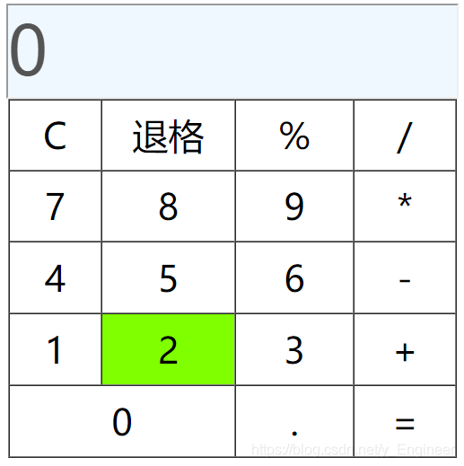

# 

# JavaScript（一）

## 一、简介

JavaScript 是一种轻量级的编程语言,是可插入 HTML 页面的编程代码,插入 HTML 页面后，可由所有的现代浏览器执行。这门语言可用于 HTML 和 web，更可广泛用于服务器、PC、笔记本电脑、平板电脑和智能手机等设备。

## 二、数据类型

```javascript
数字型:Number
未定义:Undefined
布尔型:Boolean
字符串:String
引用类型：Object
空类型：Null

js是一门弱类型语言：定义变量时，不需要规定其数据类型。
定义变量关键字： var
var a=100;
var s="hello";
var obj=new Object();
typeof运算符：获取变量的数据类型
var ty=typeof obj; //获取数据类型
ES6可以定义常量: const a=100; //常量
```

## 三、运算符

### 1、数学运算符

```javascript
算术运算符：+ - * / % ++ -- 
赋值运算符：=  += -= *= /= %=
自动类型转换：当这个运算符运算的值和他期望的值不一样，就会发生自动类型转换
字符串转数字：
例1：
var a="2";//能转数字就转数字
var b=3;
var c=a*b;
//c=6;
例2：
var a="a2";//转不了数字，就转成NaN
var b=3;
var c=a*b;
//c=NaN;  任何数字跟NaN运算结果都是NaN
布尔类型转数字：true转1  false转0
```

### 2、比较运算符

```javascript
!= == === >= <= > < instanceof
=== 全等号：如果类型不一致，直接false，类型一致再去比值
比较字符串内容是否相同： ==或===
字符串转布尔类型：空串转false  非空串转true
数字类型转布尔类型：0转false  非0转true
对象转布尔类型：null转false  非null转true
undefined转为布尔类型：转为false
NaN转布尔类型：转为false
```

## 四、函数

```javascript
定义函数：
方式一：
function 函数名(){
    //函数逻辑
}
调用： 函数名();

方式二：
var 函数名=function(){
    //逻辑函数
}

函数的参数和返回值：
//函数的参数不需要写数据类型
//js调用函数时，可以不传参，也可少传多传
例： function test(a,b){
    //函数内部的属性：
    //arguments是一个数组，可以把所有传递过来的参数，存放到这个数组中
    num=10;//局部变量前面的var不写,就会变成全局变量
    return a+b;
}
test(10,20,30,40,50,60);//可以多传

函数名.length;//获取函数形参个数
var test=(function(){})();//函数自调用
```

## 五、js内置对象

### 1、String字符串对象

```javascript
创建String字符串对象：
var str=new String();
常用方法：
charAt() //返回在指定位置的字符。 
例：	var v="abcd";
	var a=v.charAt(2);   
concat() //连接字符串。 
例： var v="ab";  
	var a="cd";
	var z=v.concat(a);
indexOf() //根据字符检索此符在字符串中的索引。 
例： var v="abcde";
	 var z=v.indexOf("c");			
lastIndexOf() //从后向前搜索字符串。 
substring() //提取字符串中两个指定的索引号之间的字符。 
例： var v="abcde";
	var z=v.substring(0,3); //含头不含尾
toLowerCase() //把字符串转换为小写。
toUpperCase() //把字符串转换为大写。 
replace() //替换字符串。
例： var v="abceaaaa";
	var z=v.replace("a","h");
split() //把字符串分割为字符串数组。
 例子：  var v="a#b#c#d";
		var arr=v.split("#");
trim()//去除字符串两端的空格
```

### 2、Number对象

```javascript
创建Number对象：
var num=new Number(10);
var num1=Number(10);
常用方法：
toString() //把数字转为字符串
toFixed() //把数字转为字符串，结果保留指定位数
toPrecision() //把数字格式化为指定长度
```

### 3、Date对象

```javascript
var date=new Date();
grtXxx();//获取时间
toLocaleString();//格式化日期
```

### 4、Array数组对象

```javascript
//JS数组长度是可变的
//JS数组元素可以是任意类型
new Array();
new Array(1,"a",'a',true,new Object());
var arr=[1,2,3,4];
concat();//归并数组
join("-");//把数组元素用指定拼接符变成字符串
pop();//删除并返回数组最后一个元素
push();//往数组最后添加元素，返回新数组长度
reverse();//反转数组元素
shift();//删除并返回数组第一个元素
slice(0,2);//从0索引处开始，截取2个元素
sort();//不传参，默认按照字典顺序排，不按大小排
//若要按照大小排，那就传入一个比较器
arr.sort((a,b)=>a-b);//ES6的语法
splice(1,1);//从1索引开始删除1个元素
splice(1,1,111);//从1索引开始删除1个元素,然后再从1索引处开始添加若干元素
unshift();//向数组开头添加若干元素，返回数组新长度
filter();//检测数值元素，并返回符合条件的所有元素的数组
forEach();//每个元素都执行一次回调函数
isArray();//判断该对象是否为数组
indexOf();//获取指定元素索引
reduce();//将数组元素计算为一个值（从左到右）
map();//通过指定元素处理数组每个元素，并返回新数组
```

### 5、全局方法对象

```javascript
isNaN(v);//判断一个数据是不是NaN
parseInt(str);//把字符串转为数字
parseFloat();//把字符串转为小数
decodeURI();//解码
encodeURI();//编码
```

### 6、正则表达式对象

```javascript
var reg=new RegExp('^$',i);
var reg=/^$/i;
i://不区分大小写
g://全文匹配
reg.test(str);//判断字符串是否符合正则
exec();//截取符合正则的字符串
```

## 六、BOM

```java
window.document;//获取html对象
window.location;//获取地址栏对象
window.history;//获取历史记录对象
window.screen;//获取屏幕对象
window.navigator;//获取整个浏览器对象

window对象中的方法：
弹框：
window.alert("警告框");
window.confirm("你确定吗？");//点确定返回true，取消返回false
window.prompt("请输入内容：");//返回输入内容
打开窗口：//返回值为新页面的window对象
var win=
    window.open("http://www.baidu.com");
关闭页面：
window.close();

定时器：
window.setTimeout(函数,时长)//指定时长后执行函数
window.setInterval(函数,时间间隔)//每过指定时间间隔执行一次函数
clearTimeout();//取消定时器

window.location.href="http//www.163.com";//设置地址栏的内容，可以跳转新的页面
reload();//刷新

历史记录对象：
window.history.go(1)// 1下一个 -1上一个
```

## 七、DOM(文档对象模型)

```java
Element //标签对象
Text //文本对象
Attribute //属性对象
Comment //注释对象
Document //整个文档对象
Node //节点对象   

获取标签对象：
var doc=window.document;//获取整个html文档对象
var mydiv=doc.getElementByID("div1");//通过id属性值获取唯一的元素
mydiv.innerText="abc";//设置div文本，将旧文本覆盖
mydiv.innerText+="abc";//设置div文本，追加在旧文本后
mydiv.innerText;//获取div文本
mydiv.innerHTML;//获取标签之间的HTML内容

getElementsByClassName()//通过class属性值获取元素对象数组
getElementsByTagName("div");//通过标签名获取对象数组
getElementsByName("username");//通过表单name值获取表单对象数组

给标签设置css属性:
bd.style.属性名;
如果css属性名称带有横杠，则需将横杠去掉，并把横杠后的第一个字母大写

创建方法：
document.createAttribute()	//创建一个属性节点
document.createElement()	//创建元素节点
document.createTextNode()	//创建文本节点
document.createComment()    //创建注释节点
```

## 八、事件

```java
焦点事件：
	onfocus //元素获得焦点。 
	onblur  //元素失去焦点	
点击事件：
	onclick //当用户点击某个对象时调用的事件句柄。 
	ondblclick //当用户双击某个对象时调用的事件句柄。 	
键盘事件：
	onkeydown //某个键盘按键被按下。
	onkeyup //某个键盘按键被松开。 
	onkeypress //某个键盘按键被按下并松开。 
鼠标事件：
	onmousedown //鼠标按钮被按下。 
	onmouseup //鼠标按键被松开。 
	onmouseover //鼠标移到某元素之上。 
	onmouseout //鼠标从某元素移开。 
	onmousemove //鼠标被移动。 
表单事件：
	onsubmit //确认按钮被点击。 
	onreset //重置按钮被点击。 
加载与卸载事件
	onload //一张页面或一幅图像完成加载。 
针对表单:
 	onchange //域的内容被改变。 比如下拉框
 	onselect //文本被选中。
```

# JavaScript（二）

## 一、JSON

### 1、简介

JSON 英文全称 JavaScript Object Notation，是一种轻量级的数据交换格式。JSON 独立于语言：JSON 使用 Javascript语法来描述数据对象，但是 JSON 仍然独立于语言和平台。JSON 解析器和 JSON库支持许多不同的编程语言。 目前非常多的动态（PHP，JSP，.NET）编程语言都支持JSON。

### 2、JSON语法规则

```javascript
	数据为 键/值 对;
	数据由逗号分隔;
	大括号保存对象;
	方括号保存数组。
示例：
{
    "name": "JavaScript Object Notation",
    "sites": [
    { "name":"google" , "url":"www.google.com" }, 
    { "name":"百度" , "url":"www.baidu.com" }
    ]
}
注意：JSON字符串大括号外面必须是单引号，里面必须是双引号，必须是紧凑格式，不能美化格式（空格、换行等）！
例：
	'{"name":"JavaScript Object Notation","sites":[{"name":"google","url":"www.google.com"},{"name":"百度" , "url":"www.baidu.com"}]}'
```

### 3、JSON对象与JSON字符串的相互转换

```javascript
JSON.parse();//解析json字符串
JSON.stringify();//将json对象转为json字符串
例：
	var json = {
				"name": "JavaScript Object Notation",
				"sites": [{
						"name": "google",
						"url": "www.google.com"
					},
					{
						"name": "百度",
						"url": "www.baidu.com"
					}
				]
			};
	var jsonStr = JSON.stringify(json);//将json对象转为json字符串
	var json1=JSON.parse(jsonStr);//解析json字符串,转化为json对象
	//注意:json字符串如果不是紧凑格式,会解析失败

```

## 二、jQuery

### 1、引入jQuery库文件

```javascript
方式一：
<script src="https://code.jquery.com/jquery-1.10.2.min.js"></script>
方式二：
<script src="js/jquery.min.js" type="text/javascript" charset="utf-8"></script>
```

### 2、jQuery入门程序

```javascript
$(function () {
		$('button').click(function () {
			alert("Hello JQuery");
		});
	});
```

### 3、加载模式

```javascript
JavaScript等待加载：
window.onload=function(){}
jQuery等待加载：
$().ready(function(){});
简写： $(function(){});
```

### 4、基础DOM操作

```javascript
html();	//获取元素中html内容
html(value);	//设置元素中html内容
text();	//获取元素中文本内容
text(value);	//设置元素中文本内容
val();	//获取表单中文本内容
val();	//设置表单中文本内容
注意：当我们使用 html()或 text()设置元素里的内容时，会清空原来的数据。而我们期望能够追加数据的话，需要先获取原本的数据。
例： $('#box').html($('#box').html() + '<em>www.li.cc</em>'); //追加数据
attr(key);  //获取某个元素key属性的值
attr(key, value);	//设置某个元素 key 属性的属性值
attr({key1:value2, key2:value2...});	//设置某个元素多个 key 属性的属性值
attr(key, function (index, value) {});	//设置某个元素 key，通过函数来设置
```

### 5、css操作

```javascript
css(name);	//获取某个元素行内的 CSS 样式
css([name1, name2, name3]);	//获取某个元素行内多个 CSS 样式,返回JSON对象
css(name, value);	//设置某个元素行内的 CSS 样式
css({name1 : value1, name2 : value2});	//设置某个元素行内多个 CSS 样式
addClass(class);	//给某个元素添加一个 CSS 类
addClass(‘class1 class2 class3...’);	//给某个元素添加多个 CSS 类
removeClass(class);	//删除某个元素的一个 CSS 类
removeClass(‘class1 class2 class3...’);	//删除某个元素的多个 CSS 类
toggleClass(class1 class2 class3...);	//切换默认样式和指定样式
toggleClass(function(){});	//通过匿名函数设置切换的规则

width();	//获取某个元素的宽度
width(value);	//设置某个元素的宽度
width(function (index, width) {});	//通过匿名函数设置某个元素的宽度
height();	//获取某个元素的高度
height(value);	//设置某个元素的高度
height(function (index, width) {});	//通过匿名函数设置某个元素的长度
```

### 6、插入节点方法

```javascript
内部插入节点的方法:
append(content);//向指定元素内部后面插入节点 content
append(function (index, html) {});//使用匿名函数向指定元素内部后面插入节点
appendTo(content);//将指定元素移入到指定元素 content 内部后面
prepend(content);//向指定元素 content 内部的前面插入节点
prepend(function (index, html) {});//使用匿名函数向指定元素内部的前面插入节点
prependTo(content);//将指定元素移入到指定元素 content 内部前面

外部插入节点方法:
after(content);//向指定元素的外部后面插入节点 content
after(function (index, html) {});//使用匿名函数向指定元素的外部后面插入节点
before(content);//向指定元素的外部前面插入节点 content
before(function (index, html) {});//使用匿名函数向指定元素的外部前面插入节点
insertAfter(content);//将指定节点移到指定元素 content 外部的后面
insertBefore(content);//将指定节点移到指定元素 content 外部的前面

包裹节点：
wrap(html);//向指定元素包裹一层 html 代码
wrapAll(html);//用 html 将所有元素包裹到一起
wrapInner(html);//向指定元素的子内容包裹一层 html
wrap(element);//向指定元素包裹一层 DOM 对象节点
wrapAll(element);//用 DOM 对象将所有元素包裹在一起
wrapInner(element);//向指定元素的子内容包裹一层 DOM 对象节点
unwrap();//移除一层指定元素包裹的内容
```

### 7、事件

```javascript
bind();	//绑定事件
on();//绑定事件，用法与bind()一样
例：
//方式1：
$('input').bind('click', function () { 
    alert('点击！');
});
//方式2：普通处理函数
$('input').bind('click', fn);
function fn() {
    alert('点击！')；
}
//方式3：通过对象键值对绑定多个参数
$('input').bind({
    'mouseout' : function () { 
        alert('移出');
    },
    'mouseover' : function () {
        alert('移入');
    }
});
//方式4：简写
$('button').click(function (e) {
			alert('点击！');
        }).mouseover(function () {
			alert('移入');
        }).mouseout(function () {
			alert('移出');
	});

unbind();//删除所有当前元素的事件
off();//功能和unbind一样
unbind(type);//删除指定类型事件
one();//事件只执行一次
preventDefault();//取消某个元素的默认行为
stopPropagation();//取消事件冒泡

trigger和triggerHandler	//自动触发事件
区别：triggerHandler()方法并不会触发事件的默认行为，而trigger()会；
	triggerHandler()方法只会影响第一个匹配到的元素，而trigger()会影响所有。

<form action="123.html" method="get">
       <input type="submit" value="提交" />
</form>
$('form').trigger('submit'); //模拟用户执行提交，并跳转到执行页面
$('form').triggerHandler('submit'); //模拟用户执行提交，并阻止的默认行为
```

## 网页版简易计算器

**代码**

```html
<!DOCTYPE html>
<html>
	<head>
		<meta charset="utf-8" />
		<title></title>
		<style type="text/css">
			input {
				width: 500px;
				height: 100px;
				font-size: 80px;
				background-color: aliceblue;
			}

			td {
				font-size: 40px;
				text-align: center;
			}

			td:hover {
				background-color: chartreuse;
				cursor: pointer;
			}
		</style>
	</head>
	<body>
		<center>
			<input type="text" id="show" value="0" disabled="disabled" />
		</center>

		<table border="1" cellspacing="0" cellpadding="" width="500px" height="400px" align="center">
			<tr>
				<td id="guiling">C</td>
				<td width="30%" id="tuige">退格</td>
				<td class="ysf">%</td>
				<td class="ysf">/</td>
			</tr>
			<tr>
				<td class="nums">7</td>
				<td class="nums">8</td>
				<td class="nums">9</td>
				<td class="ysf">*</td>
			</tr>
			<tr>
				<td class="nums">4</td>
				<td class="nums">5</td>
				<td class="nums">6</td>
				<td class="ysf">-</td>
			</tr>
			<tr>
				<td class="nums">1</td>
				<td class="nums">2</td>
				<td class="nums">3</td>
				<td class="ysf">+</td>
			</tr>
			<tr>
				<td colspan="2" class="nums">0</td>
				<td class="nums">.</td>
				<td id="denghao">=</td>

			</tr>
		</table>
	</body>
	<script type="text/javascript">
		var numValue1 = '';
		var numValue2 = '';
		var ysfValue = '';
		var flag = false;

		var show = document.getElementById("show");
		var tuige = document.getElementById("tuige");
		var guiling = document.getElementById("guiling");
		var denghao = document.getElementById("denghao");
		var nums = document.getElementsByClassName("nums");
		var ysfs = document.getElementsByClassName("ysf")
		for (var i = 0; i < nums.length; i++) {
			nums[i].onclick = function() {
				if (flag) {
					numValue1 = '';
					numValue2 = '';
					ysfValue = '';
					flag = false;
				}
				var num = this.innerText;
				if ((num == '.') && (numValue1.indexOf('.') == -1)) {
					numValue1 += num;
					show.value = numValue1;
				} else if ((num == '0') && (numValue1.indexOf('.') != -1)) {
					numValue1 = show.value;
					numValue1 += num;
					show.value = numValue1;
				} else if (num != '.') {
					numValue1 += num;
					show.value = numValue1 * 1;
				}
			}
		}
		for (var i = 0; i < ysfs.length; i++) {
			ysfs[i].onclick = function() {
				if(show.value.substring(1).indexOf("+")!=-1||show.value.substring(1).indexOf("-")!=-1||show.value.substring(1).indexOf("*")!=-1||show.value.substring(1).indexOf("/")!=-1||show.value.substring(1).indexOf("%")!=-1&&this.innerText=='%'){
					return;
				}
				if (flag) {
					if(this.innerText=='%'){
						numValue1=numValue2;
						numValue2='';
					}
					flag = false;
				}
				if(numValue1==''){
					numValue1='0';
				}
				if (numValue2 == '') {
					if(this.innerText=='%'){
						numValue1 = numValue1/100;
					}
					numValue2 = numValue1;
					numValue1 = '';
					ysfValue = this.innerText;
					show.value += ysfValue;
				}else{
					if(this.innerText=='%'){
						numValue1 = numValue1/100;
					}else{
						yunsuan();
						numValue1 = '';
						ysfValue = this.innerText;
					}
					show.value += this.innerText;
				}
			}
		}
		denghao.onclick = function() {
			if(numValue1!=''&&numValue2!=''||ysfValue=='%'){
				yunsuan();
				flag = true;
			}
		}

		function yunsuan() {
			var num1 = Number(numValue2);
			var num2 = Number(numValue1);
			var r = '';
			numValue1 = '0';
			switch (ysfValue) {
				case '+':
					r = num1 + num2;
					break;
				case '-':
					r = num1 - num2;
					break;
				case '*':
					r = num1 * num2;
					numValue1 = '1';
					break;
				case '/':
					if (num2 != 0) {
						r = num1 / num2;
					} else {
						numValue1 = '';
						numValue2 = '';
						ysfValue = '';
						alert("除数不能为0！");
						r = '0';
					}
					numValue1 = '1';
					break;
				case '%':
					r = num1;
					break;
			}
			numValue2 = Number(r).toFixed(9) * 1;
			show.value = numValue2;
		}
		guiling.onclick = function() {
			numValue1 = '';
			numValue2 = '';
			ysfValue = '';
			show.value = '0';
		}
		tuige.onclick = function() {
			if(!flag){
				if(show.value.substring(1).indexOf("+")!=-1||show.value.substring(1).indexOf("-")!=-1||show.value.substring(1).indexOf("*")!=-1||show.value.substring(1).indexOf("/")!=-1||show.value.substring(1).indexOf("%")!=-1){
					numValue1 = numValue2;
					numValue2 = '';
					ysfValue='';
					show.value=numValue1;
				}else{
					if (numValue1.length > 1) {
						numValue1 = numValue1.substring(0, numValue1.length - 1);
						show.value = numValue1;
					} else {
						numValue1 = '0';
						show.value = numValue1;
					}
				}
			}
		}
	</script>
</html>
```

**效果图**



> 参考引用链接：https://blog.csdn.net/y_engineer/article/list/1