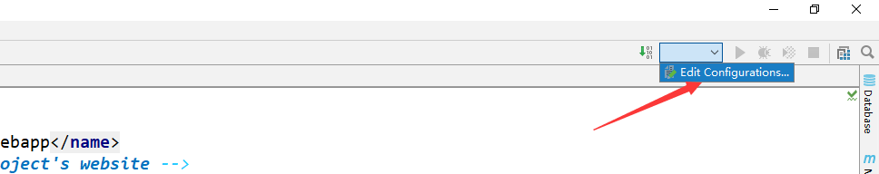
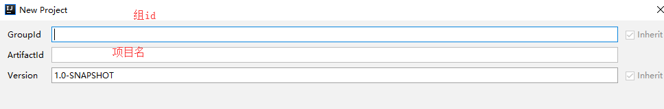
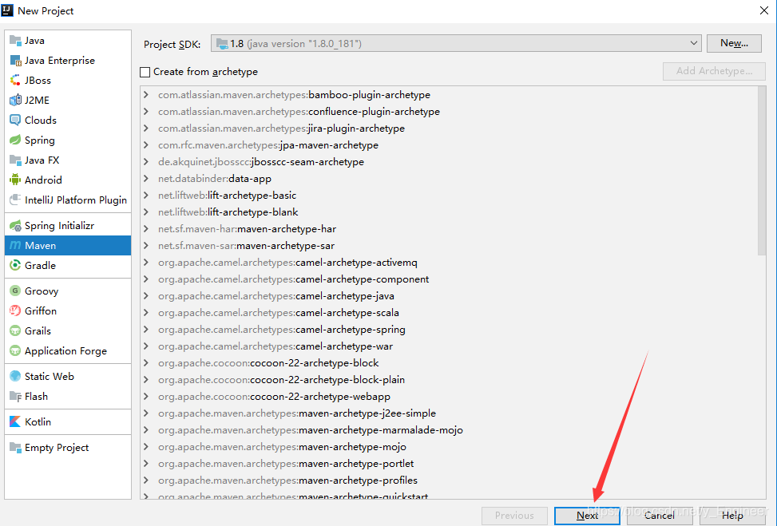
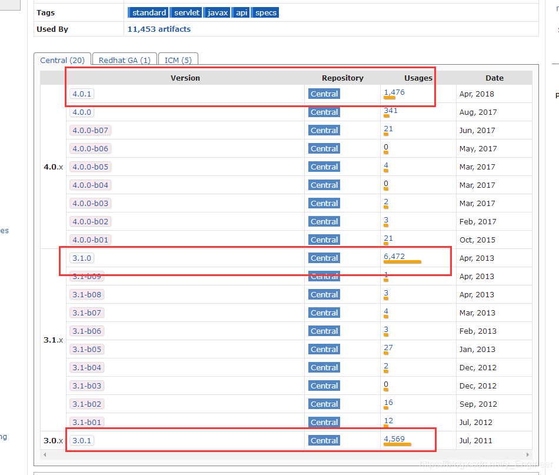

# 

# Tomcat服务器

## 1、简介

> Tomcat是Apache 软件基金会（Apache Software Foundation）的Jakarta 项目中的一个核心项目，最新的Servlet 和JSP 规范总是能在Tomcat 中得到体现，因为Tomcat 技术先进、性能稳定，而且免费，因而深受Java 爱好者的喜爱并得到了部分软件开发商的认可，成为目前比较流行的Web 应用服务器。
>
>  Tomcat 服务器是一个免费的开放源代码的Web 应用服务器，属于轻量级应用服务器，在中小型系统和并发访问用户不是很多的场合下被普遍使用，是开发和调试JSP 程序的首选。对于一个Java初学web的人来说，它是最佳的选择。
> Tomcat 实际上运行JSP 页面和Servlet。Tomcat最新版本为9.0。

## 2、安装Tomcat

**Tomcat官网**：http://tomcat.apache.org/


## 3、Tomcat启动和配置

### 3.1、文件夹作用：


### 3.2、启动、关闭Tomcat


### 3.3、Tomcat配置


**可以配置启动的端口号**

默认端口号：**8080**

```xml
<Connector port="8088" protocol="HTTP/1.1"
           connectionTimeout="20000"
           redirectPort="8443" />
```

**可以配置主机名**

默认的主机名为：**127.0.0.1 --> localhost**

```xml
<Host name="mylocalhost"  appBase="webapps"
        unpackWARs="true" autoDeploy="true">
```

### 3.4、请你谈谈网站是如何进行访问的?

1. 输入一个域名；回车

2. 检查本机的 C:\Windows\System32\drivers\etc\hosts 配置文件下有没有这个域名映射；

   ​	 a.有：直接返回对应的ip地址，这个地址中，有我们需要访问的web程序，可以直接访问

```java
127.0.0.1       www.myweb.com
```

​			b.没有：去DNS服务器找，找到的话就返回，找不到就返回找不到；


## 4、Tomcat乱码问题解决


- **解决方案**

> 如果没有设置环境变量“%LOGGING_CONFIG%”值，则到Tomcat根目录下“conf”子目录下的“ logging.properties ”文件中查看日志记录的配置，找到该文件，可发现很多的“encoding = UTF-8”配置项，因此判断是该配置项影响了Tomcat控制台的中文乱码输出，将所的“encoding = UTF-8”都修改为“encoding = GBK”，使其支持中文，然后保存重启Tomcat服务器即可解决。

 **修改前：**


 **修改后：**


**完美解决Tomcat乱码问题**


## 5、发布一个web项目

将自己写的web项目放到服务器(Tomcat)中指定的web应用的文件夹（webapps）下，就可以访问了。

```jsp
<!DOCTYPE html>
<html lang="en">
<head>
    <meta charset="UTF-8">
    <title>Title</title>
</head>
<body>
<h1>hello world</h1>
</body>
</html>
```


## 6、在 IDEA中配置Tomcat




**解决警告问题**
**为什么会有这个问题：我们访问一个网站，需要指定一个文件夹名字；**


# Maven

## 1、Maven简介

> Maven项目对象模型(POM)，可以通过一小段描述信息来管理项目的构建，报告和文档的项目管理工具软件。
>
> Maven 除了以程序构建能力为特色之外，还提供高级项目管理工具。由于 Maven 的缺省构建规则有较高的可重用性，所以常常用两三行 Maven 构建脚本就可以构建简单的项目。由于 Maven 的面向项目的方法，许多 Apache Jakarta 项目发文时使用 Maven，而且公司项目采用 Maven 的比例在持续增长。

- 核心思想：**约定大于配置**

## 2、下载安装Maven

**官网**：https://maven.apache.org/


下载完成后，解压即可。

## 3、配置环境变量

**配置如下配置**

- M2_HOME maven目录下的bin目录
- MAVEN_HOME maven的目录
- 在系统的path中配置 %MAVEN_HOME%\bin
  **测试是否安装成功**


## 4、阿里云镜像


- 镜像：mirrors
- 作用：加速下载
- 国内建议使用**阿里云的镜像**

```xml
<mirror>
    <id>nexus-aliyun</id>  
    <mirrorOf>*,!jeecg,!jeecg-snapshots</mirrorOf>  
    <name>Nexus aliyun</name>  
    <url>http://maven.aliyun.com/nexus/content/groups/public</url> 
</mirror>
```

## 5、本地仓库

**建立一个本地仓库**：localRepository

- 在**maven目录下**创建**maven-repo**文件夹

```xml
<localRepository>D:\Environment\apache-maven-3.6.2\maven-repo</localRepository>
```

## 6、在IEDA中使用Maven

1、创建一个MavenWeb项目





2、等待项目加载完成


3、IDEA中的Maven设置


4、在src/main下创建java和resources文件夹

- 标记文件夹功能


**或者**


## 7、创建一个普通的Maven项目




## 8、pom文件

**pom.xml 是Maven的核心配置文件**

**maven**由于他的**约定大于配置**，我们之后可能遇到我们写的配置文件，**无法被导出或者生效**的问题，**解决方案**：

```xml
<!--在build中配置resources，来防止我们资源导出失败的问题-->
<build>
    <resources>
        <resource>
            <directory>src/main/resources</directory>
            <includes>
                <include>**/*.properties</include>
                <include>**/*.xml</include>
            </includes>
            <filtering>true</filtering>
        </resource>
        <resource>
            <directory>src/main/java</directory>
            <includes>
                <include>**/*.properties</include>
                <include>**/*.xml</include>
            </includes>
            <filtering>true</filtering>
        </resource>
    </resources>
</build>

```

## 9、Maven仓库的使用

地址：https://mvnrepository.com/





# 注解

## 1、概述

- 定义：注解（Annotation），也叫元数据。一种代码级别的说明。它是JDK1.5及以后版本引入的一个特性，与类、接口、枚举是在同一个层次。它可以声明在包、类、字段、方法、局部变量、方法参数等的前面，用来对这些元素进行说明、注释

- 作用分类：

  ①编写文档：通过代码里标识的元数据生成文档【生成文档doc文档】

  ② 代码分析：通过代码里标识的元数据对代码进行分析【使用反射】

  ③编译检查：通过代码里标识的元数据让编译器能够实现基本的编译检查【Override】

- 注解的格式：

  @注释名(参数名=参数值,...)

  还可以添加一些参数：@注释名(参数名=参数值,...)
  

## 2、内置注解

- @Override：定义在 java.long.Override 中，此注解只适用于修饰方法，表示一个方法重写超类中的另一个方法。


- @Deprecated：定义在 java.long.Deprecated 中，此注释可以修饰方法、属性、类，表示不鼓励程序员使用这样的元素，通常是因为它很危险或存在更好的选择。

- @SuppressWarnings：定义在 java.long.SuppressWarnings 中，用来取消显示指定的编译器警告。

  此注解必须加参数才能使用，示例：

  抑制单类型的警告：

  @SuppressWarnings(“unchecked”)

  抑制多类型的警告：

  @SuppressWarnings(value={“unchecked”, “rawtypes”})

  抑制所有类型的警告：

  @SuppressWarnings(“all”)

  抑制警告的参数


**演示**

未抑制警告前


抑制警告后


## 3、元注解

```java
负责注解其他注解，Java定义了4个标准的meta-annotation类型，它们被用来对其他annotation类型作说明。
这些注解所支持的类可在 java.long.annotation 包中找到。
	@Target：用于描述注解的适用范围；
	@Retention：用于描述注解的生命周期，表示需要在什么级别保存该注解；(SOURCE < CLASS < RUNTIME)
	**@Documented：**指示该注解将通过 javadoc 和类似的默认工具进行文档化；
	@Inherited：指示该注解被自动继承。
```

## 4、自定义注解

```java
import java.lang.annotation.*;

@MyAnnotation(name = "Test02",id=1)
public class Test02 {
    public static void main(String[] args) {
        test();
    }

    //注解参数有默认值可以不显式赋值，没有默认值必须要显式赋值
    @MyAnnotation(name="test")
    private static void test(){
        System.out.println("MyAnnotation");
    }
}

//描述注解的适用范围
@Target(value={ElementType.METHOD,ElementType.TYPE})

//描述注解的生命周期 SOURCE < CLASS < RUNTIME
@Retention(value=RetentionPolicy.RUNTIME)

@Documented //可以将此注解生成在javadoc文档中
@Inherited  //此注解可被子类继承

//自定义注解格式：@interface 注解名{}
@interface MyAnnotation{
    //定义注解的参数 格式：参数类型 参数名();
    String name();
    int id()default -1;//默认值为 -1
}

```

如果注解只有一个参数，则参数名一般定义为 value ，在使用该注解时，参数名可以省略不写，直接写值。

- 例：

```
@SuppressWarnings(value="all")`等价于`@SuppressWarnings("all")
```

# Http

## 1、简介

```shell
Hyper Text Transfer Protocol（超文本传输协议），是一个简单的请求-响应协议，它通常运行在TCP之上。
	超文本：图片、音乐、视频、定位、地图…
	端口号：80
HTTPS：安全的
	端口号：443
```

## 2 、Http请求(Request)

```shell
所谓请求：就是浏览器往服务器发送数据
	请求行：请求信息的第一行
	请求头：从请求信息的第二行开始到请求空行结束
	请求体：从请求空行往下

请求行：
	GET /HTTPTest/login?username=zhangsan&password=123456 HTTP/1.1
	格式: 请求方式 /请求的资源?请求参数 协议/版本
	请求方式：Get，Post，HEAD,DELETE,PUT,TRACT…
		get：请求能够携带的数据大小有限制，会在浏览器的URL地址栏显示数据内容，不安全，但高效；
		post：请求能够携带的数据大小没有限制，会将请求参数放到请求体里面，不会在浏览器的URL地址栏显示数据内容，安全，但不高效。
请求头：格式 key:value,value
```

```properties
常见请求头：
Accept: text/html,image/*	--告诉服务器当前客户端可以接收的文档的类型。大类型/小类型 比如：text/css；*/* :表示什么都可以接收
Accept-Charset: ISO-8859-1	--告诉服务器，客户端提交的表单可能使用的编码类型
Accept-Encoding: gzip		--声明浏览器支持的编码类型
Accept-Language:zh-cn 		--语言环境
Host: localhost:8080		--访问主机
Referer: http://www.baidu.com/index.jsp	 --来自哪个页面，防盗链
Date: Tue, 11 Jul 2000 18:23:51 GMT	--时间
```

## 3、Http响应(Response)

- 所谓响应：就是服务器往浏览器回写数据
  - 响应行：响应信息第一行
  - 响应头：响应信息第二行到响应空行
  - 响应体：响应空行以下

- 响应行:

  - HTTP/1.1 200 OK

  - 格式：协议/版本 响应状态码 响应的描述

#### 响应状态码

- 1xx：消息
- 2xx：请求响应成功
  - 200：OK
- 3xx：请求重定向
  - 重定向：你重新到我给你新地址去
- 4xx：请求错误
  - 404：资源不存在
- 5xx：服务器错误
  - 500：服务端源代码错误
  - 502：网关错误

```properties
常见响应头：

Location: http://www.baidu.org/index.jsp --跳转方向 302重定向
Server:apache tomcat			--服务器型号
Content-Encoding: gzip 			--数据压缩
Content-Length: 80 			--数据长度
Content-Language: zh-cn 		--语言环境
Content-Type: text/html; charset=GB2312 --告诉浏览器，服务器返回的文本采用什么编码
Refresh: 	--定时刷新
Connection: Keep-Alive   	--保持连接 长链接
```

# Servlet

## 1、Servlet简介

-  Servlet (Service Applet) 是在服务器上运行的小程序。
- 广义的Servlet是指任何实现了这个Servlet接口的类，Servlet运行于支持Java的应用服务器中。从原理上讲，Servlet可以响应任何类型的请求，但绝大多数情况下Servlet只用来扩展基于HTTP协议的Web服务器。

## 2、HelloServlet

 Java提供了两个默认的Servlet接口实现类：

- ​	HttpServlet

- ​	GenericServlet

**1. 构建一个普通的Maven项目，删掉里面的src目录，以后我们的学习就在这个项目里面建立Moudel，这个空的工程就是Maven主工程**

Maven父子工程

父项目中会有

```xml
<modules>
    <module>servlet-01</module>
</modules>
```

子项目会有

```xml
<parent>
    <artifactId>javaweb</artifactId>
    <groupId>com.study</groupId>
    <version>1.0-SNAPSHOT</version>
</parent>
```

**2. Maven环境优化**

1. 修改web.xml为最新的

   ```xml
   <?xml version="1.0" encoding="UTF-8"?>
   <web-app xmlns="http://xmlns.jcp.org/xml/ns/javaee"
            xmlns:xsi="http://www.w3.org/2001/XMLSchema-instance"
            xsi:schemaLocation="http://xmlns.jcp.org/xml/ns/javaee
                         http://xmlns.jcp.org/xml/ns/javaee/web-app_4_0.xsd"
            version="4.0"
            metadata-complete="true">
   </web-app>
   ```

2. 将maven的结构搭建完整

   创建 **java**和 **resources** 文件夹

**3. 编写一个Servlet程序**


定义一个类，实现Servlet接口，这里我们直接继承HttpServlet

```java
public class HelloServlet extends HttpServlet {
//由于get和post只是请求的不同的方式，所以doGet和doPost业务逻辑都一样，可以相互调用
    @Override
    protected void doGet(HttpServletRequest req, HttpServletResponse resp) throws ServletException, IOException {
        PrintWriter writer = resp.getWriter(); //响应流
        writer.print("Hello Servlet");
    }

    @Override
    protected void doPost(HttpServletRequest req, HttpServletResponse resp) throws ServletException, IOException {
        doGet(req, resp);
    }
}
```

**4. 编写Servlet的映射**

```xml
<!--注册Servlet-->
<servlet>
    <servlet-name>hello</servlet-name>
    <servlet-class>com.study.servlet.HelloServlet</servlet-class>
</servlet>
<!--Servlet的请求路径-->
<servlet-mapping>
    <servlet-name>hello</servlet-name>
    <url-pattern>/hello</url-pattern>
</servlet-mapping>
```

**5. 配置Tomcat服务器**

**6. 启动发布**

## 3、Servlet原理


## 4、Mapping配置

- 一个Servlet可以指定一个映射路径

```xml
	<servlet-mapping>
        <servlet-name>hello</servlet-name>
        <url-pattern>/hello</url-pattern>
    </servlet-mapping>
```

- 一个Servlet可以指定多个映射路径

```xml
	<servlet-mapping>
        <servlet-name>hello</servlet-name>
        <url-pattern>/hello1</url-pattern>
    </servlet-mapping>
    <servlet-mapping>
        <servlet-name>hello</servlet-name>
        <url-pattern>/hello2</url-pattern>
    </servlet-mapping>
    <servlet-mapping>
        <servlet-name>hello</servlet-name>
        <url-pattern>/hello3</url-pattern>
    </servlet-mapping>
```

- 一个Servlet可以指定通配的映射路径

```xml
    <servlet-mapping>
        <servlet-name>hello</servlet-name>
        <!-- * 通配任意字符串-->
        <url-pattern>/hello/*</url-pattern>
    </servlet-mapping>
```

- 默认请求路径

```xml
    <servlet-mapping>
        <servlet-name>hello</servlet-name>
        <url-pattern>/*</url-pattern>
    </servlet-mapping>
```

- 指定后缀或前缀等

```xml
<!--
   注意点，*前面不能加项目映射的路径
-->
<servlet-mapping>
    <servlet-name>hello</servlet-name>
    <url-pattern>*.study</url-pattern>
</servlet-mapping>

```

- 优先级问题：指定了固有的映射路径优先级最高，如果找不到就会走默认的处理请求

## 5、ServletContext

**web容器在启动的时候，它会为每个web程序都创建一个对应的ServletContext对象，它代表了当前的web应用。**

### 5.1、共享数据

- 即在一个Servlet中保存的数据，可以在另外一个servlet中拿到

```java
public class HelloServlet extends HttpServlet {
	@Override
    protected void doGet(HttpServletRequest req, HttpServletResponse resp) throws ServletException, IOException {
        ServletContext context = this.getServletContext();
        String username = "张三"; //数据
        //将一个数据保存在了ServletContext中,字段名：username 值 “张三”
        context.setAttribute("username",username); 
    }
    @Override
    protected void doPost(HttpServletRequest req, HttpServletResponse resp) throws ServletException, IOException {
        doGet(req, resp);
    }
}
```

- 获取保存在ServletContext中的数据

```java
public class GetServlet extends HttpServlet {
    @Override
    protected void doGet(HttpServletRequest req, HttpServletResponse resp) throws ServletException, IOException {
        ServletContext context = this.getServletContext();
        String username = (String) context.getAttribute("username");
        resp.setContentType("text/html");
        resp.setCharacterEncoding("utf-8");
        resp.getWriter().print("名字："+username);
    }

    @Override
    protected void doPost(HttpServletRequest req, HttpServletResponse resp) throws ServletException, IOException {
        doGet(req, resp);
    }
}
```

- web.xml配置

```xml
<servlet>
	<servlet-name>hello</servlet-name>
	<servlet-class>com.study.servlet.HelloServlet</servlet-class>
</servlet>
<servlet-mapping>
	<servlet-name>hello</servlet-name>
	<url-pattern>/hello</url-pattern>
</servlet-mapping>

<servlet>
    <servlet-name>getc</servlet-name>
    <servlet-class>com.study.servlet.GetServlet</servlet-class>
</servlet>
<servlet-mapping>
    <servlet-name>getc</servlet-name>
    <url-pattern>/getc</url-pattern>
</servlet-mapping>
```

测试访问

- 若直接访问 http://localhost:8080/s2/getc ，由于username还未赋值，所以username=null;


- 先访问 http://localhost:8080/s2/hello ，将数据存进ServletContext
- 再访问 http://localhost:8080/s2/getc


### 5.2、获取初始化参数

```xml
    <!--配置一些web应用初始化参数-->
    <context-param>
        <param-name>url</param-name>
        <param-value>jdbc:mysql://localhost:3306/mydb</param-value>
    </context-param>
```

```java
public class TestServlet extends HttpServlet {
    @Override
    protected void doGet(HttpServletRequest req, HttpServletResponse resp) throws ServletException, IOException {
        ServletContext context = this.getServletContext();
        String url = context.getInitParameter("url");
        resp.getWriter().print(url);
    }

    @Override
    protected void doPost(HttpServletRequest req, HttpServletResponse resp) throws ServletException, IOException {
        doGet(req, resp);
    }
}
```

测试访问：


### 5.3、请求转发

```java
public class ForwardServlet extends HttpServlet {
    @Override
    protected void doGet(HttpServletRequest req, HttpServletResponse resp) throws ServletException, IOException {
        ServletContext context = this.getServletContext();
        // "/url" 5.2中的Servlet
        context.getRequestDispatcher("/url").forward(req,resp);
    }

    @Override
    protected void doPost(HttpServletRequest req, HttpServletResponse resp) throws ServletException, IOException {
        doGet(req, resp);
    }
}
```

测试访问


转发过程


### 5.4、读取资源文件

- 在java目录下新建properties文件
- 在resources目录下新建properties文件
- 发现：都被打包到了同一个路径下：**classes/** ，我们俗称这个路径为**classpath**
- maven由于他的**约定大于配置**，可能出现配置文件无法被导出或者生效的问题，解决方案

```xml
<!--在build中配置resources，来防止我们资源导出失败的问题-->
<build>
    <resources>
        <resource>
            <directory>src/main/resources</directory>
            <includes>
                <include>**/*.properties</include>
                <include>**/*.xml</include>
            </includes>
            <filtering>true</filtering>
        </resource>
        <resource>
            <directory>src/main/java</directory>
            <includes>
                <include>**/*.properties</include>
                <include>**/*.xml</include>
            </includes>
            <filtering>true</filtering>
        </resource>
    </resources>
</build>
```

- prop.properties

```properties
username=root
password=123456
```

- PropServlet.java

```java
public class ForwardServlet extends HttpServlet {
    @Override
    protected void doGet(HttpServletRequest req, HttpServletResponse resp) throws ServletException, IOException {
        ServletContext context = this.getServletContext();
        // "/url" 5.2中的Servlet
        context.getRequestDispatcher("/url").forward(req,resp);
    }

    @Override
    protected void doPost(HttpServletRequest req, HttpServletResponse resp) throws ServletException, IOException {
        doGet(req, resp);
    }
}
```

测试访问


## 6、Response

### 6.1、浏览器下载文件

```java
public class FileDownloadServlet extends HttpServlet {
    @Override
    protected void doGet(HttpServletRequest req, HttpServletResponse resp) throws ServletException, IOException {
        //需要下载的文件在服务器的路径
        String filePath="D:\\IdeaProjects\\maven-javaweb-01\\Servlet-03\\src\\main\\resources\\背景.png";
        //文件名
        String fileName=filePath.substring(filePath.lastIndexOf('\\')+1);
        //设置使浏览器能够支持下载(Content-Disposition)我们需要的东西，中文文件名需要设置编码(URLEncoder.encode)，否则有可能乱码
        resp.setHeader("Content-Disposition","attachment;filename="+ URLEncoder.encode(fileName,"UTF-8"));
        //创建读取文件的输入流
        FileInputStream in = new FileInputStream(filePath);
        //获取输出流
        ServletOutputStream out =resp.getOutputStream();
        //创建buffer缓冲区
        byte[] buffer = new byte[1024 * 8];
        int len=0;
        //将FileOutputStream流写入到buffer缓冲区,使用OutputStream将缓冲区中的数据输出到浏览器！
        while ((len=in.read(buffer))!=-1){
            out.write(buffer,0,len);
        }
        in.close();
        out.close();
    }

    @Override
    protected void doPost(HttpServletRequest req, HttpServletResponse resp) throws ServletException, IOException {
        doGet(req, resp);
    }
}
```

- 测试访问


### 6.2、创建一张图片，在其中生成8位随机数，并响应给浏览器

```java
public class ImageServlet extends HttpServlet {
    @Override
    protected void doGet(HttpServletRequest req, HttpServletResponse resp) throws ServletException, IOException {
        //让浏览器3秒自动刷新一次
        resp.setHeader("refresh","3");
        //在内存中创建一个图片
        BufferedImage image = new BufferedImage(200, 40, BufferedImage.TYPE_INT_RGB);
        //获取图片
        Graphics2D g = (Graphics2D) image.getGraphics();
        //设置图片背景颜色
        g.setColor(Color.cyan);
        g.fillRect(0,0,200,40);
        //在图片中写入数据
        g.setColor(Color.RED);
        g.setFont(new Font("华文彩云",Font.BOLD,30));
        g.drawString(getNum(),20,30);
        //把图片写到浏览器
        ImageIO.write(image,"png",resp.getOutputStream());
    }

    private String getNum() {
        Random random = new Random();
        StringBuilder sb = new StringBuilder(random.nextInt(99999999));
        int sbLen=sb.length();
        for (int i = 0; i < 8-sbLen; i++) {
            sb.append(random.nextInt(10));
        }
        return sb.toString();
    }

    @Override
    protected void doPost(HttpServletRequest req, HttpServletResponse resp) throws ServletException, IOException {
        doGet(req, resp);
    }
}
```

- 测试访问


### 6.3、重定向

- RedirectServlet.java

```java
public class RedirectServlet extends HttpServlet {
    @Override
    protected void doGet(HttpServletRequest req, HttpServletResponse resp) throws ServletException, IOException {
        //重定向
        resp.sendRedirect("/s3/success.jsp");
    }

    @Override
    protected void doPost(HttpServletRequest req, HttpServletResponse resp) throws ServletException, IOException {
        doGet(req, resp);
    }
}
```

- success.jsp

```jsp
<%@ page contentType="text/html;charset=UTF-8" language="java" %>
<html>
<head>
    <title>success</title>
</head>
<body>
<h1>redirect success!</h1>
</body>
</html>
```

- 测试访问


- 重定向示意图


- 重定向和转发的区别
  - 重定向是两次请求，转发是一次请求，因此转发的速度要快于重定向；
  - 重定向之后地址栏上的地址会发生变化，变化成第二次请求的地址，转发之后地址栏上的地址不变，还是第一次请求的地址；
  - 转发是服务器行为，重定向是客户端行为；
  - 重定向时的网址可以是任何网址，转发的网址必须是本站点的网址。

# Cookie、Session

## 1、会话

**会话可简单理解为：用户开一个浏览器，点击多个超链接，访问服务器多个web资源，然后关闭浏览器，整个过程称之为一个会话。**

## 2、保存会话的两种技术

### Cookie

- **Cookie是客户端技术**，服务器把每个用户的数据以**cookie的形式**写给用户**各自的浏览器**。当用户使用浏览器再去访问服务器中的web资源时，就会**携带各自的数据(Cookie)**去。这样，web资源处理的就是用户各自的数据了。

### Session

- **Session是服务器端技术**，利用这个技术，**服务器在运行时可以为每一个用户的浏览器创建一个其独享的session对象**，由于**session**为用户浏览器**独享**，所以用户在访问服务器的web资源时，可以**把各自的数据放在各自的session中**，当用户再去访问服务器中的其它web资源时，其它web资源再从**用户各自的session中取出数据**为用户服务。**Session**对象由服务器创建，开发人员可以调用**request**对象的**getSession()方法**得到**session对象**。


## 3、Cookie

### 3.1、Cookie相关API

```java
HttpServletResponse 类的方法:
//添加Cookie对象到当前response对象中，此方法可以被调用多次
void addCookie(Cookie c);
HttpServletRequest 类的方法：
Cookie[] getCookies();//返回Cookie数组，如果请求中没有Cookie，那么该方法返回null。 
Cookie 类的方法： 
public Cookie(String name,String value);//cookie的构造方式 
String getName();//获取cookie的名称 
String getValue();//获取cookie的值 
void setMaxAge(int expiry);//设置cookie有效期
void setPath(String url);//设置有效路径 
void setDomain(String pattern);//设置有效域名
```

- **示例：在网页显示用户上次登录时间**

```java
public class CookieServlet extends HttpServlet {
    @Override
    protected void doGet(HttpServletRequest req, HttpServletResponse resp) throws ServletException, IOException {
        //统一编码，防止出现乱码问题
        req.setCharacterEncoding("utf-8");
        resp.setCharacterEncoding("utf-8");
        resp.setContentType("text/html;charset=utf-8");
        //获取cookie数组
        Cookie[] cookies = req.getCookies();
        if (cookies != null) {
            for (int i = 0; i < cookies.length; i++) {
                if(cookies[i].getName().equals("lastLoginTime")){
                    //将cookie数据写到网页
                    resp.getWriter().write("您上次访问本站时间："+ new SimpleDateFormat("yyyy年MM月dd日 HH:mm:ss E").format(new Date(Long.parseLong(cookies[i].getValue()))));
                    break;
                }
            }
        }else {
            resp.getWriter().write("这是您今天第一次访问本站！");
        }
        //重新创建cookie，将当前时间戳存到cookie中
        Cookie cookie = new Cookie("lastLoginTime", System.currentTimeMillis()+"");
        //获取从当前时间到当日24:00:00的秒数     //复习Calendar抽象类用法
        Calendar calendar = Calendar.getInstance();
        calendar.set(Calendar.HOUR_OF_DAY,0);
        calendar.set(Calendar.MINUTE,0);
        calendar.set(Calendar.SECOND,0);
        calendar.add(Calendar.DAY_OF_MONTH,1);
        long endTime = calendar.getTimeInMillis();
        int effectiveTime = (int) ((endTime - System.currentTimeMillis())/1000);
        System.out.println(effectiveTime);
        //设置cookie有效期为到当日24:00:00
        cookie.setMaxAge(effectiveTime);
        //添加cookie到浏览器
        resp.addCookie(cookie);
    }

    @Override
    protected void doPost(HttpServletRequest req, HttpServletResponse resp) throws ServletException, IOException {
         doGet(req, resp);
    }
}
```

**测试访问**

 	**第一次访问**


​	**第二次访问**


### 3.2、删除Cookie

- 不设置有效期（默认`maxAge = -1`），相当于 `cookie.setMaxAge(-1)`; ，关闭浏览器，自动失效

- 设置有效期为0，即`cookie.setMaxAge(0);`

### 3.3、编码解码

```java
URLEncoder.encode(String s,String enc)  //编码
URLDecoder.decode(String s,String enc)	//解码
/*---------------------示例-----------------------*/
Cookie cookie = new Cookie("hello", URLEncoder.encode("你好", "utf-8"));
URLDecoder.decode(cookie.getValue(),"utf-8");
```

## 4、Session

### 4.1、Session相关API

```java
request.getSession()  //获取session
String getId() //获取sessionId； 
void setMaxInactiveInterval(int interval) //设置session允许的最大不活动时间（秒）
int getMaxInactiveInterval() //获取session可以的最大不活动时间（秒），默认为30分钟。当session在30分钟内没有使用，那么Tomcat会在session池中移除这个session； 
long getCreationTime() //返回session的创建时间，返回值为当前时间的毫秒值； 
long getLastAccessedTime() //返回session的最后活动时间，返回值为当前时间的毫秒值； 
void invalidate() //让session失效，调用这个方法会让session失效，当session失效后，客户端再次请求，服务器会给客户端创建一个新的session，并在响应中给客户端新的sessionId； 
boolean isNew() //查看session是否为新。当客户端第一次请求时，服务器为客户端创建session，但这时服务器还没有响应客户端，也就是还没有把sessionId响应给客户端，这时session的状态为新。
```

- **示例：获取设置session，并将其相关信息写到网页**

```java
public class SessionServlet extends HttpServlet {
    @Override
    protected void doGet(HttpServletRequest req, HttpServletResponse resp) throws ServletException, IOException {
        //统一编码，防止出现乱码问题
        req.setCharacterEncoding("utf-8");
        resp.setCharacterEncoding("utf-8");
        resp.setContentType("text/html;charset=utf-8");
        //获取session
        HttpSession session = req.getSession();
        //设置session允许的最大不活动时间为60秒，即60秒内无操作，session自动注销
        session.setMaxInactiveInterval(60);
        //session创建时间
        Date creationTime = new Date(session.getCreationTime());
        //将session创建时间存入session
        session.setAttribute("creationTime",creationTime);
        if (session.isNew()) {
            resp.getWriter().write("session创建成功，ID="+session.getId());
        }else {
            resp.getWriter().write("session已经在服务器中存在！<br>ID="+session.getId()+"<br>创建时间："+session.getAttribute("creationTime"));
        }
    }

    @Override
    protected void doPost(HttpServletRequest req, HttpServletResponse resp) throws ServletException, IOException {
        doGet(req, resp);
    }
}
```

- **移除session中的属性，手动注销session**

```java
public class SessionDemo03 extends HttpServlet {
    @Override
    protected void doGet(HttpServletRequest req, HttpServletResponse resp) throws ServletException, IOException {
        HttpSession session = req.getSession();
        //移除session中的creationTime属性
        session.removeAttribute("creationTime");
        //手动注销Session
        session.invalidate();
    }

    @Override
    protected void doPost(HttpServletRequest req, HttpServletResponse resp) throws ServletException, IOException {
        doGet(req, resp);
    }
}
```

**测试访问**

 	**第一次访问**


​	**第二次访问**


​	**手动注销session后，再次访问**


​	**60秒不活动后再次访问**


### 4.2、在web.xml中配置session最大不活动时间

```xml
<session-config>
    <!--15分钟后Session自动失效，以分钟为单位-->
    <session-timeout>15</session-timeout>
</session-config>
```

## 5、Session与Cookie的区别

- Cookie是把用户的数据写给用户的浏览器，数据保存在客户端；Session技术把用户的数据写到用户独占的session中（服务器端），数据保存在服务器端；
- Cookie不是很安全，别人可以分析存在本地的Cookie，并进行Cookie欺骗，如果需要考虑安全，则使用Session；
- Session会在一定时间内保存在服务器上，当访问增多，会占用的服务器的性能，如果主要考虑减轻服务器性能，应当使用Cookie ；
- Cookie有大小和个数的限制。
  

# JSP

## 1、简介

- JSP（Java Server Pages）是由Sun Microsystems公司主导创建的一种动态网页技术标准。

- JSP将Java代码和特定变动内容嵌入到静态的页面中，实现以静态页面为模板，动态生成其中的部分内容。

- JSP文件在运行时会被其编译器转换成更原始的Servlet代码。JSP编译器可以把JSP文件编译成用Java代码写的Servlet，然后再由Java编译器来编译成能快速执行的二进制机器码，也可以直接编译成二进制码。

## 2、JSP在运行时转换的Servlet类

- **index.jsp**

```jsp
<%@ page contentType="text/html;charset=UTF-8" language="java" %>
<html>
<body>
<h2>Hello World!</h2>
</body>
</html>
```

- **index_jsp.java**

- 我的电脑此文件的路径：`C:\Users\73256\.IntelliJIdea2018.2\system\tomcat\Unnamed_javaweb-session-cookie\work\Catalina\localhost\ROOT\org\apache\jsp`

```java
package org.apache.jsp;

import javax.servlet.*;
import javax.servlet.http.*;
import javax.servlet.jsp.*;

public final class index_jsp extends org.apache.jasper.runtime.HttpJspBase
    implements org.apache.jasper.runtime.JspSourceDependent,
                 org.apache.jasper.runtime.JspSourceImports {

  /*---------------------------------此处部分代码省略-----------------------------------*/
  //初始化
  public void _jspInit() {
  }
  //销毁
  public void _jspDestroy() {
  }
  //JSPService
  public void _jspService(final javax.servlet.http.HttpServletRequest request, final javax.servlet.http.HttpServletResponse response)
      throws java.io.IOException, javax.servlet.ServletException {

    if (!javax.servlet.DispatcherType.ERROR.equals(request.getDispatcherType())) {
      final java.lang.String _jspx_method = request.getMethod();
      if ("OPTIONS".equals(_jspx_method)) {
        response.setHeader("Allow","GET, HEAD, POST, OPTIONS");
        return;
      }
      if (!"GET".equals(_jspx_method) && !"POST".equals(_jspx_method) && !"HEAD".equals(_jspx_method)) {
        response.setHeader("Allow","GET, HEAD, POST, OPTIONS");
        response.sendError(HttpServletResponse.SC_METHOD_NOT_ALLOWED, "JSP 只允许 GET、POST 或 HEAD。Jasper 还允许 OPTIONS");
        return;
      }
    }

    final javax.servlet.jsp.PageContext pageContext;//页面上下文
    javax.servlet.http.HttpSession session = null;//session
    final javax.servlet.ServletContext application;//applicationContext
    final javax.servlet.ServletConfig config;//config
    javax.servlet.jsp.JspWriter out = null;//out
    final java.lang.Object page = this;//page：当前页面
    javax.servlet.jsp.JspWriter _jspx_out = null;//请求
    javax.servlet.jsp.PageContext _jspx_page_context = null;//响应


    try {
      response.setContentType("text/html;charset=UTF-8");
      pageContext = _jspxFactory.getPageContext(this, request, response,
      			null, true, 8192, true);
      _jspx_page_context = pageContext;
      application = pageContext.getServletContext();
      config = pageContext.getServletConfig();
      session = pageContext.getSession();
      out = pageContext.getOut();
      _jspx_out = out;
        
	  //HTML代码，会被转换为下面的形式。
      out.write("\n");
      out.write("<html>\n");
      out.write("<body>\n");
      out.write("<h2>Hello World!</h2>\n");
      //Java代码原封不动的转换
      System.out.println("Hello World!");
      out.write("</body>\n");
      out.write("</html>\n");
    } catch (java.lang.Throwable t) {
      if (!(t instanceof javax.servlet.jsp.SkipPageException)){
        out = _jspx_out;
        if (out != null && out.getBufferSize() != 0)
          try {
            if (response.isCommitted()) {
              out.flush();
            } else {
              out.clearBuffer();
            }
          } catch (java.io.IOException e) {}
        if (_jspx_page_context != null) _jspx_page_context.handlePageException(t);
        else throw new ServletException(t);
      }
    } finally {
      _jspxFactory.releasePageContext(_jspx_page_context);
    }
  }
}
```

**9大内置对象**：**可在JSP脚本中直接调用**

- pageContext：可以取得任何范围的参数，保存的数据只在一个页面中有效
- request：客户端的请求，作用域为一次请求
- response： 响应
- session：存数据，保存的数据只在一次会话中有效，即从打开到关闭浏览器
- application：保存的数据在服务器中有效，从打开到关闭服务器
- config：主要作用是取得服务器的配置信息
- out ：用于在Web浏览器内输出信息
- page ：代表JSP本身
- exception：显示异常信息

## 3、JSP基础语法

### 3.1、JSP表达式

 **作用：用来将程序的结果，输出到客户端**

- **格式：<%= 变量或者表达式%>**

```jsp
  <%= "你好！"%>
```

### 3.2、JSP脚本片段

- **作用：写Java代码**
- **格式：<% Java代码%>**

```jsp
<%
    int sum = 0;
    for (int i = 0; i <=100 ; i++) {
      sum+=i;
    }
    //将sum打印到页面
    out.println("<h1>Sum="+sum+"</h1>");
%>
```

- **脚本片段之间也可嵌入HTML元素**

```jsp
<%
    for (int i = 0; i < 5 ; i++) {
%>
	<h1>Hello World!--=<%=i%></h1>
<%
	}
%>
```

- **测试访问**


### 3.3、JSP声明

- **作用：JSP声明中的代码会被编译到JSP生成的Java类中，即可以使用JSP声明定义其Java类的成员变量、方法、静态代码块等。**
- **格式：`<%! Java代码 %>`**

```jsp
<%!
    static {
        System.out.println("<h1>static代码块执行了！</h1>");
    }
    private String name="JSP";
    public String getName(){
        return "<span style=\"font-size: 30px\">"+name+"</span>";
    }
%>

<%
    for (int i = 0; i < 5; i++) {
        out.write(getName());
%>
    <span style="color: red;font-size: 30px">--=<%=i%></span><br>
<%
    }
%>
```

- **测试访问：**


### 3.4、JSP指令

| **指令**             | **描述**                                                |
| -------------------- | ------------------------------------------------------- |
| **<%@ page … %>**    | 定义网页依赖属性，比如脚本语言、error页面、缓存需求等等 |
| **<%@ include … %>** | 包含其他文件                                            |
| **<%@ taglib … %>**  | 引入标签库的定义                                        |

- 合并网页

```jsp
<%--@include 合并三个页面，形成一个页面--%>
<%@include file="common/header.jsp"%>
    <h1>网页主体</h1>
<%@include file="common/footer.jsp"%>
```

- **index_jsp.java中的代码**


### 3.5、JSP标签

| **语法**        | **描述**                                                   |
| --------------- | ---------------------------------------------------------- |
| jsp:include     | 用于在当前页面中包含静态或动态资源                         |
| jsp:useBean     | 寻找和初始化一个JavaBean组件                               |
| jsp:setProperty | 设置 JavaBean组件的值                                      |
| jsp:getProperty | 将 JavaBean组件的值插入到 output中                         |
| jsp:forward     | 从一个JSP文件向另一个文件传递一个包含用户请求的request对象 |
| jsp:plugin      | 用于在生成的HTML页面中包含Applet和JavaBean对象             |
| jsp:element     | 动态创建一个XML元素                                        |
| jsp:attribute   | 定义动态创建的XML元素的属性                                |
| jsp:body        | 定义动态创建的XML元素的主体                                |
| jsp:text        | 用于封装模板数据                                           |

- **拼接页面**

```jsp
<jsp:include page="/common/header.jsp"/>
<h1>网页主体</h1>
<jsp:include page="/common/footer.jsp"/>
```

- **index_jsp.java中的代码**


- **测试访问**


### 3.6、EL表达式

- **格式：`${}`**
- **作用：获取数据、执行运算、获取web开发常用对象**

```jsp
<h1>${"Hello World!"}</h1>
```

# Ajax

## 一、简介

- Ajax 即 “Asynchronous Javascript And XML”（异步 JavaScript 和 XML），是指一种创建交互式网页应用的网页开发技术。
- Ajax 可通过后台与服务器进行少量的数据交换，使网页实现异步更新。这意味着可以在不重新加载整个网页的情况下，对网页的某部分进行更新。这极大的增强 B/S 的体验性

## 二、jQucry实现Ajax

### 2.1、实现方式

- **$.ajax(options)：把远程数据加载到 XMLHttpRequest 对象中**

- **$.get(url,data,callback,type)：使用 HTTP GET 来加载远程数据**

- **$.post(url,data,callback,type)：使用 HTTP POST 来加载远程数据**

### 2.2、常用参数

- **url：请求路径**
- **type：请求方式，ajax()默认方式为get**
- **data：请求参数**
- **success：$.ajax() 响应成功后的回调函数**
- **callback：$.get() 和 $.post() 响应成功后的回调函数**

### 2.3、示例

- **账号密码Ajax异步请求校验：在输入框输入用户名或密码，当输入框失去焦点时，浏览器向服务器发送异步请求，让服务器校验账号或密码，然后给浏览器响应结果，浏览器再将结果展示到页面。**

- **login.jsp**

```jsp
<%@ page contentType="text/html;charset=UTF-8" language="java" %>
<html>
<head>
    <title>loginCheck</title>
    <script src="${pageContext.request.contextPath}/statics/js/jQuery.js"></script>
    <script>
        function f1() {
            //ajax() type默认请求方式为：get
            $.ajax({
                url:"${pageContext.request.contextPath}/check",
                data:{username:$("#username").val()},
                success:function (data) {
                    if(data==='ok'){
                        $('#userInfo').css("color","green");
                    }else {
                        $('#userInfo').css("color","red");
                    }
                    $('#userInfo').html(data);
                }
            });
        }
        function f2() {
            $.ajax({
                url:"${pageContext.request.contextPath}/check",
                data:{password:$("#password").val()},
                success:function (data) {
                    if(data==='ok'){
                        $('#pwdInfo').css("color","green");
                    }else {
                        $('#pwdInfo').css("color","red");
                    }
                    $('#pwdInfo').html(data);
                }
            });
        }
    </script>
</head>
<body>
<h2>
    用户名：<input type="text" id="username" onblur="f1()"/>
    <span id="userInfo"></span>
</h2>
<h2>
    密码：<input type="password" id="password" onblur="f2()"/>
    <span id="pwdInfo"></span>
</h2>
</body>
</html>
```

- **AjaxServlet.java**

```java
public class AjaxServlet extends HttpServlet {
    @Override
    protected void doGet(HttpServletRequest req, HttpServletResponse resp) throws ServletException, IOException {
        req.setCharacterEncoding("utf-8");
        resp.setCharacterEncoding("utf-8");
        String username = req.getParameter("username");
        String password = req.getParameter("password");
        String msg = "";
        if (username != null) {
            if (username.equals("admin")) {
                msg = "ok";
            } else {
                msg = "用户名不存在！";
            }
        }

        if (password != null) {
            if (password.equals("123456")) {
                msg = "ok";
            } else {
                msg = "密码错误！";
            }
        }
        resp.getWriter().write(msg);
    }

    @Override
    protected void doPost(HttpServletRequest req, HttpServletResponse resp) throws ServletException, IOException {
        doGet(req, resp);
    }
}
```

- **web.xml**

```xml
<servlet>
    <servlet-name>AjaxServlet</servlet-name>
    <servlet-class>com.study.ajax.AjaxServlet</servlet-class>
</servlet>
<servlet-mapping>
    <servlet-name>AjaxServlet</servlet-name>
    <url-pattern>/check</url-pattern>
</servlet-mapping>
```

- **测试访问**
- **正确用户名：admin 正确密码：123456**
- 输入**错误**用户名测试


- 输入**正确**用户名和**错误**密码测试


- 输入**正确用户名和密码**测试


# 邮件发送（Java）

## 一、传输协议

### 1.发送邮件协议

- SMTP协议

- SMTP服务器(邮件发送服务器)：处理用户smtp请求(邮件发送请求)的服务器。

### 2.接受邮件协议

- POP3协议
- POP3服务器(邮件接收服务器)：处理用户pop3请求(邮件接收请求)的服务器。

## 二、Java邮件发送

### 1.需要的jar包支持

- mall.jar
- activation.jar

### 2.纯文本邮件

- 以QQ邮箱为例，首先设置权限

- 设置–>账户–>POP3/IMAP/SMTP/Exchange/CardDAV/CalDAV服务–>开启POP3/SMTP服务
  将生成的授权码复制备用

  

  

- 在项目中导入jar包

- 编写代码

```java
import com.sun.mail.util.MailSSLSocketFactory;

import java.util.*;
import javax.mail.*;
import javax.mail.internet.*;

public class SendEmail {

    public static void main(String[] args) throws Exception {

        Properties prop = new Properties();
        prop.setProperty("mail.host", "smtp.qq.com"); // 设置QQ邮件服务器
        prop.setProperty("mail.transport.protocol", "smtp"); // 邮件发送协议
        prop.setProperty("mail.smtp.auth", "true"); // 需要验证用户名密码

        // 关于QQ邮箱，还要设置SSL加密，加上以下代码即可
        MailSSLSocketFactory sf = new MailSSLSocketFactory();
        sf.setTrustAllHosts(true);
        prop.put("mail.smtp.ssl.enable", "true");
        prop.put("mail.smtp.ssl.socketFactory", sf);

        //使用JavaMail发送邮件的5个步骤

        //创建定义整个应用程序所需的环境信息的 Session 对象

        Session session = Session.getDefaultInstance(prop, new Authenticator() {
            public PasswordAuthentication getPasswordAuthentication() {
                //发件人邮件用户名、授权码
                return new PasswordAuthentication("732565790@qq.com", "授权码");
            }
        });


        //开启Session的debug模式，这样就可以查看到程序发送Email的运行状态
        session.setDebug(true);

        //2、通过session得到transport对象
        Transport ts = session.getTransport();

        //3、使用邮箱的用户名和授权码连上邮件服务器
        ts.connect("smtp.qq.com", "732565790@qq.com", "授权码");

        //4、创建邮件

        //创建邮件对象
        MimeMessage message = new MimeMessage(session);

        //指明邮件的发件人
        message.setFrom(new InternetAddress("732565790@qq.com"));

        //指明邮件的收件人
        message.setRecipient(Message.RecipientType.TO, new InternetAddress("yangmanxw@vip.qq.com"));

        //邮件的标题
        message.setSubject("只包含文本的简单邮件");

        //邮件的文本内容
        message.setContent("这是一封纯文本邮件", "text/html;charset=UTF-8");

        //5、发送邮件
        ts.sendMessage(message, message.getAllRecipients());

        //释放资源
        ts.close();
    }
}
```

### 3.发送带有图片和附件的邮件

```java
import com.sun.mail.util.MailSSLSocketFactory;
import javax.activation.DataHandler;
import javax.activation.FileDataSource;
import javax.mail.*;
import javax.mail.internet.InternetAddress;
import javax.mail.internet.MimeBodyPart;
import javax.mail.internet.MimeMessage;
import javax.mail.internet.MimeMultipart;
import java.security.GeneralSecurityException;
import java.util.Properties;

public class SendFileMail {
    public static void main(String[] args) throws MessagingException, GeneralSecurityException {
        //创建一个配置文件保存并读取信息
        Properties properties = new Properties();
        //设置qq邮件服务器
        properties.setProperty("mail.host","smtp.qq.com");
        //设置发送的协议
        properties.setProperty("mail.transport.protocol","smtp");
        //设置用户是否需要验证
        properties.setProperty("mail.smtp.auth", "true");

        // 关于QQ邮箱，还要设置SSL加密，加上以下代码即可
        MailSSLSocketFactory sf = new MailSSLSocketFactory();
        sf.setTrustAllHosts(true);
        properties.put("mail.smtp.ssl.enable", "true");
        properties.put("mail.smtp.ssl.socketFactory", sf);

        //1.创建一个session会话对象；
        Session session = Session.getDefaultInstance(properties, new Authenticator() {
            @Override
            protected PasswordAuthentication getPasswordAuthentication() {
                return new PasswordAuthentication("732565790@qq.com", "授权码");
            }
        });

        //可以通过session开启Dubug模式，查看所有的过程
        session.setDebug(true);

        //2.获取连接对象，通过session对象获得Transport，需要捕获或者抛出异常；
        Transport tp = session.getTransport();

        //3.连接服务器,需要抛出异常；
        tp.connect("smtp.qq.com","732565790@qq.com","授权码");

        //4.连接上之后我们需要发送邮件；
        MimeMessage mimeMessage = imageMail(session);

        //5.发送邮件
        tp.sendMessage(mimeMessage,mimeMessage.getAllRecipients());

        //6.关闭连接
        tp.close();

    }

    public static MimeMessage imageMail(Session session) throws MessagingException {

        //消息的固定信息
        MimeMessage mimeMessage = new MimeMessage(session);

        //邮件发送人
        mimeMessage.setFrom(new InternetAddress("732565790@qq.com"));
        //邮件接收人
        mimeMessage.setRecipient(Message.RecipientType.TO, new InternetAddress("yangmanxw@vip.qq.com"));
        mimeMessage.setSubject("带有图片和附件的邮件"); //邮件主题

        /*
        编写邮件内容
        1.图片
        2.附件
        3.文本
         */

        //图片
        MimeBodyPart body1 = new MimeBodyPart();
        body1.setDataHandler(new DataHandler(new FileDataSource("src/resources/yhbxb.png")));
        body1.setContentID("yhbxb.png"); //图片设置ID

        //文本
        MimeBodyPart body2 = new MimeBodyPart();
        body2.setContent("图片","text/html;charset=utf-8");

        //附件
        MimeBodyPart body3 = new MimeBodyPart();
        body3.setDataHandler(new DataHandler(new FileDataSource("src/resources/log4j.properties")));
        body3.setFileName("log4j.properties"); //附件设置名字

        MimeBodyPart body4 = new MimeBodyPart();
        body4.setDataHandler(new DataHandler(new FileDataSource("src/resources/1.txt")));
        body4.setFileName("1.txt"); //附件设置名字

        //拼装邮件正文内容
        MimeMultipart multipart1 = new MimeMultipart();
        multipart1.addBodyPart(body1);
        multipart1.addBodyPart(body2);
        multipart1.setSubType("related"); //文本和图片内嵌成功！

    	//将拼装好的正文内容设置为主体
        MimeBodyPart contentText =  new MimeBodyPart();
        contentText.setContent(multipart1);

        //拼接附件
        MimeMultipart allFile =new MimeMultipart();
        allFile.addBodyPart(body3); //附件
        allFile.addBodyPart(body4); //附件
        allFile.addBodyPart(contentText);//正文
        allFile.setSubType("mixed"); //正文和附件都存在邮件中，所有类型设置为mixed；

        //放到Message消息中
        mimeMessage.setContent(allFile);
        mimeMessage.saveChanges();//保存修改
        return mimeMessage;
    }
}
```

# Java文件上传

## 一、需要jar包支持

**commons-io**

​	https://mvnrepository.com/artifact/commons-io/commons-io

**commons-fileupload**

​	https://mvnrepository.com/artifact/commons-fileupload/commons-fileupload

**在web项目中导入jar包**

## 二、准备工作

### 1、文件上传的注意事项

```shell
为保证服务器安全，上传文件应该放在外界无法直接访问的目录下，比如放于WEB-INF目录下;
为防止文件覆盖的现象发生，要为上传文件产生一个唯一的文件名;
要限制上传文件的最大值;
可以限制上传文件的类型，在收到上传文件名时，判断后缀名是否合法。
```

### 2、需要用到的类

ServletFileUpload负责处理上传的文件数据,并将表单中每个输入项封装成一个FileItem对象， 在使用ServletFileUpload对象解析请求时需要DiskFileItemFactory对象。所以，我们需要在进行解析工作前构造好DiskFileItemFactory对象，通过ServletFileUpload对象的构造方法或setFileItemFactory()方法设置ServletFileUpload对象的fileItemFactory属性。

### 3、常用方法

```java
//isFormField方法用于判断FileItem类对象封装的数据是一个普通文本表单
//还是一个文件表单，如果是普通表单字段则返回true，否则返回false
boolean isFormField();

//getFieldName方法用于返回表单标签name属性的值。
String getFieldName();
//getString方法用于将FileItem对象中保存的数据流内容以一个字符串返回
String getString();
    
//getName方法用于获得文件上传字段中的文件名。
String getName();

//以流的形式返回上传文件的数据内容。
InputStream getInputStream()

//delete方法用来清空FileItem类对象中存放的主体内容
//如果主体内容被保存在临时文件中，delete方法将删除该临时文件。
void delete();
```

### 4、前端页面支持

- **表单如果包含一个文件上传输入项的话，这个表单的 enctype 属性就必须设置为multipart/form-data**

```jsp
<form action="${pageContext.request.contextPath}/upload.do" enctype="multipart/form-data" method="post">
    上传文件2：<input type="file" name="filename"><br/>
    <input type="submit" value="提交">
</form>
```

## 三、代码编写

- **UploadFileServlet**

```java
import org.apache.commons.fileupload.FileItem;
import org.apache.commons.fileupload.FileUploadException;
import org.apache.commons.fileupload.ProgressListener;
import org.apache.commons.fileupload.disk.DiskFileItemFactory;
import org.apache.commons.fileupload.servlet.ServletFileUpload;

import javax.servlet.ServletException;
import javax.servlet.http.HttpServlet;
import javax.servlet.http.HttpServletRequest;
import javax.servlet.http.HttpServletResponse;
import java.io.*;
import java.util.List;
import java.util.UUID;

public class UploadServlet extends HttpServlet {
    protected void doPost(HttpServletRequest request, HttpServletResponse response) throws ServletException, IOException {
        doGet(request, response);
    }

    protected void doGet(HttpServletRequest request, HttpServletResponse response) throws ServletException, IOException {

        try {
            //判断上传的文件是普通的表单还是带文件的表单
            if (!ServletFileUpload.isMultipartContent(request)) {
                return;//如果是普通文件，我们可以直接返回
            } //如果通过了这个if，说明我们的表单是带文件上传的；

            //创建上传文件的保存路径，建议在WEB-INF路径下，安全，用户无法直接访问上传的文件；
            String uploadPath = this.getServletContext().getRealPath("/WEB-INF/upload");
            File uploadFile = new File(uploadPath);
            if (!uploadFile.exists()) {//如果目录不存在，创建这样一个目录；
                uploadFile.mkdir();
            }

            //临时路径，假如文件超过了预期的大小，我们就把他放到一个临时文件中，过几天自动删除，或者提醒用户转存为永久
            String tmpPath = this.getServletContext().getRealPath("/WEB-INF/tmp");
            File file = new File(tmpPath);
            if (!file.exists()) {//如果目录不存在，创建这样一个目录；
                file.mkdir();
            }

            //处理上传的文件，一般都需要通过流来获取，我们可以使用request.getInputStream(),原生态的文件上传流获取，十分麻烦
            //但是我们都建议使用 Apache的文件上传组件来实现，common-fileupload，它需要依赖于 commons-io组件；

            //1.创建DiskFileItemFactory对象，处理文件上传路径或者大小限制的；
            DiskFileItemFactory factory = getDiskFileItemFactory(file);
            //2.获取ServletFileUpload
            ServletFileUpload upload = getServletFileUpload(factory);
            //3.处理上传的文件
            String msg = uploadParseRequest(upload, request, uploadPath);

            //servlet请求转发消息
            request.setAttribute("msg",msg);
            request.getRequestDispatcher("info.jsp").forward(request,response);

        } catch (FileUploadException e) {
            e.printStackTrace();
        }
    }

    public static DiskFileItemFactory getDiskFileItemFactory(File file) {
        DiskFileItemFactory factory = new DiskFileItemFactory();
        //通过这个工厂设置一个缓冲区，当上传的文件大于这个缓冲区的时候，将他放到临时文件中；
        factory.setSizeThreshold(1024 * 1024); //缓存区大小为1M
        factory.setRepository(file);//临时目录的保存目录，需要一个File
        return factory;
    }

    public static ServletFileUpload getServletFileUpload(DiskFileItemFactory factory) {
        ServletFileUpload upload = new ServletFileUpload(factory);
        //监听文件上传进度；
        upload.setProgressListener(new ProgressListener() {
            @Override
            //pBytesRead:已经读取到的文件大小
            //pContentLength ： 文件大小
            public void update(long pBytesRead, long pContentLength, int pItems) {
                System.out.println("总大小：" + pContentLength + "已上传：" + pBytesRead);
            }
        });

        //处理乱码问题
        upload.setHeaderEncoding("UTF-8");
        //设置单个文件的最大值
        upload.setFileSizeMax(1024 * 1024 * 10);
        //设置总共能够上传文件的大小
        //1024 = 1kb * 1024 = 1M * 10 = 10M
        upload.setSizeMax(1024 * 1024 * 10);

        return upload;
    }

    public static String uploadParseRequest(ServletFileUpload upload,HttpServletRequest request,String uploadPath)
            throws FileUploadException, IOException {

        String msg = "";

        //3.把前端请求解析，封装成一个FileItem对象
        List<FileItem> fileItems = upload.parseRequest(request);
        for (FileItem fileItem : fileItems) {
            if (fileItem.isFormField()){ //判断上传的文件是普通的表单还是带文件的表单
                //getFieldName指的是前端表单控件的name；
                String name = fileItem.getFieldName();
                String value = fileItem.getString("UTF-8"); //处理乱码
                System.out.println(name+":"+value);
            }else { //判断它是上传的文件

                //=======================处理文件===============================//

                //拿到文件名字
                String uploadFileName = fileItem.getName();
                System.out.println("上传的文件名："+uploadFileName);

                if (uploadFileName.trim().equals("")||uploadFileName==null){
                    continue;
                }

                //获得上传的文件名  /images/girl/paojie.png
                String fileName = uploadFileName.substring(uploadFileName.lastIndexOf("/") + 1);
                //获得文件的后缀名
                String fileExtName = uploadFileName.substring(uploadFileName.lastIndexOf(".") + 1);
                    /*
                        如果文件后缀名 fileExtName 不是我们所需要的
                        就直接return，不处理，告诉用户文件类型不对。
                    */

                System.out.println("文件信息 [件名："+fileName+"---文件类型"+fileExtName+"]");

                //可以使用UUID（唯一识别的通用码），保证文件名唯一；
                //UUID.randomUUID()，随机生一个唯一识别的通用码；
                String uuidPath = UUID.randomUUID().toString();

                //=======================处理文件完毕===============================//

                //存到哪？ uploadPath
                //文件真实存在的路径 realPath
                String realPath =   uploadPath+"/"+uuidPath;
                //给每个文件创建一个对应的文件夹
                File realPathFile = new File(realPath);
                if (!realPathFile.exists()){
                    realPathFile.mkdir();
                }

                //=======================存放地址完毕===============================//

                //获得文件上传的流
                InputStream inputStream = fileItem.getInputStream();

                //创建一个文件输出流
                //realPath = 真实的文件夹；
                //差了一个文件; 加上输出文件的名字+"/"+uuidFileName
                FileOutputStream fos = new FileOutputStream(realPath+"/"+fileName);

                //创建一个缓冲区
                byte[] buffer = new byte[1024*1024];

                //判断是否读取完毕
                int len = 0;
                //如果大于0说明还存在数据；
                while ((len=inputStream.read(buffer))>0){
                    fos.write(buffer,0,len);
                }

                //关闭流
                fos.close();
                inputStream.close();

                msg = "文件上传成功！";
                fileItem.delete(); //上传成功，清除临时文件
                //=======================文件传输完毕===============================//
            }
        }
        return msg;
    }
}
```

- **upload.jsp**

```jsp
<%@ page contentType="text/html;charset=UTF-8" language="java" %>
<html>
<head>
    <title>文件上传</title>
</head>
<body>
    <form action="${pageContext.request.contextPath}/upload.do" enctype="multipart/form-data" method="post">
        上传用户：<input type="text" name="username"><br/>
        上传文件1：<input type="file" name="file1"><br/>
        上传文件2：<input type="file" name="file2"><br/>
        <input type="submit" value="提交">
    </form>
</body>
</html>
```

- **msg.jsp**

```jsp
<%@ page contentType="text/html;charset=UTF-8" language="java" %>
<html>
<head>
    <title>消息提示</title>
</head>
<body>
    ${msg}
</body>
</html>
```

- **web.xml**

```xml
<?xml version="1.0" encoding="UTF-8"?>
<web-app xmlns="http://xmlns.jcp.org/xml/ns/javaee"
         xmlns:xsi="http://www.w3.org/2001/XMLSchema-instance"
         xsi:schemaLocation="http://xmlns.jcp.org/xml/ns/javaee http://xmlns.jcp.org/xml/ns/javaee/web-app_4_0.xsd"
         version="4.0">
    <servlet>
        <servlet-name>upload</servlet-name>
        <servlet-class>com.kuang.servlet.UploadFileServlet</servlet-class>
    </servlet>
    
    <servlet-mapping>
        <servlet-name>upload</servlet-name>
        <url-pattern>/upload.do</url-pattern>
    </servlet-mapping>
</web-app>
```

# JavaWeb常用maven依赖

## 1、junit

```xml
<dependency>
   <groupId>junit</groupId>
   <artifactId>junit</artifactId>
   <version>4.12</version>
 </dependency>
```

## 2、mysql驱动

```xml
<dependency>
  <groupId>mysql</groupId>
  <artifactId>mysql-connector-java</artifactId>
  <version>5.1.47</version>
</dependency>
```

## 3、servlet

```xml
<dependency>
  <groupId>javax.servlet</groupId>
  <artifactId>javax.servlet-api</artifactId>
  <version>4.0.1</version>
</dependency>
```

## 4、jsp

```xml
<dependency>
  <groupId>javax.servlet.jsp</groupId>
  <artifactId>javax.servlet.jsp-api</artifactId>
  <version>2.3.3</version>
</dependency>
```

## 5、jstl

```xml
<dependency>
  <groupId>javax.servlet.jsp.jstl</groupId>
  <artifactId>jstl-api</artifactId>
  <version>1.2</version>
</dependency>
```

## 6、taglibs

```xml
<dependency>
  <groupId>taglibs</groupId>
  <artifactId>standard</artifactId>
  <version>1.1.2</version>
</dependency>
```

## 7、阿里巴巴的 fastjson

```xml
<dependency>
  <groupId>com.alibaba</groupId>
  <artifactId>fastjson</artifactId>
  <version>1.2.61</version>
</dependency>
```

## 8、mybatis

```xml
<dependency>
  <groupId>org.mybatis</groupId>
  <artifactId>mybatis</artifactId>
  <version>3.5.2</version>
</dependency>
```

## 9、log4j

```xml
<dependency>
    <groupId>log4j</groupId>
    <artifactId>log4j</artifactId>
    <version>1.2.17</version>
</dependency>
```

## 10、lombok

```xml
<dependency>
    <groupId>org.projectlombok</groupId>
    <artifactId>lombok</artifactId>
    <version>1.18.10</version>
</dependency>
```

## 11、spring

```xml
<dependency>
    <groupId>org.springframework</groupId>
    <artifactId>spring-webmvc</artifactId>
    <version>5.2.0.RELEASE</version>
</dependency>
```

# 常用配置文件

## 1、web.xml

```xml
<?xml version="1.0" encoding="UTF-8"?>
<web-app xmlns="http://xmlns.jcp.org/xml/ns/javaee"
         xmlns:xsi="http://www.w3.org/2001/XMLSchema-instance"
         xsi:schemaLocation="http://xmlns.jcp.org/xml/ns/javaee
                      http://xmlns.jcp.org/xml/ns/javaee/web-app_4_0.xsd"
         version="4.0"
         metadata-complete="true">

</web-app>
```

## 2、maven资源导出失败的问题

```xml
<!--在build中配置resources，防止资源导出失败的问题-->
<build>
    <resources>
        <resource>
            <directory>src/main/resources</directory>
            <includes>
                <include>**/*.properties</include>
                <include>**/*.xml</include>
            </includes>
            <filtering>true</filtering>
        </resource>
        <resource>
            <directory>src/main/java</directory>
            <includes>
                <include>**/*.properties</include>
                <include>**/*.xml</include>
            </includes>
            <filtering>true</filtering>
        </resource>
    </resources>
</build>
```

## 3、MyBatis相关配置

### 3.1、mybatis-config.xml

```xml
<?xml version="1.0" encoding="UTF-8" ?>
<!DOCTYPE configuration
        PUBLIC "-//mybatis.org//DTD Config 3.0//EN"
        "http://mybatis.org/dtd/mybatis-3-config.dtd">
<configuration>
    
    <properties resource="db.properties"/>
    
    <settings>
        <setting name="logImpl" value="STDOUT_LOGGING"/>
    </settings>

    <typeAliases>
        <package name="com.study.pojo"/>
    </typeAliases>

    <environments default="development">
        <environment id="development">
            <transactionManager type="JDBC"/>
            <dataSource type="POOLED">
                <property name="driver" value="${driver}"/>
                <property name="url" value="${url}"/>
                <property name="username" value="${username}"/>
                <property name="password" value="${password}"/>
            </dataSource>
        </environment>
    </environments>
    
    <mappers>
        <mapper class="com.study.dao.XxxMapper"/>
    </mappers>
</configuration>
```

### 3.2、db.properties(数据库配置文件)

```properties
driver=com.mysql.jdbc.Driver
url=jdbc:mysql://localhost:3306/mybatis?useSSL=true&useUnicode=true&characterEncoding=UTF-8
username=root 
password=123456
```

### 3.3、XxxMapper.xml

```xml
<?xml version="1.0" encoding="UTF-8" ?>
<!DOCTYPE mapper
        PUBLIC "-//mybatis.org//DTD Mapper 3.0//EN"
        "http://mybatis.org/dtd/mybatis-3-mapper.dtd">
<mapper namespace="com.study.dao.XxxMapper">

</mapper>
```

### 3.4、log4j.properties

```properties
#将等级为DEBUG的日志信息输出到console和file这两个目的地，console和file的定义在下面的代码
log4j.rootLogger=DEBUG,console,file

#控制台输出的相关设置
log4j.appender.console = org.apache.log4j.ConsoleAppender
log4j.appender.console.Target = System.out
log4j.appender.console.Threshold=DEBUG
log4j.appender.console.layout = org.apache.log4j.PatternLayout
log4j.appender.console.layout.ConversionPattern=[%c]-%m%n

#文件输出的相关设置
log4j.appender.file = org.apache.log4j.RollingFileAppender
log4j.appender.file.File=./log/study.log
log4j.appender.file.MaxFileSize=10mb
log4j.appender.file.Threshold=DEBUG
log4j.appender.file.layout=org.apache.log4j.PatternLayout
log4j.appender.file.layout.ConversionPattern=[%p][%d{yy-MM-dd}][%c]%m%n

#日志输出级别
log4j.logger.org.mybatis=DEBUG
log4j.logger.java.sql=DEBUG
log4j.logger.java.sql.Statement=DEBUG
log4j.logger.java.sql.ResultSet=DEBUG
log4j.logger.java.sql.PreparedStatement=DEBUG

```

### 3.5、MyBatisUtils.java

```java
import org.apache.ibatis.io.Resources;
import org.apache.ibatis.session.SqlSession;
import org.apache.ibatis.session.SqlSessionFactory;
import org.apache.ibatis.session.SqlSessionFactoryBuilder;
import java.io.IOException;
import java.io.InputStream;

public class MyBatisUtils {

    private static SqlSessionFactory sqlSessionFactory;

    static {
        try {
            String resources="mybatis-config.xml";
            InputStream inputStream = Resources.getResourceAsStream(resources);
            sqlSessionFactory = new SqlSessionFactoryBuilder().build(inputStream);
        } catch (IOException e) {
            e.printStackTrace();
        }
    }

    public static SqlSession getSqlSession(){
        //true：自动提交事务,默认为false
        return sqlSessionFactory.openSession(true);
    }
}
```

## 4、applicationContext.xml

```xml
<?xml version="1.0" encoding="UTF-8"?>
<beans xmlns="http://www.springframework.org/schema/beans"
       xmlns:xsi="http://www.w3.org/2001/XMLSchema-instance"
       xsi:schemaLocation="http://www.springframework.org/schema/beans
        https://www.springframework.org/schema/beans/spring-beans.xsd">

   
</beans>
```

> 参考引用地址：https://blog.csdn.net/y_engineer/article/list/1