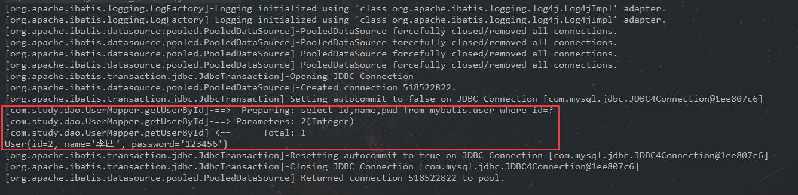
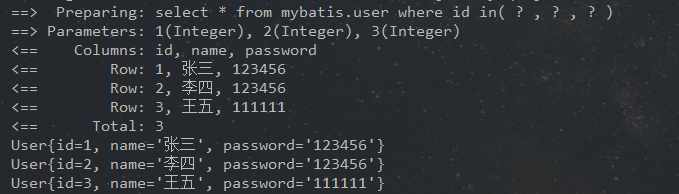

# 

# MyBatis一

## 一、概述

- MyBatis 是一款优秀的持久层框架，它支持定制化 SQL、存储过程以及高级映射。
- MyBatis 避免了几乎所有的 JDBC 代码和手动设置参数以及获取结果集。
- MyBatis 可以使用简单的 XML 或注解来配置和映射原生类型、接口和 Java 的 POJO（Plain Old Java Objects，普通老式 Java 对象）为数据库中的记录
  

## 二、官方文档及下载

- 官方文档：https://mybatis.org/mybatis-3/index.html

- **下载地址：**https://github.com/mybatis/mybatis-3/releases

- **maven依赖**：

```xml
<!--mybatis-->
<dependency>
     <groupId>org.mybatis</groupId>
     <artifactId>mybatis</artifactId>
     <version>3.5.2</version>
</dependency>
```

## 三、MyBatis入门程序

### 3.1、搭建环境

#### 3.1.1、创建数据库表

```sql
CREATE DATABASE `mybatis`;
USE `mybatis`;
CREATE TABLE `user`(
	`id` INT(20) NOT NULL PRIMARY KEY,
	`name` VARCHAR(30) DEFAULT NULL,
	`pwd`VARCHAR(30)DEFAULT NULL
)ENGINE=INNODB DEFAULT CHARSET=utf8;
INSERT INTO `user`(`id`,`name`,`pwd`)VALUES
(1,'张三','123456'),
(2,'李四','123456')
```

#### 3.1.2、创建maven项目

##### 项目结构


##### pom.xml配置

- **添加必要的maven依赖**

```xml
<!--数据库驱动-->
<dependency>
    <groupId>mysql</groupId>
    <artifactId>mysql-connector-java</artifactId>
    <version>5.1.47</version>
</dependency>
<!--MyBatis-->
<dependency>
    <groupId>org.mybatis</groupId>
    <artifactId>mybatis</artifactId>
    <version>3.5.2</version>
</dependency>
<!--测试-->
<dependency>
    <groupId>junit</groupId>
    <artifactId>junit</artifactId>
    <version>4.12</version>
</dependency>
```

- **防止资源导出失败的问题**

```xml
<!--在build中配置resources，来防止资源导出失败的问题-->
<build>
    <resources>
        <resource>
            <directory>src/main/resources</directory>
            <includes>
                <include>**/*.properties</include>
                <include>**/*.xml</include>
            </includes>
            <filtering>true</filtering>
        </resource>
        <resource>
            <directory>src/main/java</directory>
            <includes>
                <include>**/*.properties</include>
                <include>**/*.xml</include>
            </includes>
            <filtering>true</filtering>
        </resource>
    </resources>
</build>
```

### 3.2、MyBatis配置文件

##### mybatis-config.xml

- 内容：

```xml
<?xml version="1.0" encoding="UTF-8" ?>
<!DOCTYPE configuration
        PUBLIC "-//mybatis.org//DTD Config 3.0//EN"
        "http://mybatis.org/dtd/mybatis-3-config.dtd">
<configuration>
     <properties resource="db.properties"/>
    
    <environments default="development">
        <environment id="development">
            <transactionManager type="JDBC"/>
            <dataSource type="POOLED">
                <property name="driver" value="${driver}"/>
                <property name="url" value="${url}"/>
                <property name="username" value="${username}"/>
                <property name="password" value="${password}"/>
            </dataSource>
        </environment>
    </environments>
    <mappers>
        <mapper resource="com/study/dao/UserMapper.xml"/>
    </mappers>
</configuration>
```

- **db.properties**

```properties
driver=com.mysql.jdbc.Driver
url=jdbc:mysql://localhost:3306/mybatis?useSSL=true&useUnicode=true&characterEncoding=UTF-8
username=root
password=123456
```

### 3.3、编写代码

#### 3.3.1、MyBatisUtils工具类

```java
//功能：获取SqlSessionFactory 对象
public class MybatisUtils {
    private static SqlSessionFactory sqlSessionFactory;

    static {
        try {
            String resources = "mybatis-config.xml";
            InputStream inputStream = Resources.getResourceAsStream(resources);
            sqlSessionFactory = new SqlSessionFactoryBuilder().build(inputStream);
        } catch (IOException e) {
            e.printStackTrace();
        }
    }
    public static SqlSession getSqlSession() {
        return sqlSessionFactory.openSession();
    }
}
```

#### 3.3.2、User实体类

```java
public class User {
    private int id;
    private String name;
    private String pwd;

    public User() {}

    public User(int id, String name, String pwd) {
        this.id = id;
        this.name = name;
        this.pwd = pwd;
    }

    public int getId() {
        return id;
    }

    public void setId(int id) {
        this.id = id;
    }

    public String getName() {
        return name;
    }

    public void setName(String name) {
        this.name = name;
    }

    public String getpwd() {
        return pwd;
    }

    public void setpwd(String pwd) {
        this.pwd = pwd;
    }

    @Override
    public String toString() {
        return "User{" +
                "id=" + id +
                ", name='" + name + '\'' +
                ", pwd='" + pwd + '\'' +
                '}';
    }
}
```

#### 3.3.3、UserMapper持久层接口

```java
public interface UserMapper {
    //根据id获取获取用户
    User getUserById(int id);
    //添加用户
    int addUser(User user);
    //根据id删除用户
    int deleteUserById(int id);
    //修改用户
    int updateUesr(User user);
}
```

#### 3.3.4、UserMapper.xml

```xml
<?xml version="1.0" encoding="UTF-8" ?>
<!DOCTYPE mapper
        PUBLIC "-//mybatis.org//DTD Mapper 3.0//EN"
        "http://mybatis.org/dtd/mybatis-3-mapper.dtd">
<mapper namespace="com.study.dao.UserMapper">
    
    <!--根据id查询用户-->
    <select id="getUserById" resultType="User">
        select * from mybatis.user where id=#{id}
    </select>
    <!--添加用户-->
    <insert id="addUser" parameterType="User">
        insert into mybatis.user values(#{id},#{name},#{pwd})
    </insert>
    <!--删除用户-->
    <delete id="deleteUserById">
        delete from mybatis.user where id=#{id}
    </delete>
    <!--修改用户信息-->
    <update id="updateUesr" parameterType="User">
        update mybatis.user set name=#{name},pwd=#{pwd} where id=#{id}
    </update>
</mapper>
```

- **namespace**：绑定一个对应接口
- **id**：就是对应的namespace中的方法名
- **resultType**：sql语句返回值类型
- **parameterType**：参数类型
- 在 **mybatis-config.xml** 中注册

```xml
<mappers>
     <mapper resource="com/study/dao/UserMapper.xml"/>
</mappers>
```

#### 3.3.5、UserMapperTest测试类

```java
public class UserMapperTest {

    @Test
    public void getUserByIdTest(){
        //获取getUserList对象
        SqlSession sqlSession = MybatisUtils.getSqlSession();
        UserMapper mapper = sqlSession.getMapper(UserMapper.class);
        User user = mapper.getUserById(1);
        System.out.println(user);
        //关闭SqlSession
        sqlSession.close();
    }
    
    @Test
    public void addUserTest(){
        SqlSession sqlSession = MybatisUtils.getSqlSession();
        UserMapper mapper = sqlSession.getMapper(UserMapper.class);
        int num = mapper.addUser(new User(3,"王五","121212"));
        if (num>0) {
            System.out.println("添加成功！");
        }
        sqlSession.commit();
        sqlSession.close();
    }

    @Test
    public void delectTest(){
        SqlSession sqlSession = MybatisUtils.getSqlSession();
        UserMapper mapper = sqlSession.getMapper(UserMapper.class);
        int num = mapper.deleteUserById(0);
        if (num>0) {
            System.out.println("删除成功！");
        }
        sqlSession.commit();
        sqlSession.close();
    }

    @Test
    public void updateTest(){
        SqlSession sqlSession = MybatisUtils.getSqlSession();
        UserMapper mapper = sqlSession.getMapper(UserMapper.class);
        int num = mapper.updateUesr(new User(1,"哈哈","111111"));
        if (num>0) {
            System.out.println("修改成功！");
        }
        sqlSession.commit();
        sqlSession.close();
    }
}
```

- getUserById测试结果：

```
User{id=2, name='李四', pwd='123456'}

Process finished with exit code 0
```

- **注意：**增删改操作必须提交事务`sqlSession.commit();`

## 四、作用域（Scope）和生命周期

#### SqlSessionFactoryBuilder

这个类可以被实例化、使用和丢弃，一旦创建了 SqlSessionFactory，就不再需要它了。 因此 SqlSessionFactoryBuilder 实例的最佳作用域是方法作用域（也就是局部方法变量）。 你可以重用 SqlSessionFactoryBuilder 来创建多个 SqlSessionFactory 实例，但是最好还是不要让其一直存在，以保证所有的 XML 解析资源可以被释放给更重要的事情。


#### SqlSessionFactory

SqlSessionFactory 一旦被创建就应该在应用的运行期间一直存在，没有任何理由丢弃它或重新创建另一个实例。 使用 SqlSessionFactory 的最佳实践是在应用运行期间不要重复创建多次，多次重建 SqlSessionFactory 被视为一种代码“坏味道（bad smell）”。因此 SqlSessionFactory 的最佳作用域是应用作用域。 有很多方法可以做到，最简单的就是使用单例模式或者静态单例模式。

#### SqlSession

每个线程都应该有它自己的 SqlSession 实例。SqlSession 的实例不是线程安全的，因此是不能被共享的，所以它的最佳的作用域是请求或方法作用域。 绝对不能将 SqlSession 实例的引用放在一个类的静态域，甚至一个类的实例变量也不行。 也绝不能将 SqlSession 实例的引用放在任何类型的托管作用域中，比如 Servlet 框架中的 HttpSession。 如果你现在正在使用一种 Web 框架，要考虑 SqlSession 放在一个和 HTTP 请求对象相似的作用域中。 换句话说，每次收到的 HTTP 请求，就可以打开一个 SqlSession，返回一个响应，就关闭它。 这个关闭操作是很重要的，你应该把这个关闭操作放到 finally 块中以确保每次都能执行关闭。

sion** 实例。SqlSession 的实例不是线程安全的，因此是不能被共享的，所以它的最佳的作用域是请求或方法作用域。 绝对不能将 SqlSession 实例的引用放在一个类的静态域，甚至一个类的实例变量也不行。 也绝不能将 SqlSession 实例的引用放在任何类型的托管作用域中，比如 Servlet 框架中的 HttpSession。 如果你现在正在使用一种 Web 框架，要考虑 SqlSession 放在一个和 HTTP 请求对象相似的作用域中。 换句话说，每次收到的 HTTP 请求，就可以打开一个 SqlSession，返回一个响应，就关闭它。 这个关闭操作是很重要的，你应该把这个关闭操作放到 finally 块中以确保每次都能执行关闭。


## 五、MyBatis的XML配置

### 1、properties（属性）

 **这些属性都是可外部配置且可动态替换的**，**既可以在典型的 Java 属性文件中配置，也可通过 properties 元素的子元素来传递。** **这些属性可以在整个配置文件中被用来替换需要动态配置的属性值。**

```properties
<properties resource="db.properties">
     <property name="username" value="root"/>
     <property name="password" value="123456"/>
</properties>
```

```properties
<dataSource type="POOLED">
    <property name="driver" value="${driver}"/>
    <property name="url" value="${url}"/>
    <property name="username" value="${username}"/>
    <property name="password" value="${password}"/>
</dataSource>
```

- 注意：**配置文件**中的配置优先级**大于**在**property标签**中的配置，即会优先选择配置文件中的配置。

### 2、typeAliases（类型别名）

- **给实体类起别名**

```xml
<typeAliases>
    <typeAlias type="com.study.pojo.User" alias="User"/>
</typeAliases>
```

- **指定一个包名，MyBatis 会在包名下面搜索需要的 Java Bean**

```xml
<typeAliases>
    <typeAlias type="com.study.pojo.User" alias="User"/>
</typeAliases>
```

**每一个在包 `com.study.pojo` 中的 Java Bean，在没有注解的情况下，会使用 Bean 的首字母小写的非限定类名来作为它的别名。若有注解，则别名为其注解值。**

```java
@Alias("_user")		//使用注解自定义别名为 _user
public class User {...}
```

## 六、结果集映射（resultMap ）

- 修改上面实体类字段：pwd–>password

```java
public class User {
    private int id;
    private String name;
    private String password;
    ...
}
```

- 由于实体类字段与数据库字段不一致（数据库字段依然为**pwd**），导致查出的 **password=null**
- 解决办法：使用**结果集映射**

```xml
<resultMap id="UserMap" type="User">
        <result column="pwd" property="password"/>
</resultMap>
    
<!--根据id查询用户-->
<select id="getUserById" resultMap="UserMap">
    select id,name,pwd from mybatis.user where id=#{id}
</select>
```

# MyBatis二

## 一、日志

| 设置名  | 描述                                                  | 有效值                                                       | 默认值 |
| ------- | ----------------------------------------------------- | ------------------------------------------------------------ | ------ |
| logImpl | 指定 MyBatis 所用日志的具体实现，未指定时将自动查找。 | **SLF4J、LOG4J、LOG4J2、JDK_LOGGING、COMMONS_LOGGING、STDOUT_LOGGING、NO_LOGGING** | 未设置 |

### 1.1、STDOUT_LOGGING（标准日志）

**使用**

- 在**mybatis-config.xml**中，配置日志实现

```xml
<settings>
    <setting name="logImpl" value="STDOUT_LOGGING"/>
</settings>
```

- **标准日志不用再做其他配置，即可以使用！**


### 1.2、log4j

#### 1.2.1、简介

- Log4j是Apache的一个开源项目，通过使用Log4j，我们可以控制日志信息输送的目的地是控制台、文件、GUI组件；
- 我们也可以控制每一条日志的输出格式；
- 通过定义每一条日志信息的级别，我们能够更加细致地控制日志的生成过程。
- 通过一个配置文件来灵活地进行配置，而不需要修改应用的代码。

#### 1.2.2、使用

- **导入log4j的包**

```xml
<!-- https://mvnrepository.com/artifact/log4j/log4j -->
<dependency>
    <groupId>log4j</groupId>
    <artifactId>log4j</artifactId>
    <version>1.2.17</version>
</dependency>
```

- **log4j.properties**

```properties
#将等级为DEBUG的日志信息输出到console和file这两个目的地，console和file的定义在下面的代码
log4j.rootLogger=DEBUG,console,file

#控制台输出的相关设置
log4j.appender.console = org.apache.log4j.ConsoleAppender
log4j.appender.console.Target = System.out
log4j.appender.console.Threshold=DEBUG
log4j.appender.console.layout = org.apache.log4j.PatternLayout
log4j.appender.console.layout.ConversionPattern=[%c]-%m%n

#文件输出的相关设置
log4j.appender.file = org.apache.log4j.RollingFileAppender
log4j.appender.file.File=./log/kuang.log
log4j.appender.file.MaxFileSize=10mb
log4j.appender.file.Threshold=DEBUG
log4j.appender.file.layout=org.apache.log4j.PatternLayout
log4j.appender.file.layout.ConversionPattern=[%p][%d{yy-MM-dd}][%c]%m%n

#日志输出级别
log4j.logger.org.mybatis=DEBUG
log4j.logger.java.sql=DEBUG
log4j.logger.java.sql.Statement=DEBUG
log4j.logger.java.sql.ResultSet=DEBUG
log4j.logger.java.sql.PreparedStatement=DEBUG
```

- **配置log4j为日志的实现**

```xml
<settings>
    <setting name="logImpl" value=""/>
</settings>
```

- **测试运行**



- **日志级别**

- **日志对象，参数为当前类的class**

```java
// 注意包不能导错：import org.apache.log4j.Logger;
static Logger logger = Logger.getLogger(UserDaoTest.class);
```

- **测试方法**

```java
@Test
public void log4jTest(){
    logger.info("info: log4jTest");
    logger.debug("debug: log4jTest");
    logger.error("error: log4jTest");
}
```

- **测试结果**


## 二、分页

### 2.1、使用limit实现分页

- **UserMapper接口**

```java
public interface UserMapper {
    //获取用户列表并分页
    List<User> getUserListLimit(Map<String,Integer> map);
}
```

- **UserMapper.xml**

```xml
<!--//获取用户列表并分页-->
<select id="getUserListLimit" parameterType="map" resultType="user">
    # startIndex：起始索引
    # pageSize：页面容量
    select * from mybatis.user limit #{startIndex},#{pageSize}
</select>
```

- **测试方法**

```java
@Test
public void getUserListLimitTest(){
    SqlSession sqlSession = MybatisUtils.getSqlSession();
    UserMapper mapper = sqlSession.getMapper(UserMapper.class);
    Map<String, Integer> map = new HashMap<String, Integer>();
    map.put("startIndex",0);
    map.put("pageSize",3);
    List<User> userListLimit = mapper.getUserListLimit(map);
    for (User user : userListLimit) {
        System.out.println(user);
    }
    sqlSession.close();
}
```

- **数据库**


- **测试结果**


### 2.2、RowBounds分页

- **UserMapper接口**

```java
public interface UserMapper {
   //获取用户列表，分页留给java类实现
    List<User> getUserList();
}
```

- **UserMapper.xml**

```xml
<!--//获取用户列表-->
<select id="getUserList" resultType="user">
    select * from mybatis.user
</select>
```

- **测试方法**

```java
@Test
public void getUserListTest(){
    SqlSession sqlSession = MybatisUtils.getSqlSession();
    RowBounds rowBounds = new RowBounds(0, 3);
    List<User> userList = sqlSession.selectList("com.study.dao.UserMapper.getUserList", null, rowBounds);
    for (User user : userList) {
        System.out.println(user);
    }
    sqlSession.close();
}
```

- **测试结果**


## 三、使用注解开发

- **UserMapper接口**

```java
public interface UserMapper {
    //根据ID获取用户
    @Select("select * from user where id = #{id}")
    User getUserById(@Param("id") Integer id);
    //根据id删除用户
    @Delete("delete from user where id = #{id}")
    int deleteUserById(@Param("id") Integer id);
    //添加用户
    @Insert("insert into user values(#{id},#{name},#{password})")
    int add(User user);
    //根据id修改用户
    @Update("update user set name = #{name},password = #{password} where id= #{id}")
    int updateUserById(Map<String,Object> map);
}
```

- **在核心配置文件中绑定接口**

```xml
<mappers>
    <mapper class="com.study.dao.UserMapper"/>
</mappers>
```

- **测试方法**

```java
@Test
public void myTest(){
    SqlSession sqlSession = MybatisUtils.getSqlSession();
    UserMapper mapper = sqlSession.getMapper(UserMapper.class);
    User user = mapper.getUserById(1);
    int delete = mapper.deleteUserById(5);
    int add = mapper.add(new User(6, "root", "123456"));
    Map<String, Object> map = new HashMap<String, Object>();
    map.put("id",1);
    map.put("name","zhangsan");
    map.put("password","123456");
    int update = mapper.updateUserById(map);
    System.out.println(user);
    if(delete==1) {
        System.out.println("删除成功！");
    }else {
        System.out.println("删除失败！");
    }
    if(add==1) {
        System.out.println("添加成功！");
    }else {
        System.out.println("添加失败！");
    }
    if(update==1) {
        System.out.println("修改成功！");
    }else {
        System.out.println("修改失败！");
    }
    //注意：增删改操作必须要提交事务
    sqlSession.commit();
    sqlSession.close();
}
```

- **测试结果**


## 四、多对一和一对多问题

 **以学生和老师为例，多个学生对应一个老师，一个老师对应多个学生。**

- **数据库表关系**


**实体类**

- **Student**


- **Teacher**


#### 4.1、多对一

- 暂不考虑 **Teacher** 类的 **students** 属性

##### 4.1.1、按照结果嵌套处理（联表查询）

- **StudentMapper 接口**

```java
public interface StudentMapper {
    List<Student> getStudentList();
}
```

- **StudentMapper.xml**

```xml
<select id="getStudentList" resultMap="studentMap">
    select s.id sid,s.name sname,t.id tid,t.name tname from mybatis.student s,mybatis.teacher t where t.id = s.tid
</select>
<resultMap id="studentMap" type="student">
    <result property="id" column="sid"/>
    <result property="name" column="sname"/>
    <association property="teacher" javaType="Teacher">
        <result property="id" column="tid"/>
        <result property="name" column="tname"/>
    </association>
</resultMap>
```

- **测试方法**

```java
@Test
public void getStudentListTest(){
    SqlSession sqlSession = MybatisUtils.getSqlSession();
    StudentMapper mapper = sqlSession.getMapper(StudentMapper.class);
    List<Student> studentList = mapper.getStudentList();
    for (Student student : studentList) {
        System.out.println(student);
    }
    sqlSession.close();
}
```

- **测试结果**


##### 4.1.2、按照查询嵌套处理（子查询）

- **StudentMapper 接口**

```java
public interface StudentMapper {
    List<Student> getStudentList();
}
```

- **StudentMapper.xml**

```xml
<select id="getStudentList" resultMap="studentMap">
    select * from mybatis.student
</select>
<resultMap id="studentMap" type="student">
    <association property="teacher" column="tid" javaType="teacher" select="getTeacher"/>
</resultMap>
<select id="getTeacher" resultType="teacher">
    select * from mybatis.teacher where id = #{tid}
</select>
```

- **测试方法与4.1.1相同，在此省略**
- **测试结果**


#### 4.2、一对多

- 过程和多对一相似，此处只展示 **StudentMapper.xml** 核心内容

##### 4.2.1、按照结果嵌套处理

```xml
<select id="getTeacherById" resultMap="teacherMap">
    select s.id sid,s.name sname,t.id tid,t.name tname from mybatis.teacher t,mybatis.student s where t.id=s.tid and t.id=#{tid}
</select>
<resultMap id="teacherMap" type="Teacher">
    <result property="id" column="tid"/>
    <result property="name" column="tname"/>
    <collection property="students" javaType="ArrayList" ofType="Student">
        <result property="id" column="sid"/>
        <result property="name" column="sname"/>
        <result property="tid" column="tid"/>
    </collection>
</resultMap>
```

##### 4.2.2、按照查询嵌套处理

```xml
<select id="getTeacherById2" resultMap="teacherMap">
        select * from mybatis.teacher where id=#{tid}
</select>
<resultMap id="teacherMap" type="Teacher">
    <result property="id" column="id"/>
    <collection property="students" javaType="ArrayList" ofType="Student" column="id" select="getStudent"/>
</resultMap>
<select id="getStudent" resultType="student">
    select * from mybatis.student where tid=#{tid}
</select>
```

## 五、动态SQL

### 5.1、if

```xml
<!--
    根据传递过来的参数，通过模糊查询获取用户列表
    如果参数为null或是空串，则查询获取全部用户的列表
-->
<select id="getUserListByName" resultType="user">
    select * from mybatis.user
    <where>
        <if test="name != null and name != ''">
            name like concat('%',#{name},'%')
        </if>
    </where>
</select>
```

- **测试**


- **where标签**

  **where 元素只会在至少有一个子元素的条件返回 SQL 子句的情况下才去插入“WHERE”子句。而且，若语句的开头为“AND”或“OR”，where 元素也会将它们去除。**

### 5.2、choose, when, otherwise

```xml
<!--
    优先根据id获取用户，若id为空，则根据传递过来的name通过模糊查询获取用户列表
    若id 和 name 都为空，则返回空列表
-->
<select id="getUserListByIdOrName" resultType="user">
    select * from mybatis.user
    <where>
        <choose>
            <when test="id != null">
                id  = #{id}
            </when>
            <when test="name != null and name != ''">
                name like concat('%',#{name},'%')
            </when>
            <otherwise>
                false
            </otherwise>
        </choose>
    </where>
</select>
```

**测试**：传递的参数为 `id = 2 , name = "张"`


### 5.3、foreach

```xml
<!--
    通过集合中的id获取对应用户列表
-->
<select id="getUserListByIds" resultType="user">
    select * from mybatis.user
    <foreach item="id" collection="list" open="where id in(" close=")" separator=",">
        #{id}
    </foreach>
</select>
```

测试：`ids = [1, 2, 3]`



### 5.4、SQL片段

- 等价于 **5.1** 中的代码

```xml
<sql id="ifName">
    <if test="name != null and name != ''">
        name like concat('%',#{name},'%')
    </if>
</sql>

<select id="getUserListByName" resultType="user">
    select * from mybatis.user
    <where>
        <include refid="ifName"/>
    </where>
</select>
```

### 5.5、set

```xml
<!--
    根据id修改用户信息
-->
<update id="updateUserById" parameterType="map">
    update mybatis.user
    <set>
        <if test="name != null and name != ''">`name` = #{name},</if>
        <if test="password != null and password != ''">`password` = #{password}</if>
    </set>
    where id = #{id}
</update>
```

- **set元素会动态前置 SET 关键字，同时也会删掉无关的逗号**
- **测试**


# Spring快速入门

## 一、 简介

### 1.1、优点

- Spring是一个开源的免费的框架（容器）！
- Spring是一个轻量级的、非入侵式的框架！
- 控制反转（IOC） ， 面向切面编程（AOP）！
- 支持事务的处理，支持对框架的整合！

### 1.2、官网及文档地址

- 官网：https://spring.io/
- 学习文档：https://docs.spring.io/spring/docs/5.2.0.RELEASE/spring-framework-reference/
- Spring Framework 5 中文文档：https://lfvepclr.gitbooks.io/spring-framework-5-doc-cn/content/
- 源码及jar包下载地址：https://repo.spring.io/release/org/springframework/spring/
- GitHub：https://github.com/spring-projects/spring-framework
  

## 二、HelloWorld 入门程序

### 2.1、环境搭建

- 创建maven项目，导包

```xml
<dependency>
    <groupId>org.springframework</groupId>
    <artifactId>spring-webmvc</artifactId>
    <version>5.2.0.RELEASE</version>
</dependency>
<!--测试-->
<dependency>
    <groupId>junit</groupId>
    <artifactId>junit</artifactId>
    <version>4.12</version>
</dependency>
```

- 在 **resources** 包下新建 **applicationContext.xml** 配置文件

```xml
<?xml version="1.0" encoding="UTF-8"?>
<beans xmlns="http://www.springframework.org/schema/beans"
       xmlns:xsi="http://www.w3.org/2001/XMLSchema-instance"
       xsi:schemaLocation="http://www.springframework.org/schema/beans
        https://www.springframework.org/schema/beans/spring-beans.xsd">

</beans>
```

### 2.2、编写代码

- **实体类**

```java
public class Hello {
    
    private String str;

    public String getStr() {
        return str;
    }

    public void setStr(String str) {
        this.str = str;
    }
}
```

- **在spring的配置文件中绑定实体类，并为实体类字段注入值**

```xml
<!--
    id：单个bean的标识符，相当于对象名
    class：全类名
-->
<bean id="hello" class="com.study.pojo.Hello">
    <!-- 为str注入值 -->
    <property name="str" value="Hello World!"/>
</bean>
```

- **测试类**

```java
public class MyTest {
    @Test
    public void helloTest() {
        ApplicationContext context = new ClassPathXmlApplicationContext("applicationContext.xml");
        Hello hello = (Hello) context.getBean("hello");
        System.out.println(hello.getStr());
    }
}
//测试结果： Hello World!
```

# Spring IOC

## 一、Spring IOC

-  IoC（Inversion of Control，控制反转）是一种设计思想。这是spring的核心，贯穿始终。所谓IoC，对于spring框架来说，就是由spring来负责控制对象的生命周期和对象间的关系。
- Spring 的 IoC 设计支持以下功能：
  - 依赖注入
  - 依赖检查
  - 自动装配
  - 支持集合
  - 指定初始化方法和销毁方法
  - 支持回调某些方法（但是需要实现 Spring 接口，略有侵入）

##  二、DI（依赖注入）

### 2.1、构造器注入

- **实体类**

```java
@Data
@NoArgsConstructor
@AllArgsConstructor
@ToString
public class User {
    private int id;
    private String name;
}
```

- **方式一：通过参数名给字段注入值**

```xml
<bean id="user" class="com.study.pojo.User">
    <constructor-arg name="id" value="1"/>
    <constructor-arg name="name" value="张三"/>
</bean>
```

- **方式二：通过参数类型给字段注入值**

- **注意：此方式要求参数类型唯一**

```xml
bean id="user" class="com.study.pojo.User">
    <constructor-arg type="int" value="1"/>
    <constructor-arg type="java.lang.String" value="张三"/>
</bean>
```

- **方式三：通过有参构造参数列表的索引给字段注入值**

```xml
<bean id="user" class="com.study.pojo.User">
    <constructor-arg index="0" value="1"/>
    <constructor-arg index="1" value="张三"/>
</bean>
```

### 2.2、Set方式注入

- **实体类**

```java
@Data
@ToString
public class Address {
    private String address;
}
```

```java
@Data
@ToString
public class Student {
    private String name;
    private Address address;
    private String[] books;
    private List<String> hobbys;
    private Set<String> games;
    private Map<String,String> cards;
    private String wife;
    private Properties info;
}
```

- **applicationContext.xml**

```xml
<?xml version="1.0" encoding="UTF-8"?>
<beans xmlns="http://www.springframework.org/schema/beans"
       xmlns:xsi="http://www.w3.org/2001/XMLSchema-instance"
       xsi:schemaLocation="http://www.springframework.org/schema/beans
        https://www.springframework.org/schema/beans/spring-beans.xsd">

    <bean id="address" class="com.study.pojo.Address">
        <property name="address" value="西安"/>
    </bean>

    <bean id="student" class="com.study.pojo.Student">

        <property name="name" value="张三"/>

        <property name="address" ref="address"/>

        <!--数组注入-->
        <property name="books">
            <array>
                <value>Java</value>
                <value>C</value>
                <value>PHP</value>
                <value>JS</value>
            </array>
        </property>

        <!--List-->
        <property name="hobbys">
            <list>
                <value>旅游</value>
                <value>敲代码</value>
            </list>
        </property>

        <!--Map-->
        <property name="cards">
            <map>
                <entry key="身份证" value="111111111111111111"/>
                <entry key="学生卡" value="11111111"/>
            </map>
        </property>

        <!--Set-->
        <property name="games">
            <set>
                <value>lol</value>
                <value>cf</value>
            </set>
        </property>

        <!--null-->
        <property name="wife">
            <null/>
        </property>

        <!--properties-->
        <property name="info">
            <props>
                <prop key="username">root</prop>
                <prop key="password">123456</prop>
            </props>
        </property>
    </bean>
</beans>
```

### 2.3、拓展方式注入

- 使用**p命令空间**和**c命令空间**注入，实体类为上例 2.1 中的 **User 类**

```xml
<?xml version="1.0" encoding="UTF-8"?>
<beans xmlns="http://www.springframework.org/schema/beans"
       xmlns:xsi="http://www.w3.org/2001/XMLSchema-instance"
       xmlns:p="http://www.springframework.org/schema/p"
       xmlns:c="http://www.springframework.org/schema/c"
       xsi:schemaLocation="http://www.springframework.org/schema/beans
        https://www.springframework.org/schema/beans/spring-beans.xsd">

    <bean id="user" class="com.study.pojo.User" p:name="张三" p:id="1"/>
    <bean id="user2" class="com.study.pojo.User" c:name="李四" c:id="2"/>
</beans>
```

## 三、Bean的自动装配

- 自动装配是spring满足bean依赖的一种方式

- spring会在上下文中自动寻找，并自动给bean装配属性

### 3.1、ByName

- 保证所有bean的 id 唯一，且这个bean需要和自动注入的set方法的值一致

```xml
<bean id="bean" class="com.study.pojo.Bean" autowire="byName"/>
```

### 3.2、ByType

- 保证所有bean的 class类型 唯一，且这个bean需要和自动注入属性的类型一致

```xml
<bean id="bean" class="com.study.pojo.Bean" autowire="byType"/>
```

## 四、使用注解开发

- 注意：必须 导入**spring-aop**的包，必须在**applicationContext.xml** 文件中导入 context 约束，必须配置注解的支持，必须指定要扫描的包。

```xml
<?xml version="1.0" encoding="UTF-8"?>
<beans xmlns="http://www.springframework.org/schema/beans"
       xmlns:xsi="http://www.w3.org/2001/XMLSchema-instance"
       xmlns:context="http://www.springframework.org/schema/context"
       xsi:schemaLocation="http://www.springframework.org/schema/beans
        https://www.springframework.org/schema/beans/spring-beans.xsd
        http://www.springframework.org/schema/context
        https://www.springframework.org/schema/context/spring-context.xsd">

    <!--指定要扫描的包，这个包下的注解才会生效-->
    <context:component-scan base-package="com.study"/>
    <context:annotation-config/>

</beans>
```

### 4.1、注册类到spring中

- @Component：加在类前

- 衍生注解：
  - dao【@Repository】
  - service【@Service】
  - controller【@Controller】

- 这四个注解功能完全一样，都是代表将某个类注册到spring中，装配Bean

```java
@Component
public class User {...}
```

### 4.2、属性的注入

- @Value(“value”)
- 可以加在**属性**前，也可以加在**set()**方法前

```java
@Value("张三")
private String name;


private int age;

public void setName(String name) {
    this.name = name;
}

@Value("1")
public void setAge(int age) {
    this.age = age;
}
```

### 4.3、使用注解实现自动装配

- **@Autowired**：自动装配，需要满足上面 **byName** 或 **byType** 的条件

- **@Qualifier**：可**与@Autowired配合使用**，一般在**@Autowired**不能满足需求的时候使用，可指定需要装配的bean的 id

- **@Resource**：自动装配，整合以上两种注解，即也可以**指定 id**

```java
@Resource(name="dog")
private Dog dog;

@Autowired
@Qualifier("cat")
private Cat cat;
```

### 4.4、作用域

- @Scope(“singleton”) 【**spring 默认作用域**】

- @Scope(“prototype”)：**原型**

- **加在类前面**

## 五、使用Java的方式配置Spring

- 使用 Java 类可以完全代替 **applicationContext.xml** 配置文件
- 实体类

```java
@Component
public class User {

    @Value("张三")
    private String name;

    public void setName(String name) {
        this.name = name;
    }

    @Override
    public String toString() {
        return "User{" +
                "name='" + name + '\'' +
                '}';
    }
}
```

- 配置类

```java
//标记这是一个配置类
@Configuration
// 指定要扫描的包，这个包下的注解才会生效
//等同于：<context:component-scan base-package="com.study"/>
@ComponentScan("com.study.pojo")
//整合其他配置类，等同于：
//<import resource="beans.xml"/>
@Import(Config.class)
public class UserConfig {

    //注册一个bean ， 就相当于我们之前写的一个bean标签
    //这个方法的名字，就相当于bean标签中的id属性
    //这个方法的返回值，就相当于bean标签中的class属性
    @Bean
    public User user(){
        return new User(); //返回要注入到bean的对象
    }
}
```

- 测试类

```java
public static void main(String[] args) {
    ApplicationContext context = new AnnotationConfigApplicationContext(UserConfig.class);
    User user = context.getBean("user", User.class);
    System.out.println(user);
}
```

# 代理模式

**代理模式：为其它对象提供一种代理以控制对这个对象的访问控制；在某些情况下，客户不想或者不能直接引用另一个对象，这时候代理对象可以在客户端和目标对象之间起到中介的作用。**

## 一、静态代理

**角色分析：**

- 抽象事务 ：一般会使用接口或者抽象类

- 真实角色 ：被代理的角色

- 代理角色 ：代理真实角色 ， 代理真实角色后，我们一般会做一些附属操作

- 客户 ： 访问代理对象

**下面以租房为例，学习静态代理模式**

- 抽象事务：出租房，对应**Rent 接口**

- 真实角色：房东，他需要出租房，即要实现**Rent 接口**，并实现出租的 rent()方法

- 代理角色：房屋中介，他需要帮房东出租房子，同样需要实现**Rent 接口**，实现 **rent()** 方法，并对此方法做出一些扩展操作

- 客户：需要租房的人

**代码实现：**

- 接口

```java
public interface Rent {
    void rent();
}
```

- 真实角色

```java
public class Host implements Rent{
    public void rent() {
        System.out.println("【Host】房东要出租房子！");
    }
}
```

- 代理角色

```java
public class Proxy implements Rent{
    private Host host;

    public Proxy() {
    }

    public Proxy(Host host) {
        this.host = host;
    }

    public void rent() {
        lookHouse();
        host.rent();
        contract();
        rentRent();
    }

    public void contract() {
        System.out.println("【Proxy】签合同！");
    }

    public void rentRent() {
        System.out.println("【Proxy】收房租！");
    }

    public void lookHouse() {
        System.out.println("【Proxy】看房！");
    }
}
```

- 客户 (测试类)

```java
public class Client {
    public static void main(String[] args) {
        Host host = new Host();
        Proxy proxy = new Proxy(host);
        proxy.rent();
    }
}
```

- 测试结果：

```java
【Proxy】看房！
【Host】房东要出租房子！
【Proxy】签合同！
【Proxy】收房租！
```

**静态代理模式的利弊：**

**优点：**

- 可以使真实角色的操作更加纯粹，不用去关注一些公共的业务；

- 公共的业务交给代理角色，实现了业务的分工；

- 公共业务发生扩展的时候，方便集中管理。

**缺点：**

- 必须事先知道要代理的是什么；
- 一个真实角色就会产生一个代理角色，代码量会翻倍，开发效率会变低！

## 二、动态代理

- **动态代理的实现方式：**
  - 基于接口实现 【JDK动态代理】 
  - 基于类实现：**cglib**
  - 基于java字节码实现：Javassist

- **动态代理和静态代理的角色一样，代理类是动态生成的，不是直接写好的**

- **学习动态代理需要用到的两个类：**

  - **Proxy**：提供用于创建动态代理类和实例的静态方法，它还是由这些方法创建的所有动态代理类的超类。

  ```java
  //返回一个指定接口的代理类实例，该接口可以将方法调用指派到指定的调用处理程序。
  static Object newProxyInstance(ClassLoader loader, Class<?>[] interfaces, InvocationHandler h)            
  ```

  - **InvocationHandler**：是代理实例的*调用处理程序* 实现的接口。 每个代理实例都具有一个关联的调用处理程序。对代理实例调用方法时，将对方法调用进行编码并将其指派到它的调用处理程序的 `invoke`方法。

```java
//在代理实例上处理方法调用并返回结果。
Object invoke(Object proxy, Method method, Object[] args) 
```

**JDK动态代理代码实现：**

- **仍以上面租房为例，接口和真实角色都不变！**

- **动态代理类**

```java
public class InvocationHandlerProxy implements InvocationHandler {

    //需要代理的接口的实例
    private Object target;

    public void setObject(Object object) {
        this.target = object;
    }

    //获取代理实例
    public Object getProxy(){
        /*  参数:
            ClassLoader loader: 代理类的类加载器
            Class<?>[] interfaces: 代理类要实现的接口列表
            InvocationHandler h：指派方法调用的调用处理程序，即InvocationHandler的实例，也就是当前对象
        */
        return Proxy.newProxyInstance(this.getClass().getClassLoader(),target.getClass().getInterfaces(),this);
    }

    /* 参数：
    *   proxy：代理实例
    *   method：对应于在代理实例上调用的接口方法的 Method 实例。
    *   args：方法的参数列表
    * */
    public Object invoke(Object proxy, Method method, Object[] args) throws Throwable {
        lookHouse();
        //执行接口的方法
        //target：调用此方法的对象 args：参数列表
        Object invoke = method.invoke(target,args);
        contract();
        rentRent();
        return invoke;
    }

    public void contract() {
        System.out.println("【Proxy】签合同！");
    }

    public void rentRent() {
        System.out.println("【Proxy】收房租！");
    }

    public void lookHouse() {
        System.out.println("【Proxy】看房！");
    }
}
```

- 测试类

```java
public class Client {
    public static void main(String[] args) {
        Rent rent = new Host();
        InvocationHandlerProxy ihp = new InvocationHandlerProxy();
        ihp.setObject(rent);
        Rent proxy = (Rent) ihp.getProxy();
        proxy.rent();
    }
}
```

- 动态代理的优点：

  - 包含静态代理的所有优点，且解决了其缺点；

  - 一个动态代理类可以代理一个接口下的所有类；

  - 动态代理事先不知道要代理的是什么，在运行的时候才确定；

  - 实现无侵入式的代码扩展，也就是方法的增强；让你可以在不用修改源码的情况下，增强一些方法；在方法的前后你可以做你任何想做的事情。

> 参考引用链接：https://blog.csdn.net/y_engineer/article/list/1