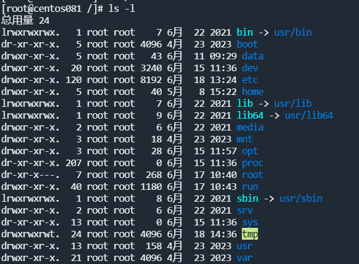
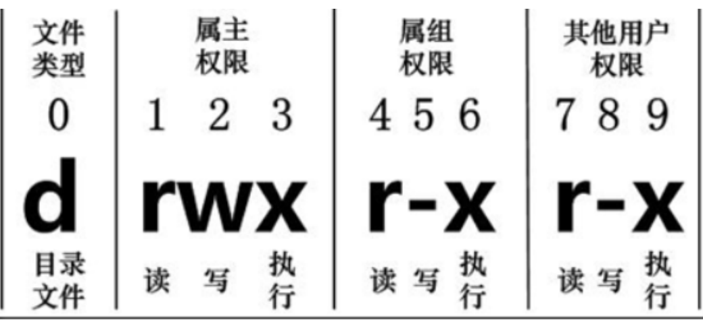
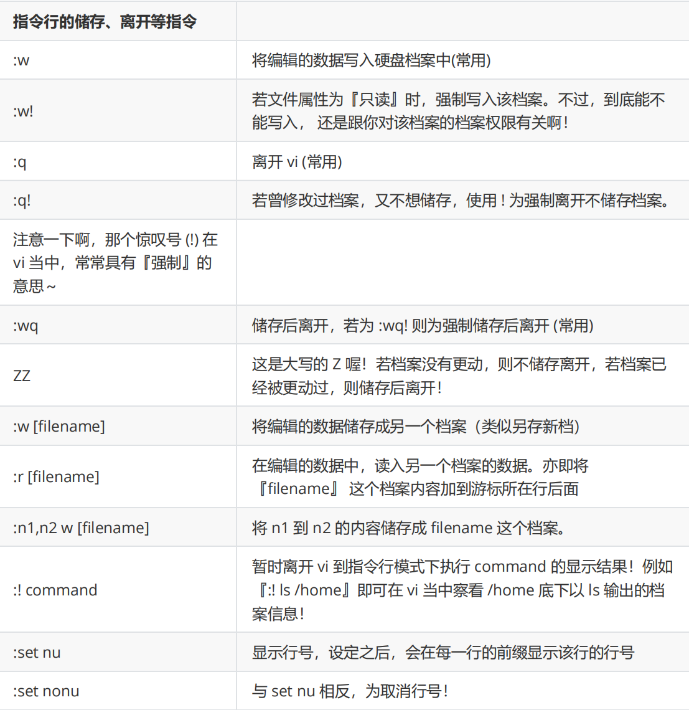

# 目录介绍

* **/bin**： bin是Binary的缩写, 这个目录存放着最经常使用的命令。

* **/boot**： 这里存放的是启动Linux时使用的一些核心文件，包括一些连接文件以及镜像文件。

* **/dev** **：** dev是Device(设备)的缩写, 存放的是Linux的外部设备，在Linux中访问设备的方式和访问文件的方式是相同的。

* **/etc**： 这个目录用来存放所有的系统管理所需要的配置文件和子目录。

* **/home**：用户的主目录，在Linux中，每个用户都有一个自己的目录，一般该目录名是以用户的账号命名的。

* **/lib**： 这个目录里存放着系统最基本的动态连接共享库，其作用类似于Windows里的DLL文件。

* **/lost+found**： 这个目录一般情况下是空的，当系统非法关机后，这里就存放了一些文件。

* **/media**：linux系统会自动识别一些设备，例如U盘、光驱等等，当识别后，linux会把识别的设备挂载到这个目录下。

* **/mnt**：系统提供该目录是为了让用户临时挂载别的文件系统的，我们可以将光驱挂载在/mnt/上，然后进入该目录就可以查看光驱里的内容了。

* **/opt**：这是给主机额外安装软件所摆放的目录。比如你安装一个ORACLE数据库则就可以放到这个目录下。默认是空的。

* **/proc**： 这个目录是一个虚拟的目录，它是系统内存的映射，我们可以通过直接访问这个目录来获取系统信息。

* **/root**：该目录为系统管理员，也称作超级权限者的用户主目录。

* **/sbin**：s就是Super User的意思，这里存放的是系统管理员使用的系统管理程序。

* **/srv**：该目录存放一些服务启动之后需要提取的数据。

* **/sys**：这是linux2.6内核的一个很大的变化。该目录下安装了2.6内核中新出现的一个文件系统sysfs 。

* **/tmp**：这个目录是用来存放一些临时文件的。

* **/usr**：这是一个非常重要的目录，用户的很多应用程序和文件都放在这个目录下，类似于windows下的program files目录。

* **/usr/bin**：系统用户使用的应用程序。

* **/usr/sbin**：超级用户使用的比较高级的管理程序和系统守护程序。

* **/usr/src**：内核源代码默认的放置目录。

* **/var**：这个目录中存放着在不断扩充着的东西，我们习惯将那些经常被修改的目录放在这个目录下。包括各种日志文件。

* **/run**：是一个临时文件系统，存储系统启动以来的信息。当系统重启时，这个目录下的文件应该被删掉或清除。

# 常用的基本命令

## 目录管理

> **ls （列出目录）**

```shell
[root@centos081 ~]# ll 目录名称
```

选项与参数：

* -a ：全部的文件，连同隐藏文件( 开头为 . 的文件) 一起列出来(常用)

* -l ：长数据串列出，包含文件的属性与权限等等数据；(常用)

> **cd （切换目录）**

```shell
# 切换到用户目录下
[root@centos081 /]# cd home

# 使用 mkdir 命令创建 study 目录
[root@centos081 home]# mkdir study

# 进入 study 目录
[root@centos081 home]# cd study

# 回到上一级
[root@centos081 study]# cd ..

# 回到根目录
[root@centos081 study]# cd /

# 表示回到自己的家目录，亦即是 /root 这个目录
[root@kuangshen study]# cd ~
```

> **pwd ( 显示目前所在的目录 )**

选项与参数： 

* -P ：显示出确实的路径，而非使用连结 (link) 路径

> **mkdir （创建新目录）**

选项与参数：

* -m ：配置文件的权限喔！直接配置，不需要看默认权限 (umask) 的脸色～

* -p ：帮助你直接将所需要的目录(包含上一级目录)递归创建起来！

```shell
# 进入我们用户目录下
[root@centos081 /]# cd /home

# 创建一个 test 文件夹
[root@centos081 home]# mkdir test

# 创建多层级目录
[root@centos081 home]# mkdir test1/test2/test3/test4
mkdir: cannot create directory ‘test1/test2/test3/test4’:
No such file or directory # <== 没办法直接创建此目录啊！

# 加了这个 -p 的选项，可以自行帮你创建多层目录！
[root@centos081 home]# mkdir -p test1/test2/test3/test4

# 创建权限为 rwx--x--x 的目录。
[root@centos081 home]# mkdir -m 711 test2
[root@centos081 home]# ls -l
drwxr-xr-x 2 root root 4096 Mar 12 21:55 test
drwxr-xr-x 3 root root 4096 Mar 12 21:56 test1
drwx--x--x 2 root root 4096 Mar 12 21:58 test2
```

> **rmdir ( 删除空的目录 )**

> **cp ( 复制文件或目录 )**

```shell
[root@www ~]# cp [-adfilprsu] 来源档(source) 目标档(destination)
[root@www ~]# cp [options] source1 source2 source3 .... directory
```

选项与参数：

* **-a**：相当於 -pdr 的意思，至於 pdr 请参考下列说明；(常用)

* **-p**：连同文件的属性一起复制过去，而非使用默认属性(备份常用)；

* **-d**：若来源档为连结档的属性(link file)，则复制连结档属性而非文件本身；

* **-r**：递归持续复制，用于目录的复制行为；(常用)

* **-f**：为强制(force)的意思，若目标文件已经存在且无法开启，则移除后再尝试一次；

* **-i**：若目标档(destination)已经存在时，在覆盖时会先询问动作的进行(常用)

* **-l**：进行硬式连结(hard link)的连结档创建，而非复制文件本身。

* **-s**：复制成为符号连结档 (symbolic link)，亦即『捷径』文件；

* **-u**：若 destination 比 source 旧才升级 destination ！

```shell
# 找一个有文件的目录，我这里找到 root目录
[root@centos081 home]# cd /root
[root@centos081 ~]# ls
install.sh

[root@centos081 ~]# cd /home

# 复制 root目录下的install.sh 到 home目录下
[root@centos081 home]# cp /root/install.sh /home
[root@centos081 home]# ls
install.sh

# 再次复制，加上-i参数，增加覆盖询问？
[root@centos081 home]# cp -i /root/install.sh /home
cp: overwrite ‘/home/install.sh’? y # n不覆盖，y为覆盖
```

> **rm [-fir] 文件或目录** 

选项与参数：

* -f ：就是 force 的意思，忽略不存在的文件，不会出现警告信息；

* -i ：互动模式，在删除前会询问使用者是否动作

* -r ：递归删除啊！最常用在目录的删除了！这是非常危险的选项！！！

```shell
# 将刚刚在 cp 的实例中创建的 install.sh删除掉！
[root@centos081 home]# rm -i install.sh
rm: remove regular file ‘install.sh’? y

# 如果加上 -i 的选项就会主动询问喔，避免你删除到错误的档名！

# 尽量不要在服务器上使用 rm -rf /
```

> **mv ( 移动文件与目录，或修改名称 )**

选项与参数：

* -f ：force 强制的意思，如果目标文件已经存在，不会询问而直接覆盖；

* -i ：若目标文件 (destination) 已经存在时，就会询问是否覆盖！

* -u ：若目标文件已经存在，且 source 比较新，才会升级 (update)

```shell
# 复制一个文件到当前目录
[root@centos081 home]# cp /root/install.sh /home

# 创建一个文件夹 test
[root@centos081 home]# mkdir test

# 将复制过来的文件移动到我们创建的目录，并查看
[root@centos081 home]# mv install.sh test
[root@centos081 home]# ls
test
[root@centos081 home]# cd test
[root@centos081 test]# ls
install.sh

# 将文件夹重命名，然后再次查看！
[root@centos081 test]# cd ..
[root@centos081 home]# mv test mvtest
[root@centos081 home]# ls
mvtest
```

## 基本属性

Linux系统是一种典型的多用户系统，不同的用户处于不同的地位，拥有不同的权限。为了保护系统的安全性，Linux系统对不同的用户访问同一文件（包括目录文件）的权限做了不同的规定。

在Linux中我们可以使用 **ll** 或者 **ls –l** 命令来显示一个文件的属性以及文件所属的用户和组。



在Linux中**第一个字符代表这个文件是目录、文件或链接文件**等等：

* 当为[ **d** ]则是目录

* 当为[ **-** ]则是文件；

* 若是[ **l** ]则表示为链接文档 ( link file )；

* 若是[ **b** ]则表示为装置文件里面的可供储存的接口设备 ( 可随机存取装置 )；

* 若是[ **c** ]则表示为装置文件里面的串行端口设备，例如键盘、鼠标 ( 一次性读取装置 )。

接下来的字符中，以三个为一组，且均为『rwx』 的三个参数的组合。其中，[ r ]代表可读(read)、[ w ]代表可写(write)、[ x ]代表可执行(execute)。要注意的是，这三个权限的位置不会改变，如果没有权限，就会出现减号[ - ]而已。每个文件的属性由左边第一部分的10个字符来确定



从左至右用0-9这些数字来表示。**第0位确定文件类型，第1-3位确定属主（该文件的所有者）拥有该文件的权限。第4-6位确定属组（所有者的同组用户）拥有该文件的权限，第7-9位确定其他用户拥有该文件的权限**。

其中：

* 第1、4、7位表示读权限，如果用"r"字符表示，则有读权限，如果用"-"字符表示，则没有读权限；

* 第2、5、8位表示写权限，如果用"w"字符表示，则有写权限，如果用"-"字符表示没有写权限；

* 第3、6、9位表示可执行权限，如果用"x"字符表示，则有执行权限，如果用"-"字符表示，则没有执行权限。

对于文件来说，它都有一个特定的所有者，也就是对该文件具有所有权的用户。

同时，在Linux系统中，用户是按组分类的，一个用户属于一个或多个组。文件所有者以外的用户又可以分为文件所有者的同组用户和其他用户。因此，Linux系统按文件所有者、文件所有者同组用户和其他用户来规定了不同的文件访问权限。

>  **chgrp：更改文件属组**

```shell
chgrp [-R] 属组名 文件名
```

选项与参数：

* -R：递归更改文件属组，就是在更改某个目录文件的属组时，如果加上-R的参数，那么该目录下的所有文件的属组都会更改。

> **chown：更改文件属主，也可以同时更改文件属组**

```shell
chown [–R] 属主名 文件名

chown [-R] 属主名：属组名 文件名
```

> **chmod：更改文件9个属性**

```shell
chmod [-R] xyz 文件或目录
```

Linux文件属性有两种设置方法，一种是数字，一种是符号。

Linux文件的基本权限就有九个，分别是owner/group/others三种身份各有自己的read/write/execute权限。

## 文件内容查看

Linux系统中使用以下命令来查看文件的内容：

* cat由第一行开始显示文件内容

* tac 从最后一行开始显示，可以看出 tac 是 cat 的倒著写！

* nl 显示的时候，顺道输出行号！

* more 一页一页的显示文件内容

* less 与 more 类似，但是比 more 更好的是，他可以往前翻页！

* head 只看头几行

* tail 只看尾巴几行

> tail 取出文件后面几行

```shell
tail [-n number] 文件
```

选项与参数：

* -n ：后面接数字，代表显示几行的意思

## Vim编辑器



## 进程管理

> **PS指令**

使用ps指令即可查看当前系统中正在执行的进程的各种进程信息

**选项说明：**

* -a：显示当前终端的所有进程信息

* -u：以用户的形式显示进程信息

* -x：显示后台进程运行的参数

```shell
ps -aux|grep xxx ，查看某个服务的进程 如，ps -aux|grep mysql
```

说明：

1、grep 命令用于查找文件里符合条件的字符串。

2、命令格式：**命令A|命令B**，即命令A的正确输出作为命令B的操作对象

> **终止进程kill或killall**

kill指令就像是Windows系统中的任务管理->结束任务一样

```shell
kill -9 PID   -9 :表示强迫进程立即停止
```


