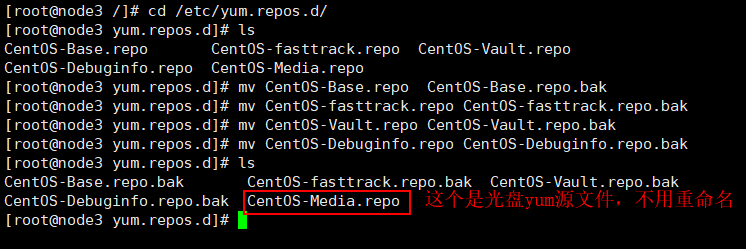
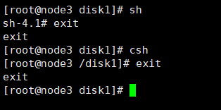
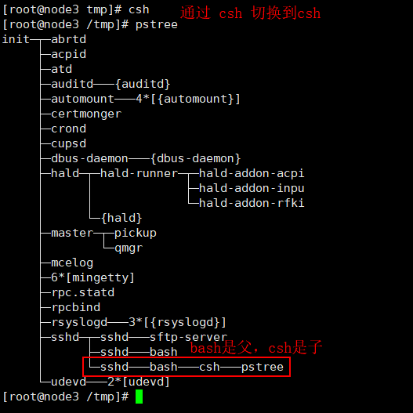
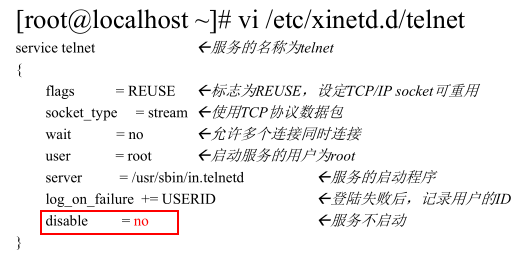
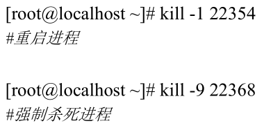
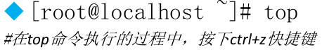

> [Linux系列教程](https://www.cnblogs.com/ysocean/tag/Linux%E7%B3%BB%E5%88%97%E6%95%99%E7%A8%8B/)

## Linux常用命令之文件和目录处理命令

### 1、Linux命令的普遍语法格式

命令格式： 命令 【-选项】【参数】
　　例子：　　 ls -la /etc
　　说明：    ①、个别命令使用不遵循此格式，【】这种符号表示可以省略
　　　　　　②、当有多个选项时，可以写在一起
　　　　　　③、简化选项(一般用一个-)与完整选项（一般用两个--）
　　　　　　　　  比如 ls  -a 等于 ls  --all

### 2、目录处理命令

#### 一、显示目录文件命令：ls

功能描述：显示目录文件

语法： ls 选项【-ald】【文件或目录】

​				-a 显示所有文件，包括隐藏文件

　　　　-l 详细信息显示

　　　　-d 仅显示目录名，而不显示目录下的内容列表

　　　　-h 人性化显示（hommization）

　　　　-i 查看任意一个文件的i节点（类似于身份证唯一信息）

​    			-t 用文件和目录的更改时间排序；可以用第一个显示的文件判断最近修改的文件

> 注意：. 开头的文件除非是目录，否则就是隐藏文件

#### 二、创建目录命令：mkdir

功能描述：创建新目录

语法： mkdir 【-p】【目录名】

　　　　　-p 递归创建

例子：创建单个目录：mkdir /tmp/vae.txt

　　　创建多个目录：mkdir /tmp/a.txt /tmp/b.txt

#### 三、切换目录命令：cd

功能描述：切换目录

语法： cd【目录名】

例子：切换到指定目录：cd /tmp/vae

　　　回到上一级目录：cd .. 

　　　还是在当前目录：cd .

　　　返回上两级目录：cd ../..

　　　返回进入此目录之前所在的目录：cd  - 

#### 四、内部命令和外部命令

用type命令可以分辨内部命令和外部命令，通过echo $PATH命令查看外部命令的存储路径

#### 五、显示当前目录命令：pwd

功能描述：显示当前目录

语法： pwd

例子：显示当前目录：pwd

#### 六、删除空目录命令：rmdir

功能描述：删除空目录（如果目录不存在文件则不能删除）

语法： rmdir 【空目录名】

例子：删除指定空目录：rmdir /tmp/a

#### 七、复制文件或目录命令：cp

功能描述：复制文件或目录

语法：cp -rp 【原文件或目录】【目标目录】

　　　-r  复制目录

　　　-p  保留文件属性

#### 八、剪切文件或目录命令：mv

功能描述：剪切文件、改名

语法： mv【原文件或目录】【目标目录】

例子：在 tmp 目录下创建目录 tmp1 ，然后在 tmp1 目录下创建目录 tmp1_1,然后 命令 mv /tmp/tmp1/tmp1_1 /tmp 将 tmp1目录下的 tmp1_1 剪切到 tmp 目录下

#### 九、删除文件或目录命令：rm

功能描述：剪切文件、改名

语法： rm -rf 【文件或目录】

　　　　　-r  删除目录

　　　　　-f  强制执行

例子：在 tmp 目录下有两个目录 tmp1 和 tmp1_1,rm -r tmp1_1 是删除这个目录，但是需要输入 y 来确认

​			rm -rf tmp1 是强制删除 tmp1 目录，不需要输入 y 来确认，但是容易误删文件，没有反悔的机会

​			rm -rf tmp1 tmp2 同时删除两个文件

### 3、文件处理命令

#### 一、创建空文件命令：touch

功能描述：创建空文件

语法： touch 【文件名】

例子：在 tmp 目录下创建 tmp.log 文件

> **创建文件时，文件名不要有空格，不然就是创建了 两个文件**
>
> touch progrom files  这是创建了两个文件，progrom 和 files

> **如果我们想创建一个文件名为 progrom files ，应该用引号括起来(尽量避免文件名包含空格)**
>
> touch "progrom files"

#### 二、显示文件内容命令（适合内容较少的文件）：cat

功能描述：显示文件内容（只能显示内容较少的文件）

语法： cat【文件名】

　　　　　-n 显示文件行号

例子：通过不加参数-n和加参数-n，显示/etc/issue的内容

#### 三、反向显示文件内容命令（适合内容较少的文件）：tac

功能描述：显示文件内容（只能显示内容较少的文件）

语法： tac【文件名】

例子：显示/etc/issue的内容

#### 四、分页显示文件内容命令（不能向前翻页）：more

功能描述：分页显示文件内容

语法： more【文件名】

​			（空格）或f 翻页（一页一页的往后显示）

　　　（Enter） 换行（一行一行的往后显示）

　　　 q 或 Q 退出

例子：查看etc目录下的 services 文件信息：more /etc/services

#### 五、分页显示文件内容命令（可以前后翻页）：less

功能描述：分页显示文件内容

语法：less【文件名】

　　　（空格）或f 或PgDn 翻页（一页一页的往后显示）PgUp向前翻页

　　　（Enter） 换行或向下的箭头（一行一行的往后显示）向上的箭头（一行一行的往前显示）

　　　q 或 Q 退出

​			输入“/想搜索的字符“，然后回车键

例子：查看etc目录下的 services 文件信息：less/etc/services。主要是最后提到的搜索功能，我们在进入命令之后，输入 /想搜索的字符，然后回车键

#### 六、显示文件内容命令（指定行数）：head

功能描述：显示文件的前面几行　

语法： head【文件名】

　　　　-n  指定显示的行数

　　　　不加 -n 默认显示前 20 行数据

例子：显示 etc目录下的 services 文件前面 20 行  head -n 20 /etc/services

#### 七、反向文件内容命令（文件即时更新后也能动态显示，多用于日志文件显示）：tail

功能描述：显示文件的后面几行　

语法： tail【文件名】

　　　-n  指定显示的行数

　　　-f 动态显示文件末尾内容（即文件实时变化，那么显示内容也会随之变化）

例子：显示 etc目录下的 services 文件后面 20 行  tail -n 20 -f /etc/services

> 注意：如果我们想结束加上 -f显示的tail命令，通过 Ctrl+C。

### 总结

Linux系统中的文件和目录处理命令，显示目录文件信息 `ls` 这是我们最常用的，然后创建目录命令 `mkdir`,切换目录命令 `cd`，显示当前目录 `pwd`，删除空目录命令 `rmdir`，这个命令用的不多，删除目录可以用 rm 命令，rm 如果加上 -f 参数，那将没有提示，直接将文件从系统中删除，需要特别注意，以免删除系统文件。复制文件或目录命令 `cp`，剪切文件或目录命令 `mv`，注意`mv`命令在剪切后可以直接更改文件或目录名称。

文件处理命令，创建空文件 `touch`,显示文件内容的命令有很多，首先`less`命令能显现文件内容比较多的文件，而且能前后翻页显示。需要动态监视文件内容的变化，比如某个日志文件，可以通过 tail 加上-f参数动态显示文件末尾的内容。

## Linux常用命令之链接命令和权限管理命令

### 1、链接命令

#### 一、生成链接文件命令：ln

功能描述：生成链接文件

语法： ln -s 【源文件】【目标文件】

　　　　-s 　　 创建软链接

　　　　不加 -s  创建硬链接

### 2、权限管理命令

#### 一、更改文件或目录权限命令：chmod

功能描述：改变文件或目录权限

语法： chmod 【{ugoa}{+-=}{rwx}】【文件或目录】

　　　　　　　　【mode=421】【文件或目录】

　　　　　　　　 -R 递归修改

> 注意：不是每一个Linux用户都有权限更改某个文件或目录权限，能更改文件或目录权限的只有两种用户
>
> **①、文件的所有者。我们通过ls命令查看某个文件的详细信息，可以看到该文件的所有者。**
>
> **②、root用户，这不用多说，root用户是linux系统权限最大的用户。别人不能干的事，root用户都能干。**

对于上面的语法 chmod 【{ugoa}{+-=}{rwx}】【文件或目录】，ugoa分别是：u:表示所有者，g:表示所属组，o:表示其他人，a:表示所有人。而rwx表示的意思如下


对于【mode=421】【文件或目录】，这是我们将权限用数字表示，其中 r 表示4，w表示2，x表示1，分别是2的0次方，1次方，2次方。那么我们可以这样理解：具有 rwx 权限的数字就是 7，具有 rw- 权限的数字是 6，具有 r-- 权限的数字是 4。

例1：我们赋予 tmp 目录下的 tmp.log 所有者 x 的权限；赋予 所属组 w 权限，其他人 w 权限。

　　　　　　chmod u+x /tmp/tmp.log

　　　　　　chmod g+w,o+w /tmp/tmp.log

上面例子改为用 数字来操作，要给 tmp.log赋予的文件权限是 rwxrw-rw-，用数字表示是766。chmod 766 tmp.log

递归赋予权限，也就是加上 -R 参数给指定目录下的所有文件或目录赋予指定权限。

例2：给 tmp 目录下所有文件和目录赋予 776 的权限

​			chmod -R 776 /tmp

#### 二、改变文件或目录所有者命令：chown

功能描述：改变文件或目录的所有者

语法： chown 【用户】【文件或目录】

> 注意：能更改文件或目录的所有者用户是 root

#### 三、改变文件或目录所属组命令：chgrp

功能描述：改变文件或目录的所属组

语法： chgrp【用户组】【文件或目录】

> 注意：能更改文件或目录的所有者用户是 root

#### 四、显示、设置文件的缺省权限命令：umask

功能描述：显示、设置文件的缺省权限

语法： umask 【-S】

​			-S 以rwx形式显示新建文件的缺省权限

### 总结

讲解了链接命令ln和权限管理命令。对于链接命令，注意 ln -s 表示创建软链接，不加-s表示创建硬链接，软链接和硬链接的区别，软链接类似与 windows 的快捷方式，有一个明显的箭头指向，而指向的是源文件。而硬链接想象为 cp -p +同步更新，也就是说创建的硬链接和原文件保持一样的属性，而且原文件更改了，硬链接也会更改。

接着介绍几个权限管理命令，对于权限，够用就好，很多新手在进行权限操作是，上来就是 chmod 777 【文件或目录】，虽然省事，但是显然是不够准确的，chmod命令可以更改文件或目录权限，chown命令可以改变文件或目录所有者，chgrp命令可以改变文件或目录所属组。需要注意的是，后面两个命令只能由root用户来完成，而chmod命令除了root用户能完成，还有所更改文件或目录的所有者。

## Linux常用命令之文件搜索命令

### 1、最强大的搜索命令：find

功能描述：进行各种花式文件搜索

语法：find【搜索范围】【匹配条件】

> **Linux搜索和windows是有明显区别的，Linux严格区分文件大小写**

#### 一、根据 文件或目录名称 搜索

find 【搜索目录】【-name或者-iname】【搜索字符】：-name和-iname的区别一个区分大小写，一个不区分大小写

①、find /etc -name init  (精准搜索，名字必须为 init 才能搜索的到)

②、find /etc -iname init  (精准搜索，名字必须为 init或者有字母大写也能搜索的到)

③、find /etc -name *init  (模糊搜索，以 init 结尾的文件或目录名) 

④、find /etc -name init??? (模糊搜索，？ 表示单个字符，即搜索到 init___)

#### 二、根据 文件大小 搜索

比如：在根目录下查找大于 100M 的文件

find / -size +204800

这里 +n 表示大于，-n 表示小于，n 表示等于

1 数据块 == 512 字节 ==0.5KB，也就是1KB等于2数据块

100MB == 102400KB==204800数据块

#### 三、根据 所有者和所属组 搜索

①、在home目录下查询所属组为 root 的文件

　　find /home -group root

②、在home目录下查询所有者为 root 的文件

　　find /home -user root

#### 四、根据 时间属性 搜索

find 【路径】【选项】【时间】

选项有下面三种：-amin 访问时间

　　　　　　　　-cmin  文件属性被更改

　　　　　　　　-mmin 文件内容被修改

时间：+n,-n,n分别表示超过n分钟，n分钟以内和n分钟

范例：在 /etc 目录下查找5 分钟内被修改过属性的文件和目录

　　　　　find /etc -cmin -5

#### 五、根据 文件类型或i节点 搜索

-type 根据文件类型查找：f表示文件，d表示目录，l表示软链接

范例：查找 /home 目录下文件类型是目录的  find /home -type l

　　-inum 根据i节点查找

范例：查找 /tmp 目录下i节点为400342的文件或目录 find /tmp -inum 400342

#### 六、组合条件 搜索

这里有两个参数：

①、-a 表示两个条件同时满足（and）

②、-o 表示两个条件满足任意一个即可（or）

范例：查找/etc目录下大于80MB同时小于100MB的文件

　　find /etc -size +163840 -a -size -204800

### 2、在文件资料库中查找文件命令：locate

功能描述：在文件资料库中查找文件

语法：locate【文件名】

　　　-i 不区分大小写

> **这里和 find 命令是有区别的，find是全盘检索，而locate 是在文件资料库中进行搜索。所以locate命令的执行要比find命令执行速度快很多。但是这里有个问题，文件资料库是需要不断更新的。我们新创建的文件如果不更新 文件资料库，使用 locate 是查找不到的。**
>
> **updatedb 手动更新资料库，但是对于/tmp目录下的新建文件，是更新不到文件资料库的，因为/tmp目录不属于文件资料库的收录范围。**　

### 3、搜索命令所在的目录及别名信息：which

功能描述：搜索命令所在的目录及别名信息

语法：which【命令】

范例：查询 ls 命令所在目录以及别名信息

### 4、搜索命令所在的目录及帮助文档路径：whereis

功能描述：搜索命令所在的目录及帮助文档路径

语法：whereis【命令】

范例：查询 ls 命令所在目录以及帮助文档路径

### 5、在文件中搜寻字符串匹配的行并输出：grep

功能描述：在文件中搜寻字符串匹配的行并输出

语法：grep -iv 【指定字符串】【文件】

　　　　　  -i 不区分大小写

　　　　　 -v 排除指定字符串

范例：查找 /root/install.log 文件中包含 mysql 字符串的行，并输出

grep mysql /root/install.log

### 总结

find是用的最多的也是功能最强大的文件或目录搜索命令，和另一个搜索命令locate的区别是，find命令是全盘搜索，刚创建的文件也能搜索的到，而locate是在文件资料库中进行搜索，对比find命令搜索速度快很多，但是新创建的文件如果没有收录到文件资料库中，使用locate命令是搜索不到的，再就是/tmp目录是不收录到文件资料库的，也就是说使用locate命令搜索不到在/tmp目录下的文件。

然后介绍搜索命令所在的目录以及别名信息which，搜索命令所在的目录以及帮助文档路径whereis，最后一个命令grep和前面搜索文件或目录命令是不同的，grep是在文件中搜索匹配的字符串，是在文件中进行内容搜索，这个命令后面用到的比较多，需要记住

## Linux常用命令之帮助和用户管理命令

### 1、帮助命令

#### 一、获得命令或配置文件帮助信息：man

功能描述：获得帮助信息

语法： man【命令或配置文件】

范例1：查看 ls 命令的帮助信息：man ls

#### 二、获得shell内置命令的帮助信息：help

功能描述：获得shell内置命令帮助信息

语法： help【shell内置命令】

#### 三、获得命令的中文帮助信息：--help

命令  --help

### 2、用户管理命令

#### 一、添加新用户：useradd

功能描述：添加新用户

语法： useradd【用户名】

范例：添加用户tom:  useradd tom

#### 二、设置用户密码：passwd

功能描述：修改用户的密码

语法： passwd【用户名】

> 注意：root用户能修改任何用户的密码。而普通用户只能修改自己的密码，而且密码要符合密码规则，不然修改不了

#### 三、查看登录用户简单信息：who

功能描述：查看登录用户简单信息

语法：who

#### 四、查看登录用户详细信息：w

功能描述：查看登录用户详细信息

语法：w

## Linux常用命令之压缩和解压缩命令

### 1、压缩解压缩格式  .gz 

#### 一、将文件压缩为 .gz 格式,只能压缩文件：gzip

功能描述：压缩文件，压缩后格式为.gz

语法： gzip【需要压缩的文件】

压缩后文件格式：.gz

> 注意：只能压缩文件，不能压缩目录；压缩完后不保留原文件

#### 二、将 .gz 文件解压：gunzip

功能描述：将格式为.gz的压缩文件解压

语法： gunzip【压缩文件名】

> 解压后不保留原文件

### 2、压缩解压缩格式 .tar.gz 

#### 一、将文件或目录压缩为 .tar.gz 格式：tar -zcf

功能描述：将文件压缩为.tar.gz格式

语法： tar 选项【-zcf】【压缩后文件名】【目录】　　　

　　　　 　　　-c 打包
　　　　　　 　-v 显示详细信息
　　　　 　　　-f  指定文件名
　　　　 　　　-z 打包同时压缩

压缩后文件格式：.tar.gz

范例：在/tmp目录下创建a目录，然后在a目录下创建文件a.txt，通过tar -zcvf a.tar.gz a 命令将a目录压缩为a.tar.gz文件

> 与前面的gzip命令不同，通过tar压缩后是保留原文件或原目录的

#### 二、将 .tar.gz 文件解压：tar -zxf

功能描述：将格式为.tar.gz的压缩文件解压

语法：tar 选项【-zxf】【.tar.gz的压缩文件名】【指定解压后的文件存放目录，默认当前目录】

　　　　	-x 解包

　　　　　-v 显示详细信息

　　　　　-f 指定解压文件

　　　　　-z 解压缩

范例：将a.tar.gz文件解压：tar -zxf a.tar.gz

### 3、压缩解压缩格式 .zip

#### 一、将文件或目录压缩为 .zip 格式：zip

功能描述：将文件或目录压缩为.zip格式

语法： zip 选项【-r】【压缩后文件名】【文件或目录】

　　　　　　　-r 压缩目录

压缩后文件格式：.zip

范例：在/tmp目录下创建a目录，然后执行命令：zip -r a.zip a，将a目录压缩为a.zip文件

#### 二、将 .zip 文件解压：unzip

功能描述：将格式为.zip的压缩文件解压

语法：uzip【.zip的压缩文件名】

范例：将a.zip文件解压：unzip a.zip

> 解压之后也是保留原文件的

### 4、压缩解压缩格式 .bz2

#### 一、将文件压缩为 .bz2 格式，只能压缩文件：bzip2

功能描述：将文件压缩为.bz2 格式

语法： bzip2 选项【-k】 【文件】

　　　　　　　　-k　　产生压缩文件后保留原文件

压缩后文件格式：.bz2

范例：在/tmp目录下创建a文件，然后执行命令：bzip2 -k a，将a文件压缩为a.bz2文件

#### 二、将 .bz2 文件解压：bunzip2

功能描述：将格式为.bz2的压缩文件解压

语法：bunzip2 选项【-k】 【压缩文件】

　　　　　　-k　　解压缩文件后保留原文件

范例：将a.bz2 文件解压：bunzip2 a.bz2

### 总结

几种压缩文件和解压缩文件命令，使用的最多的是tar命令，在很多源码包都是.tar.gz的格式，通过 tar -zxvf 能完成解压。对于.zip格式的文件，使用unzip 命令解压，最后对于比较大的文件，使用bunzip2命令来进行解压。

## Linux常用命令之网络和关机重启命令

### 1、网络命令

#### 一、给指定用户发送信息：write

功能描述：给指定用户发送信息，以Ctrl+D 保存结束

语法： write【用户名】

范例：给vae用户发送信息：write vae

#### 二、给所有用户发送广播信息：wall

功能描述：发送广播信息

语法： wall【信息内容】

范例：发送广播信息：wall hello linux!!!

#### 三、测试网络连通性：ping

功能描述：测试网络连通性

语法： ping 【-c n】【IP地址】

　　　　　　-c n是指定发送次数，如果不指定次数，那么将不断发送连接信息

范例：测试与百度的连接：ping www.baidu.com

#### 四、查看和设置网卡信息：ifconfig

功能描述：查看和设置网卡信息

语法：ifconfig 【网卡名称】【IP地址】

范例1：查看本机网卡信息：ifconfig

范例2：查看eth0 的网卡信息：ifconfig eth0 

#### 五、查看发送电子邮件：mail

功能描述：查看发送电子邮件

语法：mail【用户名】

范例：给root用户发送邮件：mail root

#### 六、列出所有登录系统的用户信息：last

功能描述：列出所有登录过系统的用户信息

语法：last

范例：查看所有登录系统的用户：last

#### 七、显示数据包到主机间的路径：traceroute

执行权限：所有用户

功能描述：显示数据包到主机间的路径

语法：traceroute 【IP地址】

#### 八、显示网络相关信息：netstat

功能描述：显示网络相关信息

语法：netstat【选项】

　　　　　　-t　　TCP协议

　　　　　　-u　　UDP协议

　　　　　　-l　　监听

　　　　　　-r　　路由

　　　　　　-n　　显示IP地址和端口号

范例1：netstat -tlun 查看本机监听的端口

范例2：netstat -an 查看本机所有的网络连接

范例3：netstat -rn 查看本机路由表

#### 九、配置网络：setup

功能描述：配置网络，比如IP地址，子网掩码等

语法：setup

#### 十、挂载命令：mount

功能描述：给光盘、U盘等外界存储设备分配类似于windows系统的盘符，便于访问

语法：mount 【-t 文件系统】设备文件名 挂载点

将光盘挂载到 /mnt/cdrom 目录下：mount -t iso9960 /dev/sr0 /mnt/cdrom。-t iso9660 可以省略

卸载：umount /dev/sr0

### 2、关机重启命令

#### 一、shutdown命令(推荐使用)

功能描述：进行关机重启操作

语法：shutdown 【选项】 【时间】

　　　　　　-c　　取消前一个关机命令

　　　　　　-h　　关机

　　　　　　-r　　重启

范例1：马上关机：shutdown -h now

范例2：晚上八点半关机：shutdown -h 20:30

> 注意：推荐使用该命令进行关机，此命令关机之前会正确的关闭系统的服务。

#### 二、其他关机命令

①、halt

②、poweroff

③、init0

#### 三、其他重启命令

①、reboot

②、init6

#### 四、退出登录命令

①、logout

### 总结

网络和关机重启命令，网络命令用的比较多的测试网络连通性ping,查看网卡信息，比如查看本机IP地址ifconfig，配置网络setup等等。关机重启命令记住shutdown的用法就好了，shutdown命令在执行关机的时候会正确的关闭系统的相关服务，而别的关机重启命令在这里不推荐。

## Linux文本编译器vim

### 1、vim 的工作模式


vim 主要有三种工作模式，分别是命令模式、插入模式和编辑模式，输入 vi 文件名 我们可以进入命令模式，输入字符 i或者a或者o我们可以进入插入模式，进入插入模式之后我们可以进行文件的内容修改，修改完成之后，可以输入 :wq 可以保存退出。

### 2、插入命令


### 3、定位命令


### 4、删除命令


### 5、复制和剪切命令 


### 6、替换和取消命令


### 7、搜索和搜索替换命令


### 8、保存和退出命令


###  9、vim 高级操作


## Linux软件包管理之RPM命令

### 1、Linux软件包分类

#### 一、源码包

源码包能直接看到源码，安装时需要人为手工设置安装位置，一般是/usr/local/软件名/。源码包的升级版——脚本安装包，人为的改动源码使其有安装界面。

优点：

　	①、开源，如果有足够的能力，可以直接修改源代码。

　　②、安装时可以自由选择所需的功能。

　　③、软件是编译安装，所以更加适合自己的系统，更加稳定也效率更高。

　　④、卸载方便，直接删了你安装软件的那个目录就好了。

缺点：

　　①、安装步骤较多，尤其安装较大的软件集合时，容易出现拼写错误。

　　②、编译时间过长，比后面讲的二进制安装时间长。

　　③、因为是编译安装，安装过程中一旦报错新手很难解决。

#### 二、二进制包

二进制包最要包括centos中的rpm包。rpm包有默认安装位置。/etc/ 配置文件安装目录；/usr/bin/ 可执行的命令安装目录；/usr/lib/ 程序所使用的函数库保存位置；/usr/share/doc/ 基本的软件使用手册保存位置；/usr/share/man/ 帮助文件保存位置。

优点：

　　　①、包管理系统简单，只通过几个命令就可以实现包的安装、升级、查询和卸载。

　　　②、安装速度比源码包快很多。

缺点：CentOS-6.8-x86_64-bin-DVD1.iso

　　　①、已经经过编译了，看不到源代码。

　　　②、功能选择不如源代码包灵活。

　　　③、安装过程中有很多依赖的包，依赖性不好解决。

### 2、rpm 包命名规则

我们以 httpd-2.2.15-53.el6.centos.x86_64.rpm 文件为例来看rpm包的命名规则。

　　①、httpd:软件包名

　　②、2.2.15：软件版本

　　③、15：软件发布的次数

　　④、el6.centos：适合的Linux平台

　　⑤、x86_64：适合的硬件平台，这里表示64位。

　　⑥、rpm：rpm包的扩展名，注意Linux是没有扩展名的概念，这里是告诉管理员这是一个rpm包文件。

### 3、rpm包安装


范例：以安装 httpd-2.2.15-53.el6.centos.x86_64.rpm 为例：

进入到该rpm文件的挂载目录 /mnt/cdrom/Packages，执行命令：rpm -ivh httpd-2.2.15-53.el6.centos.x86_64.rpm

注意：这种安装方法可能需要先安装各种依赖，安装过程特别繁琐，后面讲解yum安装会简单的多

### 4、rpm包升级


### 5、rpm包卸载


### 6、查询rpm包是否安装


### 7、查询软件包的详细信息


### 8、查询软件包的安装位置　　


### 9、查询系统文件属于哪个RPM包


### 10、查询软件包的依赖性


### 总结

rpm包的命名规则、安装、升级、卸载等，还有如何查询rpm包的相关信息。如果大家使用rpm命令手动安装某个软件包，会发现安装遇到到的依赖让人痛不欲生，安装一个rpm时会要先先安装某个依赖的rpm，而安装这个依赖的rpm包是可能又必须先安装它所依赖的。在实际操作中，是不会使用rpm命令手动安装软件包的，那么有更简单的方法吗？答案是肯定的，下一篇博介绍RPM包管理——yum在线管理。

## Linux软件包管理之yum在线管理

### 1、yum在线管理

yum（全称为 Yellow dog Updater, Modified）是一个在Fedora和RedHat以及SUSE中的Shell前端软件包管理器。基于RPM包管理，能够从指定的服务器自动下载RPM包并且安装，**可以自动处理依赖性关系，并且一次安装所有依赖的软体包**，无须繁琐地一次次下载、安装。yum提供了查找、安装、删除某一个、一组甚至全部软件包的命令，而且命令简洁而又好记。 

yum管理是从指定的服务器（网络yum源）下载，要有网络或者自己手动配置一个本地yum源（不需要网络，后面会讲解如何手动配置），而且最关键的是yum能帮解决依赖性关系。

### 2、网络 yum 源

在安装好的Linux系统中，进入到 /etc/yum.repos.d/ 目录：


一般来讲，以 .repo 结尾的文件都是yum源。如果能联网，会使用CentOS-Base.repo作为默认的yum源，如果不能联网我们使用 CentOS-Media.repo 作为本地光盘yum源。

通过vim 命令打开 CentOS-Base.repo：


查看红色框住的内容：


mirrorlist和baseurl的地址就是用来下载rpm包的地址，我们使用其中一个就好了。由于默认的地址都是国外的网站，如果嫌网速慢的话，可以更改为国内的yum源地址。

比如阿里的：http://mirrors.aliyun.com/repo/Centos-7.repo

### 3、光盘 yum 源搭建步骤

#### ①、挂载光盘


#### ②、让网络 yum 源失效

原理就是让以 .repo 文件都不存在，这里我们将 /etc/yum.repos.d 目录下的 .repo 文件都重命名为.repo.bak



#### ③、修改光盘yum源文件

修改上面的 CentOS-Media.repo 文件


#### ④、输入yum list 可以查看光盘yum源里面的软件包


### 4、常用的 yum 命令 

#### ①、查询所有可用软件包列表:yum list

注意：此命令是在配好的yum源服务器上去查询所有可用的软件包

#### ②、查询服务器上和关键字相关的软件包：yum search 关键字

#### ③、yum 安装软件包：yum -y install 包名

选项： -y  表示自动回答 yes（如果不加，每安装一个软件都会让你确认是否安装）

　　　　　install  表示安装

范例：这里以安装编译器 gcc 为例（后面演示安装源码包必须要用到此编译器）：yum -y install gcc

没有报错，出现如下安装信息则说明安装成功；或者在安装完成之后，输入 rpm -q gcc 弹出如下界面表示安装成功

#### ④、yum 升级软件包：yum -y update 包名

注意：如果不指定包名，那么将会升级系统中所有的软件包，包括Linux内核。而Linux内核升级之后是需要在本地进行一些配置才能开机，如果是远程连接服务器进行Linux内核升级，那么是不可能启动服务器的。

#### ⑤、yum 卸载软件包：yum -y remove 包名

注意：卸载和升级也一样，而且由于软件包很多都有依赖性，你卸载A，而B和C都依赖于A，那么B和C都会卸载。假如C和Linux某个系统软件有依赖，而C也卸载掉了，可能造成某个系统功能不能使用。所以我们在卸载软件的时候一定要注意。

### 5、yum软件组管理


安装某个软件组，会比我们一个一个安装某个软件包要方便的多。


这是在远程的桌面显示的是中文信息，如果直接进入服务器查询，显示的便是英文，我们需要什么直接安装即可。

### 总结

本文讲解了网络yum源和光盘yum源的搭建步骤，详细介绍了相关的yum命令，yum 最重要的解决了软件包依赖性问题。在安装软件时，使用yum命令将会简单方便很多，下篇博客将介绍源码包以及如何安装源码包。

## Linux软件包管理之源码包、脚本安装包

### 1、源码包和RPM包的区别

源码包开源，如果有足够的能力，可以直接修改源代码。安装时可以自由选择所需的功能。软件是编译安装，所以更加适合自己的系统，更加稳定也效率更高。卸载方便，直接删了安装软件的那个目录就好了。但是安装步骤较多，尤其安装较大的软件集合时，容易出现拼写错误。编译时间过长，比后面讲的二进制安装时间长。因为是编译安装，安装过程中一旦报错新手很难解决。

rpm包包管理系统简单，只通过几个命令就可以实现包的安装、升级、查询和卸载。安装速度比源码包快很多。但是由于源码已经经过编译了，看不到源代码。功能选择不如源代码包灵活。安装过程中有很多依赖的包，依赖性不好解决。

这里由于安装位置的不同，安装之后会带来一些很明显的区别。

#### RPM包和源码包默认安装位置：


rpm包也能手工更改安装位置，但是更改位置之后会造成一些影响。

**源码包安装位置：**

```java
/usr/local/软件名/
```

#### 由于安装位置不同带来的影响

①、rpm包安装的服务可以使用系统服务管理命令（service）来管理。

比如 rpm 包安装的apache 的启动方法是：

```shell
①、/etc/rc.d/init.d/httpd start
②、service httpd start
```

第二种命令是第一种命令的简化形式。这是红帽专有命令。service 会去 rpm 包默认的安装位置去找可执行文件，所以service类似的启动服务管理命令只能管理rpm安装包。如果更改了rpm包的默认安装位置，可能造成通过service启动服务失败。

Linux要启动一个执行文件，都应该是用绝对路径来启动，后面讲的配置好环境变量之后能直接通过文件名来启动，其实原理也是通过环境变量找到的绝对路径。而 /etc/rc.d/init.d/ 目录是所有rpm包安装的服务执行文件存放目录。


提示：绿色的都是可执行文件。

②、源码包启动服务

由于源码包没有安装到指定的路径中，源码包安装的服务不能被类似service服务管理命令管理，这里就只能通过绝对路径的形式来启动了。

```shell
/usr/local/apache2/bin/apachectl start
```

### 2、源码包安装

#### ①、安装准备

一、首先在Linux系统安装gcc编译器


二、下载源码包

#### ②、安装注意事项

一、源代码建议保存位置：/usr/local/src

二、软件安装位置：/usr/local

三、如何确定安装过程报错：安装过程停止，并出现error、warning或no的提示。注意源码包安装过程一旦报错是很难解决的，需要我们去修改源码。所以从正规网站上下载别人验证过的源码包，一般是不会报错的。

#### ③、安装源码包

将下载好的源码包通过工具复制到Linux系统中，然后解压，最后进入到解压目录，因为后面很多命令都需要在解压之后的目录中操作。


查看INSTALL 文件，查看安装说明：


**第一步：软件配置与检查 ./configure**

①、定义需要的功能选项。

②、检测系统是否符合安装要求。

③、把定义好的功能选项和检测系统环境的信息都写入Makefile 文件，用于后续的编辑

```shell
./configure --prefix=/usr/local/apache2
```

通过 -- prefix 定义源码包安装位置，后面的apache2（由于通过yum已经安装了apache,所以这里命名为apache2）可以任意命名。


执行完成如果没有出现报错信息，则准备工作完成。

**第二步：执行编译 make ,将源码包编译为机器码**


这一步安装的时长取决于源码包的大小以及机器的性能。如果安装出错，可以执行 make clean，清空产生的所有临时文件。

注意：这一步执行完成之后并不会在 /usr/local 下生成 apache2目录。但是在httpd源码包解压目录生成了Makefile 文件。

**第三步：执行 make install ，编译安装**


**第四步：安装完成之后，启动该服务**

查看源码包解压之后的目录 INSTALL 文件，可以知道启动命令


```shell
/usr/local/apache2/bin/apachectl start
```

启动发现报如下错误：这是 80 端口被占用了。因为用 yum 安装过rpm包的httpd，这里停掉 rpm包的httpd就好了。


### 3、源码包卸载

源码包不需要额外的卸载命令，直接删除安装目录即可，不会有任何的垃圾文件遗留。


### 4、脚本安装包

Linux系统从本质上讲只有rpm包和源码包，是没有脚本安装包的。脚本安装包，根本上就是源码包。上面刚刚讲了源码包的安装方法，发现还是比较麻烦的。为了简化源码包的安装，人为的修改源码包，使其变成自动安装的脚本，只需要执行脚本定义简单的参数就能完成安装。具体解释如下：

①、脚本安装包并不是独立的软件包类型，基本上都是源码包。

②、脚本安装包是人为的把安装过程写成了自动安装的脚本，只要执行脚本，定义简单的参数，就可以完成安装。

③、脚本安装包类似于windows下软件的安装方式。

这里以 Webim 的安装为例来介绍如何安装脚本安装包：

Webim 是一个基于 Web 的Linux 系统管理界面，安装完成之后，就可以通过图形化的方式来设置用户账户、DNS、文件共享等服务。

**第一步：下载 Webim 脚本安装包**

下载地址：http://sourceforge.net/projects/webadmin/files/webmin

**第二步：将下载的文件通过工具复制到Linux系统中，并解压**


**第三步：进入到解压之后的目录，并执行里面的脚本安装文件 ./setup.sh** 


出现如下界面安装成功：


安装完成之后，输入 虚拟机的ip地址:20000，后面的端口号20000根据你安装实际情况来，进入到 Webim 操作界面


### 总结

源码包和rpm包由于安装位置的不同造成后面启动相关服务的方法的区别。脚本安装包其实就是人为的修改源码包，使其成为一个自动安装的脚本，安装过程简单。

## Linux用户和用户组管理之相关配置文件

### 1、用户信息文件：/etc/passwd

通过 vim /etc/passwd 命令，打开 passwd 文件：


上面的每一行代表一个用户，以第一行为例：

```shell
root:x:0:0:root:/root:/bin/bash
```

上面的root用户通过 ： 分隔为 7 个字段。

①、第一个字段：root 表示用户名称

②、第二个字段：x 表示密码标志，真正的密码是存储在 /etc/shadow 文件中，下面详细讲解。

③、第三个字段：UID,用户ID。这里我们需要说明的是在Linux系统中不一定root用户是超级用户，用户id为0的才是超级用户。

　　　0：表示超级用户，权限最大的用户。

　　　1-499：表示系统用户（伪用户），伪用户是系统用来启动相关服务和命令的，不能用来登录系统，而且不能删除，删除伪用户会造成一些命令不能使用。

　　　500-65535：普通用户。Linux内核2.6以后是可以支持232个用户，基本上是不用担心用户不够的。

④、第四个字段：GID,用户初始组ID。这里需要理解初始组和用户组的概念，初始组就是指用户一登录就立刻拥有这个用户组的相关权限，每个用户的初始组只能有一个，一般就是和这个用户的用户组相同的组名作为这个用户的初始组。附加组值用户可以加入多个其他的用户组，并拥有这些组的权限，附加组可以有多个。

⑤、第五个字段：用户说明

⑥、第六个字段：家目录。

　　　　普通用户：/home/用户名/

　　　　超级用户：/root/

⑦、第七个字段：登录之后的 shell。shell后面会详细介绍，这里简单来说shell就是Linux的命令解释器。

### 2、用户密码文件：/etc/shadow 

通过 vim /etc/shadow 命令，打开 shadow文件：


同理上面的每一行和 passwd 文件一样，都是表示一个用户。passwd描述的是用户信息，shadow文件描述的是用户密码。还是以第一行为例：

```shell
root:$6$bo3LXGTQ8SwsRa6J$.7qTM2GT8EmA8YSkHtIqlVefcUyOTdv3EBwJLA32U0qL/YHIOe0SQiacsNq4tSAN2zVbp0bvlOFP.sK0euPIg/:17324:0:99999:7:::
```

上面的root用户通过 ： 分隔为 9 个字段。

①、第一个字段：root 表示用户名

②、第二个字段：root用户的登录加密密码。

　　　　一、加密算法升级为 SHA512 散列加密算法

　　　　二、如果密码位是“!!”或者“*”代表没有密码，不能登录，基本上伪用户都是没有密码的

③、第三个字段：密码的最后一次修改日期。使用1970年1月1日作为标准时间，每过一天时间戳加1.

　　　　root 用户的修改日期是17324。这里我们通过 date -d "1970-01-01 17324 days"进行换算：


④、第四个字段：两次密码的修改间隔时间（和第三字段相比）

⑤、第五个字段：密码有效期（和第三字段相比）

⑥、第六个字段：密码修改到期前的警告天数（和第五个字段进行比较）

⑦、第七个字段：密码过期后的宽限天数（和第五个字段进行比较）

​				0：代表密码过期后立即失效

　　　　-1：代表密码永远不会失效

⑧、第八个字段：账号失效时间（要用时间戳表示）

⑨、第九个字段：保留字段

### 3、用户组信息文件：/etc/group

通过 vim /etc/group 命令，打开 group文件


一般创建一个用户，立即创建一个和用户名相同的用户组，还是以第一行 root 为例：

```shell
root:x:0:
```

①、第一个字段：组名

②、第二个字段：组密码标志，密码文件存放在 /etc/gshadow 中

③、第三个字段：GID，组id

④、第四个字段：组中的附加用户

### 4、用户组密码文件：/etc/gshadow 


这个文件基本上不会用到

①、第一个字段：组名

②、第二个字段：组密码

③、第三个字段：组管理员用户名

④、第四个字段：组中的附加用户

### 5、用户的家目录

①、普通用户：/home/用户名/，一般创建一个新用户就会自动创建该家目录。所有者和所属组都是此用户，权限是700。

②、超级用户：/root/，所有者和所属组都是root用户，权限是550。注意看上去权限是550，其实权限对于超级用户基本上是没有限制的，所以这里给什么权限都没多大区别。

### 6、用户的邮箱

目录是：

```shell
/var/spool/mail/用户名/
```

### 7、用户的模板目录

目录是：

```shell
/etc/skel
```

这个目录是每创建一个新用户，就会在其家目录下自动创建 /etc/skel 目录下的所有文件。

范例：我们在 /etc/skel 目录下创建一个 hello 文件，然后创建一个新用户 test，进入到 test 用户的家目录/home/test 就会看到有 hello 文件。


### 总结

本篇博客介绍了用户管理的相关配置文件，包括用户信息文件/etc/passwd，用户密码文件/etc/shadow；然后介绍了用户组信息文件/etc/group，用户组密码文件/etc/gshadow。用户的家目录，以及用户的模板目录，这些需要了解即可。

## Linux用户和用户组管理之用户管理命令

### 1、添加用户命令：useradd

功能描述：添加新用户

语法： useradd 【选项】【用户名】

　　　		-u UID:手工指定用户的uid

　　　　　-d 家目录:手工指定用户的家目录

　　　　　-c 用户说明:手工指定用户说明

　　　　　-g 组名:手工指定用户的初始组

　　　　　-G 组名:手工指定用户的附加组

　　　　　-s shell:手工指定用户的登录shell，默认是/bin/bash

**注意：添加选项的uid，家目录等等前面的配置文件已经讲解了，实际上创建新用户是不用添加任何选项的，默认就好。**

范例：添加用户tom：useradd tom。


创建一个新用户之后，会在下面文件中自动生成内容：

　　/etc/passwd：生成用户信息

　　/etc/shadow：生成密码信息

　　/etc/group：生成用户组信息

　　/etc/gshadow：生成用户组密码信息

　　/home/tom:创建家目录

　　/var/spool/mail/tom：创建用户邮箱目录


上面出现了很多默认值，用户默认值文件如下：


### 2、修改用户密码：passwd

功能描述：修改用户的密码

语法： passwd 【选项】【用户名】

　　　　　-S　　查询用户密码的密码状态，仅root用户可用

　　　　　-l　　暂时锁定用户。仅root用户可用

　　　　　-u　　解锁用户。仅root用户可用

　　　　　-stdin 可以通过管道符输出的数据作为用户的密码

注意：root用户能修改任何用户的密码，语法为 passwd 用户名。而普通用户只能修改自己的密码，语法为 passwd，后面不能加普通用户名，而且密码要符合密码规则，不然修改不了


### 3、修改用户信息：usermod


### 4、修改用户密码状态：chage


### 5、删除用户命令：userdel

语法：userdel 【-r】用户名

　　　　　-r 删除用户的同时删除用户家目录

执行上面的命令，会自动删除下面的文件：

　　①、删除 /etc/passwd 文件的用户信息

　　②、删除 /etc/shadow 文件的用户密码信息

　　③、删除/etc/group 文件的用户组信息

　　④、删除 /etc/gshadow 文件的用户组密码信息

　　⑤、删除用户的邮件信息 rm -rf /var/spool/mail/用户名

　　⑥、删除用户的家目录 rm -rf /home/用户名

注意：基本上完整的删除一个用户都是要加上 -r 选项的。如何判断是否完整的删除一个用户，只需要从新添加该用户一次，如果报如下错误则没有删除干净

### 6、查看用户id


### 7、切换用户身份 su 


注意：选项 - 千万不能省略，必须要连带用户的环境变量一起切换。从普通用户切换到 root 用户是需要输入密码的，而从root用户切换到普通用户是不需要输入密码的。


### 8、添加用户组：groupadd

语法：groupadd 【选项】组名

　　　　　　-g GID 指定组id

### 9、修改用户组：groupmod

语法：groupmod 【选项】组名

　　　　　　-g GID 修改组id

　　　　　　-n 新组名 修改组名

范例：把组名 group1 修改为 group2

　　　　　　groupmod -n group2 group1

### 10、删除用户组：groupdel

语法：groupdel 组名

### 总结

本篇讲解了管理用户和用户组的命令，包括新建、修改、查看等等。还讲解了切换用户的命令 su，这个命令以后用到的也比较多。那么通过这一篇博客和前面一篇博客，用户和用户组管理就结束了

## Linux权限管理之ACL权限

### 1、什么是 ACL 权限？

比如有如下场景：某大牛在QQ群内直播讲解Linux系统的权限管理，讲解完之后，他在一个公有的Linux系统中创建了一个 /project 目录，里面存放的是课后参考资料。那么 /project 目录对于大牛而言是所有者，拥有读写可执行（rwx）权限，对于QQ群内的所有用户他们都分配的一个所属组里面，也都拥有读写可执行（rwx）权限，而对于 QQ 群外的其他人，那么我们不给他访问/project 目录的任何权限，那么 /project 目录的所有者和所属组权限都是（rwx），其他人权限无。

问题来了，这时候直播有旁听的人参与（不属于QQ群内），听完之后，我们允许他访问/project目录查看参考资料，但是不能进行修改，也就是拥有（r-x）的权限，这时候我们该怎么办呢？我们知道一个文件只能有一个所属组，我们将他分配到QQ群所在的所属组内，那么他拥有了写的权限，这是不被允许的；如果将这个旁听的人视为目录/project 的其他人，并且将/project目录的其他人权限改为（r-x），那么不是旁听的人也能访问我们/project目录了，这显然也是不被允许的。怎么解决呢？


windows系统里面给某个文件分配权限的办法：


想要让某个用户不具备某个权限，直接不给他分配这个目录的相应权限就行了。那么对应到Linux系统也是这样，给指定的用户指定目录分配指定的权限，也就是 ACL 权限分配。

### 2、查看分区 ACL 权限是否开启：dump2fs

看某个文件（Linux系统中目录也是文件，一切皆是文件）是否支持 ACL 权限，首先要看文件所在的分区是否支持 ACL 权限。

#### ①、查看当前系统有哪些分区：df -h


#### ②、查看指定分区详细文件信息：dumpe2fs -h 分区路径

下面是查看 根分区/ 的详细文件信息


### 3、开启分区 ACL 权限

#### ①、临时开启分区 ACL 权限

```shell
mount -o remount,acl /
```

重新挂载根分区，并挂载加入 acl 权限。注意这种命令开启方式，如果系统重启了，那么根分区权限会恢复到初始状态。

#### ②、永久开启分区 ACL 权限

一、修改配置文件 /etc/fstab


上面是修改根分区拥有 acl 权限

```shell
UUID=490ed737-f8cf-46a6-ac4b-b7735b79fc63 /                       ext4    defaults,acl        1 1
```

二、重新挂载文件系统或重启系统，使得修改生效

```shell
mount -o remount /
```

### 4、设定 ACL 权限：setfacl 选项 文件名


#### ①、给用户设定 ACL 权限：setfacl -m u:用户名:权限 指定文件名

#### ②、给用户组设定 ACL 权限:setfacl -m g:组名:权限 指定文件名

注意：给用户或用户组设定 ACL 权限其实并不是真正设定的权限，是与 mask 的权限“相与”之后的权限才是用户的真正权限，一般默认mask权限都是rwx，与所设定的权限相与就是设定的权限。mask 权限下面详细讲解

范例：所有者root用户在根目录下创建一个文件目录/project，然后创建一个QQ群所属组，所属组里面创建两个用户zhangsan和lisi。所有者和所属组权限和其他人权限是770。

然后创建一个旁听用户 pt，给他设定/project目录的 ACL 为 r-x。


目录 /project 的所有者和所属组其他人权限设定为 770。接下来我们创建旁听用户 pt，并赋予 acl 权限 rx


为了验证 pt 用户对于 /project 目录没有写权限，我们用 su 命令切换到 pt 用户，然后进入 /project 目录，在此目录下创建文件，看是否能成功：


上面提示权限不够，说明 acl 权限赋予成功，注意如下所示，如果某个目录或文件下有 + 标志，说明其具有 acl 权限。


### 5、查看 ACL 权限：getfacl 文件名


### 6、最大有效权限 mask

给用户或用户组设定 ACL 权限其实并不是真正设定的权限，是与 mask 的权限“相与”之后的权限才是用户的真正权限，一般默认mask权限都是rwx，与所设定的权限相与就是设定的权限。

通过 getfacl 文件名 也能查看 mask 的权限，那么怎么设置呢？

```
setfacl -m m:权限 文件名
```


### 7、删除 ACL 权限

①、删除指定用户的 ACL 权限

```shell
setfacl -x u:用户名 文件名
```

②、删除指定用户组的 ACL 权限

```shell
setfacl -x g:组名 文件名
```

③、删除文件的所有 ACL 权限

```shell
setfacl -b 文件名
```

### 8、递归 ACL 权限

通过加上选项 -R 递归设定文件的 ACL 权限，所有的子目录和子文件也会拥有相同的 ACL 权限。

```shell
setfacl -m u:用户名:权限 -R 文件名
```

### 9、默认 ACL 权限

如果给父目录设定了默认的 ACL 权限，那么父目录中所有新建的子文件会继承父目录的 ACL 权限。

```shell
setfacl -m d:u:用户名:权限 文件名
```

### 总结

权限管理的ACL权限，通过设定 ACL 权限，为某个用户指定某个文件的特定权限，在实际权限管理中还是用的比较多的。

## Linux权限管理之文件系统属性chattr权限和sudo命令

### 1、设定文件系统属性：chattr

```shell
chattr [+-=][选项] 文件或目录名
```

+：增加权限

-：删除权限

=：等于某权限


>  　注意：chattr 限制权限之后，root 用户也不能例外。这个命令可以防止文件进行误操作。

### 2、查看文件的系统属性：lsattr

```shell
lsattr 选项 文件名
```

①、-a 显示所有文件和目录

②、-d 若是目录，仅列出本身的属性，而不是子文件的


### 3、sudo 权限

①、sudo 的操作对象只能是系统命令。

②、把本来由超级用户执行的命令赋予给普通用户执行。

简单来讲就是比如很多只能由超级用户来执行的命令，比如重启，关机等等，有时候不能使用超级用户，那我们该怎么办呢？

第一步：那就进行适当的配置，让超级用户赋予普通用户也能执行这些命令的权限

第二步：加上 sudo 去执行这些命令

#### 一、超级用户赋予普通用户执行命令权限，配置 /etc/sudoers 文件

使用 vim /etc/sudoers 命令，或者 visudo 命令


#### 二、授权用户可以重启服务器

```shell
用户名    ALL=/sbin/shutdown -h now
```


#### 三、查看可用的sudo 命令

```shell
sudo -l
```


#### 四、普通用户执行 sudo 赋予的命令


#### 总结

本篇介绍了权限管理两个特别常用的命令，chattr 命令能设定文件的系统属性，超级用户也能被限制，这个命令能更好的保护文件和目录不被破坏；而另一个命令 sudo，超级管理员赋予普通用户执行系统命令的权利，然后通过 sudo 命令去执行，有时候没有超级用户的使用权限，这时候又想使用一些系统命令，那么就使用sudo 命令。

## Linux文件系统管理之文件系统常用命令

### 1、为什么要给硬盘分区？

前面讲解 Linux 系统的安装时，手动给硬盘划分了4个分区，分为了根目录/，/home 分区,/boot分区，还有/swap交换分区，那么为什么要给硬盘分区呢？

#### ①、易于管理和使用

一个没有分区的硬盘就像一个大柜子，如果在柜子里放些衣物和化妆品就会显得很杂乱没有规则更不容易管理和拿取，这时如果找来木匠把柜子分割成不同的空间，用来分别储存衣物和化妆品就会让很容易管理和拿取衣服和化妆品。同样的一个硬盘如果不分割空间而直接储存各种文件会难以管理和使用。

#### ②、有利于数据安全

如果漏雨，一个没有分割的大柜子里面的东西肯定全部无法避免被雨水侵蚀的命运，而把柜子分割开来则会因每个空间相对独立，先侵蚀的只会是正好漏雨的空间如果及时采取措施那其它空间里的东西将得以保存。如果中病毒，一个没有分区的硬盘，里面保存的数据肯定全部都会被感染或者损坏，而如果把硬盘分区，然后把文件分开存放，在中毒后有充分的时间来采取措施防止病毒和清除病毒，即使需要重做系统也只会丢失系统所在的数据而其它数据将得以保存。

#### ③、节约寻找文件的时间

在没有分区的硬盘里面找文件就想在一个大柜子里面找衣服一样，总会翻动很多东西才能找到自己想要的。如果把硬盘分区，在需要某个文件时可以直接到特定的分区去寻找，这样避免了翻找过多的文件。

### 2、Linux系统分区类型

①、主分区：总共最多只能分 4 个。

②、扩展分区：只能有一个，也算作主分区的一种，也就是说主分区加上扩展分区最多有 4 个。但是扩展分区不能存储数据和格式化，必须在划分为逻辑分区才能使用。

③、逻辑分区：逻辑分区是扩展分区中划分的，如果是 IDE 硬盘，Linux 最多支持59个逻辑分区，如果是 SCSI 硬盘Linux最多支持 11 个逻辑分区。


**注意：如果只有一个主分区，一个扩展分区，扩展分区下有三个逻辑分区。那么主分区的设备文件名为/dev/sda1,扩展分区的设备文件名为 /dev/sda2。而逻辑分区直接是 /dev/sda5，也就是说系统默认的设备文件名从/dev/sda1——/dev/sda4是给主分区和扩展分区命名的，而逻辑分区的设备文件名是从/dev/sda5开始的。**

### **3、Linux 文件系统的格式**


###  4、文件系统的常用命令　　

#### ①、文件系统查看命令：df

```
df 【选项】【挂载点】
```


使用的比较多的就是 df -h


#### ②、统计目录或文件大小：du

```
du 【选项】【目录或文件名】
```


通过 ls 命令也能统计文件大小，但是ls 命令只是文件的一级目录，而du能显示目录以及所有子目录和文件的大小。


df命令能统计文件或目录大小，而前面讲的df命令也能查看分区大小，这里我们以 /home分区为例：


df 统计的/home分区使用大小为 760M，而du 命令统计的/home分区使用大小为 751M，这是为什么呢？

①、df 命令是从文件系统考虑的，不管要考虑文件占用的空间，还要统计被命令或程序占用的空间（最常见的就是文件已经删除，但是程序并没有释放空间）。

②、du 命令是面向文件的，只会计算文件或目录占用的空间。

也就是说，实际系统的剩余空间大小是以 df 命令统计为准的。这也说明 Linux 虽然系统很稳定，但是对于经常高负载的服务器，还是应该定期重启，维护服务器的高效运转。

#### ③、文件系统修复命令：fsck

```shell
fsck 【选项】分区设备文件名
```


系统在启动时会自动进行文件系统修复，最好不要手动执行文件系统修复命令，很容易造成意外的错误。

#### ④、显示磁盘状态命令：dumpe2fs

```
dumpe2fs 分区设备文件名
```


### 5、挂载命令

#### ①、查询系统中已经挂载的设备：mount 

```shell
mount 【-l】
```

选项：-l 会显示卷标名称，也就是设备文件名的别名


#### ②、依据配置文件 /etc/fstab 的内容自动挂载：mount -a

下面是 /etc/fstab 的文件内容


注意：最好不要将光盘或者U盘的挂载配置写在 /etc/fstab 文件中，因为系统启动的时候会自动挂载这个文件中配置好的内容，不可能光盘或者U盘一直都和系统连着，如果没有，则挂载出错，系统有可能奔溃。

#### ③、挂载命令格式


范例：重新挂载 /home 分区，加上-o noexec，也就是说使得 /home 分区的可执行文件不能执行。然后创建一个脚本（后面会讲解，这里只需要知道是一个可执行文件），然后看其是否能执行。

第一步：在/home目录下创建脚本hello.sh，简单的输出 hello world


给其赋予可执行权限，然后执行此脚本：


第二步：重新挂载 /home分区，加上 -o noexec,在执行此脚本发现权限不够了，注意还是使用的超级用户root


第三步：将/home分区还原，然后在执行此脚本，发现又可以了


### 6、挂载光盘与U盘

#### ①、挂载光盘

一、建立挂载点

```shell
mkdir /mnt/cdrom
```

二、将光盘放入光驱

对于虚拟机我们执行以下操作即可：


三、挂载光盘

```shell
mount -t iso9660 /dev/cdrom /mnt/cdrom
```

或者执行下面命令

```shell
mount /dev/sr0 /mnt/cdrom
```

为什么有两个设备文件名/dev/cdrom 和/dev/sr0 呢？


可以看到这是一个软链接，光盘的设备文件名是系统自动检测的，以及固定了，只需要记住就好了。

#### ②、挂载 U 盘

第一步：让虚拟机识别到 U 盘

注意是在真实物理机上安装的虚拟Linux系统，为了让虚拟机能检测到U盘，要鼠标点进到虚拟机中，不能用远程连接工具。

第二步：执行 fdisk -l 查看U 盘的设备文件名

第三步：挂载 U 盘

```shell
mount -t vfat /dev/sdb1 /mnt/usb
```

#### ③、卸载命令

```shell
umount 设备文件名或者挂载点
```


### 7、支持 NTFS 文件系统

Linux 默认是不支持 NTFS 文件系统的，早期的苹果笔记本如果插上移动硬盘，是不能对硬盘的内容进行修改，只能读取的。

那么如何解决 Linux 系统不支持 NTFS 文件系统呢？

第一种方法是重新编译内核，这种方法要求较高，这里我们就不做演示了。

第二种方法是安装 NTFS-3G 插件，如下


### 总结

本篇介绍了硬盘为什么要分区，以及Linux系统的几种分区类型，介绍了Linux系统几个常用的文件系统命令，最后讲解了挂载命令，并通过实例演示了如何挂载光盘和U盘

## Linux文件系统管理之手工分区

### 1、添加新硬盘

在虚拟机上进行添加，注意要先关闭虚拟机。在进行虚拟机安装的时候，给 Linux 系统分配了一块20GB的硬盘，现在添加一块 10GB的。

关闭虚拟机后选择硬盘，点击下面的 添加 按钮。


然后依次下一步，下一步，硬盘大小输入 10 GB即可，最后点击完成。


### 2、查看新硬盘：fdisk -l


### 3、使用 fdisk 命令分区

已经添加了硬盘，并且硬盘已经被系统识别了，现在就对其进行分区。执行下面命令

```
fdish /dev/sdb
```


上面，输入 m 可以查看帮助，帮助如下：


 **第一步：按 n 新建分区**


**第二步： 按 p 创建主分区**


**第三步：主分区创建完成，这里我们在演示创建扩展分区，按e创建扩展分区**


这时候，如果再按n，则会出现创建逻辑分区的选项：


分区完成之后，输入 w，保存退出


**第四步：要想让分区有效，可以重启，或者执行下面命令**

```
partprobe
```

这是重新读取分区信息。下面的警告信息不管用。


**第五步：查看分区信息 fdisk -l**


**第六步：格式化分区（注意不能格式化扩展分区）**

```shell
mkfs -t ext4 /dev/sdb1
```


**第七步：建立挂载点，并挂载分区**

```shell
mkdir /disk1
mount /dev/sdb1 /disk1
```


### 4、分区自动挂载

上面将硬盘分区，并进行了挂载，但是发现如果系统重启，那么分区又不见了，又需要重新挂载，那么怎么能实现系统重启自动挂载呢？

①、/etc/fstab 文件


添加如下信息：


### 总结

本文介绍如何用fdisk命令进行手工分区，以及分区完成之后通过配置/etc/fstab 文件，使得系统能进行自动挂载。

## Linux的shell概述以及如何执行脚本

### 1、Shell 是什么

和大家通常说的shell是一门编程语言的说法其实是不完全正确的。

①、shell 是一个命令行解释器，它为用户提供了一个向 Linux 内核发送请求以便运行程序的界面系统级程序，用户可以用 shell 来启动、挂起、停止甚至是编写一些程序。

比如，现在操作的界面就是shell，输入一些命令，通过shell 去翻译为机器语言，然后由硬件去执行这些命令。

②、shell 是一个功能很强大的编程语言，它易编写、易调试，而且灵活性强。shell 是解释执行的脚本语言，在 shell 中可以直接调用 Linux 系统命令


其实windows类似于shell的就是它的图形交互界面，在windows系统中打开文件，删除文件等操作，就是向windows系统发送命令。

### 2、Shell 的分类


### 3、查看Linux系统支持的 shell：/etc/shells


可以在shell解释器中直接输入shell名称进行切换



### 4、echo 输出命令

这个命令如果学过Java的类似于 System.out.println()，如果学过C语言的类似于 printf()，在shell 当中语法形式如下：

```shell
echo 【选项】【输出内容】
```

-e 表示支持反斜杠控制的字符转换，也就是转义字符。


范例：


### 5、脚本执行方式

首先编写一个shell 脚本。通过 vi hello.sh，打开 hello.sh 文件，然后在文件中添加如下内容：


①、Linux系统是不区分文件后缀名的，这里是 bash,所以创建文件 hello.sh，后缀名最好加上.sh（虽然不加也没问题），便于识别。

②、脚本的第一行 #!,这是一个约定的标记，它告诉系统这个脚本需要用什么解释器去执行，即使用哪一种 shell，所以学习 bash，第一行固定都是 #!/bin/bash。这是不能省略的。

创建完毕之后，接下来执行该脚本，有如下两种方式：

#### ①、作为可执行程序

```shell
cd /tmp                     #进入到脚本所在的目录
chmod +x ./hello.sh   #使得脚本具有可执行权限
./hello.sh                  #执行脚本
```

注意，一定要写成 ./hello.sh，而不是 hello.sh，运行其它二进制的程序也一样，直接写 hello.sh，linux 系统会去 PATH 里寻找有没有叫 hello.sh 的（这是后面会讲的环境变量的配置），而只有 /bin, /sbin, /usr/bin，/usr/sbin 等在 PATH 里，你的当前目录通常不在 PATH 里，所以写成 hello.sh 是会找不到命令的，要用 ./hello.sh 告诉系统说，就在当前目录找。


#### ②、作为解释器参数

直接运行解释器，其参数就是 shell 脚本的文件名，如下：

```shell
/bin/sh hello.sh
或者
bash hello.sh
```

注意：这种方式执行脚本，并不需要第一行写上 #!/bin/bash。

## Linux的bash基本功能

### 1、历史命令


### 2、命令与文件补全：Tab


在输入一些命令的时候，最好用Tab键去补全，防止命令输入错误。

### 3、命令的别名：alias


 **让别名永远生效：vim /root/.bashrc**


**删除别名**

```shell
unalias 别名
```

### 4、命令的执行顺序


### 5、bash 常用快捷键


### 6、输入输出重定向

#### ①、标准输入输出


#### ②、输出重定向：将命令执行结果本该显示在屏幕上的存储到别的地方


#### ③、输入重定向：本该由键盘输入的信息改为由文件进行输入

输入重定向用的很少。在讲解输入重定向之前，先介绍一个命令：


范例：统计 file 文件


### 7、多命令顺序执行


　第一个;，两个命令是没有任何逻辑关系的，即使第一个命令出错了，第二个命令还是会执行。


### 8、管道符 命令1 | 命令2


### 9、通配符


### 10、bash 中的其他特殊符号


### 总结

本篇博客介绍了操作bash的一些基本功能，也算是一些快捷命令吧，这是日常操作中使用特别频繁

## Linux的bash变量

### 1、什么是变量

变量是计算机内存的单元，其中存放的值可以改变。当 shell 脚本需要保存一些信息时，如一个文件名或者一个数字，就把它放在一个变量里。每个变量都有一个名字，可以根据名字来引用变量。使用变量可以保存有用信息，使系统获知用户的相关设置，变量也可以保存暂时信息。

### 2、变量的声明规则


### 3、变量的分类


### 4、用户自定义变量的用法

用户自定义变量也就是本地变量。只在当前 shell 中生效。

#### ①、变量定义

```shell
变量名=变量值
```


#### ②、变量调用

```shell
$变量名
```


#### ③、变量查看

```shell
set
```

set 是查看当前系统中定义的所有变量


#### ④、变量删除

```shell
unset 变量名
```

### 5、环境变量的用法

环境变量主要保存的是和系统操作环境相关的变量。

前面讲的用户自定义变量（本地变量）只在当前shell 中生效，而环境变量会在当前shell和这个shell的所有子shell当中生效，如果把环境变量写入相应的配置文件中，那么这个环境变量就会在所有的shell中生效。

#### ①、通过 pstree 命令区分当前shell 的级别是父还是子



#### ②、声明环境变量

```shell
export 变量名=变量值
```

#### ③、查询所有环境变量

```shell
env
```

前面讲的 set 命令是查看所有变量，而 env 是查看环境变量。

#### ④、查看、删除指定环境变量

```shell
$变量名            #查看环境变量
unset 变量名   	#删除环境变量
```

这两个和本地变量一样。


#### ⑤、系统查找命令的路径环境变量 $PATH

调用命令必须要是在当前目录，或者是用绝对路径进行。但是实际上调用某个命令直接使用命令名就可以了，比如cd,ls等等这些常用的，这是为什么呢？

原因就是在 PATH里面已经定义好了，执行某个名称的命令，系统会首先去PATH里面查找，如果找不到才会报找不到命令错误。

首先看一下$PATH:


可以看到，$PATH 里面都是保存的一些路径，然后通过:分隔。

前面写过一个 hello.sh 的脚本，要想执行它，必须首先赋予可执行权限，然后要么在当前目录通过./hello.sh来执行，要么通过绝对路径/tmp/hello.sh来执行。如果想直接通过 hello.sh 来执行呢？

解决办法就将hello.sh的所在路径添加到 $PATH 变量中，如下：


#### ⑥、定义系统提示符的变量 $PS1


### 6、位置参数变量的用法


### 7、预定义变量的用法

　其实预定义变量也是位置参数变量的一种，有如下几种用法：


###  8、声明变量类型 declare


### 9、数值运算的三种方法

#### ①、declare -i 


#### ②、expr 或 let 数值运算工具


#### ③、((运算式))或[运算式]


### 10、运算符及其优先级顺序


### 11、变量测试与替换


### 12、环境变量配置文件

前面在将环境变量的时候，将脚本的路径加入到PATH路径中， 就可以直接通过脚本的名称来执行脚本。但是如果系统重启之后，发现又必须要重新加入到PATH 变量中才可以。那么有没有让它一直生效的方法呢？

解决办法就是在环境变量配置文件中加入脚本的路径。

环境变量配置文件中主要定义对系统的操作环境生效的系统默认环境变量，比如 PATH,HISTSIZE,PS1，HOSTNAME等默认环境变量。分别有以下配置文件：


下图是环境变量文件的读取顺序：（用户每次重新登录的时候就会重新读取下面的配置文件）


知道 PATH变量，用户每次登录，就会从上面的文件读取顺序读取所有配置文件，最后得到PATH 变量的值。

注意：越往后面的配置文件，里面配置的变量内容优先级越高。


## Linux的服务管理

### 1、Linux服务管理总览


Linux的服务分为 RPM包安装的服务以及源码包安装的服务，而RPM包服务又分为独立服务和基于 xinetd 服务。下面分别介绍着三种服务的启动和如何自启动。

### 2、启动和自启动

①、启动：启动某个服务就是在当前系统让服务运行，并提供功能。

②、自启动：自启动某个服务，就是在系统开机或重启动之后，随着系统启动而自动启动的服务。

### 3、RPM包和源码包服务启动差别根本原因

不管是RPM包，还是源码包，只不过是初始安装方式不一样而已，如果已经在Linux系统上安装完成之后，那么启动服务都是可以通过如下方式启动：

```shell
/绝对路径/启动脚本名 start
```

之所以RPM包还有诸如 service 服务名 start 等启动方式是由于其安装位置差异造成的。

①、源码包：

安装路径一般是 /usr/local。查看源码包的启动方式可以进入到源码包的安装目录，查看安装说明文档 INSTALL


这里查看INSTALL 文件，查看安装说明：


也就是源码包 httpd 的启动方式是：/usr/local/src/bin/apachectl start

②、RPM包

默认安装位置如下：


比如 RPM 包安装的httpd服务启动方式有两种：

```shell
①、/etc/rc.d/init.d/httpd start
②、service httpd start
```

第二种命令是第一种命令的简化形式。这是红帽专有命令。service 会去 rpm 包默认的安装位置去找可执行文件，所以service类似的启动服务管理命令只能管理rpm安装包。如果更改了rpm包的默认安装位置，可能造成通过service启动服务失败。

下面我们分别对启动和自启动RPM包以及源码包服务进行讲解。

### 4、独立服务

独立服务属于RPM包服务，启动方法如下：


第一种方法是启动服务的万能方法，而通过service启动服务是红帽专有命令。start 表示启动服务，stop 表示停止服务，status表示查看指定服务是否启动，restart 是重启指定服务。

**独立服务自启动：**


第二种方法


修改/etc/rc.local或者/etc/rc.d/rc.local 都可以


第三种方法是图形配置界面：

输入ntsysv 命令，弹出如下界面进行配置就好了


### 5、xinetd 服务

这个服务也是属于 RPM包，现在Linux系统中基于 xinetd 服务越来越少了，启动服务只需要修改 /etc/xinetd.d/服务名  这个文件的 disable = no 即可



自启动可以通过 chkconfig 服务名 on 来设置。还可以通过 ntsysv 配置。

### 6、源码包服务

启动：


自启动：


让源码包服务能被服务管理命令识别：即能通过 service 来启动


### 总结

RPM 包和源码包启动服务的方法都可以通过绝对路径/启动脚本 start 。而对于 RPM 包还可以通过 service 包名 start 来启动，源码包则需要经过配置才可以。造成启动方法的根本原因就是安装位置不同，RPM 包是有默认的安装位置的，而源码包则是需要手动指定安装位置。

## linux的系统管理

### 1、进程管理

进程简单来说就是系统中正在执行的一个程序或命令，每个进程都是一个运行的实体，都有自己的地址空间，并占用一定的系统资源。

通过管理进程，主要工作是：

①、判断服务器健康状态。

②、查看系统中的所有进程。

③、杀死进程。

### 2、查看系统中的所有进程:ps aux


　每一列解释如下：


### 3、查看系统健康状态：top


### 4、查看进程数：pstree


### 5、终止进程:kill

**①、查看可用的进程信号：kill -l**


**②、根据进程 pid 杀死进程**

**kill -15 进程号  默认正常结束进程，其中选项 -15 可以省略。**



**③、根据进程名 杀死进程**


### 6、将进程放入后台运行

①、在命令后加 &，使得命令在后台运行


②、快捷键 Ctrl+z ，使得命令在后台暂停



### 7、查看后台的工作


### 8、将后台暂停的工作号恢复到前台执行


### 9、将后台暂停的工作号恢复到后台执行


### 10、监控系统资源：vmstat


### 11、查看硬件信息 dmesg


还有个命令也可以查看 CPU 信息：

```shell
cat /proc/cpuinfo
```

### 12、查看系统与内核相关信息 uname


### 13、查看当前系统位数 file

通过 file 命令查看任意一个外部命令的信息，比如 file /bin/ls

