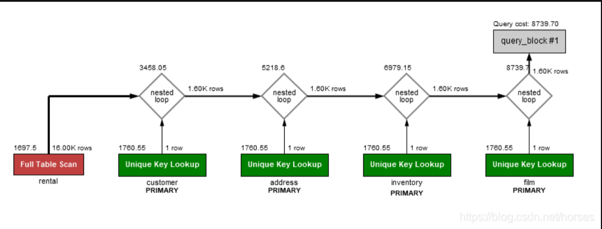
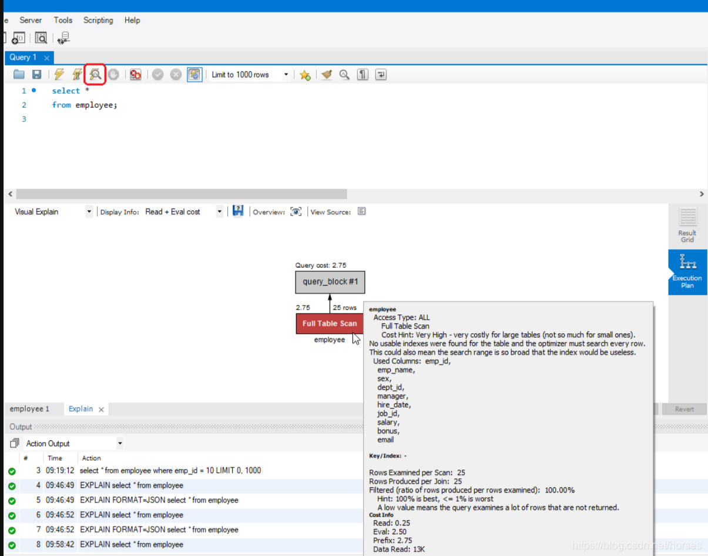

> 参考链接：https://blog.csdn.net/horses/article/details/106905110



执行计划（execution plan，也叫查询计划或者解释计划）是 MySQL 服务器执行 SQL 语句的具体步骤。例如，通过索引还是全表扫描访问表中的数据，连接查询的实现方式和连接的顺序，分组和排序操作的实现方式等。

负责生成执行计划的组件就是优化器，优化器利用表结构、字段、索引、查询条件、数据库的统计信息和配置参数决定 SQL 语句的最佳执行方式。如果想要解决慢查询的性能问题，首先应该查看它的执行计划。

# 获取执行计划

MySQL 提供了 [EXPLAIN](https://dev.mysql.com/doc/refman/8.0/en/explain.html) 语句，用于获取 SQL 语句的执行计划。该语句的基本形式如下：

```sql
{EXPLAIN | DESCRIBE | DESC}
{
    SELECT statement
  | TABLE statement
  | DELETE statement
  | INSERT statement
  | REPLACE statement
  | UPDATE statement
}
```

EXPLAIN和DESCRIBE是同义词，可以通用。实际应用中，DESCRIBE主要用于查看表的结构，EXPLAIN主要用于获取执行计划。MySQL 可以获取 SELECT、INSERT、DELETE、UPDATE、REPLACE 等语句的执行计划。从 MySQL 8.0.19 开始，支持 TABLE 语句的执行计划。

举例来说：

```sql
explain
select *
from employee;
id|select_type|table   |partitions|type|possible_keys|key|key_len|ref|rows|filtered|Extra|
--|-----------|--------|----------|----|-------------|---|-------|---|----|--------|-----|
 1|SIMPLE     |employee|          |ALL |             |   |       |   |  25|   100.0|     |
```

MySQL 中的执行计划包含了 12 列信息，这些字段的含义我们在下文中进行解读。

除了使用 EXPLAIN 语句之外，很多管理和开发工具都提供了查看图形化执行计划的功能，例如 MySQL Workbench 中显示以上查询的执行计划如下：



当然，这种方式最终也是执行了 EXPLAIN 语句。

# 解读执行计划

理解执行计划中每个字段的含义可以帮助我们知悉 MySQL 内部的操作过程，找到性能问题的所在并有针对性地进行优化。在执行计划的输出信息中，最重要的字段就是 type。

## type 字段

type 被称为连接类型（join type）或者访问类型（access type），它显示了 MySQL 如何访问表中的数据。

访问类型会直接影响到查询语句的性能，性能从好到差依次为：

* system，表中只有一行数据（系统表），这是 const 类型的特殊情况；
* const，最多返回一条匹配的数据，在查询的最开始读取；
* eq_ref，对于前面的每一行，从该表中读取一行数据；
* ref，对于前面的每一行，从该表中读取匹配索引值的所有数据行；
* fulltext，通过 FULLTEXT 索引查找数据；
* ref_or_null，与 ref 类似，额外加上 NULL 值查找；
* index_merge，使用索引合并优化技术，此时 key 列显示使用的所有索引；
* unique_subquery，替代以下情况时的 eq_ref：value IN (SELECT primary_key FROM single_table WHERE some_expr)；
* index_subquery，与 unique_subquery 类似，用于子查询中的非唯一索引：value IN (SELECT key_column FROM single_table WHERE some_expr)；
* range，使用索引查找范围值；
* index，与 ALL 类型相同，只不过扫描的是索引；
* ALL，全表扫描，通常表示存在性能问题。

const 和 eq_ref 都意味着着通过 PRIMARY KEY 或者 UNIQUE 索引查找唯一值；它们的区别在于 const 对于整个查询只返回一条数据，eq_ref 对于前面的结果集中的每条记录只返回一条数据。例如以下查询通过主键（key = PRIMARY）进行等值查找：

```sql
explain
select * 
from employee
where emp_id = 1;
id|select_type|table   |partitions|type |possible_keys|key    |key_len|ref  |rows|filtered|Extra|
--|-----------|--------|----------|-----|-------------|-------|-------|-----|----|--------|-----|
 1|SIMPLE     |employee|          |const|PRIMARY      |PRIMARY|4      |const|   1|   100.0|     |
```

const 只返回一条数据，是一种非常快速的访问方式，所以相当于一个常量（constant）。

以下语句通过主键等值连接两个表：

```sql
explain
select * 
from employee e
join department d
on (e.dept_id = d.dept_id )
where e.emp_id in(1, 2);
id|select_type|table|partitions|type  |possible_keys       |key    |key_len|ref           |rows|filtered|Extra      |
--|-----------|-----|----------|------|--------------------|-------|-------|--------------|----|--------|-----------|
 1|SIMPLE     |e    |          |range |PRIMARY,idx_emp_dept|PRIMARY|4      |              |   2|   100.0|Using where|
 1|SIMPLE     |d    |          |eq_ref|PRIMARY             |PRIMARY|4      |hrdb.e.dept_id|   1|   100.0|           |
```

对于 employee 中返回的每一行（table = e），department 表通过主键（key = PRIMARY）返回且仅返回一条数据（type = eq_ref）。Extra 字段中的 Using where 表示将经过条件过滤后的数据传递给下个表或者客户端。

ref、ref_or_null 以及 range 表示通过范围查找所有匹配的索引项，然后根据需要再访问表中的数据。通常意味着使用了非唯一索引或者唯一索引的前面部分字段进行数据访问，例如：

```sql
explain
select * 
from employee e
where e.dept_id = 1;
id|select_type|table|partitions|type|possible_keys|key         |key_len|ref  |rows|filtered|Extra|
--|-----------|-----|----------|----|-------------|------------|-------|-----|----|--------|-----|
 1|SIMPLE     |e    |          |ref |idx_emp_dept |idx_emp_dept|4      |const|   3|   100.0|     |

explain
select * 
from employee e
join department d
on (e.dept_id = d.dept_id )
where d.dept_id = 1;
id|select_type|table|partitions|type |possible_keys|key         |key_len|ref  |rows|filtered|Extra|
--|-----------|-----|----------|-----|-------------|------------|-------|-----|----|--------|-----|
 1|SIMPLE     |d    |          |const|PRIMARY      |PRIMARY     |4      |const|   1|   100.0|     |
 1|SIMPLE     |e    |          |ref  |idx_emp_dept |idx_emp_dept|4      |const|   3|   100.0|     |
```

以上两个查询语句都是通过索引 idx_emp_dept 返回 employee 表中的数据。

ref_or_null 和 ref 的区别在于查询中包含了 IS NULL 条件。例如：

```sql
alter table employee modify column dept_id int null;

explain
select * 
from employee e
where e.dept_id = 1 or dept_id is null;
id|select_type|table|partitions|type       |possible_keys|key         |key_len|ref  |rows|filtered|Extra                |
--|-----------|-----|----------|-----------|-------------|------------|-------|-----|----|--------|---------------------|
 1|SIMPLE     |e    |          |ref_or_null|idx_emp_dept |idx_emp_dept|5      |const|   4|   100.0|Using index condition|
```

其中，Extra 字段显示为 Using index condition，意味着通过索引访问表中的数据之前，直接通过 WHERE 语句中出现的索引字段条件过滤数据。这是 MySQL 5.6 之后引入了一种优化，叫做[索引条件下推](https://dev.mysql.com/doc/refman/8.0/en/index-condition-pushdown-optimization.html)（Index Condition Pushdown）。

为了显示 ref_or_null，我们需要将字段 dept_id 设置为可空，测试之后记得重新修改为 NOT NULL

```sql
alter table employee modify column dept_id int not null;
```

**range** 通常出现在使用 =、<>、>、>=、<、<=、IS NULL、<=>、BETWEEN、LIKE 或者 IN() 运算符和索引字段进行比较时，例如：

```sql
explain
select * 
from employee e
where e.email like 'zhang%';
id|select_type|table|partitions|type |possible_keys|key         |key_len|ref|rows|filtered|Extra                |
--|-----------|-----|----------|-----|-------------|------------|-------|---|----|--------|---------------------|
 1|SIMPLE     |e    |          |range|uk_emp_email |uk_emp_email|302    |   |   2|   100.0|Using index condition|
```

**index_merge** 表示索引合并，当查询通过多个索引 range 访问方式返回数据时，MySQL 可以先对这些索引扫描结果合并成一个，然后通过这个索引获取表中的数据。例如：

```sql
explain
select * 
from employee e
where dept_id = 1 or job_id = 1;
id|select_type|table|partitions|type       |possible_keys      |key                |key_len|ref|rows|filtered|Extra                                        |
--|-----------|-----|----------|-----------|-------------------|-------------------|-------|---|----|--------|---------------------------------------------|
 1|SIMPLE     |e    |          |index_merge|PRIMARY,idx_emp_job|PRIMARY,idx_emp_job|4,4    |   |   2|   100.0|Using union(PRIMARY,idx_emp_job); Using where|
```

其中，字段 key 显示了使用的索引列表；Extra 中的 Using union(PRIMARY,idx_emp_job) 是索引合并的算法，这里采用了并集算法（查询条件使用了 or 运算符）。

unique_subquery 本质上也是 eq_ref 索引查找，用于优化以下形式的子查询：

```sql
value IN (SELECT primary_key FROM single_table WHERE some_expr)
```

**index_subquery** 本质上也是 ref 范围索引查找，用于优化以下形式的子查询：

```sql
value IN (SELECT key_column FROM single_table WHERE some_expr)
```

**index**表示扫描整个索引，以下两种情况会使用这种访问方式：

- 查询可以直接通过索引返回所需的字段信息，也就是 index-only scan。此时 Extra 字段显示为 Using index。例如：

  ```sql
  explain
  select dept_id
  from employee;
  id|select_type|table   |partitions|type |possible_keys|key         |key_len|ref|rows|filtered|Extra      |
  --|-----------|--------|----------|-----|-------------|------------|-------|---|----|--------|-----------|
   1|SIMPLE     |employee|          |index|             |idx_emp_dept|4      |   |  25|   100.0|Using index|
  ```

  查询所需的 dept_id 字段通过扫描索引 idx_emp_dept 即可获得，所以采用了 index 访问类型。

- 通过扫描索引执行全表扫描，从而按照索引的顺序返回数据。此时 Extra 字段不会出现 Using index。

  ```sql
  explain
  select *
  from employee force index (idx_emp_name)
  order by emp_name;
  id|select_type|table   |partitions|type |possible_keys|key         |key_len|ref|rows|filtered|Extra|
  --|-----------|--------|----------|-----|-------------|------------|-------|---|----|--------|-----|
   1|SIMPLE     |employee|          |index|             |idx_emp_name|202    |   |  25|   100.0|     |
  ```

  为了演示 index 访问方式，我们使用了强制索引（force index）；否则，MySQL 选择使用全表扫描（ALL）。

**ALL**表示全表扫描，这是一种 I/O 密集型的操作，通常意味着存在性能问题。例如：

```sql
explain
select *
from employee;
id|select_type|table   |partitions|type|possible_keys|key|key_len|ref|rows|filtered|Extra|
--|-----------|--------|----------|----|-------------|---|-------|---|----|--------|-----|
 1|SIMPLE     |employee|          |ALL |             |   |       |   |  25|   100.0|     |
```

因为 employee 表本身不大，而且我们查询了所有的数据，这种情况下全表扫描反而是一个很好的访问方法。但是，以下查询显然需要进行优化：

```sql
explain
select *
from employee
where salary = 10000;
id|select_type|table   |partitions|type|possible_keys|key|key_len|ref|rows|filtered|Extra      |
--|-----------|--------|----------|----|-------------|---|-------|---|----|--------|-----------|
 1|SIMPLE     |employee|          |ALL |             |   |       |   |  25|    10.0|Using where|
```

显然，针对这种查询语句，我们可以通过为 salary 字段创建一个索引进行优化。

## Extra 字段

执行计划输出中的 Extra 字段通常会显示更多的信息，可以帮助我们发现性能问题的所在。上文中我们已经介绍了一些 Extra 字段的信息，需要重点关注的输出内容包括：

- **Using where**，表示将经过 WHERE 条件过滤后的数据传递给下个数据表或者返回客户端。如果访问类型为 ALL 或者 index，而 Extra 字段不是 Using where，意味着查询语句可能存在问题（除非就是想要获取全部数据）。

- **Using index condition**，表示通过索引访问表之前，基于查询条件中的索引字段进行一次过滤，只返回必要的索引项。这也就是索引条件下推优化。

- **Using index**，表示直接通过索引即可返回所需的字段信息（index-only scan），不需要访问表。对于 InnoDB，如果通过主键获取数据，不会显示 Using index，但是仍然是 index-only scan。此时，访问类型为 index，key 字段显示为 PRIMARY。

- **Using filesort**，意味着需要执行额外的排序操作，通常需要占用大量的内存或者磁盘。例如：

  ```sql
  explain
  select *
  from employee
  where dept_id =3
  order by hire_date;
  id|select_type|table   |partitions|type|possible_keys|key         |key_len|ref  |rows|filtered|Extra         |
  --|-----------|--------|----------|----|-------------|------------|-------|-----|----|--------|--------------|
   1|SIMPLE     |employee|          |ref |idx_emp_dept |idx_emp_dept|4      |const|   2|   100.0|Using filesort|
  ```

  索引通常可以用于优化排序操作，我们可以为索引 idx_emp_dept 增加一个 hire_date 字段来消除示例中的排序。

- **Using temporary**，意味着需要创建临时表保存中间结果。例如：

  ```sql
  explain
  select dept_id,job_id, sum(salary)
  from employee
  group by dept_id, job_id;
  id|select_type|table   |partitions|type|possible_keys|key|key_len|ref|rows|filtered|Extra          |
  --|-----------|--------|----------|----|-------------|---|-------|---|----|--------|---------------|
   1|SIMPLE     |employee|          |ALL |             |   |       |   |  25|   100.0|Using temporary|
  ```

  示例中的分组操作需要使用临时表，同样可以通过增加索引进行优化。

## 访问谓词与过滤谓词

在 SQL 中，WHERE 条件也被称为谓词（[predicate](https://so.csdn.net/so/search?q=predicate&spm=1001.2101.3001.7020)）。MySQL 数据库中的谓词存在以下三种使用方式：

* **访问谓词**（access predicate），在执行计划的输出中对应于 key_len 和 ref 字段。访问谓词代表了索引叶子节点遍历的开始和结束条件。
* **索引过滤谓词**（index filter predicate），在执行计划中对应于 Extra 字段的 Using index condition。索引过滤谓词在遍历索引叶子节点时用于判断是否返回该索引项，但是不会用于判断遍历的开始和结束条件，也就不会缩小索引扫描的范围。
* **表级过滤谓词**（table level filter predicate），在执行计划中对应于 Extra 字段的 Using where。谓词中的非索引字段条件在表级别进行判断，意味着数据库需要访问表中的数据然后再应用该条件。

一般来说，对于相同的查询语句，访问谓词的性能好于索引过滤谓词，索引过滤谓词的性能好于表级过滤谓词。

MySQL 执行计划中不会显示每个条件对应的谓词类型，而只是笼统地显示使用了哪种谓词类型。我们创建一个示例表：

```sql
create table test (
  id int not null auto_increment primary key,
  col1 int,
  col2 int,
  col3 int);

insert into test(col1, col2, col3)
values (1,1,1), (2,4,6), (3,6,9);

create index test_idx on test (col1, col2);

analyze table test;
```

以下语句使用 col1 和 col2 作为查询条件：

```sql
explain
select *
from test
where col1=1 and col2=1;
id|select_type|table|partitions|type|possible_keys|key     |key_len|ref        |rows|filtered|Extra|
--|-----------|-----|----------|----|-------------|--------|-------|-----------|----|--------|-----|
 1|SIMPLE     |test |          |ref |test_idx     |test_idx|10     |const,const|   1|   100.0|     |
```

其中，Extra 字段为空；key = test_idx 表示使用索引进行查找，key_len = 10 就是 col1 和 col2 两个字段的长度（可空字段长度加 1）；ref = const,const 表示使用了索引中的两个字段和常量进行比较，从而判断是否返回数据行。因此，该语句中的 WHERE 条件是一个访问谓词。

接下来我们仍然使用 col1 和 col2 作为查询条件，但是修改一下返回的字段：

```sql
explain
select id, col1, col2
from test
where col1=1 and col2=1;
id|select_type|table|partitions|type|possible_keys|key     |key_len|ref        |rows|filtered|Extra      |
--|-----------|-----|----------|----|-------------|--------|-------|-----------|----|--------|-----------|
 1|SIMPLE     |test |          |ref |test_idx     |test_idx|10     |const,const|   1|   100.0|Using index|
```

其中，Extra 字段中的 Using index 不是 Using index condition，它是一个 index-only scan，因为所有的查询结果都可以通过索引直接返回（包括 id）；其他字段的信息和上面的示例相同。因此，该语句中的 WHERE 条件也是一个访问谓词。

然后使用 col1 进行范围查询：

```sql
explain
select *
from test
where col1 between 1 and 2;
id|select_type|table|partitions|type |possible_keys|key     |key_len|ref|rows|filtered|Extra                |
--|-----------|-----|----------|-----|-------------|--------|-------|---|----|--------|---------------------|
 1|SIMPLE     |test |          |range|test_idx     |test_idx|5      |   |   2|   100.0|Using index condition|
```

其中，Extra 字段中显示为 Using index condition；key = test_idx 表示使用索引进行范围查找，key_len = 5 就是 col1 字段的长度（可空字段长度加 1）；ref 为空表示没有访问谓词。因此，该语句中的 WHERE 条件是一个索引过滤谓词，查询需要遍历整个索引并且通过索引判断是否访问表中的数据。

最后使用 col1 和 col3 作为查询条件：

```sql
explain
select *
from test
where col1=1 and col3=1;
id|select_type|table|partitions|type|possible_keys|key     |key_len|ref  |rows|filtered|Extra      |
--|-----------|-----|----------|----|-------------|--------|-------|-----|----|--------|-----------|
 1|SIMPLE     |test |          |ref |test_idx     |test_idx|5      |const|   1|   33.33|Using where|
```

其中，Extra 字段中显示为 Using where，表示访问表中的数据然后再应用查询条件 col3=1；key = test_idx 表示使用索引进行查找，key_len = 5 就是 col1 字段的长度（可空字段长度加 1）；ref = const 表示常量等值比较；filtered = 33.33 意味着经过查询条件比较之后只保留三分之一的数据。因此，该语句中的 WHERE 条件是一个表级过滤谓词，意味着数据库需要访问表中的数据然后再应用该条件。

## 完整字段信息

下表列出了 MySQL 执行计划中各个字段的作用：

| 列名              | 作用                                                         |
| ----------------- | ------------------------------------------------------------ |
| **id**            | 语句中 SELECT 的序号。如果是 UNION 操作的结果，显示为 NULL；此时 table 列显示为 <unionM,N>。 |
| **select_type**   | SELECT 的类型，包括：<br/>- SIMPLE，不涉及 UNION 或者子查询的简单查询；<br/>- PRIMARY，最外层 SELECT；<br/>- UNION，UNION 中第二个或之后的 SELECT；<br/>- DEPENDENT UNION，UNION 中第二个或之后的 SELECT，该 SELECT 依赖于外部查询；<br/>- UNION RESULT，UNION 操作的结果；<br/>- SUBQUERY，子查询中的第一个 SELECT；<br/>- DEPENDENT SUBQUERY，子查询中的第一个 SELECT，该 SELECT 依赖于外部查询；<br/>- DERIVED，派生表，即 FROM 中的子查询；<br/>- DEPENDENT DERIVED，依赖于其他表的派生表；<br/>- MATERIALIZED，物化子查询；<br/>- UNCACHEABLE SUBQUERY，无法缓存结果的子查询，对于外部表中的每一行都需要重新查询；<br/>- UNION 中第二个或之后的 SELECT，该 UNION属于 UNCACHEABLE SUBQUERY |
| **table**         | 数据行的来源表，也有可能是以下值之一：<br/>\- <unionM,N>，id 为 M 和 N 的 SELECT 并集运算的结果；<br/>\- <derivedN>，id 为 N 的派生表的结果；<br/>\- <subqueryN>，id 为 N 的物化子查询的结果。 |
| **partitions**    | 对于分区表而言，表示数据行所在的分区；普通表显示为 NULL。    |
| **type**          | 连接类型或者访问类型，性能从好到差依次为：<br/>- system，表中只有一行数据，这是 const 类型的特殊情况；<br/>- const，最多返回一条匹配的数据，在查询的最开始读取；<br/>- eq_ref，对于前面的每一行，从该表中读取一行数据；<br/>- ref，对于前面的每一行，从该表中读取匹配索引值的所有数据行；<br/>- fulltext，通过 FULLTEXT 索引查找数据；<br/>- ref_or_null，与 ref 类似，额外加上 NULL 值查找；<br/>- index_merge，使用索引合并优化技术，此时 key 列显示使用的所有索引；<br/>- unique_subquery，替代以下情况时的 eq_ref：value IN (SELECT primary_key FROM single_table WHERE some_expr)；<br/>- index_subquery，与 unique_subquery 类似，用于子查询中的非唯一索引：value IN (SELECT key_column FROM single_table WHERE some_expr)；<br/>- range，使用索引查找范围值；<br/>- index，与 ALL 类型相同，只不过扫描的是索引；<br/>- ALL，全表扫描，通常表示存在性能问题。 |
| **possible_keys** | 可能用到的索引，实际上不一定使用。                           |
| **key**           | 实际使用的索引。                                             |
| **key_len**       | 实际使用的索引的长度。                                       |
| **ref**           | 用于和 key 中的索引进行比较的字段或者常量，从而判断是否返回数据行。 |
| **rows**          | 执行查询需要检查的行数，对于 InnoDB 是一个估计值。           |
| **filtered**      | 根据查询条件过滤之后行数百分比，rows × filtered 表示进入下一步处理的行数。 |
| **Extra**         | 包含了额外的信息。例如 Using temporary 表示使用了临时表，Using filesort 表示需要额外的排序操作等。 |

## 格式化参数

MySQL EXPLAIN 语句支持使用 FORMAT 选项指定不同的输出格式：

```sql
{EXPLAIN | DESCRIBE | DESC}
FORMAT = {TRADITIONAL | JSON | TREE}
explainable_stmt
```

默认的格式为 TRADITIONAL，以表格的形式显示输出信息；JSON 选项表示以 JSON 格式显示信息；MySQL 8.0.16 之后支持 TREE 选项，以树形结构输出了比默认格式更加详细的信息，这也是唯一能够显示 hash join 的格式。

例如，以下语句输出了 JSON 格式的执行计划：

```sql
explain
format=json
select *
from employee
where emp_id = 1;
{
  "query_block": {
    "select_id": 1,
    "cost_info": {
      "query_cost": "1.00"
    },
    "table": {
      "table_name": "employee",
      "access_type": "const",
      "possible_keys": [
        "PRIMARY"
      ],
      "key": "PRIMARY",
      "used_key_parts": [
        "emp_id"
      ],
      "key_length": "4",
      "ref": [
        "const"
      ],
      "rows_examined_per_scan": 1,
      "rows_produced_per_join": 1,
      "filtered": "100.00",
      "cost_info": {
        "read_cost": "0.00",
        "eval_cost": "0.10",
        "prefix_cost": "0.00",
        "data_read_per_join": "568"
      },
      "used_columns": [
        "emp_id",
        "emp_name",
        "sex",
        "dept_id",
        "manager",
        "hire_date",
        "job_id",
        "salary",
        "bonus",
        "email"
      ]
    }
  }
}
```

其中，大部分的节点信息和表格形式的字段能够对应；但是也返回了一些额外的信息，尤其是各种操作的成本信息 cost_info，可以帮助我们了解不同执行计划之间的成本差异。

以下语句返回了树状结构的执行计划：

```sql
explain
format=tree
select *
from employee e1
join employee e2 
on e1.salary = e2.salary;
-> Inner hash join (e2.salary = e1.salary)  (cost=65.51 rows=63)
    -> Table scan on e2  (cost=0.02 rows=25)
    -> Hash
        -> Table scan on e1  (cost=2.75 rows=25)
```

从结果可以看出，该执行计划使用了 Inner hash join 实现两个表的连接查询。

## 执行计划中的分区表信息

如果 SELECT 语句使用了分区表，可以通过 EXPLAIN 命令查看涉及的具体分区。执行计划输出的 partitions 字段显示了数据行所在的表分区。首先创建一个分区表：

```sql
create table trb1 (id int primary key, name varchar(50), purchased date)
    partition by range(id)
    (
        partition p0 values less than (3),
        partition p1 values less than (7),
        partition p2 values less than (9),
        partition p3 values less than (11)
    );

insert into trb1 values
    (1, 'desk organiser', '2003-10-15'),
    (2, 'CD player', '1993-11-05'),
    (3, 'TV set', '1996-03-10'),
    (4, 'bookcase', '1982-01-10'),
    (5, 'exercise bike', '2004-05-09'),
    (6, 'sofa', '1987-06-05'),
    (7, 'popcorn maker', '2001-11-22'),
    (8, 'aquarium', '1992-08-04'),
    (9, 'study desk', '1984-09-16'),
    (10, 'lava lamp', '1998-12-25');
```

然后查看使用 id 进行范围查询时的执行计划：

```sql
explain 
select * from trb1 
where id < 5;
id|select_type|table|partitions|type |possible_keys|key    |key_len|ref|rows|filtered|Extra      |
--|-----------|-----|----------|-----|-------------|-------|-------|---|----|--------|-----------|
 1|SIMPLE     |trb1 |p0,p1     |range|PRIMARY      |PRIMARY|4      |   |   4|   100.0|Using where|
```

结果显示查询访问了分区 p0 和 p1。

## 获取额外的执行计划信息

除了直接输出的执行计划之外，EXPLAIN 命令还会产生一些[额外信息](https://dev.mysql.com/doc/refman/8.0/en/explain-extended.html)，可以使用`SHOW WARNINGS`命令进行查看。例如：

```sql
explain
select * 
from department d
where exists (select 1 from employee e where e.dept_id = d.dept_id );
id|select_type|table|partitions|type|possible_keys|key         |key_len|ref           |rows|filtered|Extra                     |
--|-----------|-----|----------|----|-------------|------------|-------|--------------|----|--------|--------------------------|
 1|SIMPLE     |d    |          |ALL |PRIMARY      |            |       |              |   6|   100.0|                          |
 1|SIMPLE     |e    |          |ref |idx_emp_dept |idx_emp_dept|4      |hrdb.d.dept_id|   5|   100.0|Using index; FirstMatch(d)|

show warnings\G
*************************** 1. row ***************************
  Level: Note
   Code: 1276
Message: Field or reference 'hrdb.d.dept_id' of SELECT #2 was resolved in SELECT #1
*************************** 2. row ***************************
  Level: Note
   Code: 1003
Message: /* select#1 */ select `hrdb`.`d`.`dept_id` AS `dept_id`,`hrdb`.`d`.`dept_name` AS `dept_name` from `hrdb`.`department` `d` semi join (`hrdb`.`employee` `e`) where (`hrdb`.`e`.`dept_id` = `hrdb`.`d`.`dept_id`)
2 rows in set (0.00 sec)
```

SHOW WARNINGS 命令输出中的 Message 显示了优化器如何限定查询语句中的表名和列名、应用了重写和优化规则后的查询语句以及优化过程的其他信息。

目前只有 SELECT 语句相关的额外信息可以通过 SHOW WARNINGS 语句进行查看，其他语句（DELETE、INSERT、REPLACE 和UPDATE）显示的信息为空。

## 获取指定连接的执行计划

EXPLAIN 语句也可以用于获取指定连接中正在执行的 SQL 语句的执行计划，语法如下：

```sql
EXPLAIN [FORMAT = {TRADITIONAL | JSON | TREE}] FOR CONNECTION conection_id;
```

其中，connection_id 是连接标识符，可以通过字典表 INFORMATION_SCHEMA PROCESSLIST 或者 SHOW PROCESSLIST 命令获取。如果某个会话中存在长时间运行的慢查询语句，在另一个会话中执行该命令可以获得相关的诊断信息。

首先获取当前连接的会话标识符：

```sql
mysql> SELECT CONNECTION_ID();
+-----------------+
| CONNECTION_ID() |
+-----------------+
|              30 |
+-----------------+
1 row in set (0.00 sec)
```

如果此时在当前会话中获取执行计划，将会返回错误信息：

```sql
mysql> EXPLAIN FOR CONNECTION 30;
ERROR 3012 (HY000): EXPLAIN FOR CONNECTION command is supported only for SELECT/UPDATE/INSERT/DELETE/REPLACE
```

因为只有 SELECT、UPDATE、INSERT、DELETE、REPLACE 语句支持执行计划，当前正在执行的是 EXPLAIN 语句。

在当前会话中执行一个大表查询：

```sql
mysql> select * from large_table;
```

然后在另一个会话中执行 EXPLAIN 命令：

```sql
explain for connection 30;
id|select_type|table      |partitions|type|possible_keys|key|key_len|ref|rows  |filtered|Extra|
--|-----------|-----------|----------|----|-------------|---|-------|---|------|--------|-----|
 1|SIMPLE     |large_table|          |ALL |             |   |       |   |244296|   100.0|     |
```

如果指定会话没有正在运行的语句，EXPLAIN 命令将会返回空结果。

## 获取实际运行的执行计划

MySQL 8.0.18 增加了一个新的命令：`EXPLAIN ANALYZE`。该语句用于运行一个语句并且产生 EXPLAIN 结果，包括执行时间和迭代器（iterator）信息，可以获取优化器的预期执行计划和实际执行计划之间的差异。

```sql
{EXPLAIN | DESCRIBE | DESC} ANALYZE select_statement
```

例如，以下 EXPLAIN 语句返回了查询计划和成本估算：

```sql
explain
format=tree
select * 
from employee e
join department d
on (e.dept_id = d.dept_id )
where e.emp_id in(1, 2);
-> Nested loop inner join  (cost=1.61 rows=2
    -> Filter: (e.emp_id in (1,2))  (cost=0.91 rows=2)
        -> Index range scan on e using PRIMARY  (cost=0.91 rows=2)
    -> Single-row index lookup on d using PRIMARY (dept_id=e.dept_id)  (cost=0.30 rows=1)
```

那么，实际上的执行计划和成本消耗情况呢？我们可以使用 EXPLAIN ANALYZE 语句查看：

```sql
explain analyze 
select * 
from employee e
join department d
on (e.dept_id = d.dept_id )
where e.emp_id in(1, 2);
-> Nested loop inner join  (cost=1.61 rows=2) (actual time=0.238..0.258 rows=2 loops=1)
    -> Filter: (e.emp_id in (1,2))  (cost=0.91 rows=2) (actual time=0.218..0.233 rows=2 loops=1)
        -> Index range scan on e using PRIMARY  (cost=0.91 rows=2) (actual time=0.214..0.228 rows=2 loops=1)
    -> Single-row index lookup on d using PRIMARY (dept_id=e.dept_id)  (cost=0.30 rows=1) (actual time=0.009..0.009 rows=1 loops=2)
```

对于每个迭代器，EXPLAIN ANALYZE 输出了以下信息：

* 估计执行成本，某些迭代器不计入成本模型；
* 估计返回行数；
* 返回第一行的实际时间（ms）；
* 返回所有行的实际时间（ms），如果存在多次循环，显示平均时间；
* 实际返回行数；
* 循环次数。

在输出结果中的每个节点包含了下面所有节点的汇总信息，所以最终的估计信息和实际信息如下：

```sql
-> Nested loop inner join  (cost=1.61 rows=2) (actual time=0.238..0.258 rows=2 loops=1)
```

查询通过嵌套循环内连接实现；估计成本为 1.61，估计返回 2 行数据；实际返回第一行数据的时间为 0.238 ms，实际返回所有数据的平均时间为 0.258 ms，实际返回了 2 行数据，嵌套循环操作执行了 1 次。

循环的实现过程是首先通过主键扫描 employee 表并且应用过滤迭代器：

```sql
    -> Filter: (e.emp_id in (1,2))  (cost=0.91 rows=2) (actual time=0.218..0.233 rows=2 loops=1)
        -> Index range scan on e using PRIMARY  (cost=0.91 rows=2) (actual time=0.214..0.228 rows=2 loops=1)
```

其中，应用过滤迭代器返回第一行数据的时间为 0.218 ms，包括索引扫描的 0.214 ms；返回所有数据的平均时间为 0.233 ms，包括索引扫描的 0.228 ms；绝大部分时间都消耗在了索引扫描，总共返回了 2 条数据。

然后循环上一步返回的 2 条数据，扫描 department 表的主键返回其他数据：

```sql
    -> Single-row index lookup on d using PRIMARY (dept_id=e.dept_id)  (cost=0.30 rows=1) (actual time=0.009..0.009 rows=1 loops=2)
```

其中，loops=2 表示这个迭代器需要执行 2 次；每次返回 1 行数据，所以两个实际时间都是 0.009 ms。

以上示例的预期执行计划和实际执行计划基本上没有什么差异。但有时候并不一定如此，例如：

```sql
explain analyze 
select * 
from employee e
join department d
on (e.dept_id = d.dept_id )
where e.salary = 10000;
-> Nested loop inner join  (cost=3.63 rows=3) (actual time=0.427..0.444 rows=1 loops=1)
    -> Filter: (e.salary = 10000.00)  (cost=2.75 rows=3) (actual time=0.406..0.423 rows=1 loops=1)
        -> Table scan on e  (cost=2.75 rows=25 (actual time=0.235..0.287 rows=25 loops=1)
    -> Single-row index lookup on d using PRIMARY (dept_id=e.dept_id)  (cost=0.29 rows=1) (actual time=0.018..0.018 rows=1 loops=1)
```

我们使用 salary 字段作为过滤条件，该字段没有索引。执行计划中的最大问题在于估计返回的行数是 3，而实际返回的行数是 1；这是由于缺少字段的直方图统计信息。

我们对 employee 表进行分析，收集字段的直方图统计之后再查看执行计划：

```sql
analyze table employee update histogram on salary;

explain analyze 
select * 
from employee e
join department d
on (e.dept_id = d.dept_id )
where e.salary = 10000;
-> Nested loop inner join  (cost=3.10 rows=1) (actual time=0.092..0.105 rows=1 loops=1)
    -> Filter: (e.salary = 10000.00)  (cost=2.75 rows=1) (actual time=0.082..0.093 rows=1 loops=1)
        -> Table scan on e  (cost=2.75 rows=25) (actual time=0.056..0.080 rows=25 loops=1)
    -> Single-row index lookup on d using PRIMARY (dept_id=e.dept_id)  (cost=0.35 rows=1) (actual time=0.009..0.009 rows=1 loops=1)
```

估计返回的行数变成了 1，和实际执行结果相同。

> 📝除了本文介绍的各种 EXPLAIN 语句之外，MySQL 还提供了优化器跟踪（optimizer trace）功能，可以获取关于优化器的更多信息，具体可以参考 [MySQL Internals:Tracing the Optimizer](https://dev.mysql.com/doc/internals/en/optimizer-tracing.html)。

