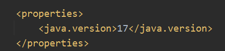
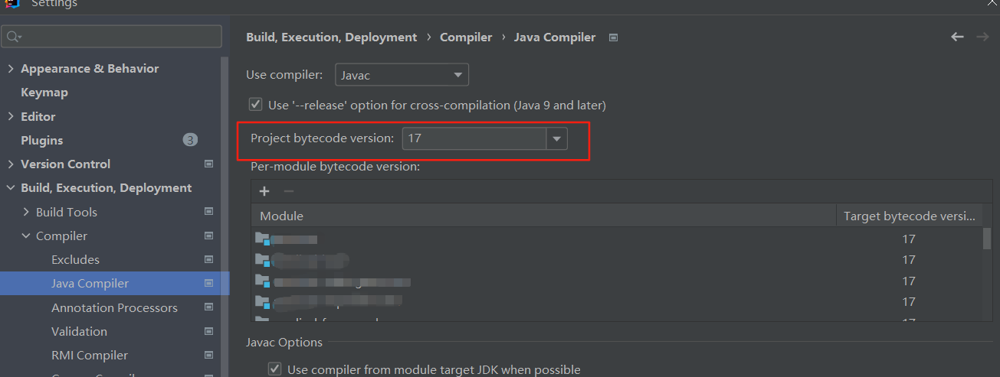
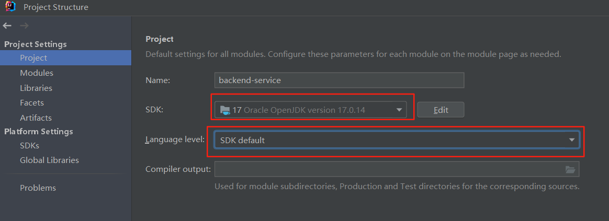
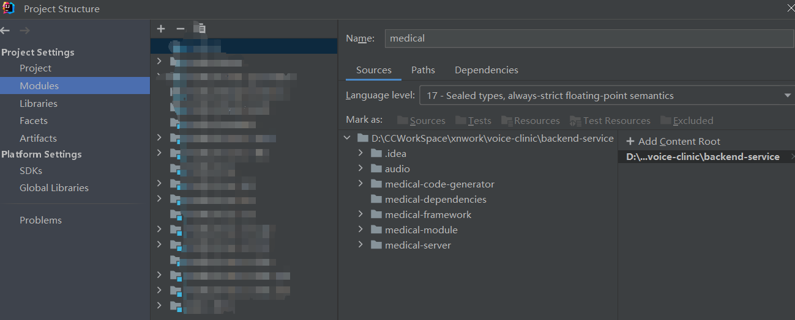
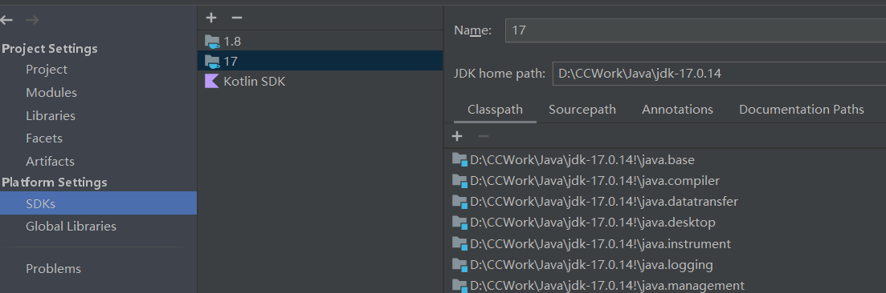
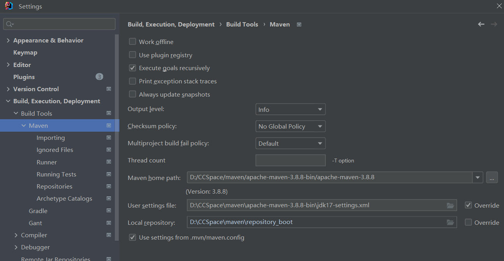
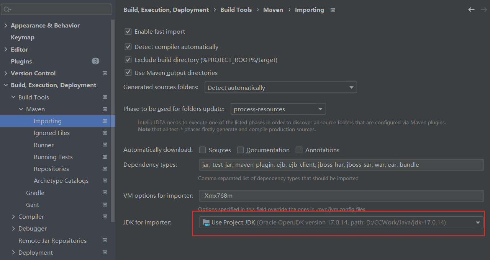
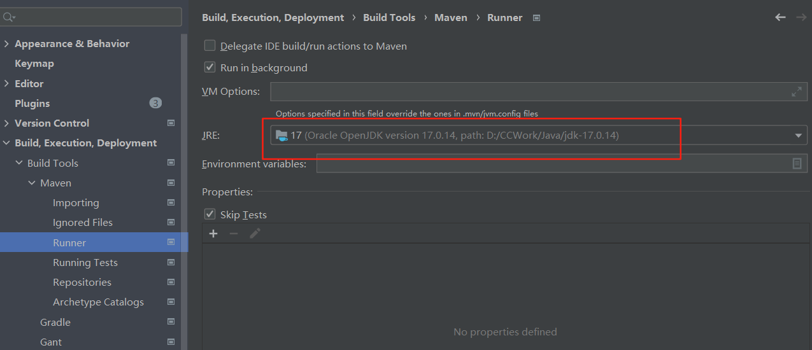

# IDEA

## 设置项目JDK版本

> [项目运行/Maven项目打包 无效的目标发行版: 17 （全）](https://blog.csdn.net/Yusian_/article/details/127763882)

### 1、项目运行出错

pom.xml可能出现问题

检查setting中的编译器设置

project structure中的项目、模块及sdk设置

### 2、Maven打包出错

检查项目使用的Maven配置

如果使用的是本地的maven，确认一下maven中conf/settings.xml中jdk的设置是否正确。

确认Maven中importing和runner的设置

