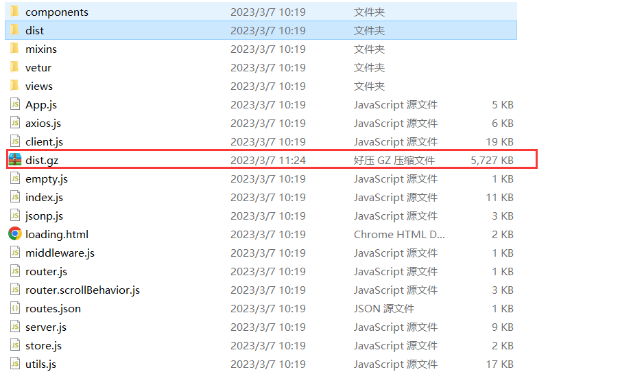

# 代理

## windows网络代理

> 通过跳板机访问内网web服务
>
> 公网机器A：124.132.54.67
> 内网机器B：192.168.0.113
>
> 公网机器A可以访问内网机器B,但互联网无法访问内网机器B，通过以下操作访问内网机器
>
> #通过代理访问
>
> 8848代表本地监听的端口  
>
> 192.168.0.113代表内网机器B
>
> 124.132.54.67代表公网ip的机器A
>
> 输入此命令后会要求输入公网的机器A的密码，然后就可以通过127.0.0.1:8848访问192.168.0.113：8848的内网机器了
>
> ssh -N -L 8848:192.168.0.113:8848 root@124.132.54.67

# Git相关

## Git出现“filename too long”错误处理

Windows系统下，在Git使用过程中，出现”filename too long”错误提示。直译成中文的意思就是：”文件名过长“。导致始终无法进行将文件添加到Git树中。因为.NET项目的层次比较深而且文件夹和文件名称也比较长。GIt使用了旧版本的Windows API，导致它限制文件名不能超过260个字符。所以Git的Windows客户端默认是禁用长名称支持的。开启长名称支持即可。

打开PowerShell或者Cmd，在命令行窗口中运行：继续进行Git操作就可以成功了。

```shell
git config --system core.longpaths true
```

## Idea切换分支提示

使用 Git 进行版本管理时,当我们切换分支时会出现如上的提示，出现上述界面的原因是我们在当前分支的代码没有 commit,当我们需要切换到其它分支的时候,Git 就会提示我们要进行哪些操作

下面有三个选项 Smart checkout、Force checkout、don`t checkout


1. `Smart checkout`：当前分支未提交的代码会被带到你要切换的那个分支上去
2. `Force Checkout`：就不会把冲突的这部分内容带到目的分支,但是你在当前分支修改的所有内容就会被删除,就算你再切回来也找不到了,所以需要慎重哦。
3. **don`t checkout**：不进行分支切换,还是留在当前分支

## git仓库存在大文件处理

```shell
git config --global http.postBuffer 857286400
```

# Windows命令行压缩gz文件

## tar -help

输入 tar -help 命令，如下所示


```shell
//打包文件
tar -cf xxx.tar.gz ./xxx   
```

```shell
tar -xf xxx.tar.gz  
//解压文件
```

## 命令参数解释

| t    | 显示档案文件列表内容（已压缩的文件）    |
| ---- | --------------------------------------- |
| x    | 解压档案文件                            |
| c    | 生成档案文件，创建打包文件              |
| f    | 指定档案文件名称，f必须放在命令参数最后 |

需要压缩，需要进到该文件的父级

例如需要压缩dist文件夹，则需要进到.nuxt文件夹，输入命令tar -cf dist.gz ./dist，最终压缩成功




解压同理，输入tar -xf dist.gz，最终解压成功

