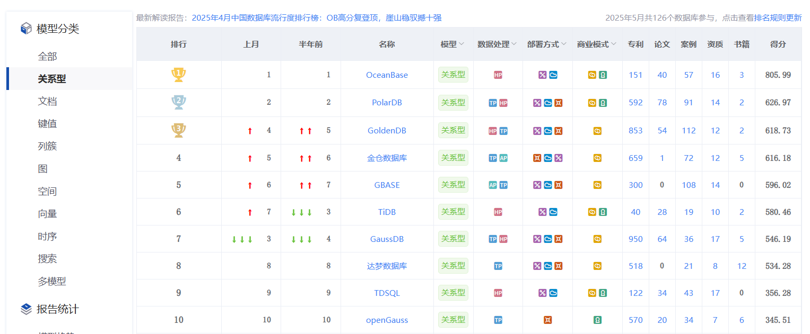

[墨天伦](https://www.modb.pro/)：国产数据库行业分析报告



# TiDB

TiDB 是 PingCAP 公司自主设计、研发的开源分布式关系型数据库，是一款同时支持在线事务处理与在线分析处理 (Hybrid Transactional and Analytical Processing, HTAP) 的融合型分布式数据库产品，具备水平扩容或者缩容、金融级高可用、实时 HTAP、云原生的分布式数据库、**兼容 MySQL 5.7 协议**和 MySQL 生态等重要特性。目标是为用户提供一站式 OLTP (Online Transactional Processing)、OLAP (Online Analytical Processing)、HTAP 解决方案。TiDB 适合高可用、强一致要求较高、数据规模较大等各种应用场景。

[TIDB文档](https://docs.pingcap.com/zh/tidb/stable/ )

# openGauss

openGauss 是一款全面友好开放，携手伙伴共同打造的企业级开源关系型数据库。openGauss采用木兰宽松许可证v2发行，提供面向多核架构的极致性能、全链路的业务、数据安全、基于AI的调优和高效运维的能力。openGauss深度融合华为在数据库领域多年的研发经验，结合企业级场景需求，持续构建竞争力特性。同时，openGauss也是一个开源、免费的数据库平台，鼓励社区贡献、合作，**兼容 PostgreSQL** ，[postgresql菜鸟教程](https://www.runoob.com/postgresql/postgresql-tutorial.html)

[openGauss文档](https://docs.opengauss.org/zh/)

参考安装链接：

[opengauss 数据库安装](https://blog.csdn.net/weixin_50495215/article/details/146200664)

[深度体验与测评openGauss 6.0.0新版本](https://blog.csdn.net/devcloud/article/details/139586760)

# OceanBase

为现代数据架构打造的开源分布式数据库。兼容 MySQL 的单机分布式一体化国产开源数据库，具有原生分布式架构，支持金融级高可用、透明水平扩展、分布式事务、多租户和语法兼容等企业级特性。OceanBase 内核通过大规模商用场景的考验，已服务众多行业客户；面向未来携手生态伙伴，共建开源开放的数据库内核和生态。

## 快速上手

[快速体验 OceanBase 数据库、部署生产环境](https://open.oceanbase.com/quickStart)

[说明文档](https://www.oceanbase.com/docs/oceanbase-database-cn)

[OceanBase软件下载中心](https://www.oceanbase.com/softwarecenter)

[部署单机版 OceanBase 集群](https://www.oceanbase.com/demo/deploy-a-standalone-cluster)

## 连接配置

### 默认连接权限情况

**1、系统租户(root@sys)**：

- 默认**不允许**直接从外部IP连接
- 仅允许本地(127.0.0.1)或服务器本机IP连接
- 这是出于安全考虑的设计

**2、新建的普通租户**：

- 默认也**不允许**外部IP连接
- 需要显式授权才能从外部访问

### 检查当前连接权限

```sql
-- 查看用户权限
SELECT * FROM mysql.user WHERE user='root'\G

-- 查看允许连接的host
SELECT host, user FROM mysql.user;
```

### 如何启用IP连接

如果需要通过IP远程连接，需要执行以下授权命令：

**1、授权特定IP连接**：

```sql
GRANT ALL PRIVILEGES ON *.* TO 'root'@'192.168.1.%' IDENTIFIED BY 'password';
```

**2、授权所有IP连接（不推荐生产环境）**

```sql
GRANT ALL PRIVILEGES ON *.* TO 'root'@'%' IDENTIFIED BY 'password';
```

**3、刷新权限**

```sql
FLUSH PRIVILEGES;
```

### 检查防火墙配置

```bash
# CentOS/RHEL
sudo firewall-cmd --list-ports
sudo firewall-cmd --zone=public --add-port=2881/tcp --permanent
sudo firewall-cmd --reload
```

## 数据库连接

### navicat

连接MySql方式连接

### dbeaver

选择OceanBase数据库连接

### Springboot

```yml
# 数据源配置
spring.datasource.url=jdbc:mysql://<OceanBase服务器IP>:2881/oceanbase?useSSL=false&allowPublicKeyRetrieval=true&serverTimezone=Asia/Shanghai
spring.datasource.username=root@sys  # 注意租户格式
spring.datasource.password=your_password
spring.datasource.driver-class-name=com.mysql.cj.jdbc.Driver

#非sys租户
spring.datasource.username=tenant_user@tenant_name  # 租户用户格式
```