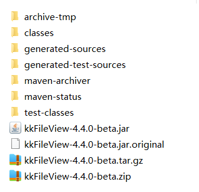

# 安装说明

从[kkFileView官网](https://kkfileview.keking.cn/zh-cn/index.html)选择gitee或github进行代码仓库，下载源码，通过idea进行打包，得到安装包。选择需要安装环境的安装包进行安装。

kkfileview是Springboot项目，环境需要先安装JDK。

## window安装



* 解压**kkFileView-4.4.0-beta.zip**。
* 执行**bin\startup.bat**文件
* 执行成功后，通过浏览器访问**127.0.0.1:8012**
  * 日志查看**log**文件夹
* 修改默认配置**config\application.properties**

## Linux安装

安装kkfileview之前，需要在linux上面安装LibreOffice 或者 让kkfileview自动安装。解压**kkFileView-4.4.0-beta.tar.gz**文件夹，执行bin\startup.sh，会自动安装所需的依赖。

也可以提前手动安装所需依赖

[Index of /libreoffice/old (documentfoundation.org)](https://downloadarchive.documentfoundation.org/libreoffice/old/)

手动安装 LibreOffice ，找到适合的版本号

版本号，可查看bin文件中，install.sh命令，如下版本号7.5.3.2。安装流程见下参考链接

```sh
#!/bin/bash
cd /tmp

install_redhat() {
   wget https://downloadarchive.documentfoundation.org/libreoffice/old/7.5.3.2/rpm/x86_64/LibreOffice_7.5.3.2_Linux_x86-64_rpm.tar.gz -cO LibreOffice_7_rpm.tar.gz && tar -zxf /tmp/LibreOffice_7_rpm.tar.gz && cd /tmp/LibreOffice_7.5.3.2_Linux_x86-64_rpm/RPMS
   echo $?
   if [ $? -eq 0 ];then
     yum install -y libSM.x86_64 libXrender.x86_64  libXext.x86_64
     yum groupinstall -y  "X Window System"
     yum localinstall -y *.rpm
     echo 'install finshed...'
   else
     echo 'download package error...'
   fi
}

install_ubuntu() {
   wget https://downloadarchive.documentfoundation.org/libreoffice/old/7.5.3.2/deb/x86_64/LibreOffice_7.5.3.2_Linux_x86-64_deb.tar.gz  -cO LibreOffice_7_deb.tar.gz && tar -zxf /tmp/LibreOffice_7_deb.tar.gz && cd /tmp/LibreOffice_7.5.3.2_Linux_x86-64_deb/DEBS
   echo $?
 if [ $? -eq 0 ];then
     apt-get install -y libxinerama1 libcairo2 libcups2 libx11-xcb1
     dpkg -i *.deb
     echo 'install finshed...'
  else
    echo 'download package error...'
 fi
}


if [ -f "/etc/redhat-release" ]; then
  yum install -y wget
  install_redhat
else
  apt-get install -y wget
  install_ubuntu
fi
```

# 错误情况

* [在 CentOS 8 中安装软件出现 “错误：为仓库 ‘appstream’ 下载元数据失败” 的解决办法](https://www.hhyit.com/archives/4226)

在 CentOS 8 中使用 yum 命令安装软件时会出现 “错误：为仓库 ‘appstream’ 下载元数据失败 : Cannot prepare internal mirrorlist: No URLs in mirrorlist“。

出现这个错误提示的原因是在2022年1月31日，CentOS 团队从官方镜像中移除 CentOS 8 的所有包。因为 CentOS 8 已于2021年12月31日停止官方服务了，但软件包仍在官方镜像上保留了一段时间。现在他们被转移到 https://vault.centos.org。如果你仍然需要运行 CentOS 8，你可以在 /etc/yum.repos.d 中更新一下源。使用 vault.centos.org 代替 mirror.centos.org 即可。

打开终端，输入 su 命令切换 root 用户登录，然后使用下面的命令更新源

```shell
sed -i -e "s|mirrorlist=|#mirrorlist=|g" /etc/yum.repos.d/CentOS-*
sed -i -e "s|#baseurl=http://mirror.centos.org|baseurl=http://vault.centos.org|g" /etc/yum.repos.d/CentOS-*
```

* [LibreOffice使用问题记录](https://blog.csdn.net/u011924665/article/details/133211819)

报错：/opt/libreoffice7.5/program/oosplash: error while loading shared libraries: libXinerama.so.1: cannot open shared object file: No such file or directory
程序无法加载名为libXinerama.so.1的共享库。这通常意味着系统缺少这个库或者该库没有被正确安装。

libXinerama是一个用于X Window系统的库，它用于处理多屏幕和全屏模式。

要解决这个问题，你需要在你的系统上安装这个库。具体的安装步骤可能会因操作系统的不同而不同。如果你使用的是基于Debian的Linux系统（例如Ubuntu），你可以使用以下命令来安装：

```shell
sudo apt-get update
sudo apt-get install libxinerama1
```

如果你使用的是基于Red Hat的Linux系统（例如Fedora或CentOS），你可以使用以下命令来安装：

```shell
sudo yum install libXinerama
```

如果你使用的是Arch Linux或者基于Arch的系统（例如Manjaro），你可以使用以下命令来安装：

```shell
sudo pacman -Sy libxinerama
```

* [安装gcc出现错误-----正在尝试其他镜像](https://huaweicloud.csdn.net/63566b05d3efff3090b5ed16.html)

**CentOS 7**

```shell
wget -O /etc/yum.repos.d/CentOS-Base.repo http://mirrors.aliyun.com/repo/Centos-7.repo
```

* [无网络的情况下怎么使用YUM安装软件---yum localinstall](https://blog.csdn.net/saffronsdas/article/details/126401203)

# 参考链接

* [KKFileView 4.3 Centos7.9安装部署](https://openatomworkshop.csdn.net/6645aad5b12a9d168eb6bf1d.html)

* [kkfileview4.3.0在linux下安装](https://blog.csdn.net/qq_39306234/article/details/136803835)
* https://blog.csdn.net/G971005287W/article/details/139088394